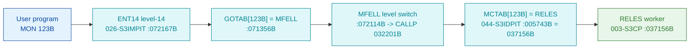

# MON 123B (octal) - RELES (ReleaseResource)

Release a device or file previously reserved with `MON 122` (ReserveResource), so another program can
use it. Some devices have a separate **input part** and **output part**; each `MON 123` releases one
part. Normal RT-program termination releases all resources. ND-100 monitor call.

**Status:** **byte-verified** (dispatch + worker body). The worker is real carved code in `003-S3CP`,
immediately after its sibling `RESRV` (MON 122B). All addresses/values are **octal**.

> **CORRECTED 2026-07-13.** The previous version of this folder said the worker was
> `misattributed / not-carved`, "zero-filled" at `037156B`, with `GOTAB[123B]=122040B` routing to an
> `F1660` compiler stub. **All of that was an artefact of the wrong dispatch model.** MON calls are
> not dispatched through the level-14 `GOTAB` (it is `MFELL` for 224 of 256 calls); they go through
> **`MCTAB @ 005620B`** (segment `044-S3IDPIT`). `MCTAB[123B] = 037156B = RELES`, and that worker IS
> carved - in `003-S3CP`. The old analysis read `037156B` in `SINTRAN-DATA_commoncode` (zeros there -
> wrong overlay). See [`../317B-ExecuteCommand/README.md`](../317B-ExecuteCommand/README.md) and
> `SINTRAN/CARVING-HANDOFF.md` section 3a.

- **Full disassembly:** [`123B-ReleaseResource.ASM`](123B-ReleaseResource.ASM).
- **Emulator model:** [`123B-ReleaseResource.pseudo.c`](123B-ReleaseResource.pseudo.c).

---

## Dispatch path



---

## Code location (dispatch path)

Byte offset = `(addr - loadbase)` in octal words x 2 (decimal). Offsets reproduced with `dd`.

| Role | Segment | Addr (octal) | Byte offset | Symbol | Verdict |
|------|---------|--------------|-------------|--------|---------|
| MCTAB[123B] slot | [044-S3IDPIT.asm](../../segments-ref/044-S3IDPIT/044-S3IDPIT.asm) | `005743B` = `037156B` | 1990 | -> `RELES` | **VERIFIED** |
| RELES worker body | [003-S3CP.asm](../../segments-ref/003-S3CP/003-S3CP.asm) | `037156B-037162B` | 7388 | `RELES` | **VERIFIED** |

**Verify by hand** (from `tools/sintran-segment-carver/versions/L-VSX-500/segments/`):
```
dd if=044-S3IDPIT.bin bs=1 skip=1990 count=2 | od -An -tx1   ->  3e 6e   (= 037156B = RELES)
dd if=003-S3CP.bin    bs=1 skip=7388 count=2 | od -An -tx1   ->  cc 67   (= 146147B, RELES entry)
```

---

## Instruction walkthrough

Full listing: [`123B-ReleaseResource.ASM`](123B-ReleaseResource.ASM).

`RELES` is a very short handler. It saves the return link (`X := L`, `037156B`), calls a shared release
helper (`JPL I 10`, `037157B`), stages a release argument (`LDA ,B -140` / `STA ,B -141`), and returns
through a computed jump (`P := X`, `037162B`). The words at `037163B-037205B` are a pointer/vector
table (decoded as `LDF I ,X` operands), not code. The actual freeing of the reservation is performed
inside the shared helper; only the prologue and return are byte-proven.

---

## Parameter / register contract

| Reg / field | Dir | Meaning | Verdict |
|-------------|-----|---------|---------|
| `L` | in | return link, saved into `X` on entry | VERIFIED (bytes) |
| `mem[,B -140]` | in | release argument staged to `,B -141` | VERIFIED (bytes) |
| DeviceNumber / IOFlag | in | which reserved device/part to release | inferred (manual) |
| error return | out | standard error code | inferred (manual) |

---

## Pseudo-code (for an emulator)

See **[`123B-ReleaseResource.pseudo.c`](123B-ReleaseResource.pseudo.c)** - the prologue (save link),
the shared-helper call and the computed return are byte-verified; the slot-freeing semantics are
inferred from the manual.

---

## Honest caveats

**What is byte-proven:** `MCTAB[123B] = 037156B = RELES`; the `RELES` entry bytes at `037156B` in
`003-S3CP` match the disassembly; `RELES` is the short release half of the `RESRV`/`RELES`
reserve/release pair, calling a shared helper and returning via a computed jump.

**What is NOT proven:** the resource-slot layout and the `DeviceNumber/IOFlag` parameters - the
freeing is done inside the shared helper, not visible in the RELES prologue. The old "not carved /
zero-filled" verdict was the wrong overlay (commoncode instead of `003-S3CP`) and is withdrawn.

Method: [../../../../../EXTRACTING-RESIDENT-CODE.md](../../../../../EXTRACTING-RESIDENT-CODE.md) ·
master map: [../../MON-CALL-INDEX.md](../../MON-CALL-INDEX.md).
