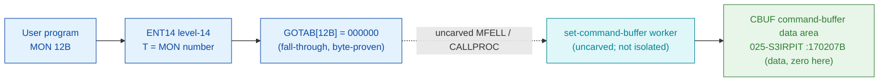

# MON 12B (octal) — SetCommandBuffer (SETCM)

> **CORRECTED 2026-07-15 (byte-verified).** The worker + dispatch described below are on the
> DEBUNKED model and are WRONG. Byte truth from the carved L07 image:
> `MCTAB[12B] = 005632B = SETOL=050666B` in segment 003-S3CP, reached by the real dispatch
> `MON 12B -> ENT14(072167B) -> GOTAB[12B]=MFELL(072114B) -> CALLP(032201B) -> MCTAB[12B]=SETOL`.
> Any "GOTAB from commoncode" / "uncarved CALLPROC bridge" / "F16xx stub" / old worker name below
> is an artefact of the wrong table. Verified: `dd if=044-S3IDPIT.bin bs=1 skip=1844 count=2`
> -> `51 b6`. Cross-ref ../317B-ExecuteCommand/README.md and SINTRAN/CARVING-HANDOFF.md sec 3a.

Transfers a string (up to 32 characters) into the **command buffer** — the buffer that holds
the last command input from the terminal (you read it back by reading from logical device
number 0). The parameter is fetched through the **alternative page table**. A common use is to
erase sensitive information (e.g. password parameters) from the command buffer. This is an
ND-100 monitor call.

**Status:** `GOTAB[12B] = 000000` (byte-proven) — a **fall-through**: there is no direct GOTAB
handler word, so the level-14 handler is reached through the resident MFELL/CALLPROC path
(uncarved). There is **no ND-100 code worker** for this call in the carved segments: the manual
short name `SETCM` resolves only in L07 `N500-SYMBOLS` (`SETCM=106214B`, the **ND-500
companion**), and the command buffer itself is the **data** area `CBUF=170207B` (L07
`SYMBOL-2-LIST`), which is zero-filled in this L image. So the transfer worker body cannot be
read from these bytes (see [Honest caveats](#honest-caveats)). All addresses/values are **octal**.

- **Full disassembly:** [`12B-SetCommandBuffer.ASM`](12B-SetCommandBuffer.ASM) — the `CBUF` command-buffer data area (no entry stub; fall-through).
- **Bytes live once in** the canonical segment layer: [`../../segments-ref/`](../../segments-ref/).

---

## Dispatch path

The dashed hop (`C ⇢ D`) is the resident `MFELL`/`CALLPROC` fall-through — it is **not present in
any carved segment**, so it is the one link that cannot be followed statically. `GOTAB[12B]` is
literally `000000`, so there is no entry stub to disassemble; dispatch enters the resident
handler. `CBUF` (E) is the command-buffer **data** destination, not the worker's code.

---

## Code location (dispatch path)

Byte offset = `(addr − loadbase)` in octal words × 2 (decimal).

| Role | Segment (full disasm) | Addr range (octal) | Byte offset | Symbol | Verdict |
|------|------------------------|--------------------|-------------|--------|---------|
| GOTAB[12] dispatch word | [commoncode.asm](../../segments-ref/SINTRAN-DATA_commoncode/SINTRAN-DATA_commoncode.asm) · [.hex](../../segments-ref/SINTRAN-DATA_commoncode/SINTRAN-DATA_commoncode.hex) | `071245B` (1 word) | 58698 | `GOTAB+12` = `000000` | **VERIFIED** (fall-through) |
| resident MFELL/CALLPROC bridge | — (uncarved) | — | — | `MFELL`/`CALLPROC` | **UNVERIFIED** |
| CBUF command-buffer data area | [025-S3IRPIT.asm](../../segments-ref/025-S3IRPIT/025-S3IRPIT.asm) · [.hex](../../segments-ref/025-S3IRPIT/025-S3IRPIT.hex) | `170207B` (1 word) | 96526 | `CBUF` | **DATA** (zero-filled here) |
| SETCM (ND-500 companion) | [026-S3IMPIT.asm](../../segments-ref/026-S3IMPIT/026-S3IMPIT.asm) · [.hex](../../segments-ref/026-S3IMPIT/026-S3IMPIT.hex) | `106214B` | — | `SETCM` (N500-SYMBOLS) | **MISATTRIBUTED** (ND-500 side, not the ND-100 body) |

There is no entry-stub row: `GOTAB[12]` is `000000`, so the level-14 handler is a resident
fall-through, not a `025-S3IRPIT` stub.

**Verify by hand:** the GOTAB word is a zero (fall-through) —
`grep '^71245 ' ../../segments-ref/SINTRAN-DATA_commoncode/SINTRAN-DATA_commoncode.hex`
→ `71245  000000  000 000  58698`; confirm from the canonical bin
`dd if=../../../resident/SINTRAN-DATA_commoncode.bin bs=1 skip=58698 count=2 2>/dev/null | od -An -tx1`
→ `00 00`. The `CBUF` data word:
`grep '^170207 ' ../../segments-ref/025-S3IRPIT/025-S3IRPIT.hex` → `170207  000000  000 000  96526`; then
`dd if=../../../segments/025-S3IRPIT.bin bs=1 skip=96526 count=2 2>/dev/null | od -An -tx1`
→ `00 00` (a stored word `000000` — the command buffer is empty/zero in this L image).
`prove-mon.py 12` reads the same GOTAB zero.

---

## Instruction walkthrough

Full listing: [`12B-SetCommandBuffer.ASM`](12B-SetCommandBuffer.ASM). There is no entry stub
(fall-through dispatch) and no ND-100 worker body in the carved segments, so there is no
executable walkthrough. The `CBUF` region is the command-buffer **data** area (zero here);
`SETCM=106214B` is the ND-500 companion in `026-S3IMPIT`, not the ND-100 worker.

---

## Parameter / register contract

Manual-side names/types are from
[`12B_SetCommandBuffer.yaml`](../../../../../../../Developer/MON/calls/12B_SetCommandBuffer.yaml)
(MAC form: `LDA (CMND / MON 12`, `CMND, 'CLOSE-FILE 102'`).

| Reg / field | Dir | Meaning | Verdict |
|-------------|-----|---------|---------|
| `A` (string addr) | in | address of the command string (`LDA (CMND`) | inferred (manual) |
| `Command` | in | string to transfer, up to 32 characters | inferred (manual) |
| alternative page table | in | the parameter is fetched through the alternative page table | inferred (manual) |
| `CBUF` | internal/out | the command-buffer data area written to | **DATA** (byte-located, zero here) |

There is no entry stub and no carved worker, so **nothing** in this contract is byte-proven from
executable code; every row is **inferred** from the manual (except that `CBUF` is byte-located
as a data word).

---

## Pseudo-code (for an emulator)

See **[`12B-SetCommandBuffer.pseudo.c`](12B-SetCommandBuffer.pseudo.c)** — a pseudo-C model.
Because the call is a fall-through and there is **no carved ND-100 worker** (`SETCM` is the
ND-500 companion; `CBUF` is data), the model is of the **documented** behaviour only, NOT carved
code. The fall-through `MON 12 → worker` bridge is modelled but not proven.

Instruction semantics follow the canonical reference:
[`../../instruction-semantics/ND100-INSTRUCTION-SEMANTICS.md`](../../instruction-semantics/ND100-INSTRUCTION-SEMANTICS.md).

---

## Honest caveats

**What is byte-proven:** `GOTAB[12B] = 000000` (level-14 fall-through; `prove-mon.py 12` reads
commoncode file byte `0xe54a = 00 00`); and `CBUF=170207B` is a byte-located **data** word
(`000000` in this L image). That is all these carved bytes establish for this call.

**What is NOT proven:** anything about the transfer worker. Because `GOTAB[12]` is `000000`,
there is no stub to follow; dispatch enters the resident `MFELL`/`CALLPROC` handler in an
**uncarved** overlay. The manual short name `SETCM` resolves only in `N500-SYMBOLS`
(`SETCM=106214B`) — the **ND-500-side** companion, not the ND-100 body — so it is
**MISATTRIBUTED** to the ND-100 call. `CBUF=170207B` is the command-buffer **data** destination
(zero-filled here), not the worker's code.

This reconciles into one story: the dispatch head (`GOTAB[12]=0`, fall-through) is solid; the
ND-100 transfer worker is not present in this carve (it is past the uncarved bridge); `CBUF` is
the data area written to; and `SETCM=106214B` is the ND-500 companion. Confirming the actual
worker needs a live trace (break on a real `MON 12`, single-step the fall-through, and record
where P lands).

---

Method: [../../../../../EXTRACTING-RESIDENT-CODE.md](../../../../../EXTRACTING-RESIDENT-CODE.md) §9 · dispatch reality:
[../../TASK-05-mismatches.md](../../TASK-05-mismatches.md) §G · master map: [../../MON-CALL-INDEX.md](../../MON-CALL-INDEX.md).
