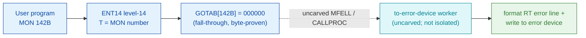

# MON 142B (octal) - ToErrorDevice (ERMON)

> **CORRECTED 2026-07-15 (byte-verified).** The worker + dispatch described below are on the
> DEBUNKED model and are WRONG (the old folder named the ND-500-side symbol ERMON; that is not
> the ND-100 worker). Byte truth from the carved L07 image:
> `MCTAB[142B] = 005762B = ERRMO=071776B` in segment 025-S3IRPIT, reached by the real dispatch
> `MON 142B -> ENT14(072167B) -> GOTAB[142B]=MFELL(072114B) -> CALLP(032201B) -> MCTAB[142B]=ERRMO`.
> Verified: `dd if=044-S3IDPIT.bin bs=1 skip=2020 count=2` -> `73 fe`. Cross-ref
> ../317B-ExecuteCommand/README.md and SINTRAN/CARVING-HANDOFF.md sec 3a.

Outputs a user-defined **real-time error** on the **error device** (normally the console). Real-time
error numbers 50-69 can be reported this way, each with a suberror number, producing a line such as
`23.10.59 ERROR 59 AT XPROG AT 134562, USER ERROR, SUBERROR 4` (see appendix A). Available to user RT
and user SYSTEM programs. This is an ND-100 monitor call (also available on ND-500).

**Status:** `documented`. `GOTAB[142B] = 000000` (byte-proven) is a **fall-through**: there is no direct
GOTAB handler word, so the level-14 handler is reached through the resident MFELL/CALLPROC path
(uncarved). The named ND-100 worker is **not isolated** in any carved segment - the `ERMON` short name
resolves only to the ND-500 side (`114574B`, N500-SYMBOLS / `1WQ1O` SYMBOL-2-LIST alias), which is not
the ND-100 body. So the to-error-device worker is attached by **name** only and its ND-100 code is **not
recoverable** from these bytes (see [Honest caveats](#honest-caveats)). All addresses/values are
**octal**.

- **Full disassembly:** [`142B-ToErrorDevice.ASM`](142B-ToErrorDevice.ASM) - the GOTAB dispatch word (fall-through); no worker body is present in the carved set.
- **Bytes live once in** the canonical segment layer: [`../../segments-ref/`](../../segments-ref/).

---

## Dispatch path

The dashed hop (`C ⇢ D`) is the resident `MFELL`/`CALLPROC` fall-through - it is **not present in any
carved segment**, so it is the one link that cannot be followed statically. `GOTAB[142B]` is literally
`000000`, so there is no entry stub to disassemble; dispatch enters the resident handler, which then
formats and writes the error line to the error device (the terminal reported by MON 254 GetErrorDevice).
`ERMON` (D) is the documented short name for this call, but it resolves only to the ND-500 side; no
ND-100 worker body is present in the carved set.

---

## Code location (dispatch path)

Every row is a real region you can open. Byte offset = `(addr - loadbase)` in octal words x 2; the
commoncode load base is `0`, so the byte offset is simply `octal-addr x 2` (decimal).

| Role | Segment (full disasm) | Addr range (octal) | Byte offset | Symbol | Verdict |
|------|------------------------|--------------------|-------------|--------|---------|
| GOTAB[142] dispatch word | [commoncode.asm](../../segments-ref/SINTRAN-DATA_commoncode/SINTRAN-DATA_commoncode.asm) · [.hex](../../segments-ref/SINTRAN-DATA_commoncode/SINTRAN-DATA_commoncode.hex) | `071375B` (1 word) | 58874 | `GOTAB+142` = `000000` | **VERIFIED** (fall-through) |
| resident MFELL/CALLPROC bridge | - (uncarved) | - | - | `MFELL`/`CALLPROC` | **UNVERIFIED** |
| to-error-device worker body | - (not isolated) | - | - | `ERMON` (ND-500 only) | body **MISATTRIBUTED** (name only) |

There is no entry-stub row: `GOTAB[142]` is `000000`, so the level-14 handler is a resident fall-through,
not a `025-S3IRPIT` stub.

**Verify by hand:** the GOTAB word is a zero (fall-through):
`grep '^71375 ' ../../segments-ref/SINTRAN-DATA_commoncode/SINTRAN-DATA_commoncode.hex`
-> `71375  000000  000 000  58874`; then
`dd if=../../../resident/SINTRAN-DATA_commoncode.bin bs=1 skip=58874 count=2 2>/dev/null | od -An -tx1`
-> `00 00` (GOTAB[142] = 000000, a fall-through).
`prove-mon.py 142` reports the same `GOTAB[142]=000000` fall-through.

---

## Instruction walkthrough

Full listing: [`142B-ToErrorDevice.ASM`](142B-ToErrorDevice.ASM). There is no worker code to walk
through: `GOTAB[142]` is `000000` (a resident fall-through, no entry stub), and no ND-100
to-error-device worker is isolated in the carved set (the `ERMON` symbol is ND-500 only). The `.ASM`
therefore lists only the byte-proven `GOTAB` dispatch word plus notes on why no body is present.

---

## Parameter / register contract

Manual-side names/types are from [`142B_ToErrorDevice.yaml`](../../../../../../../Developer/MON/calls/142B_ToErrorDevice.yaml).

| Reg / field | Dir | Meaning | Verdict |
|-------------|-----|---------|---------|
| `A` (ErrorNumber) | in | error number 50-69, printed after `ERROR` (`MAC` example `LDA ERRNO`; passed as two ASCII characters) | inferred (manual) |
| `T` (SubErrorNumber) | in | suberror number, printed after `SUBERROR` (`MAC` example `LDT SUBER`) | inferred (manual) |
| error return | out | standard error code in `A` (appendix A) | inferred (manual) |

None of this is byte-proven here: the dispatch is a fall-through and no worker body is present, so the
error/suberror contract comes entirely from the manual, not from these bytes. (The MAC example shows the
error and suberror loaded into `A` and `T` respectively before `MON 142`.)

---

## Pseudo-code (for an emulator)

See **[`142B-ToErrorDevice.pseudo.c`](142B-ToErrorDevice.pseudo.c)** - a pseudo-C model for emulator
authors. Because the dispatch is a fall-through and the worker is not isolated, the model is of the
**documented** behaviour only (validate the 50-69 error number, format the RT error line, write it to the
error device), explicitly flagged as not byte-derived. The `GOTAB[142B] = 000000` fall-through is the
only byte-verified fact. Any ND-100 instruction a live image would run here would be translated per the
canonical [`ND100-INSTRUCTION-SEMANTICS.md`](../../instruction-semantics/ND100-INSTRUCTION-SEMANTICS.md),
but no worker instructions are present in these bytes to translate.

---

## Honest caveats

**What is byte-proven:** `GOTAB[142B] = 000000` (level-14 dispatch; `prove-mon.py 142` reads commoncode
file byte `0xe5fa = 00 00 = 000000`), a fall-through. There is no entry stub and no worker region to
disassemble.

**What is NOT proven:** the to-error-device worker body. The `GOTAB[142]` fall-through enters the
resident `MFELL`/`CALLPROC`, which lives in an **uncarved** overlay; a static decode cannot follow it.
The documented ND-100 worker is not isolated in any carved segment - the `ERMON` short name resolves only
to the ND-500 side (`026-S3IMPIT` / `030-S3SM5`, address `114574B`, N500-SYMBOLS, with the `1WQ1O`
SYMBOL-2-LIST alias), which is not the ND-100 body. So the to-error-device worker is attached by **name**
only and its ND-100 code is **not recoverable** from these carved bytes.

This reconciles into one story: the dispatch head (`GOTAB[142] = 000000`, fall-through) is solid; the
resident second-level dispatch is uncarved; and the ND-100 to-error-device worker is not present in the
carved set. The related MON 254 (GetErrorDevice) does resolve to a real ND-100 worker (`GERDV=102525B`
in `025-S3IRPIT`), which identifies the error device this call writes to; but the 142B output/formatting
worker itself is not isolated here. Confirming it needs a live trace (break on a real `MON 142`,
single-step the fall-through and CALLPROC, and record where P lands).

**How this was carved:** the GOTAB word was located at `GOTAB base 071233B + 142 = 071375B` in the
canonical resident commoncode binary and read directly (`000000`, fall-through); the carved segment set
was then searched for an ND-100 to-error-device worker and none was found (the `ERMON` symbol is ND-500
only). Method: [../../../../../EXTRACTING-RESIDENT-CODE.md](../../../../../EXTRACTING-RESIDENT-CODE.md) ·
dispatch reality: [../../TASK-05-mismatches.md](../../TASK-05-mismatches.md) · master map:
[../../MON-CALL-INDEX.md](../../MON-CALL-INDEX.md).
