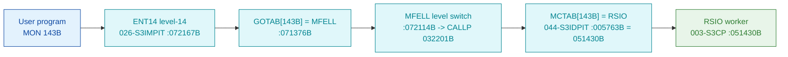

# MON 143B (octal) - RSIO (ExecutionInfo)

Returns information about how the calling program is executing: the **execution mode**
(0 = interactive, 1 = batch, 2 = mode job, 3 = RT), the **command-input** device, the
**command-output** device, and the owner's **directory + user index**. ND-100 monitor call.

**Status:** **byte-verified** (dispatch + worker body). The worker is real carved code in `003-S3CP`,
alongside its siblings `GBGSZ` / `MBECH`. All addresses/values are **octal**.

> **CORRECTED 2026-07-13.** The previous version of this folder located the worker via a fictional
> level-14 `GOTAB`/`F1670` compiler stub and read `RSIO` from `SINTRAN-DATA_commoncode`. **MON calls
> are not dispatched through that `GOTAB`** (it is `MFELL` for 224 of 256 calls); they go through
> **`MCTAB @ 005620B`** (segment `044-S3IDPIT`). `MCTAB[143B] = 051430B = RSIO`, and that worker is
> carved in `003-S3CP`. See [`../317B-ExecuteCommand/README.md`](../317B-ExecuteCommand/README.md) and
> `SINTRAN/CARVING-HANDOFF.md` section 3a.

- **Full disassembly:** [`143B-ExecutionInfo.ASM`](143B-ExecutionInfo.ASM).
- **Emulator model:** [`143B-ExecutionInfo.pseudo.c`](143B-ExecutionInfo.pseudo.c).

---

## Dispatch path



---

## Code location (dispatch path)

Byte offset = `(addr - loadbase)` in octal words x 2 (decimal). Offsets reproduced with `dd`.

| Role | Segment | Addr (octal) | Byte offset | Symbol | Verdict |
|------|---------|--------------|-------------|--------|---------|
| MCTAB[143B] slot | [044-S3IDPIT.asm](../../segments-ref/044-S3IDPIT/044-S3IDPIT.asm) | `005763B` = `051430B` | 2022 | -> `RSIO` | **VERIFIED** |
| RSIO worker body | [003-S3CP.asm](../../segments-ref/003-S3CP/003-S3CP.asm) | `051430B-051451B` | 17968 | `RSIO` | **VERIFIED** |

**Verify by hand** (from `tools/sintran-segment-carver/versions/L-VSX-500/segments/`):
```
dd if=044-S3IDPIT.bin bs=1 skip=2022  count=2 | od -An -tx1   ->  53 18   (= 051430B = RSIO)
dd if=003-S3CP.bin    bs=1 skip=17968 count=2 | od -An -tx1   ->  cc 59   (= 146131B, RSIO entry)
```

---

## Instruction walkthrough

Full listing: [`143B-ExecutionInfo.ASM`](143B-ExecutionInfo.ASM).

`RSIO` saves the frame/param base (`D := B`), switches `B` to a work base (`B := A`), then selects one
of two info sources based on a flag (`JAF` on `,B -103`): either a direct field (`,B -147`) or an
alternate value chased through a per-program table (`LDX ,B -146` then `mem[x+12]`, `mem[x+23]`). It
restores the param base (`B := D`) and returns the result through `EXIT` (`051451B`). Control flow and
the base/table access are byte-proven; the mapping of each field to mode / cmd-device / dir+user is
**inferred**.

---

## Parameter / register contract

| Reg / field | Dir | Meaning | Verdict |
|-------------|-----|---------|---------|
| `B` (param base) | in | frame/parameter base, saved into `D` on entry | VERIFIED (bytes) |
| `A` | in | work base loaded into `B` | VERIFIED (bytes) |
| `mem[,B -103]` flag | in | selects direct vs table-chased info source | VERIFIED (bytes) |
| result (A/D) | out | packed execution info (mode / cmd-in / cmd-out / dir+user) | VERIFIED (returned); field layout inferred |
| execution mode / devices / dir+user index | out | the documented four values | inferred (manual) |

---

## Pseudo-code (for an emulator)

See **[`143B-ExecutionInfo.pseudo.c`](143B-ExecutionInfo.pseudo.c)** - the base swap, the two-way
source select and the `EXIT` are byte-verified; the field meanings are inferred from the manual.

---

## Honest caveats

**What is byte-proven:** `MCTAB[143B] = 051430B = RSIO`; the `RSIO` entry bytes at `051430B` in
`003-S3CP` match the disassembly; the routine reads one of two execution-info sources (a direct frame
field or a table-chased value) and returns it via `EXIT`.

**What is NOT proven:** exactly which of mode / command-input device / command-output device /
directory+user index maps to `,B -103`, `,B -147`, `,B -146` and the chased offsets `26/12/23`. The
old "F1670 stub + commoncode worker" model was the wrong dispatch table/overlay and is withdrawn.

Method: [../../../../../EXTRACTING-RESIDENT-CODE.md](../../../../../EXTRACTING-RESIDENT-CODE.md) ·
master map: [../../MON-CALL-INDEX.md](../../MON-CALL-INDEX.md).
