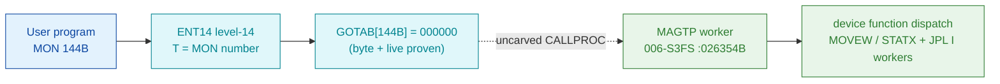

# MON 144B (octal) - DeviceFunction (MAGTP)

Device-dependent "monster" call: the caller passes a parameter list whose function code
(device-block slot `20`) is interpreted by the addressed device's type (magtape, floppy,
Versatec, SCSI streamer). The worker `MAGTP` validates the function code, selects a per-device
sub-entry, and drives a block transfer (`MOVEW`/`STATX`).

**Status:** dispatch head byte-proven (`GOTAB[144B] = 000000`, a level-14 fall-through); worker
body is real SINTRAN L bytes at `MAGTP=026354B`; the exact `MON 144 -> worker` link crosses an
uncarved resident `CALLPROC` bridge (see [Honest caveats](#honest-caveats)). All addresses/values
are **octal**.

- **Full disassembly:** [`144B-DeviceFunction.ASM`](144B-DeviceFunction.ASM) - the actual code (the worker body; there is no F16xx entry stub because the GOTAB slot is zero).
- **Bytes live once in** the canonical segment layer: [`../../segments-ref/`](../../segments-ref/).

---

## Dispatch path

A zero GOTAB slot **is** the fall-through marker: there is no per-call `F16xx` stub. The dashed hop
(`C ⇢ D`) is the resident `CALLPROC` second-level dispatch that maps the fallen-through MON number
onto its worker - it is **not present in any carved segment**, so it is the one link that cannot be
followed statically.

---

## Code location (dispatch path)

Every row is a real region you can open. Byte offset = `(addr − loadbase)` in octal words × 2.
Load bases: `SINTRAN-DATA_commoncode` = `0B`, `006-S3FS` = `26000B`.

| Role | Segment (full disasm) | Addr range (octal) | Byte offset | Symbol | Verdict |
|------|------------------------|--------------------|-------------|--------|---------|
| GOTAB[144] dispatch word | [commoncode.asm](../../segments-ref/SINTRAN-DATA_commoncode/SINTRAN-DATA_commoncode.asm) · [.hex](../../segments-ref/SINTRAN-DATA_commoncode/SINTRAN-DATA_commoncode.hex) | `071377B` (1 word) | 58878 | `GOTAB+144` = `000000` | **VERIFIED** |
| resident CALLPROC bridge | — (uncarved) | — | — | `CALLPROC` | **UNVERIFIED** |
| MAGTP worker body | [006-S3FS.asm](../../segments-ref/006-S3FS/006-S3FS.asm) · [.hex](../../segments-ref/006-S3FS/006-S3FS.hex) | `026354B–027036B` | 472 | `MAGTP` | real bytes; link **MISATTRIBUTED** |

Sub-entries `500RF` (026375B), `500WF` (026401B), `XRFIL` (026405B), `XWFIL` (026407B), `XMRW`
(026446B) and the `XRPAG/XWPAG/YFGET/YFPUT` page workers all sit inside the same
`026354B..027036B` contiguous region.

**Verify by hand (GOTAB word):** `grep '^71377 ' ../../segments-ref/SINTRAN-DATA_commoncode/SINTRAN-DATA_commoncode.hex`
→ byte offset `58878`, value `000000`; then
`dd if=../../../resident/SINTRAN-DATA_commoncode.bin bs=1 skip=58878 count=2 2>/dev/null | od -An -tx1`
→ `00 00` (the zero = fall-through).

**Verify by hand (worker entry):** `grep '^26354 ' ../../segments-ref/006-S3FS/006-S3FS.hex`
→ byte offset `472`, value `002027`; then
`dd if=../../../segments/006-S3FS.bin bs=1 skip=472 count=2 2>/dev/null | od -An -tx1`
→ `04 17` (= octal `002027` big-endian, `STZ ,X 27`, the `MAGTP` entry).

---

## Instruction walkthrough

Full listing: [`144B-DeviceFunction.ASM`](144B-DeviceFunction.ASM). All addresses octal; `X` = per-call
work-area base, `B` = device/data-field block base (roles inferred from the access pattern).

**Entry prologue + per-device setup (026354–026445)** — `MAGTP` shuffles caller params through
work-area slots `17/25/27/31` and calls shared file-system workers via pointer words
`@026442/026443/026444/026445`. The device sub-entries `500RF/500WF/XRFIL/XWFIL` each load an
immediate device selector (`SAA 0/1/2`) into slot `27/25` then re-run the same JPL-I sequence.
Words `026433–026445` are a **pointer-word/data table**; `nd100-dis` renders them as bogus
instructions because it cannot tell data from code, and their final callees live outside this carve.

**Function-code range check — the core (026446–026467, `XMRW`)** — `LDA ,B 20` fetches the function
code; `SAT 100 / SKP IF DA GRE ST` and `SAT 177 / SKP IF DT GRE SA` bound it to `100B..177B`.
Out-of-range codes divert to `026470`. In range, a handler code is derived into `,B 30` and control
falls to `026607`. **VERIFIED (bytes).**

**Masked sub-dispatch (026470–026553)** — the low path sets a default function `71B` into `,B 30`,
masks the device-state word `,B 25` with `AND 66`, and re-validates (`AAA -77 / SKP IF 0 GRE SA`).
A failing mask jumps to the common error exit `026554`. `BSKP ONE/ZRO` bit tests on `,X 3` / `,X 7`
choose error codes `SAA 132 / SAA 174 / SAA 133` before merging at `026555` (`LDA 14 ; STA ,B 12`,
the error-status store).

**MOVEW block-transfer tails (026737–027035)** — two near-identical blocks (`026741–026750` and
`027022–027031`) build a `MOVEW` descriptor (`SAA 22 / RADD.../ SAX 7 / LDD I / MOVEW`) and do the
block move, then a `STATX` device-status transfer, then call finalisers via pointer words
`@027052/027053/027054/027055`.

**Exit** — there is no explicit in-window `EXIT` on the transfer path; the handler returns to the
`CALLPROC` caller after the final `JPL I` finaliser. `027036 SUB I ,B 42` is the reported
control-flow closure boundary; `027037B` onward is padding / the next region, not a live path.

---

## Parameter / register contract

| Reg / field | Dir | Meaning | Verdict |
|-------------|-----|---------|---------|
| `A` | in | Address of parameter list `(Func, Buff, DevNo, Param1, Param2)` | inferred (caller-side wrapper, not in this carve) |
| `,B 20` | in | Function code, validated to range `100B..177B` | VERIFIED (026446–026454) |
| `,B 25` | in | Device-state word, masked with `AND 66` | VERIFIED (026473–026474) |
| `,B 30` | work | Selected function / handler code stored here | VERIFIED (026465, 026471) |
| `,X 17/25/27/31` | work | Per-call work-area slots (parameter shuffle) | VERIFIED (prologue) |
| `,B 12` | out | Error/status word (`LDA 14 ; STA ,B 12` on reject) | VERIFIED (026554–026555) |
| error codes | out | `132B / 133B / 174B` loaded via `SAA` before the error tail | VERIFIED (bytes); meanings inferred |
| `A` | out | Status returned to caller | inferred (exit glue not in window) |
| skip return | out | not observable in-window (fall-through call, not a level-14 skip handler) | inferred |

The device-specific targets reached through the pointer words (`JPL I ... -> 026442/026566/027052 ...`)
require live `B`/`X` register context; their final callees are outside the carved window and are
**not** resolvable from these bytes.

---

## Pseudo-code (for an emulator)

See **[`144B-DeviceFunction.pseudo.c`](144B-DeviceFunction.pseudo.c)** — a pseudo-C model of the
handler for emulator authors. Control flow, the `100B..177B` range check, the `AND 66` mask, and the
two `MOVEW`/`STATX` transfer blocks are byte-verified; the device-worker semantics and the error-code
meanings are inferred from the call structure.

Every instruction in the `.pseudo.c` is translated against the canonical
[`ND100-INSTRUCTION-SEMANTICS.md`](../../instruction-semantics/ND100-INSTRUCTION-SEMANTICS.md)
(bare `LDx`/`LDT`/`AND disp` = P-relative `mem[P+disp]`, not literals - e.g. `AND 66` masks with
`mem[026562B]=0176777`; `SKP`/`BSKP` skip polarity; `RADD CLD SD DA` = `A = D`; T/X transfers =
physical `EL`).

---

## Honest caveats

**What is byte-proven:** `GOTAB[144B] = 000000` (level-14 fall-through, matches a live read of the
running system); the `MAGTP` worker entry at `026354B` is real code whose first word is `002027`
(`STZ ,X 27`); the `100B..177B` function-code range check; the `AND 66` mask; the two `MOVEW`/`STATX`
transfer blocks; the error-status store at `,B 12`; control-flow closure inside `026354B..027036B`.

**What is NOT proven:** the link from the fall-through dispatch to the `MAGTP` worker. `GOTAB[144]`
is zero, so there is no stub address to follow; the resident `CALLPROC` that selects the worker for a
fallen-through MON number lives in an **uncarved overlay** and cannot be read from any carved segment.
So the `MON 144 -> MAGTP` attribution rests on the symbol name + the device-function behaviour, not a
followed pointer - hence **MISATTRIBUTED** in the strict sense. (The earlier folder note framing this
as "`GOTAB[144B] = MFELL`" meant the fall-through *mechanism* `MFELL`/`CALLPROC`, not a stored pointer
value; the stored word is zero, and that zero *is* the fall-through marker - the two statements are
consistent.) Confirming the link needs a live trace: break at the resident `CALLPROC` entry on a real
`MON 144`, single-step the second-level dispatch, and confirm P lands on `MAGTP=026354` (mapped
through the `006-S3FS` load base `26000B`).

Method: [../../../../../EXTRACTING-RESIDENT-CODE.md](../../../../../EXTRACTING-RESIDENT-CODE.md) · dispatch reality:
[../../TASK-05-mismatches.md](../../TASK-05-mismatches.md) · master map: [../../MON-CALL-INDEX.md](../../MON-CALL-INDEX.md).
