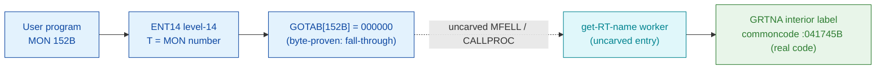

# MON 152B (octal) - GetRTName (GRTNA)

Gets the name of an RT program (7 bytes) given the RT-description address (`0` = the
calling program). The name is returned with a terminating apostrophe if shorter than 7
characters. Background programs (SINTRAN III VSX).

**Status:** `misattributed`. GOTAB dispatch head byte-proven as **fall-through**
(`GOTAB[152B] = 000000`, no per-call stub). The named symbol `GRTNA=041745B`
(`SYMBOL-1-LIST`) resolves to **real resident code** in commoncode, but it is an
**interior label** - it aliases the cell `WMSBA` at the same address and sits inside a
larger resident routine that copies a two-word program name out of the parameter block
`[B-2]` into the caller frame. The bytes are real code (byte-verified), but `GRTNA` is
not a self-contained routine entry, and the `MON 152 -> GRTNA` link crosses an uncarved
kernel bridge (see [Honest caveats](#honest-caveats)). All addresses/values are
**octal**.

- **Full disassembly:** [`152B-GetRTName.ASM`](152B-GetRTName.ASM) - a bounded excerpt of the real code enclosing `GRTNA` (the two-word name copy).
- **Bytes live once in** the canonical segment layer: [`../../segments-ref/`](../../segments-ref/).

---

## Dispatch path

The GOTAB slot is zero, so there is **no per-call entry stub**. The dashed hop
(`C -> D`) is the resident `MFELL`/`CALLPROC` fall-through - it is **not present in any
carved segment**. `GRTNA` (E) is the named point inside the real resident routine, but
it is an interior label, so the routine's entry is not isolated here.

---

## Code location (dispatch path)

Every row is a real region you can open. Byte offset = `(addr - loadbase)` in octal
words x 2; the commoncode load base is `0`, so the byte offset is simply `octal-addr x 2`
(decimal).

| Role | Segment (full disasm) | Addr range (octal) | Byte offset | Symbol | Verdict |
|------|------------------------|--------------------|-------------|--------|---------|
| GOTAB[152] dispatch word | [commoncode.asm](../../segments-ref/SINTRAN-DATA_commoncode/SINTRAN-DATA_commoncode.asm) - [.hex](../../segments-ref/SINTRAN-DATA_commoncode/SINTRAN-DATA_commoncode.hex) | `071405B` (1 word) | 58890 | `GOTAB+152` = `000000` | **VERIFIED** (fall-through) |
| resident MFELL/CALLPROC bridge | - (uncarved) | - | - | `MFELL`/`CALLPROC` | **UNVERIFIED** |
| GRTNA interior label | [commoncode.asm](../../segments-ref/SINTRAN-DATA_commoncode/SINTRAN-DATA_commoncode.asm) - [.hex](../../segments-ref/SINTRAN-DATA_commoncode/SINTRAN-DATA_commoncode.hex) | `041730B-041751B` (excerpt; `GRTNA`=041745B) | 34762 | `GRTNA` (aliases `WMSBA`) | real bytes = **CODE**; interior label, body link **MISATTRIBUTED** |

There is no entry-stub row: `GOTAB[152]` is `000000`, a resident fall-through, not a
`025-S3IRPIT` stub.

**Verify by hand:** the GOTAB word is a zero (fall-through):
`grep '^71405 ' ../../segments-ref/SINTRAN-DATA_commoncode/SINTRAN-DATA_commoncode.hex`
-> `71405  000000  000 000  58890`; then
`dd if=../../../resident/SINTRAN-DATA_commoncode.bin bs=1 skip=58890 count=2 2>/dev/null | od -An -tx1`
-> `00 00` (= `000000`, fall-through). The `GRTNA` word:
`grep '^41745 ' ../../segments-ref/SINTRAN-DATA_commoncode/SINTRAN-DATA_commoncode.hex`
-> `41745  004562  011 162  34762`; then
`dd if=../../../resident/SINTRAN-DATA_commoncode.bin bs=1 skip=34762 count=2 2>/dev/null | od -An -tx1`
-> `09 72` (the stored word = octal `004562`, a genuine `STA ,B 162` instruction, the
`GRTNA` name-store point). `prove-mon.py 152` reads the same GOTAB zero.

---

## Instruction walkthrough

Full listing: [`152B-GetRTName.ASM`](152B-GetRTName.ASM). There is no entry stub
(fall-through dispatch), and `GRTNA` is an interior label, so the excerpt is a bounded
window of the enclosing real routine, not a whole procedure.

**Name-copy region (041730-041751)** - `041730 SKP IF DD LST 0` selects the byte/word
order of the name; both arms load the parameter block via `LDX ,B -2` and copy two words
(`LDA/LDT ,X 0/1`) into the caller frame at `B+162`/`B+163`. `041745 STA ,B 162` is the
`GRTNA`-labelled store; `041750 RADD CLD 0 DA` / `041751 STA ,B -33` clear a status word.
The routine's prologue and return lie outside this window.

---

## Parameter / register contract

Manual-side names/types are from [`152B_GetRTName.yaml`](../../../../../../../Developer/MON/calls/152B_GetRTName.yaml).

| Reg / field | Dir | Meaning | Verdict |
|-------------|-----|---------|---------|
| `RTProgram` | in | address of the RT description (`0` = calling program) (`MAC` `LDA (PAR`) | inferred (manual) |
| `RTProgramName` | out | 7-byte RT name, apostrophe-terminated if short | inferred (manual) |
| `[B-2]` (param block) | internal | source of the two copied name words (`LDX ,B -2` / `LDA ,X 0/1`) | VERIFIED (bytes); meaning inferred |
| `B+162` / `B+163` | internal | destination name words in the caller frame (`STT`/`STA ,B 162/163`) | VERIFIED (bytes); meaning inferred |

The routine's entry and return are outside the carved excerpt, so the full
user-visible register convention is **inferred** from the manual, not byte-proven here.

---

## Pseudo-code (for an emulator)

See **[`152B-GetRTName.pseudo.c`](152B-GetRTName.pseudo.c)** - a pseudo-C model for
emulator authors. Only the two-word name copy visible in the excerpt is modelled (that
control flow is byte-verified); the enclosing routine's prologue/return and the exact
RT-name field layout are inferred from the manual.

Every instruction in the pseudo-code is translated against the canonical
[ND-100 instruction semantics reference](../../instruction-semantics/ND100-INSTRUCTION-SEMANTICS.md)
(`SKP IF DD LST 0` signed compare, `LDX ,B` / `LDA`/`LDT ,X` indexed loads,
`STT`/`STA ,B` frame stores, `RADD CLD 0 DA` clear, `JMP` branch).

---

## Honest caveats

**What is byte-proven:** `GOTAB[152B] = 000000` (level-14 fall-through; `prove-mon.py
152` reads commoncode file byte `0xe60a = 00 00`); the bytes at and around `GRTNA=041745B`
in commoncode are real code (the word `004562B = STA ,B 162` matches the disassembly),
part of a routine that copies a two-word program name from the parameter block into the
caller frame - consistent with GetRTName.

**What is NOT proven:** `GRTNA` is an **interior label** (it aliases the `SYMBOL-1` cell
`WMSBA` at the same address) inside a larger resident routine, not a self-contained
procedure entry - so this carve cannot present a whole handler with a prologue and
return. And because `GOTAB[152]` is `000000`, there is no stub to follow; dispatch enters
the resident `MFELL`/`CALLPROC` handler in an **uncarved overlay**. Attributing the call
body to `GRTNA` rests on the symbol **name** (`GRTNA` = Get RT NAme) plus the matching
name-copy behaviour, not a followed pointer or an isolated routine - hence
**MISATTRIBUTED**. Confirming the actual worker needs a live trace (break on a real
`MON 152`, single-step the fall-through, record where P lands).

Method: [../../../../../EXTRACTING-RESIDENT-CODE.md](../../../../../EXTRACTING-RESIDENT-CODE.md) - dispatch reality:
[../../TASK-05-mismatches.md](../../TASK-05-mismatches.md) - master map: [../../MON-CALL-INDEX.md](../../MON-CALL-INDEX.md).
