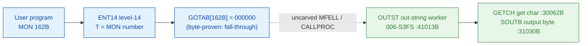

# MON 162B (octal) - OutString (OUTST)

> **CORRECTED 2026-07-15 (byte-verified).** The worker + dispatch described below are on the
> DEBUNKED model and are WRONG. Byte truth from the carved L07 image:
> `MCTAB[162B] = 006002B = 3OUTS=112671B` in segment 025-S3IRPIT, reached by the real dispatch
> `MON 162B -> ENT14(072167B) -> GOTAB[162B]=MFELL(072114B) -> CALLP(032201B) -> MCTAB[162B]=3OUTS`.
> Any "GOTAB from commoncode" / "uncarved CALLPROC bridge" / old worker name below is an artefact
> of the wrong table. Verified: `dd if=044-S3IDPIT.bin bs=1 skip=2052 count=2` -> `95 b9`.
> Cross-ref ../317B-ExecuteCommand/README.md and SINTRAN/CARVING-HANDOFF.md sec 3a.

Writes a string of characters to a peripheral file (e.g. a terminal or a
printer). It cannot be used for mass-storage files. If the device output buffer
is too small the program waits until buffer space becomes available. The maximum
string length is 2048 bytes.

**Status:** GOTAB dispatch head byte-proven as **fall-through** (`GOTAB[162B] =
000000`, no per-call stub); the `OUTST` worker body is real SINTRAN L bytes and
loops the `GETCH` (get character) and `SOUTB` (output byte) primitives; the exact
`MON 162 -> worker` link crosses an uncarved kernel bridge (see
[Honest caveats](#honest-caveats)). All addresses/values are **octal**.

- **Full disassembly:** [`162B-OutString.ASM`](162B-OutString.ASM) - the actual code (the OUTST worker body; there is no entry stub because the GOTAB slot is zero).
- **Bytes live once in** the canonical segment layer: [`../../segments-ref/`](../../segments-ref/).

---

## Dispatch path

The GOTAB slot is zero, so there is **no per-call entry stub**. The dashed hop
(`C -> E`) is the resident `MFELL`/`CALLPROC` fall-through second-level dispatch -
it is **not present in any carved segment**, so it is the one link that cannot be
followed statically.

---

## Code location (dispatch path)

Every row is a real region you can open. Byte offset = `(addr - loadbase)` in octal words x 2
(equal to the decimal `byteoff` column of the segment `.hex`).

| Role | Segment (full disasm) | Addr range (octal) | Byte offset | Symbol | Verdict |
|------|------------------------|--------------------|-------------|--------|---------|
| GOTAB[162] dispatch word | [commoncode.asm](../../segments-ref/SINTRAN-DATA_commoncode/SINTRAN-DATA_commoncode.asm) - [.hex](../../segments-ref/SINTRAN-DATA_commoncode/SINTRAN-DATA_commoncode.hex) | `071415B` (1 word) | 58906 | `GOTAB+162` = `000000` | **VERIFIED** (fall-through) |
| resident MFELL/CALLPROC bridge | - (uncarved) | - | - | `CALLPROC` | **UNVERIFIED** |
| OUTST worker body | [006-S3FS.asm](../../segments-ref/006-S3FS/006-S3FS.asm) - [.hex](../../segments-ref/006-S3FS/006-S3FS.hex) | `41013B-41021B` + loop `41030B-41061B` | 11286 | `OUTST` | real bytes; link **MISATTRIBUTED** |
| GETCH get-character primitive | [006-S3FS.asm](../../segments-ref/006-S3FS/006-S3FS.asm) - [.hex](../../segments-ref/006-S3FS/006-S3FS.hex) | `30062B` (call target) | 2148 | `GETCH` | called by OUTST (link cell `41065`) - **VERIFIED** |
| SOUTB output-byte primitive | [006-S3FS.asm](../../segments-ref/006-S3FS/006-S3FS.asm) - [.hex](../../segments-ref/006-S3FS/006-S3FS.hex) | `31030B` (call target) | 3120 | `SOUTB` | called by OUTST (link cell `41067`) - **VERIFIED** |

**Verify by hand:** `grep '^41013 ' ../../segments-ref/006-S3FS/006-S3FS.hex` -> byte offset `11286`;
then `dd if=../../../segments/006-S3FS.bin bs=1 skip=11286 count=8 | od -An -tx1` -> `22 27 cc 65 cc 59 f0 07`
(each pair is one 16-bit word, big-endian on disk = octal `021047 146145 146131 170007` = `STD I 47` / `RADD CLD SL DA` / `RADD CLD SB DD` / `SAB 7`, the OUTST entry).

The GOTAB slot itself:
`dd if=../../../resident/SINTRAN-DATA_commoncode.bin bs=1 skip=58906 count=2 | od -An -tx1` -> `00 00` (= `000000`, fall-through).

---

## Instruction walkthrough

Full listing: [`162B-OutString.ASM`](162B-OutString.ASM). The functional body is
the OUTST worker; there is no F16xx stub because `GOTAB[162] = 0`. All calls to
shared workers are **indirect** (`JPL I` / `JMP I`) through the pointer-word table
at `41062-41070`; those words are **data (link cells)**, not code, and their
resolved worker addresses are annotated in the `.ASM`.

**Entry prologue (`41013-41021`)** - `41013 STD I 47` stashes the caller's
double-word parameter (through link cell `41064`); `41016 SAB 7` builds the
7-word local frame `B`; `41017 JPL I 44` -> `003752` is the shared resident
prologue worker; `41020 LDA I 44` loads the working value; `41021 JMP 7` ->
`41030` joins the shared output loop.

**Output loop (`41030-41057`)** - `41032 LDT ,B 1` / `41033 AAT -1` decrement the
remaining count; `41034 SKP IF DT GRE SD` / `41035 JMP 23` -> `41060` exits when
the count is exhausted. `41037 JPL I 26` -> `030062` (**GETCH**) fetches the next
character; `41041 SKP IF DA UEQ ST` / `41042 JMP 16` -> `41060` exits on the
terminator. The character is emitted by `41050`/`41052`/`41055 JPL I` -> `031030`
(**SOUTB**, output one byte to the device); a special character path
(`41051 SAA 12`) emits an extra byte. `41056 RADD AD1` / `41057 JMP -25` ->
`41032` loops back to the next character.

**Exit (`41060-41061`)** - `41060 SAA -7` unwinds the 7-word frame (matching
`SAB 7`), then `41061 JMP I 7` -> `003776` returns through the resident return
cell. The output loop and the link-cell table are shared with the sibling entry
`SRTOU` (`41022B`), whose own entry body (`41022-41027`) is **not** part of
MON 162B.

The `JPL I` calls to **GETCH** (`030062`, link cell `41065`) and **SOUTB**
(`031030`, link cell `41067`) are the byte-level proof that OUTST is the OutString
worker: it fetches characters and writes them one byte at a time to the device -
exactly "write a string of characters to a peripheral file".

---

## Parameter / register contract

| Reg / field | Dir | Meaning | Verdict |
|-------------|-----|---------|---------|
| entry point | in | `41013B` = OUTST worker entry (fall-through, no stub) | VERIFIED (bytes) |
| `A` (manual) | in | address of the parameter list `{ DeviceNo, TextWrite, NoOfBytes }` | inferred (manual MAC example) |
| `D` (double) | in | caller parameter block, saved first (`STD I 47`) | VERIFIED (copy); layout inferred |
| `B+1` | internal | remaining character count (loop guard, `LDT ,B 1` / `AAT -1`) | VERIFIED (bytes); label inferred |
| `B+6` | internal | current character/argument (`STA ,B 6`) | VERIFIED (bytes) |
| local frame `B` | internal | `SAB 7` = 7-word working frame | VERIFIED (bytes) |
| `B+2` | out | returned status word (resident return slot) | inferred (manual; store not in this window) |

The user-visible parameter-list layout (`DeviceNo`, `TextWrite`, `NoOfBytes`)
lives in the caller-side `MON 162` wrapper and the uncarved `MFELL`/`CALLPROC`
frame, so the precise field assignment is **inferred** from the manual, not
byte-proven here.

---

## Pseudo-code (for an emulator)

See **[`162B-OutString.pseudo.c`](162B-OutString.pseudo.c)** - a pseudo-C model of
the handler for emulator authors. Control flow + the GETCH -> SOUTB output loop
are byte-verified; the parameter-field semantics are inferred from the call
structure and the manual. Every ND-100 instruction in the model is translated
per the canonical
[`ND100-INSTRUCTION-SEMANTICS.md`](../../instruction-semantics/ND100-INSTRUCTION-SEMANTICS.md).

---

## Honest caveats

**What is byte-proven:** `GOTAB[162B] = 000000` (level-14 dispatch, a fall-through
with no per-call vector); the `OUTST` worker body at `41013B` in `006-S3FS` is
real code (entry bytes `021047 146145 146131 170007` match the disassembly); and
it belongs to the character-output family - it loops `GETCH` (`030062B`, link cell
`41065`) and `SOUTB` (`031030B`, link cell `41067`), the get-character and
output-byte primitives.

**What is NOT proven:** the link from the zero GOTAB slot to the `OUTST` worker.
Because the vector is zero there is no stub to disassemble and no pointer to
dereference; dispatch drops into the resident `MFELL`/`CALLPROC` second-level
path, which lives in an **uncarved overlay**. So the `MON 162 -> OUTST`
attribution rests on the `OUTST` symbol name + its `GETCH`/`SOUTB` output loop +
the matching behaviour, not a followed pointer - hence **MISATTRIBUTED** in the
strict sense. Confirming the link needs a live trace: issue a real `MON 162`,
single-step the level-14 fall-through into the resident `CALLPROC` dispatch, and
confirm P lands on `OUTST = 41013`.

**Shared code:** `OUTST` (`41013B`) and the sibling entry `SRTOU` (`41022B`) share
the output loop (`41030-41061`) and the link-cell table (`41062-41070`). Only the
OUTST entry body (`41013-41021`) plus the shared loop are MON 162B; the SRTOU
entry body is a sibling and is not documented here.

The link cells `003752` (resident prologue) and `003776` (resident return) match
no `FILSYS-SYMBOLS` entry; their low addresses suggest resident-monitor /
save-restore routines outside the file-system segment and are not resolved here.

Method: [../../../../../EXTRACTING-RESIDENT-CODE.md](../../../../../EXTRACTING-RESIDENT-CODE.md) - dispatch reality:
[../../TASK-05-mismatches.md](../../TASK-05-mismatches.md) - master map: [../../MON-CALL-INDEX.md](../../MON-CALL-INDEX.md).
