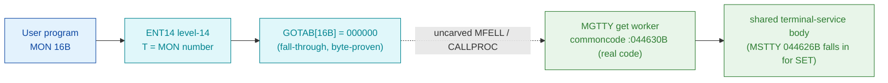

# MON 16B (octal) - GetTerminalType (MGTTY)

Gets the **terminal type** - the code that tells SINTRAN III how to handle a
particular terminal (a wrong type distorts the screen and disables the function
keys; appendix H lists the types). Input `T` = logical device number; output
`A` = terminal type. This is an ND-100 monitor call.

**Status:** `partial`. `GOTAB[16B] = 000000` (byte-proven) - a **fall-through**:
GetTerminalType has **no per-call GOTAB vector** and is routed by the resident
MFELL/CALLPROC mechanism. The named worker `MGTTY = 044630B` in resident
commoncode **is** real executable code - the GET entry of a shared terminal-service
module whose SET sibling is `MSTTY = 044626B` (MON 17B). The `fall-through -> MGTTY`
hop crosses the uncarved resident CALLPROC, so `MGTTY` is attached by symbol
**name** + shared-body adjacency (see [Honest caveats](#honest-caveats)). All
addresses/values are **octal**.

- **Full disassembly:** [`16B-GetTerminalType.ASM`](16B-GetTerminalType.ASM) - the MGTTY worker / shared body (with the MSTTY set-sibling prefix shown for the fork).
- **Bytes live once in** the canonical segment layer: [`../../segments-ref/`](../../segments-ref/).
- **Sibling call (shares this body):** [`../17B-SetTerminalType/`](../17B-SetTerminalType/).

---

## Dispatch path

The dashed hop is the resident MFELL/CALLPROC segment-switch - **not present in
any carved segment**, so the link from the fall-through slot to `MGTTY` cannot be
followed statically. `MGTTY` (E) is the named commoncode worker for MON 16B, and
it **is** real executable code.

---

## Code location (dispatch path)

Every row is a real region you can open. Byte offset = `(addr - loadbase)` in octal
words x 2; for commoncode (load base `0`) it is simply `octal-addr x 2` (decimal).

| Role | Segment (full disasm) | Addr range (octal) | Byte offset | Symbol | Verdict |
|------|------------------------|--------------------|-------------|--------|---------|
| GOTAB[16] dispatch word | [commoncode.asm](../../segments-ref/SINTRAN-DATA_commoncode/SINTRAN-DATA_commoncode.asm) - [.hex](../../segments-ref/SINTRAN-DATA_commoncode/SINTRAN-DATA_commoncode.hex) | `071251B` (1 word) | 58706 | `GOTAB+16` = `000000` | **VERIFIED** (fall-through) |
| resident MFELL/CALLPROC bridge | - (uncarved) | - | - | `CALLPROC` | **UNVERIFIED** |
| MGTTY get worker / shared body | [commoncode.asm](../../segments-ref/SINTRAN-DATA_commoncode/SINTRAN-DATA_commoncode.asm) - [.hex](../../segments-ref/SINTRAN-DATA_commoncode/SINTRAN-DATA_commoncode.hex) | `044630B-044774B` + table `044775B-045015B` | 37680 | `MGTTY` | real bytes = **CODE**; body link **MISATTRIBUTED** |
| MSTTY set sibling (shares body) | [commoncode.asm](../../segments-ref/SINTRAN-DATA_commoncode/SINTRAN-DATA_commoncode.asm) - [.hex](../../segments-ref/SINTRAN-DATA_commoncode/SINTRAN-DATA_commoncode.hex) | `044626B-044627B` (2 words) | 37676 | `MSTTY` | real bytes = **CODE** (MON 17B) |

**Verify by hand:** the GOTAB word (fall-through zero):
`grep '^71251 ' ../../segments-ref/SINTRAN-DATA_commoncode/SINTRAN-DATA_commoncode.hex`
-> byte offset `58706`; then
`dd if=../../../resident/SINTRAN-DATA_commoncode.bin bs=1 skip=58706 count=2 2>/dev/null | od -An -tx1`
-> `00 00` (= octal `000000`, the fall-through slot). For the MGTTY worker first word:
`grep '^44630 ' ../../segments-ref/SINTRAN-DATA_commoncode/SINTRAN-DATA_commoncode.hex`
-> byte offset `37680`; then
`dd if=../../../resident/SINTRAN-DATA_commoncode.bin bs=1 skip=37680 count=2 2>/dev/null | od -An -tx1`
-> `48 67` (= octal `044147` = `LDA 147`, MGTTY's first word - a real instruction,
confirming the region is code). For the MSTTY set-sibling first word:
`dd if=../../../resident/SINTRAN-DATA_commoncode.bin bs=1 skip=37676 count=2 2>/dev/null | od -An -tx1`
-> `f1 10` (= octal `170420` = `SAA 20`). `prove-mon.py 16` reports the same
`GOTAB[16] = 000000 -> FALL-THROUGH`.

---

## Instruction walkthrough

Full listing: [`16B-GetTerminalType.ASM`](16B-GetTerminalType.ASM).

**MGTTY get worker / shared body (`044630-044774`, commoncode)** is real
executable code (label `MGTTY = 044630B`, SYMBOL-1-LIST). It is the GET entry into
a large shared terminal-service module (the same module reached by the ECHOM/break
family - it calls the shared helper cell `044612` at `044764`). The body:

- **Get-mode marker (`044630-044634`)** - loads a nonzero mode constant
  (`044630 LDA 147`) and writes it into the set/get discriminator `B+164`
  (`044633 STA ,B 164`), then `044634 JMP 3 -> 044637` skips the flag-clear
  prologue at `044635-044636` (that prologue is the STMT1 sibling's entry, reached
  only from `044625`).
- **Locate the terminal datafield (`044637-044704`)** - privileged datafield
  accesses are bracketed by `BSET ZRO SSPTM` / `BSET ONE SSPTM` (page-map protect
  toggle). `044640 LDX I 135` loads the mode/param global (`mem[000072]`, via link
  cell `044775`) and `044641 LDX I ,X 141` derefs the terminal datafield pointer.
- **Set/get fork (`044661-044665`)** - `044661 LDA ,B 164` / `044662 JAZ 4`: when
  the discriminator is nonzero the SET path writes `datafield[X+27] |= 1`
  (`044663-044665`); the GET path skips the write. (16B always reaches the GET
  path with the get-default global; 17B primes it as SET - see the fork below.)
- **Terminal-type compute (`044705-044722`, `T1P04`)** - builds a 32-bit dividend
  and `044710 RDIV ST` divides by `T` (per semantics 3.7: `A = (A:D)/T`,
  `D = remainder`); `044717 MPY 71` and `044720 ADD ,B 164` scale the result.
- **Shared helper + return (`044751-044774`)** - forks into the shared terminal
  helper `044764 JPL I -152 -> [044612]` with a wait loop (`044766 JMP -2`), then
  `044774 JMP 22 -> 045016` continues into the module's second phase (`PL010`),
  past the carved window.

The link-cell/constant table `044775-045015` is **data** (the routine's pointer
and constant words); `nd100-dis` renders them as bogus instructions, so their real
values are annotated in the `.ASM`.

## The shared get/set fork (honest)

`MSTTY = 044626B` (MON 17B, set) sits **two words below** `MGTTY = 044630B` (MON
16B, get) and **falls straight through** into it. The only difference is the 2-word
MSTTY prefix: `044626 SAA 20` / `044627 STA I 146` presets the mode/opcode global
`mem[000072]` (via the same link cell `044775` the body later reads at `044640`).
So SET and GET run one body; the resident terminal primitive consults that global
(and the `B+164` discriminator) to read vs. write the terminal type. This is a
WFILE/RFILE-style single shared body forked on a preset flag.

---

## Parameter / register contract

Manual-side names/types are from
[`16B_GetTerminalType.yaml`](../../../../../../../Developer/MON/calls/16B_GetTerminalType.yaml).

| Reg / field | Dir | Meaning | Verdict |
|-------------|-----|---------|---------|
| `T` (DeviceNumber) | in | logical device number of the terminal (1 = own terminal in background); may be a TAD | inferred (manual) |
| `A` (TerminalType) | out | the terminal type (appendix H) returned to the caller | inferred (manual) |
| `B+164` | internal | set/get discriminator (`STA ,B 164` at `044633`) | VERIFIED (bytes) |
| `mem[000072]` | internal | mode/opcode global (get-default here; 17B presets 20B) | VERIFIED (cell used); value/meaning inferred |
| error return | out | standard error code (appendix A) in `A` | inferred (manual) |

The worker's register staging is VERIFIED from bytes, but the mapping onto the
user-visible device/type contract lives in the caller-side `MON 16` wrapper and the
uncarved CALLPROC frame, so the contract is **inferred**, not byte-proven here.

---

## Pseudo-code (for an emulator)

See **[`16B-GetTerminalType.pseudo.c`](16B-GetTerminalType.pseudo.c)** - a pseudo-C
model for emulator authors. The `MGTTY` worker control flow is byte-verified; the
field semantics (which cell is the terminal type, the `000072` global and the
`SSPTM` bit) are inferred, and the `045016` continuation is UNVERIFIED. Every
ND-100 instruction is translated per the canonical
[`../../instruction-semantics/ND100-INSTRUCTION-SEMANTICS.md`](../../instruction-semantics/ND100-INSTRUCTION-SEMANTICS.md).

---

## Honest caveats

**What is byte-proven:** `GOTAB[16B] = 000000` (a real fall-through slot;
`prove-mon.py 16` reads commoncode file byte `0xe552 = 00 00`). The `MGTTY` worker
at `044630B` is real code - its first word `044147B` is a genuine `LDA 147`
instruction, and the block has coherent protect-bracketed datafield access, an
`RDIV` type compute, a shared-helper wait loop and a forward continuation. The
set/get fork is byte-proven: `MSTTY = 044626B` falls through into `MGTTY` (no
branch at `044627`), and both the MSTTY prefix (`STA I 146`) and the shared body
(`LDX I 135` at `044640`) reference the **same** link cell `044775` (= `000072`).

**What is NOT proven:** the link from the fall-through slot to `MGTTY`. With
`GOTAB[16] = 0` the call is routed by the resident MFELL/CALLPROC, which lives in
an **uncarved overlay**, so a static decode cannot follow the dispatch to `MGTTY`.
Attributing the body to `MGTTY` rests on the symbol **name** (`MGTTY` matches the
`16B` short name in the manual) plus its adjacency to / shared body with `MSTTY`
(MON 17B) - not a followed pointer - hence **MISATTRIBUTED** in the strict sense.
The worker is also an **entry into a larger shared terminal-service module**: it
calls shared cells (`044612`, `045003 = 042146`, `044776 = 000215`) and the
`044774 JMP 22 -> 045016` (`PL010`) continuation lies past the carved window, so the
window is the named entry region + its data table, not a self-contained subroutine.
The meaning of the `mem[000072]` global and the `SSPTM` protect bit is inferred.

This reconciles into one story: the dispatch head is a proven fall-through
(`GOTAB[16] = 0`); `MGTTY` is a real get-entry into a shared terminal-service body;
and its attribution to MON 16 is by name + the byte-proven shared-body fall-through
with `MSTTY`, not by a followed link. Confirming the actual worker needs a live
trace (break on a real `MON 16`, single-step the CALLPROC, and record that P lands
on `MGTTY = 044630`).

Method: [../../../../../EXTRACTING-RESIDENT-CODE.md](../../../../../EXTRACTING-RESIDENT-CODE.md) - dispatch reality:
[../../TASK-05-mismatches.md](../../TASK-05-mismatches.md) - master map: [../../MON-CALL-INDEX.md](../../MON-CALL-INDEX.md).
