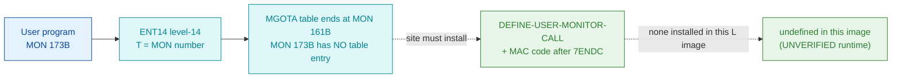

# MON 173B (octal) — UserDef3 (US3)

An **installation/user-definable** monitor call. SINTRAN III reserves eight slots
(`170B`–`177B`, names `UserDef0`–`UserDef7`, short `US0`–`US7`) that a site may implement
itself. **No handler for MON 173B is installed in this SINTRAN L image**, so there is no code
body to disassemble — this document records that proven absence and how a site would install one.

**Status:** dispatch-table structure byte-proven — the level-14 `MGOTA` table ends at MON `161B`,
so MON 173B has **no dispatch-table entry at all** (it is past the table's end). No worker is
carved or fabricated. All addresses/values are **octal**.

- **No per-call disassembly:** MON 173B is a user-definable slot with no installed handler in
  this image; there is nothing to disassemble, so no `173B-UserDef3.ASM`/`.pseudo.c` is fabricated.
- **Bytes live once in** the canonical segment layer: [`../../segments-ref/`](../../segments-ref/).

---

## Dispatch path

The `MGOTA` MON-dispatch table (base `071233B`, one word per MON number) runs cleanly from MON `0B`
to MON `161B` — odd MON numbers carry an `F16xx` level-14 entry stub, even MON numbers carry
`000000` (fall-through). The last real entry is MON `161B` at `071414B` (`F1677`). The word at
`071233B + 173B` = `71426B` lies **past the end of the dispatch table**, inside the adjacent
`D1700`/`E1600` device- and interrupt-ident data block that begins at `071416B`. So MON 173B has
no level-14 handler address here; a site installs one with `DEFINE-USER-MONITOR-CALL`.

---

## Code location (dispatch path)

Byte offset = `(addr − loadbase)` octal words × 2; `MGOTA` base = `071233B` in `commoncode` (load 0).

| Role | Segment (full disasm) | Addr (octal) | Byte offset | Reads | Verdict |
|------|------------------------|--------------|-------------|-------|---------|
| word at `071233B+173B` | [commoncode.asm](../../segments-ref/SINTRAN-DATA_commoncode/SINTRAN-DATA_commoncode.asm) · [.hex](../../segments-ref/SINTRAN-DATA_commoncode/SINTRAN-DATA_commoncode.hex) | `71426B` (1 word) | 58924 | `PIO04` (process-I/O identifier table datum) | **MISATTRIBUTED (device-table datum, not a handler)** |
| installed handler (site) | — (not in this image) | — | — | after `7ENDC`, via `DEFINE-USER-MONITOR-CALL` | **UNVERIFIED** (none installed) |

**Verify by hand:** `grep '^71426 ' ../../segments-ref/SINTRAN-DATA_commoncode/SINTRAN-DATA_commoncode.hex`
→ byte offset `58924`; then
`dd if=../../../resident/SINTRAN-DATA_commoncode.bin bs=1 skip=58924 count=2 2>/dev/null | od -An -tx1`
→ `86 a0` (= octal `103240`). Compare the last real table entry:
`grep '^71414 ' ../../segments-ref/SINTRAN-DATA_commoncode/SINTRAN-DATA_commoncode.hex` → `F1677` = MON `161B`,
the final MON-dispatch slot; everything at `071415B`+ is device/ident data, not the MON table.

---

## Instruction walkthrough

There is **no instruction body to walk** — that is the point of this entry. MON 173B is one of the
eight user-definable slots and no handler is installed in this SINTRAN L image. The word the naive
`071233B + 173B` index lands on (`PIO04`) belongs to the neighbouring device/ident
data, not to a MON handler, so it is **not** disassembled as code.

---

## Parameter / register contract

Per the manual (`Developer/MON/calls/173B_UserDef3.yaml`): **both input and output parameters are
user-defined** — a site transfers them the same way as SuspendProgram / InString / WriteToFile.
Nothing is byte-proven here because no handler exists in this image.

| Reg / field | Dir | Meaning | Verdict |
|-------------|-----|---------|---------|
| `T` | in | MON number (`173B`) used to index the level-14 table | VERIFIED (dispatch mechanism) |
| args | in/out | entirely **user-defined** (site convention) | UNKNOWN — no installed handler |
| skip / status | out | user-defined by the site handler | UNKNOWN — no installed handler |

Installation notes (from the manual): patch the handler's MAC instructions into physical memory
**after** the SINTRAN symbol `7ENDC` (best from a mode file — the call is lost on a warm start), then
register its entry with the SINTRAN-SERVICE-PROGRAM command `DEFINE-USER-MONITOR-CALL`. If the TPS
subsystem is installed, user calls `170B`–`175B` may not be available.

---

## Honest caveats

**What is byte-proven:** the shape of the level-14 `MGOTA` dispatch table. It holds one word per MON
number from `071233B` and its **last real entry is MON `161B`** (`071414B` = `F1677`); MON `162B`
onward is the adjacent `D1700`/`E1600` device/interrupt-ident data block (starts `071416B`). MON
173B therefore has **no dispatch-table entry**. The word at `71426B` reads `103240` — a `PIO03`/`PIO04` process-I/O identifier datum that is **coincidental table data, not a MON 173B handler**.

**What is NOT proven / not present:** any handler body for MON 173B. These are user-definable slots;
none is installed in this L image (the SINTRAN symbol `7ENDC`, after which a site would place its
code, bounds the resident image — the user area beyond it is empty here). No `.ASM`/`.pseudo.c` is
fabricated. Recovering a real body would require an image where a site had actually installed the
call. There is no contradiction to reconcile: the eight `170B`–`177B` slots are all in the same
state — **defined by the architecture, unimplemented in this image**.

---

Method: [../../../../../EXTRACTING-RESIDENT-CODE.md](../../../../../EXTRACTING-RESIDENT-CODE.md) · dispatch reality:
[../../TASK-05-mismatches.md](../../TASK-05-mismatches.md) · master map: [../../MON-CALL-INDEX.md](../../MON-CALL-INDEX.md).
