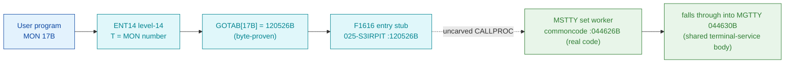

# MON 17B (octal) - SetTerminalType (MSTTY)

Sets the **terminal type** - the code that tells SINTRAN III how to handle a
particular terminal (a wrong type distorts the screen and disables the function
keys; appendix H lists the types). Input `T` = logical device number, `A` =
terminal type. Public background users may only set the type for their own
terminal. This is an ND-100 monitor call.

**Status:** `misattributed`. `GOTAB[17B] = 120526B` (byte-proven) routes to the
`F1616` entry stub in overlay `025-S3IRPIT` - a compiler stub, not the worker
itself. The named worker `MSTTY = 044626B` in resident commoncode **is** real
executable code - the SET entry of a shared terminal-service module that **falls
through** into `MGTTY = 044630B` (MON 16B GetTerminalType). The `F1616 -> MSTTY`
hop crosses the uncarved resident CALLPROC, so `MSTTY` is attached by symbol
**name** + the byte-proven fall-through (see [Honest caveats](#honest-caveats)).
All addresses/values are **octal**.

- **Full disassembly:** [`17B-SetTerminalType.ASM`](17B-SetTerminalType.ASM) - both regions (F1616 entry stub + the MSTTY worker / shared body).
- **Bytes live once in** the canonical segment layer: [`../../segments-ref/`](../../segments-ref/).
- **Sibling call (shares this body):** [`../16B-GetTerminalType/`](../16B-GetTerminalType/).

---

## Dispatch path

The dashed hop (`D -> E`) is the resident `CALLPROC`/segment-switch - **not present
in any carved segment**. `F1616` loads through runtime-populated pointer words and
re-enters via an indirect `JMP I 10`, whose targets a static decode cannot resolve.
`MSTTY` (E) is the named commoncode worker for MON 17B and it **is** real executable
code, but the link from the stub to it is not byte-followable.

---

## Code location (dispatch path)

Every row is a real region you can open. Byte offset = `(addr - loadbase)` in octal
words x 2; for commoncode (load base `0`) the byte offset is `octal-addr x 2`
(decimal), and for `025-S3IRPIT` (load base `32000B`) it is `(addr - 32000B) x 2`.

| Role | Segment (full disasm) | Addr range (octal) | Byte offset | Symbol | Verdict |
|------|------------------------|--------------------|-------------|--------|---------|
| GOTAB[17] dispatch word | [commoncode.asm](../../segments-ref/SINTRAN-DATA_commoncode/SINTRAN-DATA_commoncode.asm) - [.hex](../../segments-ref/SINTRAN-DATA_commoncode/SINTRAN-DATA_commoncode.hex) | `071252B` (1 word) | 58708 | `GOTAB+17` = `120526B` | **VERIFIED** |
| F1616 entry stub | [025-S3IRPIT.asm](../../segments-ref/025-S3IRPIT/025-S3IRPIT.asm) - [.hex](../../segments-ref/025-S3IRPIT/025-S3IRPIT.hex) | `120526B-120545B` (16 words) | 55980 | `F1616` | **VERIFIED** (real stub) |
| resident CALLPROC bridge | - (uncarved) | - | - | `CALLPROC` | **UNVERIFIED** |
| MSTTY set worker (falls into MGTTY) | [commoncode.asm](../../segments-ref/SINTRAN-DATA_commoncode/SINTRAN-DATA_commoncode.asm) - [.hex](../../segments-ref/SINTRAN-DATA_commoncode/SINTRAN-DATA_commoncode.hex) | `044626B-044627B` prefix + shared body `044630B-044774B` + table `044775B-045015B` | 37676 | `MSTTY` | real bytes = **CODE**; body link **MISATTRIBUTED** |

**Verify by hand:** the GOTAB word:
`grep '^71252 ' ../../segments-ref/SINTRAN-DATA_commoncode/SINTRAN-DATA_commoncode.hex`
-> byte offset `58708`; then
`dd if=../../../resident/SINTRAN-DATA_commoncode.bin bs=1 skip=58708 count=2 2>/dev/null | od -An -tx1`
-> `a1 56` (= octal `120526`, the F1616 vector). For the F1616 stub first word:
`grep '^120526 ' ../../segments-ref/025-S3IRPIT/025-S3IRPIT.hex`
-> byte offset `55980`; then
`dd if=../../../segments/025-S3IRPIT.bin bs=1 skip=55980 count=2 2>/dev/null | od -An -tx1`
-> `58 da` (= octal `054332` = `LDX -46`, F1616's first word). For the MSTTY worker
first word:
`grep '^44626 ' ../../segments-ref/SINTRAN-DATA_commoncode/SINTRAN-DATA_commoncode.hex`
-> byte offset `37676`; then
`dd if=../../../resident/SINTRAN-DATA_commoncode.bin bs=1 skip=37676 count=2 2>/dev/null | od -An -tx1`
-> `f1 10` (= octal `170420` = `SAA 20`, MSTTY's first word - a real instruction,
confirming the region is code). `prove-mon.py 17` reports the same
`GOTAB[17] = 120526 -> F1616`.

---

## Instruction walkthrough

Full listing: [`17B-SetTerminalType.ASM`](17B-SetTerminalType.ASM). Two regions:

**F1616 entry stub (`120526-120545`, `025-S3IRPIT`)** - a 16-word compiler stub
(label `F1616`, next symbol `CSUMO = 120546B`), structurally identical to the
F1610/F1644 stubs. It loads through indirect pointer words (`120530 LDX I 7`,
`120532 LDX I 10`) and re-enters via `120533 JMP I 10 -> [120543]`, with one direct
out-of-head branch (`120534 JMP -25 -> 120507`). Words `120535-120545` decode as
instructions but are the stub's constant/pointer cells; those targets are populated
at runtime, so the transfer to the real set-terminal-type routine is not
byte-followable from a static decode.

**MSTTY worker / shared body (`044626-044774`, commoncode)** is real executable
code (label `MSTTY = 044626B`, SYMBOL-1-LIST). It is the SET entry into a large
shared terminal-service module:

- **SET prefix (`044626-044627`)** - `044626 SAA 20` / `044627 STA I 146` presets
  the mode/opcode global `mem[000072]` (via link cell `044775`) to `20B`, then
  **falls through** into `MGTTY = 044630B` (no branch).
- **Shared body (`044630-044704`)** - marks the set/get discriminator `B+164`
  (`044633 STA ,B 164`), then locates the terminal datafield with protect-bracketed
  privileged accesses (`BSET ZRO/ONE SSPTM` around `044640 LDX I 135` /
  `044641 LDX I ,X 141`).
- **Set/get fork (`044661-044665`)** - `044661 LDA ,B 164` / `044662 JAZ 4`: because
  the SET path leaves `B+164` nonzero, MON 17B **takes** the datafield write
  `datafield[X+27] |= 1` (`044663-044665`) that the GET path (MON 16B) skips.
- **Terminal-type compute (`044705-044722`, `T1P04`)** - `044710 RDIV ST` computes
  the type index (`A = (A:D)/T`, `D = remainder`; semantics 3.7), scaled by
  `044717 MPY 71` / `044720 ADD ,B 164`.
- **Shared helper + return (`044751-044774`)** - forks into the shared terminal
  helper `044764 JPL I -152 -> [044612]` with a wait loop (`044766 JMP -2`), then
  `044774 JMP 22 -> 045016` continues into the module's second phase (`PL010`),
  past the carved window.

The link-cell/constant table `044775-045015` is **data** (annotated in the `.ASM`).

## The shared get/set fork (honest)

`MSTTY = 044626B` (set) and `MGTTY = 044630B` (get) are **adjacent** and share one
body: `MSTTY` is a 2-word prefix (`SAA 20` / `STA I 146`) that presets the
mode/opcode global `mem[000072]` and then falls straight into `MGTTY`. The resident
terminal primitive consults that global (and the `B+164` discriminator, which the
SET path leaves nonzero to take the `datafield[X+27] |= 1` write at `044663-044665`)
to decide write vs. read. This is a WFILE/RFILE-style single shared body forked on a
preset flag - the SET fork is the two words at `044626-044627`.

---

## Parameter / register contract

Manual-side names/types are from
[`17B_SetTerminalType.yaml`](../../../../../../../Developer/MON/calls/17B_SetTerminalType.yaml).

| Reg / field | Dir | Meaning | Verdict |
|-------------|-----|---------|---------|
| `T` (DeviceNumber) | in | logical device number of the terminal (1 = own terminal in background) | inferred (manual) |
| `A` (TerminalType) | in | the terminal type to set (appendix H) | inferred (manual) |
| `B+164` | internal | set/get discriminator; SET leaves it nonzero to take the datafield write | VERIFIED (bytes) |
| `mem[000072]` | internal | mode/opcode global preset to `20B` by the MSTTY prefix (`STA I 146`) | VERIFIED (cell + write); value/meaning inferred |
| `datafield[X+27]` | out | terminal datafield word whose bit0 the SET path sets (`044663-044665`) | VERIFIED (bytes); field meaning inferred |
| error return | out | standard error code (appendix A) in `A` | inferred (manual) |

The worker's register staging is VERIFIED from bytes, but the mapping onto the
user-visible device/type contract lives in the caller-side `MON 17` wrapper and the
uncarved CALLPROC frame, so the contract is **inferred**, not byte-proven here.

---

## Pseudo-code (for an emulator)

See **[`17B-SetTerminalType.pseudo.c`](17B-SetTerminalType.pseudo.c)** - a pseudo-C
model for emulator authors. Both the `F1616` stub control flow and the `MSTTY`
worker body (incl. the SET-only datafield write) are byte-verified; the field
semantics (which cell is the terminal type, the `000072` global and the `SSPTM`
bit) are inferred, and the `045016` continuation is UNVERIFIED. The `F1616 -> MSTTY`
bridge is modelled but not proven. Every ND-100 instruction is translated per the
canonical
[`../../instruction-semantics/ND100-INSTRUCTION-SEMANTICS.md`](../../instruction-semantics/ND100-INSTRUCTION-SEMANTICS.md).

---

## Honest caveats

**What is byte-proven:** `GOTAB[17B] = 120526B` (`prove-mon.py 17` reads commoncode
file byte `0xe554 = a1 56 = 120526`). The `F1616` stub at `120526B` is real code
(first word `054332B` = `LDX -46`, `CSUMO = 120546B` bounds it at 16 words). The
`MSTTY` worker at `044626B` is real code - its first word `170420B` is a genuine
`SAA 20` instruction. The set/get fork is byte-proven: `MSTTY` falls through into
`MGTTY` (no branch at `044627`), and both the MSTTY prefix (`STA I 146`) and the
shared body (`LDX I 135` at `044640`) reference the **same** link cell `044775`
(= `000072`); the SET-only datafield write at `044663-044665` is real code.

**What is NOT proven:** the link from the `F1616` stub to the `MSTTY` worker.
`F1616`'s indirect loads and `JMP I 10` go through runtime-populated pointer cells
and the resident `CALLPROC`, which lives in an **uncarved overlay**, so a static
decode cannot follow the stub to `MSTTY`; the value `044626` occurs nowhere the stub
dereferences. Attributing the body to `MSTTY` rests on the symbol **name** (`MSTTY`
matches the `17B` short name in the manual) + the byte-proven fall-through into
`MGTTY` - not a followed pointer - hence `misattributed` (stub-routed). The worker
is also an **entry into a larger shared terminal-service module**: it calls shared
cells (`044612`, `045003 = 042146`, `044776 = 000215`) and the
`044774 JMP 22 -> 045016` (`PL010`) continuation lies past the carved window, so the
window is the named entry region + its data table, not a self-contained subroutine.
The meaning of the `mem[000072]` global and the `SSPTM` protect bit is inferred.

This reconciles into one story: the dispatch head (`GOTAB -> F1616`) is solid;
`F1616` is a real but opaque compiler stub; and `MSTTY` is a real set-entry into a
shared terminal-service body whose attribution to MON 17 is by name + the
byte-proven shared-body fall-through with `MGTTY`, not by a followed link.
Confirming the actual worker needs a live trace (break at `120526B` on a real
`MON 17`, single-step through the stub and CALLPROC, and record that P lands on
`MSTTY = 044626`).

Method: [../../../../../EXTRACTING-RESIDENT-CODE.md](../../../../../EXTRACTING-RESIDENT-CODE.md) - dispatch reality:
[../../TASK-05-mismatches.md](../../TASK-05-mismatches.md) - master map: [../../MON-CALL-INDEX.md](../../MON-CALL-INDEX.md).
