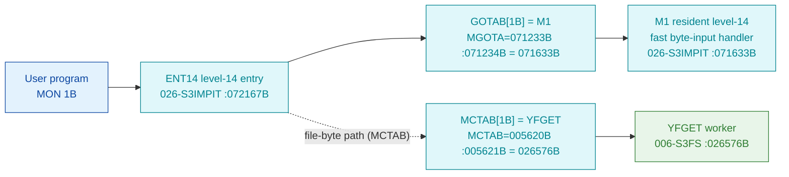

# MON 1B (octal) - InByte (INBT)

Reads **one byte** from a character device (a terminal, an opened file, or a word-oriented device
where one word is read). The program waits if the device input buffer is empty (unless a no-wait
flag is set); for a mass-storage file the next-byte pointer is incremented. Background programs may
read logical device `0` (the SINTRAN III command buffer). This is an ND-100 monitor call.

**Status:** **byte-verified** (both dispatch paths + worker body). All addresses/values are
**octal**.

> **CORRECTED 2026-07-13.** The previous version of this folder said the call was
> `misattributed (stub-routed)`, claiming `GOTAB[1B] = 120303B` routed to an `F1607` compiler
> stub and naming the worker `INBT = 032471B` in resident commoncode. **Both were artefacts of
> the wrong dispatch model.** The `120303B` was read out of `SINTRAN-DATA_commoncode`'s fake
> "GOTAB" - not the real table. Byte-proven: `GOTAB[1B] = 071633B = M1`, a **resident level-14
> fast handler** (this is one of the 32 GOTAB slots that are NOT `MFELL`), and
> `MCTAB[1B] = 026576B = YFGET`, the filesystem byte-input worker, carved in `006-S3FS`. See
> [`../317B-ExecuteCommand/README.md`](../317B-ExecuteCommand/README.md) and
> `SINTRAN/CARVING-HANDOFF.md` section 3a.

- **Full disassembly:** [`1B-InByte.ASM`](1B-InByte.ASM).
- **Emulator model:** [`1B-InByte.pseudo.c`](1B-InByte.pseudo.c).
- **Bytes live once in** the canonical segment layer: [`../../segments-ref/`](../../segments-ref/).

---

## Dispatch path

MON 1B is a **fast-path** call: its `GOTAB` slot is a resident level-14 handler (`M1`), not
`MFELL`. The filesystem byte-input worker `YFGET` is named by `MCTAB[1B]`.



Unlike the 224 `MFELL` calls, `GOTAB[1B]` jumps straight to the resident level-14 handler `M1`
(byte-proven: slot value `071633B`, exactly the `M1` symbol the skill cites as GOTAB slot 1).
`MCTAB[1B] = YFGET` is the filesystem byte-input worker. The **exact runtime hand-off** between
the `M1` fast path and the `YFGET` file-byte worker is **INFERRED** (dashed hop) - not
byte-proven here.

---

## Code location (dispatch path)

Byte offset = `(addr - loadbase)` in octal words x 2 (decimal). Offsets reproduced with `dd`.

| Role | Segment | Addr (octal) | Byte offset | Symbol | Verdict |
|------|---------|--------------|-------------|--------|---------|
| GOTAB[1B] slot | [026-S3IMPIT.asm](../../segments-ref/026-S3IMPIT/026-S3IMPIT.asm) | `071234B` = `071633B` | 32056 | -> `M1` (fast handler) | **VERIFIED** |
| MCTAB[1B] slot | [044-S3IDPIT.asm](../../segments-ref/044-S3IDPIT/044-S3IDPIT.asm) | `005621B` = `026576B` | 1826 | -> `YFGET` | **VERIFIED** |
| YFGET worker body | [006-S3FS.asm](../../segments-ref/006-S3FS/006-S3FS.asm) | `026576B-026640B` | 764 | `YFGET` | **VERIFIED** |

**Verify by hand** (from `tools/sintran-segment-carver/versions/L-VSX-500/segments/`):
```
dd if=026-S3IMPIT.bin bs=1 skip=32056 count=2 | od -An -tx1   ->  73 9b   (= 071633B = M1, NOT MFELL)
dd if=044-S3IDPIT.bin bs=1 skip=1826  count=2 | od -An -tx1   ->  2d 7e   (= 026576B = YFGET)
dd if=006-S3FS.bin    bs=1 skip=764   count=2 | od -An -tx1   ->  50 26   (= 050046B, YFGET entry: LDT 46)
```

---

## Instruction walkthrough

Full listing: [`1B-InByte.ASM`](1B-InByte.ASM).

**Two entries, one body.** `YFGET` (`026576B`, MON 1B input) and `YFPUT` (`026600B`, MON 2B
output) are a paired get/put primitive that share a single body from `026601B`:
- `YFGET`: `LDT 46` then `JMP 2` (`-> 026601B`) - loads a get selector into `T`.
- `YFPUT`: `LDT 45` then falls through to `026601B` - loads a put selector into `T`.

**Shared body (`026601B` onward).** `STT ,X 30` stores the get/put selector into the open-file
control block at `,X 30`, then `JPL I 44` (`-> 026646B`) calls the byte-transfer helper. The
code sets a status flag (`SAA 1` / `STA ,B 21`), clears a byte counter (`STZ ,B 27`), reloads a
control-block pointer (`LDT I 40`) and tests it (`SKP IF DT UEQ 0`), forking between an
in-buffer fast return and a refill/error path (`JPL I 35 -> 026652B`, error codes `132B`/`133B`
via `SAA 132`/`SAA 133`, branching back to the shared tail at `026555B`).

The two-entry structure, the selector store and the transfer-helper call are byte-proven; the
detailed buffer-refill logic in the helper is **inferred** from the get/put pairing.

---

## Parameter / register contract

| Reg / field | Dir | Meaning | Verdict |
|-------------|-----|---------|---------|
| device / file number | in | selects the input source (terminal, opened file, device) | inferred (manual) |
| `T` selector | internal | `46B` for get (`YFGET`); stored into control block `,X 30` | VERIFIED (bytes) |
| byte result | out | one byte returned (via the transfer helper) | VERIFIED (structure); register inferred |
| `,B 21` | frame | status flag set to 1 | VERIFIED (bytes) |
| `,B 27` | frame | byte counter cleared | VERIFIED (bytes) |
| wait behaviour | in/out | waits if input buffer empty unless no-wait flag set | inferred (manual) |

---

## Pseudo-code (for an emulator)

See **[`1B-InByte.pseudo.c`](1B-InByte.pseudo.c)** - the two-entry get/put selector, the control-
block store and the transfer-helper call are byte-verified; the buffer-refill logic and the
`M1` fast-path hand-off are inferred.

---

## Honest caveats

**What is byte-proven:** `GOTAB[1B] = 071633B = M1` (a resident level-14 fast handler, NOT
`MFELL` - MON 1B/2B are among the 32 fast GOTAB slots); `MCTAB[1B] = 026576B = YFGET`; the
`YFGET` entry bytes at `026576B` in `006-S3FS` match the disassembly (`050046B = LDT 46`);
`YFGET`/`YFPUT` are a shared-body get/put pair distinguished by the `T` selector (`46B`/`45B`).

**What is NOT proven:** the exact runtime relationship between the `M1` level-14 fast path and
the `YFGET` file-byte worker (whether `M1` tail-calls `YFGET` for the opened-file case, or the
monitor level reaches `YFGET` via `MCTAB` independently) - this is the dashed hop and is
**INFERRED**. The buffer-refill logic in the `026646B`/`026652B` helpers is not carved here, and
the wait/no-wait and logical-device-0 behaviours come from the manual.

**Correction to earlier work.** The old folder read `GOTAB` out of `SINTRAN-DATA_commoncode`
(the fake table) and reported `GOTAB[1B] = 120303B -> F1607` with the worker `INBT = 032471B`.
The real `GOTAB[1B] = M1 = 071633B` and the real worker is `MCTAB[1B] = YFGET = 026576B`. The
`120303B`/`F1607`/`INBT` reading was the wrong-overlay error.

Method: [../../../../../EXTRACTING-RESIDENT-CODE.md](../../../../../EXTRACTING-RESIDENT-CODE.md) -
master map: [../../MON-CALL-INDEX.md](../../MON-CALL-INDEX.md).
