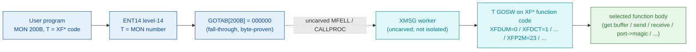

# MON 200B (octal) - XMSGFunction (XMSG)

The single entry point to the SINTRAN III **XMSG** inter-process message system.
One `MON 200` call performs one XMSG function; the **`T` register carries the
function code** (an `XF*` value, `0..47`) with option bits OR-ed into its high
byte, and the parameters ride in `A`/`D`/`X`. Programs on the same machine or on
different machines in a COSMOS network communicate entirely through this call.
This is an ND-100 monitor call.

**Status:** `documented`. `GOTAB[200B] = 000000` (byte-proven) - a **fall-through**:
there is no direct GOTAB handler word, so the level-14 handler is reached through
the resident MFELL/CALLPROC path (uncarved). The XMSG worker body is **not in the
carve set**: the symbol `2XMSG` resolves to address `200B` in a 14-symbol
**symbol-cram** (a relocation/data artifact, NOT code), and `MXMSG=75202B` lands
inside a banked-overlay **data cluster** (block-queue descriptors) whose bytes
differ per overlay - neither is the statically-reachable code worker. So the
function-code dispatch and the parameter contract below are **documented** (from
the XMSG version-M constants and the SINTRAN manuals), not byte-proven from this
L image. See [Honest caveats](#honest-caveats). All addresses/values are **octal**.

- **Full disassembly:** [`200B-XMSGFunction.ASM`](200B-XMSGFunction.ASM) - the fall-through dispatch word plus the two XMSG symbol regions, every worker word flagged UNCARVED / symbol-cram.
- **Bytes live once in** the canonical segment layer: [`../../segments-ref/`](../../segments-ref/).
- **Sibling ND-500 gateways** (which re-issue this very call from an ND-500 process): [`../512B-XMSGCallA/`](../512B-XMSGCallA/) and [`../513B-XMSGCallB/`](../513B-XMSGCallB/).

---

## Dispatch path

The caller selects the XMSG sub-function in `T`; the resident handler is a
function-code dispatch (a `GOSW`/jump-table over the `XF*` code), then it runs the
selected function body.



The dashed hop (`C -> D`) is the resident `MFELL`/`CALLPROC` fall-through - it is
**not present in any carved segment**, so it is the one link that cannot be
followed statically. `GOTAB[200B]` is literally `000000`, so there is no entry
stub to disassemble; dispatch enters the resident handler, which then switches on
the `XF*` code in `T`. The `T`-GOSW box (E) and the per-function bodies (F) are the
**documented** structure of XMSG (version-M constants + manual); they are not
isolated in these carved bytes.

---

## T-register function-code dispatch (documented)

The handler dispatches on the low byte of `T`. These are the version-M `XF*`
codes (from [`../../../../../../../SINTRAN/XMSG/DOC/XMSG-API.md`](../../../../../../../SINTRAN/XMSG/DOC/XMSG-API.md)
section 6.1; canonical values in
[`../../../../../../../SINTRAN/XMSG/xmsg-constants.json`](../../../../../../../SINTRAN/XMSG/xmsg-constants.json)).
Every code here is **documented** (version-M include file), NOT byte-proven from
this L carve - the worker table itself is not in the carve set.

| Code | Symbol | Meaning | Code | Symbol | Meaning |
|-----:|--------|---------|-----:|--------|---------|
| 0 | XFDUM | Dummy / get config | 24 | XFRIN | Routing init (obsolete) |
| 1 | XFDCT | Disconnect from msg system | 25 | XFCRD | Create driver w/ context (priv) |
| 2 | XFGET | Get message space | 26 | XFSTD | Start driver (priv) |
| 3 | XFREL | Release message space | 27 | XFDIB | Define indirect buffer (obs) |
| 4 | XFRHD | Read 6-byte header | 28 | XFRIB | Read indirect buffer (obs) |
| 5 | XFWHD | Write 6-byte header | 29 | XFWIB | Write indirect buffer (obs) |
| 6 | XFREA | Read message -> user buffer | 30 | XFPRV | Request privilege |
| 7 | XFWRI | Write user -> message | 31 | XFRTN | Write word 0 and return message |
| 8 | XFSCM | Set current message | 32 | XFRRH | Receive and read word 0 |
| 9 | XFMST | Get message status | 33 | XFDUB | Define user buffer (priv) |
| 10 | XFOPN | Open port | 34 | XFWDF | Define wake-up context (drivers) |
| 11 | XFCLS | Close port | 35 | XFDBK | Define bank no (drivers) |
| 12 | XFSND | Send message to remote port | 36 | XFSMC | Start multi-function call |
| 13 | XFRCV | Receive message on a port | 37 | XFDMM | Define max memory for task (priv) |
| 14 | XFPST | Get local port status | 38 | XFALM | Allocate messages to a task |
| 15 | XFGST | General status or wait | 39 | XFFRM | Free allocated messages |
| 16 | XFSIN | Service init (priv) | 40 | XFLMP | List messages and ports |
| 17 | XFSRL | Service release (obsolete) | 41 | XFRRE | Receive and read message |
| 18 | XFABR | Absolute read block (priv) | 42 | XFCPV | Check privileges |
| 19 | XFABW | Absolute write block (obs) | 43 | XFWRT | Write and return message |
| 20 | XFMLK | Lock msg system (obs) | 44 | XFMRT | Modify routing tables (COSROUT) |
| 21 | XFMUL | Unlock msg system (obs) | 45 | XFSFM | Send via specified link (COSROUT) |
| 22 | XFM2P | Magic -> system no. + port | 46 | XFCRR | COSROUT receive and read (COSROUT) |
| 23 | XFP2M | Port -> magic number | 47 | XFGSM | General status multiple or wait |

Option bits are OR-ed into the **high** byte of `T` (e.g. `XFWTF`=bit 15 wait,
`XFSEC`=bit 9 secure, `XFHIP`=bit 13 high-priority). Completion status returns in
`T`: positive = success (function-specific), zero = "operation not terminated"
(e.g. no message yet, no wait requested), negative = an `XE*` error code
(`XEILF`=-18 illegal function code, `XEIMA`=-19 invalid magic, ...). Full option,
error, message-type and XROUT-service tables are in
[`XMSG-API.md`](../../../../../../../SINTRAN/XMSG/DOC/XMSG-API.md) sections 2, 6.3-6.7.

---

## Code location (dispatch path)

Every row is a real region you can open. Byte offset = `(addr - loadbase)` in
octal words x 2; the commoncode load base is `0`, so the byte offset is simply
`octal-addr x 2` (decimal).

| Role | Segment (full disasm) | Addr range (octal) | Byte offset | Symbol | Verdict |
|------|------------------------|--------------------|-------------|--------|---------|
| GOTAB[200] dispatch word | [commoncode.asm](../../segments-ref/SINTRAN-DATA_commoncode/SINTRAN-DATA_commoncode.asm) · [.hex](../../segments-ref/SINTRAN-DATA_commoncode/SINTRAN-DATA_commoncode.hex) | `071433B` (1 word) | 58934 | `GOTAB+200` = `000000` | **VERIFIED** (fall-through) |
| resident MFELL/CALLPROC bridge | - (uncarved) | - | - | `MFELL`/`CALLPROC` | **UNVERIFIED** |
| `2XMSG` symbol (14-way cram) | [commoncode.asm](../../segments-ref/SINTRAN-DATA_commoncode/SINTRAN-DATA_commoncode.asm) · [.hex](../../segments-ref/SINTRAN-DATA_commoncode/SINTRAN-DATA_commoncode.hex) | `000200B` (1 word) | 256 | `2XMSG` (SYMBOL-1-LIST) | **MISATTRIBUTED** (symbol-cram / data artifact) |
| `MXMSG` symbol (overlay data cluster) | [026-S3IMPIT.asm](../../segments-ref/026-S3IMPIT/026-S3IMPIT.asm) · [.hex](../../segments-ref/026-S3IMPIT/026-S3IMPIT.hex) | `075202B` (1 word) | 36100 | `MXMSG` (SYMBOL-2-LIST) | **UNVERIFIED** (banked-overlay data cluster) |
| `XROUT` routing service (not the MON worker) | [commoncode.asm](../../segments-ref/SINTRAN-DATA_commoncode/SINTRAN-DATA_commoncode.asm) · [.hex](../../segments-ref/SINTRAN-DATA_commoncode/SINTRAN-DATA_commoncode.hex) | `014411B` | 12818 | `XROUT` (SYMBOL-2-LIST) | **UNVERIFIED** (name/routing server, not MON-200 dispatch) |

`071433B = 071233B (GOTAB base) + 200B`. The `026-S3IMPIT` word offset is
`(075202B - 032000B) = 043202B = 18050 dec`, byte offset `18050 x 2 = 36100`.

**Verify by hand (dispatch word - fall-through):**
```
grep '^71433' ../../segments-ref/SINTRAN-DATA_commoncode/SINTRAN-DATA_commoncode.hex
# -> 71433  000000  000 000  58934
dd if=../../../resident/SINTRAN-DATA_commoncode.bin bs=1 skip=58934 count=2 2>/dev/null | od -An -tx1
# -> 00 00   (the word is 000000 = GOTAB[200] is a fall-through)
```
`prove-mon.py 200` reads the same zero:
`GOTAB[200] : file byte 0xe636 of commoncode.bin, raw = 00 00 -> 000000 octal -> FALL-THROUGH`.

**Verify by hand (`2XMSG` is a 14-symbol cram at 200B, not code):**
```
grep -n '2XMSG' ../../segments-ref/SINTRAN-DATA_commoncode/SINTRAN-DATA_commoncode.symbols.txt
# the whole line reads:  200B  55MES / 5EXTD / AUPIN / SEGFS / CSPGS / ER113 /
#   2XMSG / REGBS / CMHWF / MNOBU / LUNBL / CBSIZ / SG20 / LOADR   = 200B
# 14 unrelated symbols share address 200B -> a relocation/data artifact, NOT the XMSG worker.
```

**Verify by hand (`MXMSG` sits in an overlay data cluster):**
```
grep -n 'MXMSG' ../../segments-ref/026-S3IMPIT/026-S3IMPIT.symbols.txt
# neighbours BQ09I=75201 / MXMSG=75202 / CHDVB=75204 / RECST=75225 / BQ10O=75231 /
#   DRXAC=75243 (block-queue descriptors) cluster within ~40 words = a data table, not a routine;
#   the bytes at 75202B differ between the 025 and 026 banked overlays (paging-dependent).
```

---

## Instruction walkthrough

Full listing: [`200B-XMSGFunction.ASM`](200B-XMSGFunction.ASM). There is **no entry
stub** (`GOTAB[200]=000000` is a resident fall-through) and the worker body is
**not isolated in any carved segment**, so there is no executable walkthrough of
the XMSG functions from these bytes. The `.ASM` documents the byte-proven
fall-through word and shows the two XMSG symbol regions (`2XMSG` cram at `200B`,
`MXMSG` overlay cluster at `75202B`) so the reader can see, at the byte level, why
neither is the worker. The functional model - the `T`-GOSW over the `XF*` codes -
is the **documented** structure (table above), reproduced in the pseudo-code file.

---

## Parameter / register contract

Register conventions from
[`200B_XMSGFunction.yaml`](../../../../../../../Developer/MON/calls/200B_XMSGFunction.yaml)
and the XMSG programming reference
[`XMSG-API.md`](../../../../../../../SINTRAN/XMSG/DOC/XMSG-API.md) sections 1-3.
The yaml notes that "parameters vary from function to function"; the row meanings
below are the per-function maps from the COSMOS Programmer Guide.

| Reg / field | Dir | Meaning | Verdict |
|-------------|-----|---------|---------|
| `T` (function code) | in | Low byte = `XF*` function (`0..47`); high byte = option bits (`XFWTF`/`XFSEC`/`XFHIP`/...) | documented |
| `A`, `D`, `X` | in | Function-specific parameters (e.g. `A`=NBYTES for XFGET; `AD`=MAGNO + `X`=PORTNO for XFSND; `A`=PORTNO for XFP2M) | documented |
| `AD` pair | in/out | 32-bit `MAGNO` (magic number) occupies `A`:`D` for send / port<->magic functions | documented |
| `A`, `D`, `X` | out | **Not preserved** across the call; reload after return | documented |
| `T` (status) | out | Positive = success (function-specific), `0` = not terminated, negative = `XE*` error code | documented |
| compatibility | - | ND-100 and ND-500, user + RT programs (not system programs) - per the yaml | documented |

Nothing in this contract is byte-proven from this carve (there is no isolated
worker to read it from); every row is **documented** from the XMSG constants and
the manual. The caller-side register wrapper and the uncarved resident dispatch
hold the actual assignment.

---

## Pseudo-code (for an emulator)

See **[`200B-XMSGFunction.pseudo.c`](200B-XMSGFunction.pseudo.c)** - a pseudo-C
model of the `T`-register function-code dispatch for emulator authors. Because
`GOTAB[200]=000000` (fall-through) and the XMSG worker sits past the uncarved
MFELL/CALLPROC (with only symbol-cram / overlay-cluster artifacts in the carve),
the model is of the **documented** function dispatch only, NOT of carved code. The
one byte-proven fact - the fall-through dispatch word - is modelled explicitly; the
per-function bodies are stubs that name the documented behaviour and are flagged
`UNVERIFIED`.

Instruction semantics (for the register/skip conventions the emulator must honour
around the call) follow the canonical reference:
[`../../instruction-semantics/ND100-INSTRUCTION-SEMANTICS.md`](../../instruction-semantics/ND100-INSTRUCTION-SEMANTICS.md).

---

## Honest caveats

**What is byte-proven:** `GOTAB[200B] = 000000` (level-14 fall-through;
`prove-mon.py 200` reads commoncode file byte `0xe636 = 00 00`). That is the only
fact these carved bytes establish for this call. There is no entry stub, so the
dispatch head enters the resident `MFELL`/`CALLPROC` handler in an **uncarved**
overlay.

**What is NOT proven:** the XMSG worker body and its `T`-GOSW table.
- `2XMSG` resolves to `000200B`, but **14** unrelated symbols share that exact
  address (`55MES`, `5EXTD`, `AUPIN`, `SEGFS`, `CSPGS`, `ER113`, `2XMSG`, `REGBS`,
  `CMHWF`, `MNOBU`, `LUNBL`, `CBSIZ`, `SG20`, `LOADR`) - a **symbol-cram**: a
  relocation/data artifact at a low address, not the XMSG routine. The task's own
  note flags `200B` as a symbol-cram DATA region.
- `MXMSG=75202B` sits inside a **banked-overlay data cluster** of block-queue
  descriptors (`BQ09I`, `CHDVB`, `RECST`, `BQ10O`, `DRXAC`, `BQ10I` all within ~40
  words), and its bytes **differ between the `025-S3IRPIT` and `026-S3IMPIT`
  overlays** (which overlay is mapped at MON-200 time is a runtime paging decision,
  not in the static bytes). So `MXMSG` is not a trustworthy pointer to the worker.
- `XROUT=14411B` is the XMSG **name/routing server** (a service reached by sending
  it a message), not the `MON 200` dispatch worker.

This reconciles into one story: the dispatch head (`GOTAB[200]=0`, fall-through) is
solid; the real XMSG worker and its function-code table are **not in this carve**
(only symbol-cram / overlay-cluster artifacts land in the carved segments); and the
function dispatch + parameter contract are **documented** from the XMSG version-M
constants and the SINTRAN manuals, not byte-derived. The ND-500 sibling handlers
[`../512B-XMSGCallA/`](../512B-XMSGCallA/) and [`../513B-XMSGCallB/`](../513B-XMSGCallB/)
are the reverse direction: they are byte-verified handlers that **re-issue** this
`MON 200B` on behalf of an ND-500 process (the `MON 200` at `026-S3IMPIT:075214B`
is one such re-issue). Confirming the ND-100 XMSG worker needs a live trace (break
on a real `MON 200`, single-step the fall-through and CALLPROC, record where P
lands and how it switches on `T`).

Method: [../../../../../EXTRACTING-RESIDENT-CODE.md](../../../../../EXTRACTING-RESIDENT-CODE.md) · dispatch reality:
[../../TASK-05-mismatches.md](../../TASK-05-mismatches.md) · master map: [../../MON-CALL-INDEX.md](../../MON-CALL-INDEX.md).
</content>
</invoke>
