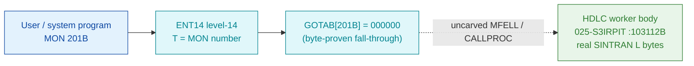

# MON 201B (octal) — HDLCfunction (HDLC)

> **CORRECTED 2026-07-15 (byte-verified).** The worker + dispatch described below are on the
> DEBUNKED model and are WRONG. Byte truth from the carved L07 image:
> `MCTAB[201B] = 006021B = XTLX=102566B` in segment 025-S3IRPIT, reached by the real dispatch
> `MON 201B -> ENT14(072167B) -> GOTAB[201B]=MFELL(072114B) -> CALLP(032201B) -> MCTAB[201B]=XTLX`.
> Any "GOTAB from commoncode" / "uncarved CALLPROC bridge" / old worker name below is an artefact
> of the wrong table. Verified: `dd if=044-S3IDPIT.bin bs=1 skip=2082 count=2` -> `85 76`.
> Cross-ref ../317B-ExecuteCommand/README.md and SINTRAN/CARVING-HANDOFF.md sec 3a.

Performs an HDLC line-driver function: **SEND** a Driver Control Block (DCB) to the driver or
**RECEIVE** a DCB from it. The same call is used by X.21 to move DCBs between a user program and
the X.21 driver; the Logical Device Number selects HDLC vs X.21. On error an HDLC status code is
returned. ND-100 call (manual ND-860228.2 EN, section 2.14).

**Status:** `partial` (fall-through). `GOTAB[201B] = 000000` is **byte-proven** — there is **no**
per-call level-14 entry stub. Dispatch drops into the resident `MFELL`/`CALLPROC` second-level path
(uncarved) which reaches the named worker `HDLC = 103112B` in segment `025-S3IRPIT` (load `32000B`,
the `SYMBOL-2-LIST` code overlay). The `HDLC` body is real SINTRAN L bytes; the `MON 201 → HDLC`
link crosses the uncarved bridge and is **inferred** from the symbol name plus the send/receive-DCB
behaviour, not a followed pointer. All addresses/values are **octal**.

- **Full disassembly:** [`201B-HDLCfunction.ASM`](201B-HDLCfunction.ASM) — the `HDLC` worker region
  (entry, function validation, SEND-DCB path, head of the RECEIVE-DCB path).
- **Bytes live once in** the canonical segment layer: [`../../segments-ref/`](../../segments-ref/).

---

## Dispatch path

`GOTAB[201]` byte-resolves to `000000` (a fall-through slot — no stub to list). The dashed hop is
the resident `MFELL`/`CALLPROC` second-level dispatch — **not present in any carved segment** — so
the `HDLC` worker (green) is located by its version-matched symbol name and its send/receive-DCB
behaviour, not by a followed pointer.

---

## Code location (dispatch path)

Ground truth: `python3 scripts/prove-mon.py 201` → `GOTAB[201] = 000000` (fall-through). Byte offset
of octal address `A` in a segment with load base `L`: `word = (A − L)` in octal, `byte = word × 2`
(decimal). The `GOTAB` slot lives in resident commoncode (load base `0`).

| Role | Segment (full disasm) | Addr range (octal) | Byte offset | Symbol | Verdict |
|------|------------------------|--------------------|-------------|--------|---------|
| GOTAB[201] dispatch word | [commoncode.asm](../../segments-ref/SINTRAN-DATA_commoncode/SINTRAN-DATA_commoncode.asm) · [.hex](../../segments-ref/SINTRAN-DATA_commoncode/SINTRAN-DATA_commoncode.hex) | `071434B` (1 word) | 58936 | `GOTAB+201` = `000000` | **VERIFIED** (fall-through, word `00 00`) |
| resident MFELL/CALLPROC bridge | — (uncarved) | — | — | `MFELL`/`CALLPROC` | **UNVERIFIED** |
| HDLC worker body | [025-S3IRPIT.asm](../../segments-ref/025-S3IRPIT/025-S3IRPIT.asm) · [.hex](../../segments-ref/025-S3IRPIT/025-S3IRPIT.hex) | `103112B–103237B` | 42132 | `HDLC` (`SYMBOL-2-LIST`; internal labels `PIO03=103122B`, `PIO04=103240B`) | real bytes **VERIFIED**; `MON 201 → HDLC` link **inferred** (symbol name + send/receive-DCB behaviour) |

**Verify by hand:** `grep '^71434 ' ../../segments-ref/SINTRAN-DATA_commoncode/SINTRAN-DATA_commoncode.hex`
→ the `GOTAB[201]` word `000000` (fall-through); then
`dd if=../../../resident/SINTRAN-DATA_commoncode.bin bs=1 skip=58936 count=2 2>/dev/null | od -An -tx1`
→ `00 00`. For the `HDLC` worker head:
`dd if=../../../segments/025-S3IRPIT.bin bs=1 skip=42132 count=6 2>/dev/null | od -An -tx1`
→ `cc 65 09 2f 49 20` (= octal `146145 004457 044440` = `RADD CLD SL DA` / `STA ,B 57` / `LDA ,B 40`,
the `HDLC` entry). Re-derive `GOTAB[201]` from the repo root with `python3 scripts/prove-mon.py 201`.

---

## Instruction walkthrough

Full listing: [`201B-HDLCfunction.ASM`](201B-HDLCfunction.ASM). One labelled region.

**Region B — `HDLC` @`103112B` (`025-S3IRPIT`), the named worker.** The entry saves the return link
(`103112 RADD CLD SL DA` = `A := L`, `103113 STA ,B 57`), and on first use of the device initialises
the driver-state cell (`103114–103136`: `SAT -1` / `SKP IF DA UEQ ST` sentinel test, then a
driver-init helper via `JPL I`). The main path reads the function selector cell `,B 33`
(`103137–103142`): selector `0` branches to the RECEIVE-DCB path at `103224`, otherwise the SEND-DCB
path runs. SEND validates the DCB size (`103143 JAP`, else status `5` via `SAT -5`; `103147–103153`
`SKP IF DT LST SA` max-vs-used, else status `7`), obtains a driver buffer (`103154–103164`, else
status `4`), writes the DCB header words into the physical buffer with four `STATX` physical stores
(`103177/103201/103203/103205`, `T = ,B 41` supplying the bank/high byte), queues the DCB to the
driver under an `IOF`/`ION` guard (`103214–103221`), and returns status `0`. The RECEIVE-DCB path
(`103224–103237`) dequeues a DCB under `IOF`, reads the header words back with `LDATX` physical loads,
and continues into the adjacent `PIO04=103240B` driver label (one shared line-driver module).

The `STATX`/`LDATX` physical DCB transfers (24-bit physical, MMU bypassed, `T` = bank) are the
byte-level reason `HDLC` is the HDLCfunction worker: it moves a Driver Control Block between the user
and the driver, exactly the manual's SEND/RECEIVE-DCB contract.

---

## Parameter / register contract

The worker body is byte-visible, but the caller-side register convention lives in the `MON 201`
wrapper and the uncarved `MFELL`/`CALLPROC` frame, so the parameter-to-frame-cell mapping is
inferred from the manual parameter order (`201B_HDLCfunction.yaml`).

| Reg / field | Dir | Meaning | Verdict |
|-------------|-----|---------|---------|
| entry point | in | `HDLC=103112B` (`025-S3IRPIT` code overlay) is the named worker | VERIFIED (bytes) |
| Func selector (`,B 33`) | in | `0` = RECEIVE DCB from driver; non-zero = SEND DCB to driver | VERIFIED test; direction meaning inferred (manual) |
| DevNo/bank (`,B 41`) | in | device/bank selector supplying `T` for the `STATX`/`LDATX` physical transfers | VERIFIED use; inferred label |
| used size (`,B 36`) | in | DCB used size; must be positive, else status `5` | VERIFIED check; label inferred |
| max size (`,B 37`) | in | DCB max size; must be `≥` used size, else status `7` | VERIFIED check; label inferred |
| status result | out | HDLC status code: `0` OK; `4` no buffer; `5` illegal size; `7` max < used | VERIFIED for the codes staged on these paths; other codes (`1,2,3,6,10,11`) manual-derived |
| user-visible convention | in | A/X/T argument assignment | **UNVERIFIED** (caller wrapper + uncarved CALLPROC) |

Full YAML contract:
[`Developer/MON/calls/201B_HDLCfunction.yaml`](../../../../../../../Developer/MON/calls/201B_HDLCfunction.yaml).

---

## Pseudo-code (for an emulator)

See **[`201B-HDLCfunction.pseudo.c`](201B-HDLCfunction.pseudo.c)** — a pseudo-C model of the `HDLC`
worker with both the SEND-DCB and RECEIVE-DCB paths. The control flow, the size/buffer validation,
and the `STATX`/`LDATX` physical DCB transfers are byte-verified; the DCB field layout and the exact
status-code meanings are inferred from the manual.

Every instruction is translated against the canonical
[`ND100-INSTRUCTION-SEMANTICS.md`](../../instruction-semantics/ND100-INSTRUCTION-SEMANTICS.md)
(`RADD CLD SL DA` = `A = L`, the COPY idiom — dest cleared then source added; `STATX` = 24-bit
PHYSICAL store `phys[EL] = A` with `EL = ((T & 0377) << 16) | ((X + disp) & 0177777)`, bypassing the
MMU; `LDATX` = the matching physical load; `SKP IF DT LST SA` = skip if `T < A`).

---

## Honest caveats

**What is byte-proven:** `GOTAB[201] = 000000` (a fall-through slot, matches `prove-mon.py`); and the
`HDLC` worker entry bytes at `103112B` are real SINTRAN L bytes that decode as a line-driver function
dispatcher (function validation, buffer allocation, `STATX`/`LDATX` physical DCB transfers, HDLC
status codes `4`/`5`/`7`).

**What is NOT proven:** the `MON 201 → HDLC` transfer. `GOTAB[201]` is `0`, so there is no stub to
follow; dispatch enters the resident `MFELL`/`CALLPROC` second-level path, which lives in an
**uncarved overlay**. `HDLC` is therefore identified as the worker by its version-matched
`SYMBOL-2-LIST` name plus the send/receive-DCB behaviour that matches the manual — the same standard
of evidence used for the other fall-through ND-100 workers in this deliverable — not by a byte-followed
pointer. Confirming the link needs a live level-14 trace: issue a real `MON 201`, single-step the
fall-through into the resident `CALLPROC`, and confirm P lands on `HDLC=103112B`.

> Address note: the NPL source is a different revision; match behaviour/structure, not raw bytes. The
> manual short name is `MHDLC`; `MHDLC=120573B` is the ND-500 companion in `N500-SYMBOLS` — a separate
> entry from the ND-100 `HDLC` worker carved here. The DCB field layout and the status numbers not
> seen on the SEND path (`1,2,3,6,10,11`) are manual-derived, not byte-isolated here.

Method: [../../../../../EXTRACTING-RESIDENT-CODE.md](../../../../../EXTRACTING-RESIDENT-CODE.md) §9 · dispatch reality:
[../../TASK-05-mismatches.md](../../TASK-05-mismatches.md) §G · master map: [../../MON-CALL-INDEX.md](../../MON-CALL-INDEX.md).
</content>
</invoke>
