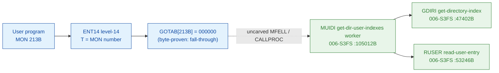

# MON 213B (octal) - GetDirUserIndexes (MUIDI)

Gets a **directory index** and a **user index** from a directory-and-user name
string (up to 16 characters, e.g. `A-HANSEN`). These two indices identify a user's
files in the file system; other calls (`GetAllFileIndexes`, `GetObjectEntry`,
`WriteDirEntry`) take them as input.

**Status:** GOTAB dispatch head byte-proven as **fall-through** (`GOTAB[213B] =
000000`, no per-call stub); the `MUIDI` worker body is real SINTRAN L bytes and
resolves the directory via `GDIRI` (Get DIRectory Index) and the user via `RUSER`
(Read USER entry) / `GUSEI` (Get USer Entry Index); the exact `MON 213 -> worker`
link crosses an uncarved kernel bridge (see [Honest caveats](#honest-caveats)). All
addresses/values are **octal**.

- **Full disassembly:** [`213B-GetDirUserIndexes.ASM`](213B-GetDirUserIndexes.ASM) - the actual code (the MUIDI worker body; there is no entry stub because the GOTAB slot is zero).
- **Bytes live once in** the canonical segment layer: [`../../segments-ref/`](../../segments-ref/).

---

## Dispatch path

The GOTAB slot is zero, so there is **no per-call entry stub**. The dashed hop
(`C -> E`) is the resident `MFELL`/`CALLPROC` fall-through second-level dispatch - it
is **not present in any carved segment**, so it is the one link that cannot be
followed statically.

---

## Code location (dispatch path)

Every row is a real region you can open. Byte offset = `(addr - loadbase)` in octal words x 2.

| Role | Segment (full disasm) | Addr range (octal) | Byte offset | Symbol | Verdict |
|------|------------------------|--------------------|-------------|--------|---------|
| GOTAB[213] dispatch word | [commoncode.asm](../../segments-ref/SINTRAN-DATA_commoncode/SINTRAN-DATA_commoncode.asm) - [.hex](../../segments-ref/SINTRAN-DATA_commoncode/SINTRAN-DATA_commoncode.hex) | `071446B` (1 word) | 58956 | `GOTAB+213` = `000000` | **VERIFIED** (fall-through) |
| resident MFELL/CALLPROC bridge | - (uncarved) | - | - | `CALLPROC` | **UNVERIFIED** |
| MUIDI get-dir-user-indexes worker | [006-S3FS.asm](../../segments-ref/006-S3FS/006-S3FS.asm) - [.hex](../../segments-ref/006-S3FS/006-S3FS.hex) | `105012B-105300B` (to `GUSNA`) | 48148 | `MUIDI` | real bytes; link **MISATTRIBUTED** |
| GDIRI get-directory-index | [006-S3FS.asm](../../segments-ref/006-S3FS/006-S3FS.asm) - [.hex](../../segments-ref/006-S3FS/006-S3FS.hex) | `47402B` (call target) | - | `GDIRI` | called by MUIDI (link cell `105260`) - **VERIFIED** |
| RUSER read-user-entry | [006-S3FS.asm](../../segments-ref/006-S3FS/006-S3FS.asm) - [.hex](../../segments-ref/006-S3FS/006-S3FS.hex) | `53246B` (call target) | - | `RUSER` | called by MUIDI (link cell `105272`) - **VERIFIED** |

**Verify by hand:** `grep '^105012 ' ../../segments-ref/006-S3FS/006-S3FS.hex` -> byte offset `48148`;
then `dd if=../../../segments/006-S3FS.bin bs=1 skip=48148 count=8 | od -An -tx1` -> `f8 90 22 29 cc 65 cc 59`
(= octal `174220 021051 146145 146131` = `BSET ONE SSK` / `STD I 51` / `RADD CLD SL DA` / `RADD CLD SB DD`, the MUIDI entry).

The GOTAB slot itself:
`dd if=../../../resident/SINTRAN-DATA_commoncode.bin bs=1 skip=58956 count=2 | od -An -tx1` -> `00 00` (= `000000`, fall-through).

The RUSER link cell: `dd if=../../../segments/006-S3FS.bin bs=1 skip=48500 count=2 | od -An -tx1` -> `56 a6` (= octal `053246`, the word at `105272B` = the resolved `RUSER` worker address); the GDIRI link cell at `105260B` (byte offset `48480`) holds `047402`.

---

## Instruction walkthrough

Full listing: [`213B-GetDirUserIndexes.ASM`](213B-GetDirUserIndexes.ASM). The functional
body is the MUIDI worker; there is no F16xx stub because `GOTAB[213] = 0`. All calls to
shared file-system workers are **indirect** (`JPL I` / `JMP I`) through pointer tables
at `105064-105077` and `105247-105300`. nd100-dis renders those pointer words as bogus
instructions - they are **data (link cells)**, not code; their contents are the real
worker addresses (resolved in the `.ASM`).

- **Entry prologue (`105012-105017`)** - `105012 BSET ONE SSK` sets the mode flag;
  `105013 STD I 51` stashes the caller's double-word parameter; `105016 SAB 157` builds
  the 157-word local frame `B` (name-string buffers); `105017 JPL I 46` -> `003752` is
  the shared resident prologue worker.
- **Parse the name string (`105026-105155`)** - the directory/user name is parsed and
  scanned via `105044/105104 JPL I -> 046231` (**FLPAR**, parameter parse),
  `105036/105010 JPL I -> 061451` (**REMCH**, remote-char), `105122 JPL I 132` ->
  `042237` (**SEPST**, separator scan) and `105127 JPL I 126` -> `030062` (**GETCH**,
  get char). Errors funnel to the store-status exit at `105243`.
- **Resolve directory + user (`105145-105213`)** - `105145 JPL I 113` -> `047402`
  (**GDIRI**, Get DIRectory Index) yields the directory index; then
  `105152 JPL I 107` -> `053740` (**GUSEI**, Get USer Entry Index),
  `105135/105173 JPL I -> 054527` (**GMUSI**), `105171 JPL I 73` -> `055111`
  (**GUSEN**), `105202 JPL I 65` -> `054130` (**GMFKN**) and
  `105207 JPL I 62` -> `053114` (**TUSRT**) resolve the user, and
  `105213 JPL I 57` -> `053246` (**RUSER**, Read USER entry) reads the user entry.
- **Return the indices (`105226-105242`)** - the resolved directory and user indices
  are packed for the caller (`105234-105237 SHA/ADD -> STA ,B 1`);
  `105240 MIN ,B 4` is the success return-link bump; `105243 STA ,B 2` writes the result
  word into the caller's status slot `B+2`; every path funnels into the resident return
  `105242 JMP I 36` -> `003776`.

The `JPL I 113` call to **GDIRI** (link cell `105260 = 047402`) plus the
`JPL I 57` call to **RUSER** (link cell `105272 = 053246`) and `JPL I 107` to **GUSEI**
(link cell `105261 = 053740`) are the byte-level proof that MUIDI is the
GetDirUserIndexes worker: it resolves a directory index and a user index from a name
string. `MUIDI` is also the `213B` short name in the manual.

---

## Parameter / register contract

Manual-side names/types are from [`213B_GetDirUserIndexes.yaml`](../../../../../../../Developer/MON/calls/213B_GetDirUserIndexes.yaml).

| Reg / field | Dir | Meaning | Verdict |
|-------------|-----|---------|---------|
| entry point (worker) | in | `105012B` = MUIDI worker entry | VERIFIED (bytes) |
| `SSK` (skip flag) | internal | `1` at entry; latched to `B+156` | VERIFIED (bytes) |
| `D` (double) | in | caller parameter block, saved first (`STD I 51`) | VERIFIED (copy); layout inferred |
| local frame `B` | internal | `SAB 157` = 157B-word working frame | VERIFIED (bytes) |
| `X` (manual) | in | address of the directory-and-user name string (up to 16 chars) | inferred (manual MAC example) |
| `T` (manual) | out | directory index (`STT INDEX` left byte) | inferred (manual) |
| `A` (manual) | out | user index (right byte of the returned index word); error number on error return | inferred (manual) |
| `B+1` | internal | packed directory/user index result (`STA ,B 1` at `105237`) | VERIFIED (bytes) |
| `B+2` | out | returned status word (`STA ,B 2` at `105243`) | VERIFIED (bytes) |

The user-visible `X` in / `T`+`A` out register convention lives in the caller-side
`MON 213` wrapper and the uncarved `MFELL`/`CALLPROC` frame, so the precise
user-register-to-field assignment is **inferred** from the manual, not byte-proven
here.

---

## Pseudo-code (for an emulator)

See **[`213B-GetDirUserIndexes.pseudo.c`](213B-GetDirUserIndexes.pseudo.c)** - a pseudo-C
model of the handler for emulator authors. Control flow + the calls to GDIRI / RUSER /
GUSEI are byte-verified; the parameter-field semantics and error-number meanings are
inferred from the call structure and the manual. Every instruction is translated per the
canonical
[`ND100-INSTRUCTION-SEMANTICS.md`](../../instruction-semantics/ND100-INSTRUCTION-SEMANTICS.md)
(bare `LDA disp` = `mem[P+disp]`; `RADD CLD SD DA` = `A = D`; `SHA ZIN` logical shift;
`MIN ,B 4` success bump).

---

## Honest caveats

**What is byte-proven:** `GOTAB[213B] = 000000` (level-14 fall-through, no per-call
vector); the `MUIDI` worker body at `105012B` in `006-S3FS` is real code (entry bytes
`174220 021051 146145 146131` match the disassembly, bounded by the next FILSYS symbol
`GUSNA = 105301B`); and it resolves the indices - it calls `GDIRI` (`047402B`, link cell
`105260`), `RUSER` (`053246B`, link cell `105272`) and `GUSEI` (`053740B`, link cell
`105261`).

**What is NOT proven:** the link from the zero GOTAB slot to the `MUIDI` worker. Because
the vector is zero there is no stub to disassemble and no pointer to dereference;
dispatch drops into the resident `MFELL`/`CALLPROC` second-level path, which lives in an
**uncarved overlay**. So the `MON 213 -> MUIDI` attribution rests on the `MUIDI` symbol
name (the `213B` short name) + its `GDIRI`/`RUSER`/`GUSEI` calls + the matching
resolve-indices behaviour, not a followed pointer - hence **MISATTRIBUTED** in the strict
sense. Confirming the link needs a live trace: issue a real `MON 213`, single-step the
level-14 fall-through into the resident `CALLPROC` dispatch, and confirm P lands on
`MUIDI = 105012`.

**Region bound:** the MUIDI worker is bounded strictly to the next FILSYS symbol
`GUSNA = 105301B`. Several link-cell targets (`003752`, `020274`, `001224`, `003776`)
sit below the `26000B` segment load base; they are resident-monitor / save-restore
routines outside the file-system segment and are not resolved here.

Method: [../../../../../EXTRACTING-RESIDENT-CODE.md](../../../../../EXTRACTING-RESIDENT-CODE.md) - dispatch reality:
[../../TASK-05-mismatches.md](../../TASK-05-mismatches.md) - master map: [../../MON-CALL-INDEX.md](../../MON-CALL-INDEX.md).
