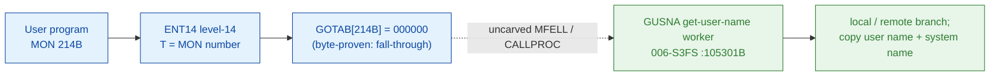

# MON 214B (octal) - GetUserName (GUSNA)

Gets the name of a user (16 characters) given a **directory index** and a **user
index**. With the COSMOS network installed the user may be on a remote computer,
in which case the remote system name is returned too and a remote flag is set. RT
programs return the name of user RT. Available to all users and all programs on
the ND-100 and ND-500.

**Status:** GOTAB dispatch head byte-proven as **fall-through** (`GOTAB[214B] =
000000`, no per-call stub); the `GUSNA` worker body is real SINTRAN L bytes in the
file-system segment `006-S3FS` (a `FILSYS-SYMBOLS` symbol). The worker is real
executable code with a local-user / remote-user branch, several resident-worker
calls, a name-byte scan and an error tail (it closes at `105407B`, bounded by the
next symbol `GUIOI=105432B`). The exact `MON 214 -> worker` link crosses an
uncarved kernel bridge (see [Honest caveats](#honest-caveats)). All
addresses/values are **octal**.

- **Full disassembly:** [`214B-GetUserName.ASM`](214B-GetUserName.ASM) - the actual code (the GUSNA worker body; there is no entry stub because the GOTAB slot is zero).
- **Bytes live once in** the canonical segment layer: [`../../segments-ref/`](../../segments-ref/).

---

## Dispatch path

The GOTAB slot is zero, so there is **no per-call entry stub**. The dashed hop
(`C -> E`) is the resident `MFELL`/`CALLPROC` fall-through second-level dispatch -
it is **not present in any carved segment**, so it is the one link that cannot be
followed statically.

---

## Code location (dispatch path)

Every row is a real region you can open. Byte offset = `(addr - loadbase)` in
octal words x 2; for commoncode (load base `0`) the byte offset is the octal
address x 2 (decimal), and for `006-S3FS` (load base `26000B`) it is
`(addr - 26000B) x 2`.

| Role | Segment (full disasm) | Addr range (octal) | Byte offset | Symbol | Verdict |
|------|------------------------|--------------------|-------------|--------|---------|
| GOTAB[214] dispatch word | [commoncode.asm](../../segments-ref/SINTRAN-DATA_commoncode/SINTRAN-DATA_commoncode.asm) - [.hex](../../segments-ref/SINTRAN-DATA_commoncode/SINTRAN-DATA_commoncode.hex) | `071447B` (1 word) | 58958 | `GOTAB+214` = `000000` | **VERIFIED** (fall-through) |
| resident MFELL/CALLPROC bridge | - (uncarved) | - | - | `MFELL`/`CALLPROC` | **UNVERIFIED** |
| GUSNA worker body | [006-S3FS.asm](../../segments-ref/006-S3FS/006-S3FS.asm) - [.hex](../../segments-ref/006-S3FS/006-S3FS.hex) | `105301B-105407B` (code) + `105410B` (pad) + `105411B-105431B` (link cells) | 48514 | `GUSNA` | real bytes = **CODE**; body link **MISATTRIBUTED** |

The window is bounded strictly to the next symbol `GUIOI=105432B` (89 words).
Words `105301B-105407B` are code, `105410B` is a one-word `ROP NOOP` pad, and
`105411B-105431B` are a pointer table (link cells) the `JPL I` / `JMP I`
indirections dereference - `nd100-dis` renders them as bogus instructions but they
are **data**.

**Verify by hand:** `grep '^105301 ' ../../segments-ref/006-S3FS/006-S3FS.hex`
-> byte offset `48514`; then
`dd if=../../../segments/006-S3FS.bin bs=1 skip=48514 count=2 2>/dev/null | od -An -tx1`
-> `22 47` (the stored word = octal `021107`, a genuine `STD I 107` instruction,
confirming the region is code). The GOTAB slot itself:
`grep '^71447 ' ../../segments-ref/SINTRAN-DATA_commoncode/SINTRAN-DATA_commoncode.hex`
-> `71447  000000  000 000  58958`; then
`dd if=../../../resident/SINTRAN-DATA_commoncode.bin bs=1 skip=58958 count=2 2>/dev/null | od -An -tx1`
-> `00 00` (= `000000`, fall-through). `prove-mon.py 214` reads the same GOTAB zero.

---

## Instruction walkthrough

Full listing: [`214B-GetUserName.ASM`](214B-GetUserName.ASM). The body is the
`GUSNA` worker (there is no F16xx stub because `GOTAB[214] = 0`).

**Entry + prologue (105301-105307)** - `105301 STD I 107` saves the incoming
`A/D` pair; `105302-105303` copy the return link and frame pointer; `105304 SAB
63` and `105305 JPL I 104 -> [105411]` call the resident prologue worker;
`105306 LDA ,B 0` / `105307 JAP 36 -> 105345` branch on the descriptor's sign bit
to the local-user or remote-user path.

**Local-user path (105310-105344)** - stages the request (`105310 LDA 102` /
`105311 RADD SB DA`, `105313 LDX ,B 1`), calls resident workers
(`105314 JPL I 77`, `105321 JPL I 74`, `105342 JPL I 57`), clears the remote bit
(`105324 BSET ZRO 15 DA`) and stores the name words into the entry through an
indirect pointer (`105330 LDX I 66`, `105331/105334/105337 STA ,X ...`), then
`105344 JMP 32 -> 105376` joins the common tail.

**Remote / COSMOS path (105345-105375)** - shifts the descriptor
(`105345 LDT ,B 0` / `105346 SHT ZIN SHR 10`), calls a resident worker
(`105347 JPL I 53`), range-checks the index (`105351 SKP IF DX MGRE SA`), masks
the descriptor (`105356 AND 47`), and scans a name byte (`105367 SAX 0` /
`105370 LBYT` / `105371 SAT 77` / `105372 SKP IF DA EQL ST`).

**Common tail + error return (105376-105410)** - `105376-105401` fetch and pass
the result to a final resident worker; the error tail `105404 SAA -63` /
`105406 STA ,B 2` loads a standard error code and returns indirectly
(`105405 JMP I 24 -> [105431]`).

---

## Parameter / register contract

Manual-side names/types are from [`214B_GetUserName.yaml`](../../../../../../../Developer/MON/calls/214B_GetUserName.yaml).

| Reg / field | Dir | Meaning | Verdict |
|-------------|-----|---------|---------|
| `A` (UserName) | in | address of a 16-char buffer to receive the user name (`MAC` `LDA (USER`) | inferred (manual) |
| `X` (index) | in | left byte = directory index, right byte = user index; bit 15 set = remote user (`LDX INDEX`) | inferred (manual) |
| `T` (RemoteSystem) | in | address of the remote-system identification string; used only if X bit 15 set (`LDT (REMID`) | inferred (manual) |
| `B+62` | internal | name-scan working pointer (`STA ,B 62`, `LDX ,B 62`) | VERIFIED (bytes); meaning inferred |
| descriptor bit 15 | internal | local vs remote branch (`LDA ,B 0` / `JAP`, `BSET ZRO 15 DA`) | VERIFIED (bytes); meaning inferred |
| error return | out | standard error code in `A` (`105404 SAA -63`) | VERIFIED (bytes); code value inferred |

The worker's register staging and stores are VERIFIED from bytes, but the mapping
onto the user-visible buffer / index / remote-flag contract lives in the
caller-side `MON 214` wrapper and the uncarved CALLPROC frame, so the contract is
**inferred**, not byte-proven here.

---

## Pseudo-code (for an emulator)

See **[`214B-GetUserName.pseudo.c`](214B-GetUserName.pseudo.c)** - a pseudo-C model
of the handler for emulator authors. The control flow (the local/remote branch,
the resident-worker calls, the field stores, the `LBYT` name-byte fetch and the
error tail) is byte-verified; the register/field semantics and the exact packed-X
index meaning are inferred from the manual and the code shape.

Every instruction in the pseudo-code is translated against the canonical
[ND-100 instruction semantics reference](../../instruction-semantics/ND100-INSTRUCTION-SEMANTICS.md)
(`RADD CLD` copy idiom, `RADD SB DA` register add, `JAP` sign branch, `BSET ZRO`
bit clear, `SHT ZIN SHR` logical shift, `SKP IF DX MGRE SA` unsigned compare,
`LBYT` byte load, `MIN ,B` increment-and-skip, `JPL I`/`JMP I` indirect
call/return, addressing-mode effective addresses).

---

## Honest caveats

**What is byte-proven:** `GOTAB[214B] = 000000` (level-14 dispatch, a fall-through
with no per-call vector; `prove-mon.py 214` reads commoncode file byte
`0xe64e = 00 00`); the `GUSNA` worker body at `105301B` in `006-S3FS` is real code
(first word `021107B = STD I 107` matches the disassembly); and it is a
get-user-name routine (local/remote branch, name-word stores, a name-byte scan and
a standard error return), consistent with GetUserName.

**Which segment and why:** `GUSNA=105301B` is a `FILSYS-SYMBOLS` symbol, so it
lives in the file-system segment `006-S3FS` (the same segment that carries the
file-open / directory workers). The window `105301B-105431B` is bounded strictly
by the next symbol `GUIOI=105432B` (89 words): `105301-105407` are code, `105410`
is a `ROP NOOP` pad, and `105411-105431` are the `JPL I`/`JMP I` link-cell table.

**What is NOT proven:** the link from the zero GOTAB slot to the `GUSNA` worker.
Because the vector is zero there is no stub to disassemble and no pointer to
dereference; dispatch drops into the resident `MFELL`/`CALLPROC` second-level
path, which lives in an **uncarved overlay**. So the `MON 214 -> GUSNA`
attribution rests on the `GUSNA` symbol name (Get USer NAme) + the matching
behaviour, not a followed pointer - hence **MISATTRIBUTED** in the strict sense.
The worker's `JPL I` indirections target the link cells `105411..105431`, whose
runtime targets are not resolved here. Confirming the dispatch link needs a live
trace: issue a real `MON 214`, single-step the level-14 fall-through into the
resident `CALLPROC`, and confirm P lands on `GUSNA = 105301`.

Method: [../../../../../EXTRACTING-RESIDENT-CODE.md](../../../../../EXTRACTING-RESIDENT-CODE.md) - dispatch reality:
[../../TASK-05-mismatches.md](../../TASK-05-mismatches.md) - master map: [../../MON-CALL-INDEX.md](../../MON-CALL-INDEX.md).
