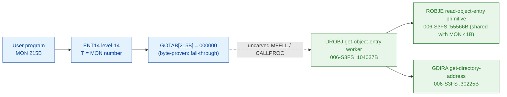

# MON 215B (octal) - GetObjectEntry (DROBJ)

Gets information about a file. An *object entry* describes each file - it holds the
file name, the access rights, the dates last opened for read and write, the size,
and the device/unit where the file resides (a 64-byte record). The caller selects
the file by **directory index**, **user index** and **object index** (one object
entry per file version), and passes a 32-word (64-byte) receive buffer. Files on a
remote system reachable through a COSMOS network can be accessed too.

**Status:** GOTAB dispatch head byte-proven as **fall-through** (`GOTAB[215B] =
000000`, no per-call stub); the `DROBJ` worker body is real SINTRAN L bytes and
calls the `ROBJE` (Read OBJect Entry) primitive - the SAME primitive MON 41B
ReadObjectEntry drives - together with `GDIRA` (Get DIRectory Address) and the
user/index helpers; the exact `MON 215 -> worker` link crosses an uncarved kernel
bridge (see [Honest caveats](#honest-caveats)). All addresses/values are **octal**.

- **Full disassembly:** [`215B-GetObjectEntry.ASM`](215B-GetObjectEntry.ASM) - the actual code (the DROBJ worker body; there is no entry stub because the GOTAB slot is zero).
- **Bytes live once in** the canonical segment layer: [`../../segments-ref/`](../../segments-ref/).

---

## Dispatch path

The GOTAB slot is zero, so there is **no per-call entry stub**. The dashed hop
(`C -> E`) is the resident `MFELL`/`CALLPROC` fall-through second-level dispatch - it
is **not present in any carved segment**, so it is the one link that cannot be
followed statically.

---

## Code location (dispatch path)

Every row is a real region you can open. Byte offset = `(addr - loadbase)` in octal words x 2.

| Role | Segment (full disasm) | Addr range (octal) | Byte offset | Symbol | Verdict |
|------|------------------------|--------------------|-------------|--------|---------|
| GOTAB[215] dispatch word | [commoncode.asm](../../segments-ref/SINTRAN-DATA_commoncode/SINTRAN-DATA_commoncode.asm) - [.hex](../../segments-ref/SINTRAN-DATA_commoncode/SINTRAN-DATA_commoncode.hex) | `071450B` (1 word) | 58960 | `GOTAB+215` = `000000` | **VERIFIED** (fall-through) |
| resident MFELL/CALLPROC bridge | - (uncarved) | - | - | `CALLPROC` | **UNVERIFIED** |
| DROBJ get-object-entry worker | [006-S3FS.asm](../../segments-ref/006-S3FS/006-S3FS.asm) - [.hex](../../segments-ref/006-S3FS/006-S3FS.hex) | `104037B-104407B` (to `DWOBJ`) | 47166 | `DROBJ` | real bytes; link **MISATTRIBUTED** |
| ROBJE read-object-entry primitive | [006-S3FS.asm](../../segments-ref/006-S3FS/006-S3FS.asm) - [.hex](../../segments-ref/006-S3FS/006-S3FS.hex) | `55566B` (call target) | - | `ROBJE` | called by DROBJ (link cell `104244`) - **VERIFIED** |
| GDIRA get-directory-address | [006-S3FS.asm](../../segments-ref/006-S3FS/006-S3FS.asm) - [.hex](../../segments-ref/006-S3FS/006-S3FS.hex) | `30225B` (call target) | - | `GDIRA` | called by DROBJ (link cell `104402`) - **VERIFIED** |

**Verify by hand:** `grep '^104037 ' ../../segments-ref/006-S3FS/006-S3FS.hex` -> byte offset `47166`;
then `dd if=../../../segments/006-S3FS.bin bs=1 skip=47166 count=8 | od -An -tx1` -> `f8 10 22 2e cc 65 cc 59`
(= octal `174020 021056 146145 146131` = `BSET ZRO SSK` / `STD I 56` / `RADD CLD SL DA` / `RADD CLD SB DD`, the DROBJ entry).

The GOTAB slot itself:
`dd if=../../../resident/SINTRAN-DATA_commoncode.bin bs=1 skip=58960 count=2 | od -An -tx1` -> `00 00` (= `000000`, fall-through).

The ROBJE link cell: `dd if=../../../segments/006-S3FS.bin bs=1 skip=47432 count=2 | od -An -tx1` -> `5b 76` (= octal `055566`, the word at `104244B` = the resolved `ROBJE` worker address).

---

## Instruction walkthrough

Full listing: [`215B-GetObjectEntry.ASM`](215B-GetObjectEntry.ASM). The functional body
is the DROBJ worker; there is no F16xx stub because `GOTAB[215] = 0`. All calls to
shared file-system workers are **indirect** (`JPL I` / `JMP I`) through pointer
tables at `104116-104131`, `104231-104251` and `104364-104407`. nd100-dis renders
those pointer words as bogus instructions - they are **data (link cells)**, not code;
their contents are the real worker addresses (resolved in the `.ASM`).

- **Entry prologue (`104037-104044`)** - `104037 BSET ZRO SSK` clears the
  read/write selector; `104040 STD I 56` stashes the caller's double-word parameter;
  `104043 SAB 131` builds the 131-word local frame `B`; `104044 JPL I 53` -> `003752`
  is the shared resident prologue worker.
- **Selector latch (`104045-104054`)** - the `SSK` flag is latched into `B+127`
  (`104050 STA ,B 127` / `104052 STZ ,B 127`) and re-read (`104053 LDA ,B 127`).
- **Index resolve (`104055-104232`)** - the directory/user/object indices are
  validated and resolved via `104063 JPL I 36` -> `031075` (**USCPS**),
  `104070 JPL I 34` -> `046231` (**FLPAR**), `104132 JPL I 77` -> `101303`
  (**CHDUO**), `104174 JPL I 45` -> `101043` (**FOPTB**),
  `104177 JPL I 44` -> `071413` (**STDUO**), `104214 JPL I 33` -> `056307`
  (**ROBJB**, read-object-block) and `104226 JPL I 23` -> `053114` (**TUSRT**). A
  range/validity failure funnels to the store-status exit at `104362`.
- **Read the object entry (`104202`)** - `104202 JPL I 42` -> `055566` (**ROBJE**),
  the Read-OBJect-Entry primitive, fetches the 64-byte entry - the same primitive
  MON 41B ReadObjectEntry uses. The directory address is taken with
  `104330 JPL I 52` -> `030225` (**GDIRA**), and the user helpers
  `104300 JPL I 74` -> `055111` (**GUSEN**), `104302 JPL I 74` -> `054527`
  (**GMUSI**), `104306 JPL I 72` -> `054130` (**GMFKN**) resolve the user/index.
- **Finish (`104351-104363`)** - `104356 MIN ,B 4` is the success return-link bump;
  `104362 STA ,B 2` writes the result word into the caller's status slot `B+2`;
  every path funnels into the resident return `104360 JMP I 27` -> `003776`.

The `JPL I 42` call to **ROBJE** (link cell `104244 = 055566`) plus the `JPL I 52`
call to **GDIRA** (link cell `104402 = 030225`) are the byte-level proof that DROBJ
is the GetObjectEntry worker: it drives the object-entry read primitive by
directory/user/object index, exactly as the manual describes. `DROBJ` (Directory
Read OBJect entry) is also the `215B` short name in the manual.

---

## Parameter / register contract

Manual-side names/types are from [`215B_GetObjectEntry.yaml`](../../../../../../../Developer/MON/calls/215B_GetObjectEntry.yaml).

| Reg / field | Dir | Meaning | Verdict |
|-------------|-----|---------|---------|
| entry point (worker) | in | `104037B` = DROBJ worker entry | VERIFIED (bytes) |
| `SSK` (skip flag) | internal | `0` at entry (get object entry); latched to `B+127` | VERIFIED (bytes) |
| `D` (double) | in | caller parameter block, saved first (`STD I 56`) | VERIFIED (copy); layout inferred |
| local frame `B` | internal | `SAB 131` = 131B-word working frame | VERIFIED (bytes) |
| `A` (manual) | in | address of the 32-word (64-byte) object-entry receive buffer | inferred (manual MAC example) |
| `T` (manual) | in | INDEX: left byte = directory index, right byte = user index | inferred (manual) |
| `X` (manual) | in | object index | inferred (manual) |
| `D` (manual) | in | remote system identification (used only if remote bit set) | inferred (manual) |
| `A` (manual) | out | error number on the error return | inferred (manual) |
| `B+2` | out | returned status word (`STA ,B 2` at `104362`) | VERIFIED (bytes) |

The user-visible `A`/`T`/`X`/`D` register convention lives in the caller-side
`MON 215` wrapper and the uncarved `MFELL`/`CALLPROC` frame, so the precise
user-register-to-field assignment is **inferred** from the manual, not byte-proven
here.

---

## Pseudo-code (for an emulator)

See **[`215B-GetObjectEntry.pseudo.c`](215B-GetObjectEntry.pseudo.c)** - a pseudo-C
model of the handler for emulator authors. Control flow + the calls to ROBJE and
GDIRA are byte-verified; the parameter-field semantics and error-number meanings are
inferred from the call structure and the manual. Every instruction is translated per
the canonical
[`ND100-INSTRUCTION-SEMANTICS.md`](../../instruction-semantics/ND100-INSTRUCTION-SEMANTICS.md)
(bare `LDA disp` = `mem[P+disp]`; `RADD CLD SD DA` = `A = D`; `BSET ZRO SSK` clears
the skip flag; `MIN ,B 4` success bump).

---

## Honest caveats

**What is byte-proven:** `GOTAB[215B] = 000000` (level-14 fall-through, no per-call
vector); the `DROBJ` worker body at `104037B` in `006-S3FS` is real code (entry bytes
`174020 021056 146145 146131` match the disassembly, bounded by the next FILSYS symbol
`DWOBJ = 104410B`); and it drives the object-entry read - it calls `ROBJE` (`055566B`,
link cell `104244`, the same primitive MON 41B uses) and `GDIRA` (`030225B`, link cell
`104402`).

**What is NOT proven:** the link from the zero GOTAB slot to the `DROBJ` worker.
Because the vector is zero there is no stub to disassemble and no pointer to
dereference; dispatch drops into the resident `MFELL`/`CALLPROC` second-level path,
which lives in an **uncarved overlay**. So the `MON 215 -> DROBJ` attribution rests on
the `DROBJ` symbol name (the `215B` short name) + its call to `ROBJE`/`GDIRA` + the
matching get-object-entry behaviour, not a followed pointer - hence **MISATTRIBUTED**
in the strict sense. Confirming the link needs a live trace: issue a real `MON 215`,
single-step the level-14 fall-through into the resident `CALLPROC` dispatch, and
confirm P lands on `DROBJ = 104037`.

**Region bound:** the DROBJ worker is bounded strictly to the next FILSYS symbol
`DWOBJ = 104410B` (which is the MON 216B SetObjectEntry worker). Several link-cell
targets (`003752`, `010376`, `020274`, `001224`, `003776`) sit below the `26000B`
segment load base; they are resident-monitor / save-restore routines outside the
file-system segment and are not resolved here.

Method: [../../../../../EXTRACTING-RESIDENT-CODE.md](../../../../../EXTRACTING-RESIDENT-CODE.md) - dispatch reality:
[../../TASK-05-mismatches.md](../../TASK-05-mismatches.md) - master map: [../../MON-CALL-INDEX.md](../../MON-CALL-INDEX.md).
