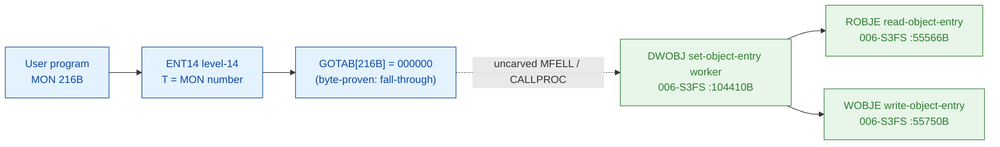

# MON 216B (octal) - SetObjectEntry (DWOBJ)

Changes the description of a file. An *object entry* describes each file (file name,
access rights, dates last opened for read and write, size, and more - a 64-byte
record). The normal use is `GetObjectEntry` to read the entry, change parts of it,
then write it back with `SetObjectEntry`. The caller selects the file by **directory
index**, **user index** and **object index**, and passes the 32-word (64-byte)
source buffer. On the ND-100 the file may live on a remote system reachable through a
COSMOS network.

**Status:** GOTAB dispatch head byte-proven as **fall-through** (`GOTAB[216B] =
000000`, no per-call stub); the `DWOBJ` worker body is real SINTRAN L bytes and reads
the entry with `ROBJE` (Read OBJect Entry) then writes it back with `WOBJE` (Write
OBJect Entry) - the write twin of `ROBJE`; the exact `MON 216 -> worker` link crosses
an uncarved kernel bridge (see [Honest caveats](#honest-caveats)). All
addresses/values are **octal**.

- **Full disassembly:** [`216B-SetObjectEntry.ASM`](216B-SetObjectEntry.ASM) - the actual code (the DWOBJ worker body; there is no entry stub because the GOTAB slot is zero).
- **Bytes live once in** the canonical segment layer: [`../../segments-ref/`](../../segments-ref/).

---

## Dispatch path

The GOTAB slot is zero, so there is **no per-call entry stub**. The dashed hop
(`C -> E`) is the resident `MFELL`/`CALLPROC` fall-through second-level dispatch - it
is **not present in any carved segment**, so it is the one link that cannot be
followed statically.

---

## Code location (dispatch path)

Every row is a real region you can open. Byte offset = `(addr - loadbase)` in octal words x 2.

| Role | Segment (full disasm) | Addr range (octal) | Byte offset | Symbol | Verdict |
|------|------------------------|--------------------|-------------|--------|---------|
| GOTAB[216] dispatch word | [commoncode.asm](../../segments-ref/SINTRAN-DATA_commoncode/SINTRAN-DATA_commoncode.asm) - [.hex](../../segments-ref/SINTRAN-DATA_commoncode/SINTRAN-DATA_commoncode.hex) | `071451B` (1 word) | 58962 | `GOTAB+216` = `000000` | **VERIFIED** (fall-through) |
| resident MFELL/CALLPROC bridge | - (uncarved) | - | - | `CALLPROC` | **UNVERIFIED** |
| DWOBJ set-object-entry worker | [006-S3FS.asm](../../segments-ref/006-S3FS/006-S3FS.asm) - [.hex](../../segments-ref/006-S3FS/006-S3FS.hex) | `104410B-105007B` (to `MRUSE`) | 47632 | `DWOBJ` | real bytes; link **MISATTRIBUTED** |
| ROBJE read-object-entry | [006-S3FS.asm](../../segments-ref/006-S3FS/006-S3FS.asm) - [.hex](../../segments-ref/006-S3FS/006-S3FS.hex) | `55566B` (call target) | - | `ROBJE` | called by DWOBJ (link cell `104771`) - **VERIFIED** |
| WOBJE write-object-entry | [006-S3FS.asm](../../segments-ref/006-S3FS/006-S3FS.asm) - [.hex](../../segments-ref/006-S3FS/006-S3FS.hex) | `55750B` (call target) | - | `WOBJE` | called by DWOBJ (link cell `105005`) - **VERIFIED** |

**Verify by hand:** `grep '^104410 ' ../../segments-ref/006-S3FS/006-S3FS.hex` -> byte offset `47632`;
then `dd if=../../../segments/006-S3FS.bin bs=1 skip=47632 count=8 | od -An -tx1` -> `22 42 cc 65 cc 59 f0 5c`
(= octal `021102 146145 146131 170134` = `STD I 102` / `RADD CLD SL DA` / `RADD CLD SB DD` / `SAB 134`, the DWOBJ entry).

The GOTAB slot itself:
`dd if=../../../resident/SINTRAN-DATA_commoncode.bin bs=1 skip=58962 count=2 | od -An -tx1` -> `00 00` (= `000000`, fall-through).

The WOBJE link cell: `dd if=../../../segments/006-S3FS.bin bs=1 skip=48138 count=2 | od -An -tx1` -> `5b e8` (= octal `055750`, the word at `105005B` = the resolved `WOBJE` worker address); the ROBJE link cell at `104771B` (byte offset `48114`) holds `055566`.

---

## Instruction walkthrough

Full listing: [`216B-SetObjectEntry.ASM`](216B-SetObjectEntry.ASM). The functional body
is the DWOBJ worker; there is no F16xx stub because `GOTAB[216] = 0`. All calls to
shared file-system workers are **indirect** (`JPL I` / `JMP I`) through pointer tables
at `104512-104531` and `104770-105007`. nd100-dis renders those pointer words as bogus
instructions - they are **data (link cells)**, not code; their contents are the real
worker addresses (resolved in the `.ASM`).

- **Entry prologue (`104410-104414`)** - `104410 STD I 102` stashes the caller's
  double-word parameter; `104413 SAB 134` builds the 134-word local frame `B`;
  `104414 JPL I 77` -> `003752` is the shared resident prologue worker.
- **Index resolve / validate (`104415-104532`)** - the directory/user/object indices
  are validated via `104417 JPL I 75` -> `101303` (**CHDUO**),
  `104423 JPL I 73` -> `053114` (**TUSRT**), `104447/104503 JPL I -> 050323`
  (**GNFLA**), `104462 JPL I 44` -> `055111` (**GUSEN**),
  `104464 JPL I 43` -> `054527` (**GMUSI**), `104470 JPL I 40` -> `054130`
  (**GMFKN**) and `104475 JPL I 34` -> `057771` (**GFIAC**). Access-check failures
  load error `70` (`104501/104507 SAA 70`) and exit.
- **Read the current entry (`104617`)** - `104617 JPL I 152` -> `055566` (**ROBJE**)
  reads the current object entry so the caller's changes can be merged; the merge
  loops compare fields with `104647/104652/104675/104700 JPL I -> 030062` (**GETCH**).
- **Write the entry back (`104756`)** - `104756 JPL I 27` -> `055750` (**WOBJE**),
  the Write-OBJect-Entry primitive, commits the modified 64-byte entry to disk.
- **Finish (`104760-104765`)** - `104760 MIN ,B 4` is the success return-link bump;
  `104764 STA ,B 2` writes the result word into the caller's status slot `B+2`;
  every path funnels into the resident return `104762 JMP I 24` -> `003776`.

The `JPL I 152` call to **ROBJE** (link cell `104771 = 055566`) plus the `JPL I 27`
call to **WOBJE** (link cell `105005 = 055750`) are the byte-level proof that DWOBJ is
the SetObjectEntry worker: it reads the object entry, merges the caller's changes, and
writes it back - the read-modify-write the manual describes. `DWOBJ` (Directory Write
OBJect entry) is also the `216B` short name in the manual.

---

## Parameter / register contract

Manual-side names/types are from [`216B_SetObjectEntry.yaml`](../../../../../../../Developer/MON/calls/216B_SetObjectEntry.yaml).

| Reg / field | Dir | Meaning | Verdict |
|-------------|-----|---------|---------|
| entry point (worker) | in | `104410B` = DWOBJ worker entry | VERIFIED (bytes) |
| `D` (double) | in | caller parameter block, saved first (`STD I 102`) | VERIFIED (copy); layout inferred |
| local frame `B` | internal | `SAB 134` = 134B-word working frame | VERIFIED (bytes) |
| `A` (manual) | in | address of the 32-word (64-byte) source object entry | inferred (manual MAC example) |
| `T` (manual) | in | INDEX: left byte = directory index, right byte = user index | inferred (manual) |
| `X` (manual) | in | object index (bit 15 set = remote file) | inferred (manual) |
| `D` (manual) | in | remote system identification (used only if remote bit set) | inferred (manual) |
| `A` (manual) | out | error number on the error return | inferred (manual) |
| error `70` | out | access-check error literal (`SAA 70` at `104501`/`104507`) | VERIFIED (bytes); mapping inferred |
| `B+2` | out | returned status word (`STA ,B 2` at `104764`) | VERIFIED (bytes) |

The user-visible `A`/`T`/`X`/`D` register convention lives in the caller-side
`MON 216` wrapper and the uncarved `MFELL`/`CALLPROC` frame, so the precise
user-register-to-field assignment is **inferred** from the manual, not byte-proven
here.

---

## Pseudo-code (for an emulator)

See **[`216B-SetObjectEntry.pseudo.c`](216B-SetObjectEntry.pseudo.c)** - a pseudo-C
model of the handler for emulator authors. Control flow + the calls to ROBJE and WOBJE
are byte-verified; the parameter-field semantics and error-number meanings are inferred
from the call structure and the manual. Every instruction is translated per the
canonical
[`ND100-INSTRUCTION-SEMANTICS.md`](../../instruction-semantics/ND100-INSTRUCTION-SEMANTICS.md)
(bare `LDA disp` = `mem[P+disp]`; `RADD CLD SD DA` = `A = D`; skip-return polarity;
`MIN ,B 4` success bump).

---

## Honest caveats

**What is byte-proven:** `GOTAB[216B] = 000000` (level-14 fall-through, no per-call
vector); the `DWOBJ` worker body at `104410B` in `006-S3FS` is real code (entry bytes
`021102 146145 146131 170134` match the disassembly, bounded by the next FILSYS symbol
`MRUSE = 105010B`); and it performs the read-modify-write - it calls `ROBJE` (`055566B`,
link cell `104771`) to read and `WOBJE` (`055750B`, link cell `105005`) to write.

**What is NOT proven:** the link from the zero GOTAB slot to the `DWOBJ` worker.
Because the vector is zero there is no stub to disassemble and no pointer to
dereference; dispatch drops into the resident `MFELL`/`CALLPROC` second-level path,
which lives in an **uncarved overlay**. So the `MON 216 -> DWOBJ` attribution rests on
the `DWOBJ` symbol name (the `216B` short name) + its `ROBJE`/`WOBJE` calls + the
matching set-object-entry behaviour, not a followed pointer - hence **MISATTRIBUTED**
in the strict sense. Confirming the link needs a live trace: issue a real `MON 216`,
single-step the level-14 fall-through into the resident `CALLPROC` dispatch, and confirm
P lands on `DWOBJ = 104410`.

**Region bound:** the DWOBJ worker is bounded strictly to the next FILSYS symbol
`MRUSE = 105010B`. Several link-cell targets (`003752`, `020274`, `001224`, `003776`)
sit below the `26000B` segment load base; they are resident-monitor / save-restore
routines outside the file-system segment and are not resolved here.

Method: [../../../../../EXTRACTING-RESIDENT-CODE.md](../../../../../EXTRACTING-RESIDENT-CODE.md) - dispatch reality:
[../../TASK-05-mismatches.md](../../TASK-05-mismatches.md) - master map: [../../MON-CALL-INDEX.md](../../MON-CALL-INDEX.md).
