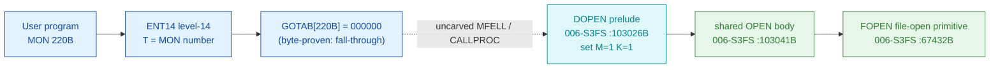

# MON 220B (octal) - DirectOpen (DOPEN)

Opens a file for access, returning an open file number. For public users this is
identical to [MON 50B OpenFile](../50B-OpenFile/README.md); users SYSTEM and RT
are given the same access rights as the file's owner. A file must be opened
before it can be read or written, and later closed with
[MON 43B CloseFile](../43B-CloseFile/README.md).

**Status:** GOTAB dispatch head byte-proven as **fall-through** (`GOTAB[220B] = 000000`,
no per-call stub); `DOPEN` is a 3-word flag-fork prelude into a shared `OPEN`
worker body (real SINTRAN L bytes) that calls the `FOPEN` file-open primitive;
the exact `MON 220 -> worker` link crosses an uncarved kernel bridge (see
[Honest caveats](#honest-caveats)). All addresses/values are **octal**.

- **Full disassembly:** [`220B-DirectOpen.ASM`](220B-DirectOpen.ASM) - the DOPEN prelude + the shared OPEN body (there is no entry stub because the GOTAB slot is zero).
- **Bytes live once in** the canonical segment layer: [`../../segments-ref/`](../../segments-ref/).

---

## Dispatch path

The GOTAB slot is zero, so there is **no per-call entry stub**. The dashed hop
(`C -> D`) is the resident `MFELL`/`CALLPROC` fall-through second-level dispatch -
it is **not present in any carved segment**, so it is the one link that cannot be
followed statically. `DOPEN` sets two STS scratch flags (M=1, K=1) and jumps into
the common `OPEN` body, which reads the flags back to select the DirectOpen mode.

---

## Code location (dispatch path)

Every row is a real region you can open. Byte offset = `(addr - loadbase)` in octal words x 2.

| Role | Segment (full disasm) | Addr range (octal) | Byte offset | Symbol | Verdict |
|------|------------------------|--------------------|-------------|--------|---------|
| GOTAB[220] dispatch word | [commoncode.asm](../../segments-ref/SINTRAN-DATA_commoncode/SINTRAN-DATA_commoncode.asm) - [.hex](../../segments-ref/SINTRAN-DATA_commoncode/SINTRAN-DATA_commoncode.hex) | `071453B` (1 word) | 58966 | `GOTAB+220` = `000000` | **VERIFIED** (fall-through) |
| resident MFELL/CALLPROC bridge | - (uncarved) | - | - | `CALLPROC` | **UNVERIFIED** |
| DOPEN flag-fork prelude | [006-S3FS.asm](../../segments-ref/006-S3FS/006-S3FS.asm) - [.hex](../../segments-ref/006-S3FS/006-S3FS.hex) | `103026B-103030B` (3w) | 46124 | `DOPEN` | real bytes; link **MISATTRIBUTED** |
| shared OPEN worker body | [006-S3FS.asm](../../segments-ref/006-S3FS/006-S3FS.asm) - [.hex](../../segments-ref/006-S3FS/006-S3FS.hex) | `103041B-103347B` (207w) | 46146 | (unnamed; between `OLDOP` and `103350B`) | real bytes |
| FOPEN file-open primitive | [006-S3FS.asm](../../segments-ref/006-S3FS/006-S3FS.asm) - [.hex](../../segments-ref/006-S3FS/006-S3FS.hex) | `67432B` (call target) | 32340 | `FOPEN` | called by OPEN body (link cell `103341`) - **VERIFIED** |

**Verify by hand:** `grep '^103026 ' ../../segments-ref/006-S3FS/006-S3FS.hex` -> byte offset `46124`;
then `dd if=../../../segments/006-S3FS.bin bs=1 skip=46124 count=6 | od -An -tx1` -> `f8 b8 f8 90 a8 09`
(= octal `174270 174220 124011` = `BSET ONE SSM` / `BSET ONE SSK` / `JMP 11`, the DOPEN prelude).

The GOTAB slot itself:
`dd if=../../../resident/SINTRAN-DATA_commoncode.bin bs=1 skip=58966 count=2 | od -An -tx1` -> `00 00` (= `000000`, fall-through).

---

## Instruction walkthrough

Full listing: [`220B-DirectOpen.ASM`](220B-DirectOpen.ASM).

**DOPEN prelude (`103026-103030`)** - `103026 BSET ONE SSM` / `103027 BSET ONE SSK`
set the two STS scratch flag bits (M and K) to 1,1; `103030 JMP 11 -> 103041`
enters the shared body. The four open entries differ only in these two bits:
`DOPEN` M=1,K=1; `SCROP` (MON 235) M=1,K=0; `OPFIL` M=0,K=0; `OLDOP` M=0,K=1.

**Shared OPEN entry (`103041-103045`)** - `103041 STD I 173` stashes the caller's
double-word parameter; `103044 SAB 150` builds the 150-word local frame;
`103045 JPL I 170` -> `003752` is the shared resident prologue worker.

**Flag readback / mode select (`103046-103063`)** - `103046 BSKP ONE SSM` and
`103050/103056 BSKP ONE SSK` read the fork flags back and pick the access mode
(`SAA -1` for DirectOpen, `SAA 2`, `SAA 1`, or `A=0`), stored at frame `B+147`
(`103063 STA ,B 147`).

**Slot scan / open (`103064-103312`)** - the body copies the caller's name/type
descriptor words into the frame, scans the open-file table for the mode's slot
(indirect `JPL I` calls through the pointer table at `103235-103266`), and
finally opens the file: `103310 JPL I 31` -> `103341 = 067432` (**FOPEN**, the
file-open primitive). This call is the byte-level proof that this body is the
open worker.

**Store status / return (`103313-103347`)** - `103313 STA ,B 2` writes the result
word into the caller's status slot `B+2`; `103314-103321` restore the saved
descriptor words; `103323 JMP I 22` -> `103345 = 003776` is the resident return.
Words `103234-103266` and `103335-103347` are pointer tables (data), rendered by
nd100-dis as bogus instructions.

---

## Parameter / register contract

| Reg / field | Dir | Meaning | Verdict |
|-------------|-----|---------|---------|
| entry point | in | `103026B` = DOPEN prelude (fall-through, no stub) | VERIFIED (bytes) |
| STS M (SSM) | internal | `BSET ONE SSM` = fork flag 1 | VERIFIED (bytes) |
| STS K (SSK) | internal | `BSET ONE SSK` = fork flag 2 (M=1,K=1 = DirectOpen) | VERIFIED (bytes) |
| `X` (manual) | in | address of file-name string | inferred (manual MAC example) |
| `A` (manual) | in/out | in: address of default file-type string; out: open file number | inferred (manual MAC example) |
| `T` (manual) | in | access code (0..9) | inferred (manual) |
| local frame `B` | internal | `SAB 150` = 150-word working frame | VERIFIED (bytes) |
| mode word `B+147` | internal | selected access mode from the M/K flags | VERIFIED (bytes) |
| `B+2` | out | returned status word (`STA ,B 2` at `103313`) | VERIFIED (bytes) |

The user-visible `X`/`A`/`T` convention lives in the caller-side `MON 220`
wrapper and the uncarved `MFELL`/`CALLPROC` frame, so the precise
user-register-to-field assignment is **inferred** from the manual, not byte-proven
here. The access-code meanings (0=seq write ... 9=random R/W append) are from the
[`220B_DirectOpen.yaml`](../../../../../../../Developer/MON/calls/220B_DirectOpen.yaml) parameter contract.

---

## Pseudo-code (for an emulator)

See **[`220B-DirectOpen.pseudo.c`](220B-DirectOpen.pseudo.c)** - a pseudo-C model of
the handler for emulator authors. The flag-fork mechanism, control flow, and the
call to the FOPEN primitive are byte-verified; the parameter-field semantics and
access-code meanings are inferred from the call structure and the manual.

Every instruction in the pseudo-code is translated against the canonical
[ND-100 instruction semantics reference](../../instruction-semantics/ND100-INSTRUCTION-SEMANTICS.md)
(BSET/BSKP bit ops with `dr=0` = STS bit, RADD/COPY register ops, addressing-mode
effective addresses, and skip/branch senses).

---

## Honest caveats

**What is byte-proven:** `GOTAB[220B] = 000000` (level-14 dispatch, a fall-through
with no per-call vector); the `DOPEN` prelude at `103026B` in `006-S3FS` is real
code (`174270 174220 124011` = `BSET ONE SSM` / `BSET ONE SSK` / `JMP -> 103041`);
the shared `OPEN` body at `103041B` is real code and calls `FOPEN` (`067432B`, link
cell `103341`), the file-open primitive.

**Shared-body fork (documented honestly):** `DOPEN` (103026), `SCROP` (103031),
`OPFIL` (103034) and `OLDOP` (103037) are each **three-word preludes** that set the
STS `M` and `K` flag bits to a distinct 2-bit code, then all `JMP` into the **same**
body at `103041`. The body reads the two bits back (`103046-103062`) to choose the
access mode. So DirectOpen and ScratchOpen share one worker body; they differ only
in the M/K flag pair set by their prelude. The shared body carries the standard
file-worker prologue (`STD I 173` / `SAB` / `JPL I 170 -> 003752`) and calls
`FOPEN`, exactly like the [OPENF](../50B-OpenFile/README.md) body.

**What is NOT proven:** the link from the zero GOTAB slot to the `DOPEN` prelude.
Because the vector is zero there is no stub to disassemble and no pointer to
dereference; dispatch drops into the resident `MFELL`/`CALLPROC` second-level path,
which lives in an **uncarved overlay** - hence **MISATTRIBUTED** in the strict
sense. Confirming the link needs a live trace: issue a real `MON 220`, single-step
the level-14 fall-through into the resident `CALLPROC` dispatch, and confirm P
lands on `DOPEN = 103026`.

Several pointer-table cell contents (`003752`, `010500`, `010506`, `003776`, and
others) match no `FILSYS-SYMBOLS` entry; their low addresses suggest resident-monitor
/ save-restore routines outside the file-system segment and are not resolved here.

Method: [../../../../../EXTRACTING-RESIDENT-CODE.md](../../../../../EXTRACTING-RESIDENT-CODE.md) - dispatch reality:
[../../TASK-05-mismatches.md](../../TASK-05-mismatches.md) - master map: [../../MON-CALL-INDEX.md](../../MON-CALL-INDEX.md).
