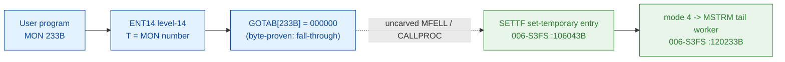

# MON 233B (octal) - SetTemporaryFile (SETTF)

> **CORRECTED 2026-07-15 (byte-verified).** The worker + dispatch described below are on the
> DEBUNKED model and are WRONG. Byte truth from the carved L07 image:
> `MCTAB[233B] = 006053B = STEFI=106052B` in segment 006-S3FS, reached by the real dispatch
> `MON 233B -> ENT14(072167B) -> GOTAB[233B]=MFELL(072114B) -> CALLP(032201B) -> MCTAB[233B]=STEFI`.
> Any "GOTAB from commoncode" / "uncarved CALLPROC bridge" / "F16xx stub" / old worker name below
> is an artefact of the wrong table. Verified: `dd if=044-S3IDPIT.bin bs=1 skip=2134 count=2`
> -> `8c 2a`. Cross-ref ../317B-ExecuteCommand/README.md and SINTRAN/CARVING-HANDOFF.md sec 3a.

Defines a file to store information temporarily: the file can be read once, and
when it is closed its contents are deleted (the empty file still exists). SETTF is
a dedicated entry that presets the operation mode directly and jumps into the
shared directory-entry dispatcher (the same `MDLFI` body used by MON 54B
DeleteFile and MON 232B RenameFile).

**Status:** GOTAB dispatch head byte-proven as **fall-through** (`GOTAB[233B] = 000000`,
no per-call stub); the SETTF entry body is real SINTRAN L bytes; it presets mode 4
and dispatches to the tail worker `MSTRM`; the exact `MON 233 -> worker` link
crosses an uncarved kernel bridge (see [Honest caveats](#honest-caveats)). All
addresses/values are **octal**.

- **Full disassembly:** [`233B-SetTemporaryFile.ASM`](233B-SetTemporaryFile.ASM) - the actual code (the SETTF entry + shared MDLFI dispatcher body; there is no entry stub because the GOTAB slot is zero).
- **Bytes live once in** the canonical segment layer: [`../../segments-ref/`](../../segments-ref/).

---

## Dispatch path

The GOTAB slot is zero, so there is **no per-call entry stub**. The dashed hop
(`C -> E`) is the resident `MFELL`/`CALLPROC` fall-through second-level dispatch -
it is **not present in any carved segment**, so it is the one link that cannot be
followed statically.

---

## Code location (dispatch path)

Every row is a real region you can open. Byte offset = `(addr - loadbase)` in octal words x 2.

| Role | Segment (full disasm) | Addr range (octal) | Byte offset | Symbol | Verdict |
|------|------------------------|--------------------|-------------|--------|---------|
| GOTAB[233] dispatch word | [commoncode.asm](../../segments-ref/SINTRAN-DATA_commoncode/SINTRAN-DATA_commoncode.asm) - [.hex](../../segments-ref/SINTRAN-DATA_commoncode/SINTRAN-DATA_commoncode.hex) | `071466B` (1 word) | 58988 | `GOTAB+233` = `000000` | **VERIFIED** (fall-through) |
| resident MFELL/CALLPROC bridge | - (uncarved) | - | - | `CALLPROC` | **UNVERIFIED** |
| SETTF entry body | [006-S3FS.asm](../../segments-ref/006-S3FS/006-S3FS.asm) - [.hex](../../segments-ref/006-S3FS/006-S3FS.hex) | `106043B-106051B` (7w) | 49222 | `SETTF` | real bytes; link **MISATTRIBUTED** |
| shared MDLFI dispatcher body | [006-S3FS.asm](../../segments-ref/006-S3FS/006-S3FS.asm) - [.hex](../../segments-ref/006-S3FS/006-S3FS.hex) | `106065B-106211B` (joined at `106107`) | 49258 | `MDLFI` | real bytes (shared) |
| MSTRM tail worker | [006-S3FS.asm](../../segments-ref/006-S3FS/006-S3FS.asm) - [.hex](../../segments-ref/006-S3FS/006-S3FS.hex) | `120233B` (link cell `106210`) | - | `MSTRM` | link-cell **VERIFIED**; meaning inferred |

**Verify by hand:** `grep '^106043 ' ../../segments-ref/006-S3FS/006-S3FS.hex` -> byte offset `49222`;
then `dd if=../../../segments/006-S3FS.bin bs=1 skip=49222 count=8 | od -An -tx1` -> `22 5b cc 65 cc 59 f0 55`
(the stored words = octal `021133 146145 146131 170125` = `STD I 133` / `RADD CLD SL DA` / `RADD CLD SB DD` / `SAB 125`, the SETTF entry).

The GOTAB slot itself:
`dd if=../../../resident/SINTRAN-DATA_commoncode.bin bs=1 skip=58988 count=2 | od -An -tx1` -> `00 00` (= `000000`, fall-through).

---

## Instruction walkthrough

Full listing: [`233B-SetTemporaryFile.ASM`](233B-SetTemporaryFile.ASM). There is no
F16xx/F17xx stub because `GOTAB[233] = 0`. Calls to shared file-system workers are
**indirect** (`JPL I` / `JMP I`) through the pointer table (link cells) at
`106176-106211`; nd100-dis renders those pointer words as bogus instructions
(`STZ`, `MPY`, `FDV`, ...) - they are **data (link cells)**, not code.

**SETTF entry (`106043-106051`)** - `106043 STD I 133` stashes the caller's D;
`106044-106045` build `A = L`, `D = B` (the `RADD CLD` COPY idiom); `106046 SAB 125`
builds the frame `B`; `106047 JPL I 130` -> `003752` is the prologue worker.
`106050 SAA 4` sets the operation mode to `4`, and `106051 JMP -> 106107` joins the
shared `MDLFI` dispatcher directly at the mode-store, **bypassing** the SSK/SSM fold
(`106065-106106`) that the DeleteFile-family entries use.

**Shared mode-store + directory lookup (`106107-106115`)** - `106107 STA ,B 123`
stores mode `4` at `B+123`; `106114 JPL I 66` -> `031075` locates the file's
directory entry; a failure returns via `106115 JMP 57` -> `106174` (store status +
return).

**Mode dispatch (`106116-106170`)** - the ladder tests `B+123` against `1`, then
`0`, `1`, `2`, `3` (`SAT n` / `SKP IF DA EQL ST` / `JAF`). Mode `4` matches **none**
of the `0..3` cases, so control falls through to the tail worker:
`106167 JPL I 21` -> `106210` = `MSTRM` (`120233`).

**Exit (`106171-106211`)** - `106171 MIN ,B 4` bumps the status, `106172 SAA -125`,
`106173 JMP I 16` -> `106211` (= `003776`, resident return). The error path
`106174 STA ,B 2` stores the status into the caller's slot then falls to `106172`.
`106176-106211` are the link cells (`003752`, `031075`, `120067` MODLF, `117352`
MRENF, `120470` MSPER, `120236` MSTMP, `120233` MSTRM, `003776`).

---

## Parameter / register contract

Contract from [`Developer/MON/calls/233B_SetTemporaryFile.yaml`](../../../../../../../Developer/MON/calls/233B_SetTemporaryFile.yaml).

| Reg / field | Dir | Meaning | Verdict |
|-------------|-----|---------|---------|
| entry point | in | `106043B` = SETTF; presets mode `4` and joins the shared `MDLFI` dispatcher at `106107` | VERIFIED (bytes) |
| `B+123` | internal | operation mode (SETTF => `4`) | VERIFIED (bytes) |
| `B+0` (`X`) | in | directory-entry context passed to the lookup worker (`106113 LDX ,B 0`) | VERIFIED (bytes); meaning inferred |
| `B+2` | out | returned status word (`STA ,B 2` at `106174`) | VERIFIED (bytes) |
| FileName (user `X`) | in | address of file-name string | inferred (manual/yaml) |
| skip / error | out | normal return skips; error return has error number in A | inferred (manual/yaml) |

The mode-`4`-to-`MSTRM` mapping is byte-proven at the link-cell level (`106210` =
`120233` = `MSTRM`); the *meaning* (set-temporary) is **inferred** from the symbol
name and the manual. The user-visible `X = file-name` convention lives in the
caller-side `MON 233` wrapper and the uncarved `MFELL`/`CALLPROC` frame, so it is
**inferred** from the manual, not byte-proven here.

---

## Pseudo-code (for an emulator)

See **[`233B-SetTemporaryFile.pseudo.c`](233B-SetTemporaryFile.pseudo.c)** - a
pseudo-C model of the handler for emulator authors. Control flow (SETTF presets
mode 4, joins the shared dispatcher, falls through to the tail worker) is
byte-verified; the worker semantics and error-number meanings are inferred from the
FILSYS symbol table and the call structure. Every instruction is translated per the
canonical [`ND100-INSTRUCTION-SEMANTICS.md`](../../instruction-semantics/ND100-INSTRUCTION-SEMANTICS.md)
(note the `RADD CLD` COPY idiom and `SAA` sign-extended argument load).

---

## Honest caveats

**What is byte-proven:** `GOTAB[233B] = 000000` (level-14 dispatch, a fall-through
with no per-call vector); the `SETTF` entry at `106043B` in `006-S3FS` is real code
(entry bytes `021133 146145 146131 170125` match the disassembly); SETTF sets
mode `4` (`SAA 4`) and jumps into the shared `MDLFI` dispatcher at `106107`; and
mode `4` falls through the `0..3` ladder to the tail worker `MSTRM = 120233`
(link cell `106210`).

**What is NOT proven:** the link from the zero GOTAB slot to the `SETTF` entry.
Because the vector is zero there is no stub to disassemble and no pointer to
dereference; dispatch drops into the resident `MFELL`/`CALLPROC` second-level path,
which lives in an **uncarved overlay**. So the `MON 233 -> SETTF` attribution rests
on the `SETTF` symbol name + the matching set-temporary behaviour, not a followed
pointer - hence **MISATTRIBUTED** in the strict sense. Confirming the link needs a
live trace: issue a real `MON 233`, single-step the level-14 fall-through into the
resident `CALLPROC` dispatch, and confirm P lands on `SETTF = 106043`.

**Name ambiguity (honest):** the FILSYS symbol table also carries `STEFI`
(`106052B`), a DeleteFile-family sibling entry (SSM=1/SSK=1 -> mode 3 -> `MSTMP`)
whose name equally reads "set temporary file". This folder documents the `SETTF`
entry (`106043B`) as specified for MON 233B; because `GOTAB[233] = 0`, neither
`SETTF` nor `STEFI` is reached through a followed pointer here, so which entry the
resident `CALLPROC` selects for MON 233 is not statically provable and both remain
candidates until a live trace resolves it.

The prologue link cell `003752`, the lookup cell `031075`, and the return cell
`003776` match no `FILSYS-SYMBOLS` entry; their addresses suggest resident-monitor /
directory-scan routines outside the resolvable symbol set, and are not resolved here.

Method: [../../../../../EXTRACTING-RESIDENT-CODE.md](../../../../../EXTRACTING-RESIDENT-CODE.md) - dispatch reality:
[../../TASK-05-mismatches.md](../../TASK-05-mismatches.md) - master map: [../../MON-CALL-INDEX.md](../../MON-CALL-INDEX.md).
