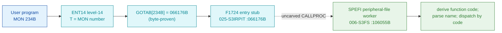

# MON 234B (octal) - SetPeripheralName (SPEFI)

Defines a peripheral file: connects a file name to the logical device number of a
peripheral (e.g. a printer). The file name should exist in advance with no file type.

**Status:** GOTAB dispatch head byte-proven (`GOTAB[234B] = 066176B`), pointing at the
3-word entry stub `F1724` in `025-S3IRPIT`; the `SPEFI` worker body is real SINTRAN L
bytes in the file-system segment `006-S3FS` (a `FILSYS-SYMBOLS` symbol). `SPEFI=106055B`
(Set PEripheral FIle) is the first of a three-entry idiom (`SPEFI`/`MRNFI`/`MDLFI`)
whose `SSM`/`SSK` skip flags encode an initial function selector; the common body
derives a function code (0..3) into `B+123` and dispatches by it to resident workers.
The code closes at `106173B` (indirect return, `106176B` a pad), bounded by the next
routine `RSPQE=106212B`. The exact `MON 234 -> worker` link crosses an uncarved kernel
bridge (see [Honest caveats](#honest-caveats)). All addresses/values are **octal**.

- **Full disassembly:** [`234B-SetPeripheralName.ASM`](234B-SetPeripheralName.ASM) - the actual code, both regions (F1724 entry stub + the SPEFI worker with its link cells).
- **Bytes live once in** the canonical segment layer: [`../../segments-ref/`](../../segments-ref/).

---

## Dispatch path

The dashed hop (`D -> E`) is the resident `CALLPROC`/segment-switch - it is **not
present in any carved segment**, so it is the one link that cannot be followed
statically. The stub `F1724` is a tiny 3-word compiler entry inside a shared stub block;
it is not a self-contained named handler and the worker address `106055` does not occur
inside `025-S3IRPIT`.

---

## Code location (dispatch path)

Every row is a real region you can open. Byte offset = `(addr - loadbase)` in octal
words x 2; for `025-S3IRPIT` (load base `32000B`) it is `(addr - 32000B) x 2`, for
`006-S3FS` (load base `26000B`) it is `(addr - 26000B) x 2`.

| Role | Segment (full disasm) | Addr range (octal) | Byte offset | Symbol | Verdict |
|------|------------------------|--------------------|-------------|--------|---------|
| GOTAB[234] dispatch word | [commoncode.asm](../../segments-ref/SINTRAN-DATA_commoncode/SINTRAN-DATA_commoncode.asm) - [.hex](../../segments-ref/SINTRAN-DATA_commoncode/SINTRAN-DATA_commoncode.hex) | `071467B` (1 word) | 58990 | `GOTAB+234` = `066176B` | **VERIFIED** |
| F1724 entry stub | [025-S3IRPIT.asm](../../segments-ref/025-S3IRPIT/025-S3IRPIT.asm) - [.hex](../../segments-ref/025-S3IRPIT/025-S3IRPIT.hex) | `066176B-066200B` (3 words) | 28924 | `F1724` | **VERIFIED** (GOTAB target); shared stub block |
| resident CALLPROC bridge | - (uncarved) | - | - | `CALLPROC` | **UNVERIFIED** |
| SPEFI worker body | [006-S3FS.asm](../../segments-ref/006-S3FS/006-S3FS.asm) - [.hex](../../segments-ref/006-S3FS/006-S3FS.hex) | `106055B-106176B` (code) + `106177B-106211B` (link cells) | 49242 | `SPEFI` (alt entries `MRNFI`=106060B, `MDLFI`=106063B) | real bytes = **CODE**; body link **MISATTRIBUTED** |

The worker window is bounded strictly by the next real routine `RSPQE=106212B`. Words
`106055B-106176B` are code (`106176B` a `ROP NOOP` pad) and `106177B-106211B` are a
pointer table (link cells, **data**). The other `FILSYS-SYMBOLS` symbols inside this
window (`MRNFI`, `MDLFI`, `UKPAR`, `USUNI`, ...) are interior labels of this one body.

**Verify by hand:** the GOTAB word:
`grep '^71467 ' ../../segments-ref/SINTRAN-DATA_commoncode/SINTRAN-DATA_commoncode.hex`
-> `71467  066176  154 176  58990`; then
`dd if=../../../resident/SINTRAN-DATA_commoncode.bin bs=1 skip=58990 count=2 2>/dev/null | od -An -tx1`
-> `6c 7e` (word = `066176B`). The stub head:
`dd if=../../../segments/025-S3IRPIT.bin bs=1 skip=28924 count=2 2>/dev/null | od -An -tx1`
-> `09 10` (= octal `004420`, `STA ,B 20`, matching the disassembly). The SPEFI worker
entry: `grep '^106055 ' ../../segments-ref/006-S3FS/006-S3FS.hex` -> byte offset
`49242`; then
`dd if=../../../segments/006-S3FS.bin bs=1 skip=49242 count=2 2>/dev/null | od -An -tx1`
-> `f8 b8` (= octal `174270`, `BSET ONE SSM`, the SPEFI entry). `prove-mon.py 234` reads
the same GOTAB value.

---

## Instruction walkthrough

Full listing: [`234B-SetPeripheralName.ASM`](234B-SetPeripheralName.ASM). Two regions.

**Region A - F1724 stub (`066176-066200`)** is the 3-word GOTAB target in `025-S3IRPIT`.
It sits inside a shared stub block and its head (`STA ,B 20` / `SUB I 63` / `RADD CLD SA
DD`) is not a self-contained per-call handler; the real transfer to the worker is the
resident `CALLPROC`, which a static decode cannot follow.

**Region B - SPEFI worker (`106055-106211`)** is the peripheral-file body.
`106055 BSET ONE SSM` / `BSET ZRO SSK` is the `SPEFI` entry; `106060` (`MRNFI`) and
`106063` (`MDLFI`) are the two alternate entries setting different `SSM`/`SSK`. All join
at `106065 STD I 111`; `106071 JPL I 106 -> [106177]` is the prologue. `106072-106106`
derive a function code (0..3) from `SSM`/`SSK` into `B+123`; `106114 JPL I 66 -> [106202]`
parses the name; `106116-106170` compare `B+123` against `1`/`2`/`3` and call the matching
resident worker (`[106204]`..`[106210]`). The tail `106171 MIN ,B 4` / `106172 SAA -125`
/ `106173 JMP I 16 -> [106211]` returns; `106174` is the error tail.

---

## Parameter / register contract

Manual-side names/types are from [`234B_SetPeripheralName.yaml`](../../../../../../../Developer/MON/calls/234B_SetPeripheralName.yaml).

| Reg / field | Dir | Meaning | Verdict |
|-------------|-----|---------|---------|
| `FileName` | in | peripheral file-name string (appendix G) | inferred (manual) |
| `DeviceNumber` | in | logical device number (appendix B) | inferred (manual) |
| entry point | in | `106055B` = SPEFI (this call); `106060B`/`106063B` are the alt entries | VERIFIED (bytes) |
| `SSM` / `SSK` | internal | two skip flags encoding the initial function selector | VERIFIED (bytes) |
| `B+123` | internal | derived function code (0..3), dispatched at `106116-106170` | VERIFIED (bytes); meaning inferred |
| error return | out | standard error number in `A` (`106172 SAA -125`) | VERIFIED (bytes); code value inferred |

---

## Pseudo-code (for an emulator)

See **[`234B-SetPeripheralName.pseudo.c`](234B-SetPeripheralName.pseudo.c)** - a pseudo-C
model for emulator authors. The control flow (the three-entry `SSM`/`SSK` idiom, the
function-code derivation, the name parse, the four-way dispatch and the success/error
tails) is byte-verified; the per-code worker semantics and the `B`-frame offsets are
inferred from the call structure.

Every instruction in the pseudo-code is translated against the canonical
[ND-100 instruction semantics reference](../../instruction-semantics/ND100-INSTRUCTION-SEMANTICS.md)
(`BSET ONE/ZRO SSM/SSK` set/clear skip flag, `RADD CLD` copy idiom, `RADD SB DA/DX`
register add, `SAA`/`SAT`/`SAB`/`SAX` set argument, `SKP IF DA EQL ST` compare,
`JAF` flag branch, `MIN ,B` increment and skip, `JPL I`/`JMP I` indirect call/return).

---

## Honest caveats

**What is byte-proven:** `GOTAB[234B] = 066176B` (`prove-mon.py 234` reads commoncode
file byte `0xe66e = 6c 7e`); that value read as a `025-S3IRPIT` address is the `F1724`
stub, whose bytes decode cleanly (`004420B = STA ,B 20`). The `SPEFI` worker at
`106055B` in `006-S3FS` is real code (first word `174270B = BSET ONE SSM`) and it is a
peripheral-file routine (three-entry `SSM`/`SSK` idiom, function-code dispatch, name
parse), consistent with SetPeripheralName.

**Which segment and why:** `SPEFI=106055B` is a `FILSYS-SYMBOLS` symbol, so it lives in
the file-system segment `006-S3FS`, with its alternate entries `MRNFI=106060B` and
`MDLFI=106063B`. The window `106055B-106211B` is bounded strictly by the next real
routine `RSPQE=106212B`: `106055-106176` are code and `106177-106211` are the `JPL I`/
`JMP I` link-cell table; the intervening `FILSYS-SYMBOLS` symbols are interior labels of
this one body.

**What is NOT proven:** the `F1724` stub is only 3 words and lands inside a shared stub
block, not a dedicated per-call handler; the actual transfer to `SPEFI` is the resident
`CALLPROC` in an **uncarved overlay**. So the `MON 234 -> SPEFI` attribution rests on
the `SPEFI` symbol name (Set PEripheral FIle) + the matching behaviour, not a followed
pointer - hence **MISATTRIBUTED** in the strict sense. The worker's `JPL I`/`JMP I` link
cells (`106177..106211`) are a pointer table whose runtime targets are not resolved
here, so which resident worker each function code reaches is inferred. Confirming the
dispatch link needs a live trace of a real `MON 234`.

Method: [../../../../../EXTRACTING-RESIDENT-CODE.md](../../../../../EXTRACTING-RESIDENT-CODE.md) - dispatch reality:
[../../TASK-05-mismatches.md](../../TASK-05-mismatches.md) - master map: [../../MON-CALL-INDEX.md](../../MON-CALL-INDEX.md).
