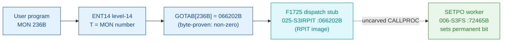

# MON 236B (octal) - SetPermanentOpen (SETPO)

> **CORRECTED 2026-07-15 (byte-verified).** The worker + dispatch described below are on the
> DEBUNKED model and are WRONG. Byte truth from the carved L07 image:
> `MCTAB[236B] = 006056B = SPERM=103353B` in segment 006-S3FS, reached by the real dispatch
> `MON 236B -> ENT14(072167B) -> GOTAB[236B]=MFELL(072114B) -> CALLP(032201B) -> MCTAB[236B]=SPERM`.
> Any "GOTAB from commoncode" / "uncarved CALLPROC bridge" / "F16xx stub" / old worker name below
> is an artefact of the wrong table. Verified: `dd if=044-S3IDPIT.bin bs=1 skip=2140 count=2`
> -> `86 eb`. Cross-ref ../317B-ExecuteCommand/README.md and SINTRAN/CARVING-HANDOFF.md sec 3a.

Sets an already-open file permanently open: the file is not closed by
[CloseFile](../43B-CloseFile/README.md) with -1 as the file number, and not
closed when your program terminates. You must specify the file number (or -2) to
close it. Only mass-storage files can be set permanently open. (The manual short
name is `SPERD`; the byte-level worker symbol is `SETPO`.)

**Status:** GOTAB dispatch head byte-proven **non-zero** (`GOTAB[236B] = 066202B`),
landing on the resident `F1725` dispatch-stub cluster in the `025-S3IRPIT` RPIT
image; the functional worker `SETPO` (real SINTRAN L bytes in `006-S3FS`) scans
the open-file table and sets a permanent-open bit. The stub does not contain a
static pointer to `SETPO`, so the stub -> worker hop crosses an uncarved kernel
bridge - hence **MISATTRIBUTED** (see [Honest caveats](#honest-caveats)). All
addresses/values are **octal**.

- **Full disassembly:** [`236B-SetPermanentOpen.ASM`](236B-SetPermanentOpen.ASM) - the F1725 GOTAB stub fragment + the SETPO worker body.
- **Bytes live once in** the canonical segment layer: [`../../segments-ref/`](../../segments-ref/).

---

## Dispatch path

Unlike DirectOpen/ScratchOpen, `GOTAB[236B]` is **non-zero**: it points at symbol
`F1725` in the resident RPIT image `025-S3IRPIT`. `F1725` is part of the same
`F17xx` GOTAB-stub cluster used by [MON 254B](../254B-GetErrorDevice/README.md)
(`F1734=066246`). The stub is real resident code but a fragment (the routine
continues past the next symbol `F1726=066206`); it does not statically reference
`SETPO`, so the dashed `D -> E` hop is the uncarved resident `CALLPROC` bridge.

---

## Code location (dispatch path)

Every row is a real region you can open. Byte offset = `(addr - loadbase)` in octal words x 2.

| Role | Segment (full disasm) | Addr range (octal) | Byte offset | Symbol | Verdict |
|------|------------------------|--------------------|-------------|--------|---------|
| GOTAB[236] dispatch word | [commoncode.asm](../../segments-ref/SINTRAN-DATA_commoncode/SINTRAN-DATA_commoncode.asm) - [.hex](../../segments-ref/SINTRAN-DATA_commoncode/SINTRAN-DATA_commoncode.hex) | `071471B` (1 word) | 58994 | `GOTAB+236` = `066202` | **VERIFIED** (non-zero) |
| F1725 dispatch stub (fragment) | [025-S3IRPIT.asm](../../segments-ref/025-S3IRPIT/025-S3IRPIT.asm) - [.hex](../../segments-ref/025-S3IRPIT/025-S3IRPIT.hex) | `066202B-066205B` (4w, to `F1726`) | 28932 | `F1725` | real bytes; link **UNVERIFIED** |
| resident CALLPROC bridge | - (uncarved) | - | - | `CALLPROC` | **UNVERIFIED** |
| SETPO SetPermanentOpen worker | [006-S3FS.asm](../../segments-ref/006-S3FS/006-S3FS.asm) - [.hex](../../segments-ref/006-S3FS/006-S3FS.hex) | `072465B-072617B` (89w) | 37482 | `SETPO` | real bytes; link **MISATTRIBUTED** |

**Verify by hand:** `grep '^72465 ' ../../segments-ref/006-S3FS/006-S3FS.hex` -> byte offset `37482`;
then `dd if=../../../segments/006-S3FS.bin bs=1 skip=37482 count=8 | od -An -tx1` -> `22 50 cc 65 cc 59 f0 07`
(= octal `021120 146145 146131 170007` = `STD I 120` / `RADD CLD SL DA` / `RADD CLD SB DD` / `SAB 7`, the SETPO entry).

The GOTAB slot itself:
`dd if=../../../resident/SINTRAN-DATA_commoncode.bin bs=1 skip=58994 count=2 | od -An -tx1` -> `6c 82` (= `066202`, the F1725 stub address).

The stub bytes:
`grep '^66202 ' ../../segments-ref/025-S3IRPIT/025-S3IRPIT.hex` -> byte offset `28932`;
then `dd if=../../../segments/025-S3IRPIT.bin bs=1 skip=28932 count=8 | od -An -tx1` -> `f2 16 c3 b0 a2 2f a0 2f`.

---

## Instruction walkthrough

Full listing: [`236B-SetPermanentOpen.ASM`](236B-SetPermanentOpen.ASM).

**F1725 stub fragment (`066202-066205`)** - `SAT 26` / `RDIV ST` / `MPY I 57` /
`MPY 57`, real bytes in the RPIT image; a fragment of resident dispatch code that
continues past the next symbol `F1726=066206B` (uncarved). It does not statically
reference `SETPO`.

**SETPO entry (`072465-072471`)** - `072465 STD I 120` stashes the caller's
double-word parameter; `072470 SAB 7` builds a small 7-word local frame (this call
takes only a file number, so the frame is much smaller than the open workers'
150-word frame); `072471 JPL I 115` -> `003752` is the shared resident prologue.

**File-number range check + table scan (`072472-072555`)** - `072472 LDT ,B 2`
loads the caller's file number; `072473-072500` range-check it; `072501 LDX 107`
loads the open-file-table base and the loop (`072502` read entry, `072551 AAX 2`
advance, `072553 SKP IF DX EQL ST` end test, `072554 JMP -52 -> 072502` loop back)
walks the table looking for the entry whose key matches the file number
(`072520-072521 LDT ,B 2` / `SKP IF DA EQL ST`).

**Set permanent bit (`072560-072602`)** - on a match the body validates the entry
(`072571 BSKP ZRO 160 DA` = test bit 14; error `133` if clear), then the core
action: `072575 LDA ,X 7` / `072576 BSET ONE 170 DA` (set bit 15) / `072577 STA ,X 7`
writes the permanent-open flag bit back into file-entry word 7. `072600 MIN ,B 4`
bumps the success flag; `072602 JMP I 15` -> `072617 = 003776` is the resident
return. There is **no FOPEN call** - nothing is opened; only a flag is set.

**Store status / errors (`072556-072603`)** - out-of-range / not-found / not-open
paths load an error number (`132`, `133`, or a classified code) and funnel through
`072603 STA ,B 2` (status -> caller `B+2`) into the resident return. Words
`072605-072617` are a pointer table (data), rendered by nd100-dis as bogus
instructions; their contents include `003752` (prologue) and `003776` (return).

---

## Parameter / register contract

| Reg / field | Dir | Meaning | Verdict |
|-------------|-----|---------|---------|
| GOTAB[236] | in | `066202B` = F1725 dispatch stub (non-zero vector) | VERIFIED (bytes) |
| worker entry | in | `072465B` = SETPO worker | VERIFIED (bytes) |
| `T` (manual) | in | file number returned from an earlier open (the only input) | inferred (manual MAC example) |
| frame `B+2` | in | file number, loaded by `LDT ,B 2` at `072472` | VERIFIED (bytes) |
| local frame `B` | internal | `SAB 7` = 7-word working frame | VERIFIED (bytes) |
| file entry word 7, bit 15 | out | permanent-open flag set (`BSET ONE 170 DA` at `072576`) | VERIFIED (bytes); semantic inferred |
| error `132` / `133` | out | not-open / validation errors (`SAA 132`/`SAA 133`) | VERIFIED (bytes); mapping inferred |
| `B+2` | out | returned status word (`STA ,B 2` at `072603`) | VERIFIED (bytes) |

The user-visible `T` = file-number convention lives in the caller-side `MON 236`
wrapper; the manual shows `LDT FILNO` / `MON 236` as the only input, matching the
worker's `LDT ,B 2`. The single-parameter contract is from the
[`236B_SetPermanentOpen.yaml`](../../../../../../../Developer/MON/calls/236B_SetPermanentOpen.yaml) parameter contract.

---

## Pseudo-code (for an emulator)

See **[`236B-SetPermanentOpen.pseudo.c`](236B-SetPermanentOpen.pseudo.c)** - a pseudo-C
model of the handler for emulator authors. Control flow and the permanent-open bit
set are byte-verified; the open-file-table layout and error-number meanings are
inferred from the call structure and the manual.

Every instruction in the pseudo-code is translated against the canonical
[ND-100 instruction semantics reference](../../instruction-semantics/ND100-INSTRUCTION-SEMANTICS.md)
(BSET/BSKP bit ops - bit number = printed field `>>3`, RADD/COPY register ops,
addressing-mode effective addresses, and skip/branch senses).

---

## Honest caveats

**What is byte-proven:** `GOTAB[236B] = 066202B` (level-14 dispatch, a non-zero
vector into the `025-S3IRPIT` RPIT image - matching the `F17xx` stub cluster);
the `SETPO` worker body at `072465B` in `006-S3FS` is real code (entry bytes
`021120 146145 146131 170007` match the disassembly); it scans the open-file table
and sets bit 15 of file-entry word 7 (`072575-072577`), which is the
permanent-open flag - consistent with the documented behaviour.

**What is NOT proven:** the `F1725` stub does not contain a static pointer to
`SETPO`; the stub is a fragment of resident dispatch code in the relocated RPIT
image, whose control flow continues past `F1726` into uncarved resident code. So
the `stub -> SETPO` link goes through the resident `CALLPROC` bridge (uncarved) -
the `MON 236 -> SETPO` attribution rests on the `SETPO` symbol name + its
permanent-bit-setting behaviour + the matching single-file-number contract, not a
followed pointer - hence **MISATTRIBUTED** in the strict sense. Confirming the link
needs a live trace: issue a real `MON 236` on an open file, single-step the
level-14 dispatch through `F1725` and the resident `CALLPROC`, and confirm P lands
on `SETPO = 072465`.

**No open here - contrast with the open family:** unlike
[DirectOpen](../220B-DirectOpen/README.md)/[ScratchOpen](../235B-ScratchOpen/README.md),
`SETPO` makes **no `FOPEN` call**. The file must already be open; the body only
locates its open-file-table entry and sets a flag bit. This matches the manual
("The file must already be open").

Method: [../../../../../EXTRACTING-RESIDENT-CODE.md](../../../../../EXTRACTING-RESIDENT-CODE.md) - dispatch reality:
[../../TASK-05-mismatches.md](../../TASK-05-mismatches.md) - master map: [../../MON-CALL-INDEX.md](../../MON-CALL-INDEX.md).
