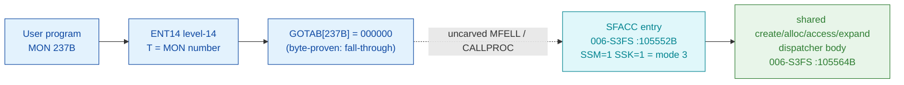

# MON 237B (octal) - SetFileAccess (SFACC)

Sets the access protection of a file - the public (other-user) access, the friend
access, and the owner's own access - each expressed as a combination of the
characters `R W A C D N`. You need directory access to the file to change it; user
SYSTEM and RT may set the access on any file.

**Status:** GOTAB dispatch head byte-proven as **fall-through** (`GOTAB[237B] =
000000`, no per-call stub); the `SFACC` worker is real SINTRAN L bytes - the
**MODE-3 entry** of a shared create/allocate/access/expand dispatcher whose body
lives at `105564B`. The exact `MON 237 -> worker` link crosses an uncarved kernel
bridge (see [Honest caveats](#honest-caveats)). All addresses/values are **octal**.

- **Full disassembly:** [`237B-SetFileAccess.ASM`](237B-SetFileAccess.ASM) - the SFACC mode-select entry + the shared dispatcher body.
- **Bytes live once in** the canonical segment layer: [`../../segments-ref/`](../../segments-ref/).

---

## Dispatch path

The GOTAB slot is zero, so there is **no per-call entry stub**. The dashed hop
(`C -> D`) is the resident `MFELL`/`CALLPROC` fall-through second-level dispatch -
not present in any carved segment. `SFACC` is the mode-3 arm of a shared body it
enters by setting two STS flags (`SSM`, `SSK`) that the body reads back into a
2-bit mode word.

---

## Code location (dispatch path)

Every row is a real region you can open. Byte offset is the `006-S3FS.hex` byte offset.

| Role | Segment (full disasm) | Addr range (octal) | Byte offset | Symbol | Verdict |
|------|------------------------|--------------------|-------------|--------|---------|
| GOTAB[237] dispatch word | [commoncode.asm](../../segments-ref/SINTRAN-DATA_commoncode/SINTRAN-DATA_commoncode.asm) - [.hex](../../segments-ref/SINTRAN-DATA_commoncode/SINTRAN-DATA_commoncode.hex) | `071472B` (1 word) | 58996 | `GOTAB+237` = `000000` | **VERIFIED** (fall-through) |
| resident MFELL/CALLPROC bridge | - (uncarved) | - | - | `CALLPROC` | **UNVERIFIED** |
| SFACC mode-3 entry | [006-S3FS.asm](../../segments-ref/006-S3FS/006-S3FS.asm) - [.hex](../../segments-ref/006-S3FS/006-S3FS.hex) | `105552B-105554B` (3w) | 48852 | `SFACC` | real bytes; link **MISATTRIBUTED** |
| shared dispatcher body | [006-S3FS.asm](../../segments-ref/006-S3FS/006-S3FS.asm) - [.hex](../../segments-ref/006-S3FS/006-S3FS.hex) | `105564B-106042B` (175w) | 48872 | (shared) | real bytes - **VERIFIED** |

**Verify by hand:** `grep '^105552 ' ../../segments-ref/006-S3FS/006-S3FS.hex` -> byte offset `48852`;
then `dd if=../../../segments/006-S3FS.bin bs=1 skip=48852 count=6 | od -An -tx1` -> `f8 b8 f8 90 a8 08`
(= octal `174270 174220 124010` = `BSET ONE SSM` / `BSET ONE SSK` / `JMP 10`, the SFACC mode-3 entry).

The GOTAB slot itself:
`dd if=../../../resident/SINTRAN-DATA_commoncode.bin bs=1 skip=58996 count=2 | od -An -tx1` -> `00 00` (= `000000`, fall-through).

---

## Instruction walkthrough

Full listing: [`237B-SetFileAccess.ASM`](237B-SetFileAccess.ASM). There is no
F16xx/F17xx stub because `GOTAB[237] = 0`.

**Mode-select entry (`105552-105554`)** - `SFACC` sets `SSM` (STS bit7 M) and `SSK`
(STS bit2 K) both to 1, then `105554 JMP 10` merges into the shared body at
`105564`. The three sibling entries in the same cluster set different flag pairs:
`EXPFI` (`105555`, mode 2, ExpandFile/231B), `CRALN` (`105560`, mode 1,
NewFileVersion/253B), `CRALF` (`105562`, mode 0).

**Prologue + mode rebuild (`105564-105574`)** - `105564 STD I 77` stashes the
caller's parameter double-word; `105567 SAB 145` builds the 145-word frame;
`105570 JPL I 74` -> `003752` is the shared resident prologue. Then the two STS
flags are rebuilt into a 2-bit mode word: `105571 RADD CLD 0 DA` clears A,
`105572 SHA LIN 2` shifts left pulling the `M` bit into the vacated position,
`105573 BSET BAC 0 DA` sets bit0 to the `K` accumulator, and `105574 STA ,B 123`
stores `MODE = (M<<1) | K` (so SFACC = 3).

**Parameter marshalling (`105575-105621`)** - the caller's four string pointers
(file name, public/friend/own access) are copied / address-adjusted into the local
frame (`B+135..B+144`); `105625 JPL I 51` -> `031075` parses the file name.

**Mode dispatch (`105627-105662`)** - `105627 LDA ,B 123` / `105630 SAT 3` /
`105631 SKP IF DA LST ST` splits mode 3 (SetFileAccess, `105633+`) from the create
/ allocate / expand arms (mode < 3, `105641+`). The mode-3 arm applies the access
words via `105636 JPL I 41` -> `031067`.

**Finish (`105777-106042`)** - `105777 MIN ,B 4` bumps the success flag; the
epilogue restores the caller words (`106000-106005`) and returns through
`106007 JMP I 33` -> `106042 = 003776`. Error paths funnel through
`106010 STA ,B 2` (status -> caller `B+2`) into the same teardown without the bump.

---

## Parameter / register contract

| Reg / field | Dir | Meaning | Verdict |
|-------------|-----|---------|---------|
| entry point | in | `105552B` = SFACC mode-3 entry (fall-through, no stub) | VERIFIED (bytes) |
| STS `M` / `K` | internal | set by SFACC to select mode 3 (`BSET ONE SSM/SSK`) | VERIFIED (bytes) |
| `X` (manual) | in | address of the file-name string | inferred (manual MAC example) |
| `T` (manual) | in | address of the public-access string | inferred (manual MAC example) |
| `A`/`D` (manual) | in | addresses of the own-access and friend-access strings | inferred (manual MAC example) |
| local frame `B` | internal | `SAB 145` = 145-word working frame | VERIFIED (bytes) |
| `B+123` | internal | 2-bit MODE word `(M<<1)|K` (`STA ,B 123` at `105574`) | VERIFIED (bytes) |
| `B+135`/`136`/`137` | internal | public / friend / own access buffers | VERIFIED (bytes); role inferred |
| `B+2` | out | returned status word (`STA ,B 2` at `106010`) | VERIFIED (bytes) |

The user-visible `X`/`T`/`A`/`D` string-pointer convention lives in the caller-side
`MON 237` wrapper and the uncarved `MFELL`/`CALLPROC` frame, so the precise
register-to-string assignment is **inferred** from the manual
([`237B_SetFileAccess.yaml`](../../../../../../../Developer/MON/calls/237B_SetFileAccess.yaml)),
not byte-proven here.

---

## Pseudo-code (for an emulator)

See **[`237B-SetFileAccess.pseudo.c`](237B-SetFileAccess.pseudo.c)** - a pseudo-C
model of the handler for emulator authors. The mode-select entry, the STS-flag mode
rebuild, control flow, and the mode dispatch are byte-verified; the access-string
roles and the identity of the per-mode primitives are inferred.

Every instruction in the model is translated per the canonical
[`ND100-INSTRUCTION-SEMANTICS.md`](../../instruction-semantics/ND100-INSTRUCTION-SEMANTICS.md)
(`BSET/BSKP` on STS bits `M`/`K`; `SHA LIN` M-bit fill (emulator-authoritative);
`BSET BAC 0 DA` = bit0 from `K` (emulator-authoritative); `SKP IF DA LST ST` signed
less-than; `MIN ,B 4` success bump).

---

## Honest caveats

**What is byte-proven:** `GOTAB[237B] = 000000` (level-14 dispatch, a fall-through
with no per-call vector); the `SFACC` entry at `105552B` in `006-S3FS` is real code
(entry bytes `174270 174220 124010` match the disassembly); it sets the `M` and `K`
STS flags to 1 and joins the shared body at `105564B`, which rebuilds those flags
into the 2-bit mode word `(M<<1)|K = 3` and dispatches on it.

**What is NOT proven:** the link from the zero GOTAB slot to the `SFACC` entry.
Because the vector is zero there is no stub to disassemble and no pointer to
dereference; dispatch drops into the resident `MFELL`/`CALLPROC` path in an
**uncarved overlay**. So the `MON 237 -> SFACC` attribution rests on the `SFACC`
symbol name (`SetFileAccess`), the mode-3 flag pattern, and the matching four-string
contract, not a followed pointer - hence **MISATTRIBUTED** in the strict sense.

**Shared body:** `SFACC` (237B), `EXPFI` (231B), `CRALN` (253B) and `CRALF` all
enter the **same** dispatcher at `105564B` differing only in the two STS flags;
this is why the ASM and pseudo-C for 237B and 253B share the body and differ only
in the entry. The mode-`<3` sub-blocks (`105700-105776`) handle the create /
allocate variants and are modelled only at the spine.

**Region bound:** the shared body is bounded to the next symbol `SETTF = 106043B`;
its control flow closes on the `003776` resident-return link cell at `106042`.
Several link-cell contents (`031067`, `031075`) match no `FILSYS-SYMBOLS` entry.

Method: [../../../../../EXTRACTING-RESIDENT-CODE.md](../../../../../EXTRACTING-RESIDENT-CODE.md) - dispatch reality:
[../../TASK-05-mismatches.md](../../TASK-05-mismatches.md) - master map: [../../MON-CALL-INDEX.md](../../MON-CALL-INDEX.md).
