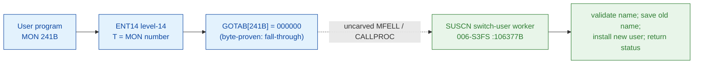

# MON 241B (octal) - NewUser (SUSCN)

Switches the user name you are logged in under (like logging out and logging in as
another user); your program continues under the new user name. Restore the old name
with OldUser (MON 242B). From the ND-100 you may execute NewUser more than once
without OldUser between. User RT and user SYSTEM only; background programs.

**Status:** GOTAB dispatch head byte-proven as **fall-through** (`GOTAB[241B] =
000000`, no per-call stub); the `SUSCN` worker body is real SINTRAN L bytes in the
file-system segment `006-S3FS` (a `FILSYS-SYMBOLS` symbol). The worker is real
executable code with user-name validation, a user-RT test, a save/restore of the
old name words, an install call and four error tails (the code region ends at `106527B`, bounded by
the next symbol `RUSCN=106562B`). The
exact `MON 241 -> worker` link crosses an uncarved kernel bridge (see
[Honest caveats](#honest-caveats)). All addresses/values are **octal**.

- **Full disassembly:** [`241B-NewUser.ASM`](241B-NewUser.ASM) - the actual code (the SUSCN worker body; there is no entry stub because the GOTAB slot is zero).
- **Bytes live once in** the canonical segment layer: [`../../segments-ref/`](../../segments-ref/).

---

## Dispatch path

The GOTAB slot is zero, so there is **no per-call entry stub**. The dashed hop
(`C -> E`) is the resident `MFELL`/`CALLPROC` fall-through second-level dispatch -
it is **not present in any carved segment**, so it is the one link that cannot be
followed statically.

---

## Code location (dispatch path)

Every row is a real region you can open. Byte offset = `(addr - loadbase)` in octal
words x 2; for `006-S3FS` (load base `26000B`) it is `(addr - 26000B) x 2`.

| Role | Segment (full disasm) | Addr range (octal) | Byte offset | Symbol | Verdict |
|------|------------------------|--------------------|-------------|--------|---------|
| GOTAB[241] dispatch word | [commoncode.asm](../../segments-ref/SINTRAN-DATA_commoncode/SINTRAN-DATA_commoncode.asm) - [.hex](../../segments-ref/SINTRAN-DATA_commoncode/SINTRAN-DATA_commoncode.hex) | `071474B` (1 word) | 59000 | `GOTAB+241` = `000000` | **VERIFIED** (fall-through) |
| resident MFELL/CALLPROC bridge | - (uncarved) | - | - | `MFELL`/`CALLPROC` | **UNVERIFIED** |
| SUSCN worker body | [006-S3FS.asm](../../segments-ref/006-S3FS/006-S3FS.asm) - [.hex](../../segments-ref/006-S3FS/006-S3FS.hex) | `106377B-106527B` (code) + `106530B` (pad) + `106531B-106561B` (link cells) | 49662 | `SUSCN` | real bytes = **CODE**; body link **MISATTRIBUTED** |

The window is bounded strictly by the next symbol `RUSCN=106562B` (115 words).
Words `106377B-106527B` are code, `106530B` is a one-word `ROP NOOP` pad, and
`106531B-106561B` are a pointer table (link cells) the `JPL I` / `JMP I`
indirections dereference - they are **data**.

**Verify by hand:** `grep '^106377 ' ../../segments-ref/006-S3FS/006-S3FS.hex`
-> byte offset `49662`; then
`dd if=../../../segments/006-S3FS.bin bs=1 skip=49662 count=2 2>/dev/null | od -An -tx1`
-> `22 59` (the stored word = octal `021131`, a genuine `STD I 131`
instruction, the SUSCN entry). The GOTAB slot itself:
`grep '^71474 ' ../../segments-ref/SINTRAN-DATA_commoncode/SINTRAN-DATA_commoncode.hex`
-> `71474  000000  000 000  59000`; then
`dd if=../../../resident/SINTRAN-DATA_commoncode.bin bs=1 skip=59000 count=2 2>/dev/null | od -An -tx1`
-> `00 00` (= `000000`, fall-through). `prove-mon.py 241` reads the same GOTAB zero.

---

## Instruction walkthrough

Full listing: [`241B-NewUser.ASM`](241B-NewUser.ASM). The body is the `SUSCN` worker
(there is no F16xx stub because `GOTAB[241] = 0`). `SUSCN` (Switch USer, Change Name)
sits directly before its twin `RUSCN` (OldUser, MON 242B).

**Prologue (106377-106403)** - `106377 STD I 131` saves the incoming `A/D` pair,
`106400-106401` copy the return link and frame pointer, `106402 SAB 32` and
`106403 JPL I 126 -> [106531]` call the resident prologue worker.

**Name validation (106404-106445)** - `106412 JPL I 123 -> [106535]` validates the
new user-name string; `106420 JPL I 117 -> [106537]` processes the project password;
`106426-106431` pack/store the coded name (`SHA ZIN 10` = logical left shift 8,
`ADD I` = add); the `BSKP`/`JAF` tests branch to the error tail with code `25`.

**User-RT test + install (106445-106507)** - `106445-106450 SAT 1` / `SKP IF DA EQL
ST` is the user-RT branch; when not user RT the resident workers at `[106550]` and
`[106551]` do the extra check; `106464-106467` save the current (old) name words
into `B+30`/`B+31`; `106476 JPL I 56 -> [106554]` installs the new user; `106500`
stores the returned status; `106505 MIN ,B 4` + `106507 JMP I 50 -> [106557]` is the
success return.

**Restore-on-failure (106510-106527)** - the install-failure tail (`106512-106521`)
restores the saved old-name words before returning the error code; the other tails
converge on `106506 SAA -32` / the indirect return.

---

## Parameter / register contract

Manual-side names/types are from [`241B_NewUser.yaml`](../../../../../../../Developer/MON/calls/241B_NewUser.yaml).

| Reg / field | Dir | Meaning | Verdict |
|-------------|-----|---------|---------|
| `X` (UserName) | in | address of the new user-name string (`MAC` `LDX (USER`) | inferred (manual) |
| `A` (UserPassword) | in | user password coded as an integer (`MAC` `LDA (PASSW`) | inferred (manual) |
| `T` (ProjectPassword) | in | address of the project-password string (`MAC` `LDT (PROJP`) | inferred (manual) |
| `B+30` / `B+31` | internal | saved old name words for restore-on-failure (`STA ,B 30/31`, `LDA ,B 30/31`) | VERIFIED (bytes); meaning inferred |
| `A` (UserType) | out | status: public users 0, user SYSTEM 1, user RT 2 (`STA ,B 2`) | inferred (manual) |
| error return | out | standard error code in `A` (`106506 SAA -32`, tail code `25`) | VERIFIED (bytes); code value inferred |

---

## Pseudo-code (for an emulator)

See **[`241B-NewUser.pseudo.c`](241B-NewUser.pseudo.c)** - a pseudo-C model for
emulator authors. The control flow (name validation, the user-RT test, the
save/restore of the old name, the install call and the four error tails) is
byte-verified; the register/field semantics and the exact name/password packing are
inferred from the manual and the code shape.

Every instruction in the pseudo-code is translated against the canonical
[ND-100 instruction semantics reference](../../instruction-semantics/ND100-INSTRUCTION-SEMANTICS.md)
(`RADD CLD` copy idiom, `RADD SB DA/DX` register add, `SHA ZIN 10` logical left
shift, `SKP IF DA EQL ST` compare, `JAF` flag branch, `MIN ,B` increment and skip,
`JPL I`/`JMP I` indirect call/return, addressing-mode effective addresses).

---

## Honest caveats

**What is byte-proven:** `GOTAB[241B] = 000000` (level-14 fall-through;
`prove-mon.py 241` reads commoncode file byte `0xe678 = 00 00`); the `SUSCN` worker
body at `106377B` in `006-S3FS` is real code (first word `021131B = STD I 131`
matches the disassembly); and it is a switch-user routine (name validation, old-name
save/restore, install call, status return), consistent with NewUser.

**Which segment and why:** `SUSCN=106377B` is a `FILSYS-SYMBOLS` symbol, so it lives
in the file-system segment `006-S3FS`, directly before its OldUser twin
`RUSCN=106562B`. The window `106377B-106561B` is bounded strictly by `RUSCN` (115
words): `106377-106527` are code, `106530` is a `ROP NOOP` pad, and `106531-106561`
are the `JPL I`/`JMP I` link-cell table.

**What is NOT proven:** the link from the zero GOTAB slot to the `SUSCN` worker.
Because the vector is zero there is no stub to disassemble and no pointer to
dereference; dispatch drops into the resident `MFELL`/`CALLPROC` second-level path,
which lives in an **uncarved overlay** - hence **MISATTRIBUTED** in the strict
sense: the attribution rests on the `SUSCN` symbol name + matching behaviour + the
`RUSCN` twin, not a followed pointer. The `JPL I`/`JMP I` link cells
(`106531..106561`) are a pointer table whose runtime targets are not resolved here.
Confirming the dispatch link needs a live trace of a real `MON 241`.

Method: [../../../../../EXTRACTING-RESIDENT-CODE.md](../../../../../EXTRACTING-RESIDENT-CODE.md) - dispatch reality:
[../../TASK-05-mismatches.md](../../TASK-05-mismatches.md) - master map: [../../MON-CALL-INDEX.md](../../MON-CALL-INDEX.md).
