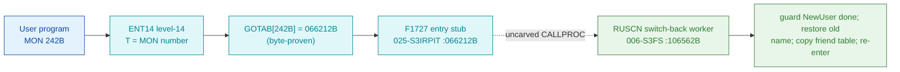

# MON 242B (octal) - OldUser (RUSCN)

Switches back to the user name in effect before NewUser (MON 241B); your program
continues under the old user. OldUser always resets the FIRST user name and has no
function if NewUser was not executed. All users; background programs.

**Status:** GOTAB dispatch head byte-proven (`GOTAB[242B] = 066212B`), pointing at
the 4-word entry stub `F1727` in `025-S3IRPIT`; the `RUSCN` worker body is real
SINTRAN L bytes in the file-system segment `006-S3FS` (a `FILSYS-SYMBOLS` symbol,
the OldUser twin of `SUSCN`). The stub sits inside a shared stub block and does not
itself reach `RUSCN`; the exact `MON 242 -> worker` link crosses an uncarved kernel
bridge (see [Honest caveats](#honest-caveats)). All addresses/values are **octal**.

- **Full disassembly:** [`242B-OldUser.ASM`](242B-OldUser.ASM) - the actual code, both regions (F1727 entry stub + RUSCN worker with its link cells).
- **Bytes live once in** the canonical segment layer: [`../../segments-ref/`](../../segments-ref/).

---

## Dispatch path

The dashed hop (`D -> E`) is the resident `CALLPROC`/segment-switch - it is **not
present in any carved segment**, so it is the one link that cannot be followed
statically. The stub `F1727` is a tiny 4-word compiler entry inside a shared stub
block (neighbours `F2130`/`F2131`/`MTOUS`); it is not a self-contained named
handler and the worker address `106562` does not occur anywhere inside `025-S3IRPIT`.

---

## Code location (dispatch path)

Every row is a real region you can open. Byte offset = `(addr - loadbase)` in octal
words x 2; for `025-S3IRPIT` (load base `32000B`) it is `(addr - 32000B) x 2`, for
`006-S3FS` (load base `26000B`) it is `(addr - 26000B) x 2`.

| Role | Segment (full disasm) | Addr range (octal) | Byte offset | Symbol | Verdict |
|------|------------------------|--------------------|-------------|--------|---------|
| GOTAB[242] dispatch word | [commoncode.asm](../../segments-ref/SINTRAN-DATA_commoncode/SINTRAN-DATA_commoncode.asm) - [.hex](../../segments-ref/SINTRAN-DATA_commoncode/SINTRAN-DATA_commoncode.hex) | `071475B` (1 word) | 59002 | `GOTAB+242` = `066212B` | **VERIFIED** |
| F1727 entry stub | [025-S3IRPIT.asm](../../segments-ref/025-S3IRPIT/025-S3IRPIT.asm) - [.hex](../../segments-ref/025-S3IRPIT/025-S3IRPIT.hex) | `066212B-066215B` (4 words) | 28948 | `F1727` | **VERIFIED** (GOTAB target); shared stub block |
| resident CALLPROC bridge | - (uncarved) | - | - | `CALLPROC` | **UNVERIFIED** |
| RUSCN worker body | [006-S3FS.asm](../../segments-ref/006-S3FS/006-S3FS.asm) - [.hex](../../segments-ref/006-S3FS/006-S3FS.hex) | `106562B-106701B` (code) + `106702B` (pad) + `106703B-106731B` (link cells) | 49892 | `RUSCN` | real bytes = **CODE**; body link **MISATTRIBUTED** |

The worker window is bounded strictly by the next symbol `FDFDI=106732B` (104
words). Words `106562B-106701B` are code, `106702B` is a `ROP NOOP` pad, and
`106703B-106731B` are the `JPL I`/`JMP I` link-cell table (**data**).

**Verify by hand:** the GOTAB word:
`grep '^71475 ' ../../segments-ref/SINTRAN-DATA_commoncode/SINTRAN-DATA_commoncode.hex`
-> `71475  066212  154 212  59002`; then
`dd if=../../../resident/SINTRAN-DATA_commoncode.bin bs=1 skip=59002 count=2 2>/dev/null | od -An -tx1`
-> `6c 8a` (the stored word = `066212B`). The stub head:
`dd if=../../../segments/025-S3IRPIT.bin bs=1 skip=28948 count=2 2>/dev/null | od -An -tx1`
-> `cc 3d` (= octal `146075`, `RADD SX DA`, matching the disassembly). The RUSCN
worker entry: `grep '^106562 ' ../../segments-ref/006-S3FS/006-S3FS.hex` -> byte
offset `49892`; then
`dd if=../../../segments/006-S3FS.bin bs=1 skip=49892 count=2 2>/dev/null | od -An -tx1`
-> `22 50` (= octal `021120`, `STD I 120`, the RUSCN entry). `prove-mon.py 242`
reads the same GOTAB value.

---

## Instruction walkthrough

Full listing: [`242B-OldUser.ASM`](242B-OldUser.ASM). Two regions.

**Region A - F1727 stub (`066212-066215`)** is the 4-word GOTAB target in
`025-S3IRPIT`. It sits inside a shared stub block and its head (`RADD SX DA` / `AAA
-1` / `RADD CLD SA DD` / `LDA 51`) is not a self-contained per-call handler; the
real transfer to the worker is the resident `CALLPROC`, which a static decode cannot
follow.

**Region B - RUSCN worker (`106562-106731`)** is the functional body.
`106562 STD I 120` saves the incoming pair; `106566 JPL I 115 -> [106703]` is the
prologue. `106567-106575` guard on the saved-name slots being `-1` (no NewUser done
-> no-op tail). `106601-106617` rebuild the old coded name (`SHA ZIN SHR 10` =
logical right shift 8, `AND` mask) and clear the saved-name flag; `106620 JPL I 100
-> [106720]` re-enters the old user. `106646-106660` is an 8-word friend-table copy
loop (`SKP IF DT GRE SX` bounds it, `AAX 1` increments). The tails converge on
`106671 SAA -12` / `106672 JMP I 37 -> [106731]`.

---

## Parameter / register contract

Manual-side names/types are from [`242B_OldUser.yaml`](../../../../../../../Developer/MON/calls/242B_OldUser.yaml).

| Reg / field | Dir | Meaning | Verdict |
|-------------|-----|---------|---------|
| (none) | in | OldUser takes no input parameters (`MAC` `MON 242`) | inferred (manual) |
| saved-name slots | internal | `-1` sentinel = no NewUser done (`SAT -1` / `SKP IF DA UEQ ST` at 106567-106575) | VERIFIED (bytes); meaning inferred |
| `B+11` | internal | descriptor pointer for the release path (`STX ,B 11`, `LDX ,B 11`) | VERIFIED (bytes); meaning inferred |
| friend table (8 words) | internal | copied back into the user datafield (loop 106652-106660) | VERIFIED (bytes); meaning inferred |
| error return | out | standard error code in `A` (`106671 SAA -12`) | VERIFIED (bytes); code value inferred |

---

## Pseudo-code (for an emulator)

See **[`242B-OldUser.pseudo.c`](242B-OldUser.pseudo.c)** - a pseudo-C model for
emulator authors. The control flow (the "was NewUser done?" guard, the saved-name
restore, the friend-table copy loop and the error tails) is byte-verified; the
register/field semantics are inferred from the code shape and the NewUser twin.

Every instruction in the pseudo-code is translated against the canonical
[ND-100 instruction semantics reference](../../instruction-semantics/ND100-INSTRUCTION-SEMANTICS.md)
(`RADD CLD` copy idiom, `RADD SB/SX/SD DA` adds, `SHA ZIN SHR 10` logical right
shift, `SKP IF DA UEQ ST` unsigned compare, `SKP IF DT GRE SX` signed compare,
`AAA`/`AAX` add-constant, `MIN ,B` increment and skip, `JPL I`/`JMP I` indirect
call/return).

---

## Honest caveats

**What is byte-proven:** `GOTAB[242B] = 066212B` (`prove-mon.py 242` reads commoncode
file byte `0xe67a = 6c 8a`); that value read as a `025-S3IRPIT` address is the
`F1727` stub, whose bytes decode cleanly (`146075B = RADD SX DA`). The `RUSCN` worker
at `106562B` in `006-S3FS` is real code (first word `021120B = STD I 120`) and it is
a switch-back routine (no-NewUser guard, old-name restore, friend-table copy),
consistent with OldUser.

**What is NOT proven:** the `F1727` stub is only 4 words and lands inside a shared
stub block, not a dedicated per-call handler; it branches within its own head and
the actual transfer to `RUSCN` is the resident `CALLPROC` in an **uncarved overlay**.
So the `MON 242 -> RUSCN` attribution rests on the `RUSCN` symbol name (Reset USer,
Change Name) + the matching behaviour + the `SUSCN` twin, not a followed pointer -
hence **MISATTRIBUTED** in the strict sense. The worker's `JPL I`/`JMP I` link cells
(`106703..106731`) are a pointer table whose runtime targets are not resolved here.
Confirming the dispatch link needs a live trace: issue a real `MON 242`, single-step
through the stub and the resident `CALLPROC`, and confirm P lands on `RUSCN = 106562`.

Method: [../../../../../EXTRACTING-RESIDENT-CODE.md](../../../../../EXTRACTING-RESIDENT-CODE.md) - dispatch reality:
[../../TASK-05-mismatches.md](../../TASK-05-mismatches.md) - master map: [../../MON-CALL-INDEX.md](../../MON-CALL-INDEX.md).
