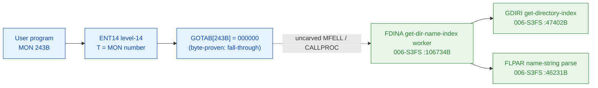

# MON 243B (octal) - GetDirNameIndex (FDINA)

Gets a **directory index** and a **name index** from a directory name string (1-16
characters, e.g. `PACK-TWO`). The name index identifies the device description of the
disk that holds the directory. `GetNameEntry` (MON 245B) then reads the device's name
entry from this name index.

**Status:** GOTAB dispatch head byte-proven as **fall-through** (`GOTAB[243B] =
000000`, no per-call stub); the `FDINA` worker body is real SINTRAN L bytes and
resolves the directory via `GDIRI` (Get DIRectory Index) after parsing the name string
with `FLPAR`; the exact `MON 243 -> worker` link crosses an uncarved kernel bridge
(see [Honest caveats](#honest-caveats)). All addresses/values are **octal**.

- **Full disassembly:** [`243B-GetDirNameIndex.ASM`](243B-GetDirNameIndex.ASM) - the actual code (the FDINA worker body; there is no entry stub because the GOTAB slot is zero).
- **Bytes live once in** the canonical segment layer: [`../../segments-ref/`](../../segments-ref/).

---

## Dispatch path

The GOTAB slot is zero, so there is **no per-call entry stub**. The dashed hop
(`C -> E`) is the resident `MFELL`/`CALLPROC` fall-through second-level dispatch - it
is **not present in any carved segment**, so it is the one link that cannot be followed
statically.

---

## Code location (dispatch path)

Every row is a real region you can open. Byte offset = `(addr - loadbase)` in octal words x 2.

| Role | Segment (full disasm) | Addr range (octal) | Byte offset | Symbol | Verdict |
|------|------------------------|--------------------|-------------|--------|---------|
| GOTAB[243] dispatch word | [commoncode.asm](../../segments-ref/SINTRAN-DATA_commoncode/SINTRAN-DATA_commoncode.asm) - [.hex](../../segments-ref/SINTRAN-DATA_commoncode/SINTRAN-DATA_commoncode.hex) | `071476B` (1 word) | 59004 | `GOTAB+243` = `000000` | **VERIFIED** (fall-through) |
| resident MFELL/CALLPROC bridge | - (uncarved) | - | - | `CALLPROC` | **UNVERIFIED** |
| FDINA get-dir-name-index worker | [006-S3FS.asm](../../segments-ref/006-S3FS/006-S3FS.asm) - [.hex](../../segments-ref/006-S3FS/006-S3FS.hex) | `106734B-107105B` (to `WDIEN`) | 50104 | `FDINA` | real bytes; link **MISATTRIBUTED** |
| GDIRI get-directory-index | [006-S3FS.asm](../../segments-ref/006-S3FS/006-S3FS.asm) - [.hex](../../segments-ref/006-S3FS/006-S3FS.hex) | `47402B` (call target) | - | `GDIRI` | called by FDINA (link cell `107070`) - **VERIFIED** |
| FLPAR name-string parse | [006-S3FS.asm](../../segments-ref/006-S3FS/006-S3FS.asm) - [.hex](../../segments-ref/006-S3FS/006-S3FS.hex) | `46231B` (call target) | - | `FLPAR` | called by FDINA (link cell `107065`) - **VERIFIED** |

**Verify by hand:** `grep '^106734 ' ../../segments-ref/006-S3FS/006-S3FS.hex` -> byte offset `50104`;
then `dd if=../../../segments/006-S3FS.bin bs=1 skip=50104 count=8 | od -An -tx1` -> `f8 10 22 53 cc 65 cc 59`
(= octal `174020 021123 146145 146131` = `BSET ZRO SSK` / `STD I 123` / `RADD CLD SL DA` / `RADD CLD SB DD`, the FDINA entry).

The GOTAB slot itself:
`dd if=../../../resident/SINTRAN-DATA_commoncode.bin bs=1 skip=59004 count=2 | od -An -tx1` -> `00 00` (= `000000`, fall-through).

The GDIRI link cell: `dd if=../../../segments/006-S3FS.bin bs=1 skip=50288 count=2 | od -An -tx1` -> `4f 02` (= octal `047402`, the word at `107070B` = the resolved `GDIRI` worker address).

---

## Instruction walkthrough

Full listing: [`243B-GetDirNameIndex.ASM`](243B-GetDirNameIndex.ASM). The functional body
is the FDINA worker; there is no F16xx stub because `GOTAB[243] = 0`. All calls to shared
file-system workers are **indirect** (`JPL I` / `JMP I`) through the pointer table at
`107060-107105`. nd100-dis renders those pointer words as bogus instructions - they are
**data (link cells)**, not code; their contents are the real worker addresses (resolved
in the `.ASM`).

- **Entry prologue (`106734-106741`)** - `106734 BSET ZRO SSK` clears the mode flag;
  `106735 STD I 123` stashes the caller's double-word parameter; `106740 SAB 75` builds
  the 75-word local frame `B`; `106741 JPL I 120` -> `003752` is the shared resident
  prologue worker.
- **Parse the directory name (`106750-106762`)** - `106755 JPL I 106` -> `031075`
  (**USCPS**) and `106762 JPL I 103` -> `046231` (**FLPAR**, parameter parse) parse and
  validate the directory name string.
- **Resolve directory + name index (`106764-107032`)** - `106770 JPL I 77` -> `010500`
  is a resident helper; `106773 JPL I 75` -> `047402` (**GDIRI**, Get DIRectory Index)
  yields the directory index; `107001 JPL I 72` -> `050124` (**GDIRT**, directory table)
  and `107010 JPL I 66` -> `061451` (**REMCH**, remote-char) resolve the remote/name
  case; `107030 JPL I 52` -> `054527` (**GMUSI**), `107032 JPL I 51` -> `054341`
  (**GDFKN**) and `107045 JPL I 40` -> `055263` (**GDEFD**) reach the name/device tables.
- **Return the indices (`107034-107057`)** - the directory index goes to `B+1`
  (`107034 STT ,B 1`) or `B+2` (`107050 STX ,B 2`); `107036 MIN ,B 4` is the success
  return-link bump; the store-status point `107035/107052/107056 STA ,B 2` writes the
  result word into the caller's status slot `B+2`; every path funnels into the resident
  return `107040 JMP I 44` -> `003776`.

The `JPL I 75` call to **GDIRI** (link cell `107070 = 047402`) plus the `JPL I 103` call
to **FLPAR** (link cell `107065 = 046231`) are the byte-level proof that FDINA is the
GetDirNameIndex worker: it parses a directory name and resolves the directory index (and
the name/device index alongside it). `FDINA` (Find-DIrectory-NAme) is also the `243B`
short name in the manual.

---

## Parameter / register contract

Manual-side names/types are from [`243B_GetDirNameIndex.yaml`](../../../../../../../Developer/MON/calls/243B_GetDirNameIndex.yaml).

| Reg / field | Dir | Meaning | Verdict |
|-------------|-----|---------|---------|
| entry point (worker) | in | `106734B` = FDINA worker entry | VERIFIED (bytes) |
| `SSK` (skip flag) | internal | `0` at entry; latched to `B+74` | VERIFIED (bytes) |
| `D` (double) | in | caller parameter block, saved first (`STD I 123`) | VERIFIED (copy); layout inferred |
| local frame `B` | internal | `SAB 75` = 75B-word working frame | VERIFIED (bytes) |
| `X` (manual) | in | address of the directory name string (1-16 chars) | inferred (manual MAC example) |
| `T` (manual) | out | directory index (`STT DIRIX`) | inferred (manual) |
| `A` (manual) | out | name index (`STA NAMIX`); error number on error return | inferred (manual) |
| `B+1` | internal | directory index result (`STT ,B 1` at `107034`) | VERIFIED (bytes) |
| `B+2` | out | returned status / index word (`STA ,B 2` / `STX ,B 2`) | VERIFIED (bytes) |

The user-visible `X` in / `T`+`A` out register convention lives in the caller-side
`MON 243` wrapper and the uncarved `MFELL`/`CALLPROC` frame, so the precise
user-register-to-field assignment is **inferred** from the manual, not byte-proven here.

---

## Pseudo-code (for an emulator)

See **[`243B-GetDirNameIndex.pseudo.c`](243B-GetDirNameIndex.pseudo.c)** - a pseudo-C
model of the handler for emulator authors. Control flow + the calls to GDIRI / FLPAR /
GDIRT are byte-verified; the parameter-field semantics and error-number meanings are
inferred from the call structure and the manual. Every instruction is translated per the
canonical
[`ND100-INSTRUCTION-SEMANTICS.md`](../../instruction-semantics/ND100-INSTRUCTION-SEMANTICS.md)
(bare `LDA disp` = `mem[P+disp]`; `RADD CLD SD DA` = `A = D`; `MIN ,B 4` success bump).

---

## Honest caveats

**What is byte-proven:** `GOTAB[243B] = 000000` (level-14 fall-through, no per-call
vector); the `FDINA` worker body at `106734B` in `006-S3FS` is real code (entry bytes
`174020 021123 146145 146131` match the disassembly, bounded by the next FILSYS symbol
`WDIEN = 107106B`); and it resolves the indices - it calls `FLPAR` (`046231B`, link cell
`107065`) to parse the name and `GDIRI` (`047402B`, link cell `107070`) to get the
directory index.

**What is NOT proven:** the link from the zero GOTAB slot to the `FDINA` worker. Because
the vector is zero there is no stub to disassemble and no pointer to dereference; dispatch
drops into the resident `MFELL`/`CALLPROC` second-level path, which lives in an **uncarved
overlay**. So the `MON 243 -> FDINA` attribution rests on the `FDINA` symbol name (the
`243B` short name) + its `FLPAR`/`GDIRI` calls + the matching resolve-directory-name
behaviour, not a followed pointer - hence **MISATTRIBUTED** in the strict sense.
Confirming the link needs a live trace: issue a real `MON 243`, single-step the level-14
fall-through into the resident `CALLPROC` dispatch, and confirm P lands on `FDINA =
106734`.

**Region bound:** the FDINA worker is bounded strictly to the next FILSYS symbol
`WDIEN = 107106B` (the MON 311B WriteDirEntry entry). The name index (the device
description of the disk) is resolved from the directory table alongside the directory
index; the exact word that maps to the manual's `NAMIX` is not isolated here beyond the
`B+1`/`B+2` result slots. Several link-cell targets (`003752`, `010500`, `010506`,
`020274`, `003776`) sit below the `26000B` segment load base; they are resident-monitor /
save-restore routines outside the file-system segment and are not resolved here.

Method: [../../../../../EXTRACTING-RESIDENT-CODE.md](../../../../../EXTRACTING-RESIDENT-CODE.md) - dispatch reality:
[../../TASK-05-mismatches.md](../../TASK-05-mismatches.md) - master map: [../../MON-CALL-INDEX.md](../../MON-CALL-INDEX.md).
