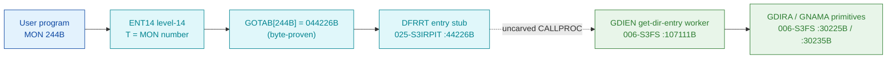

# MON 244B (octal) - GetDirEntry (GDIEN)

Gets information about a directory: the directory entry (24 words / 42 bytes) is
returned into the caller's buffer, together with a flag telling whether the disk
has spare-track allocation. The directory index selects the entry; with bit 15 of
the index register set, the entry may be read from a directory on a remote system
over a COSMOS network.

**Status:** GOTAB dispatch head byte-proven (`GOTAB[244B] = 044226B`, the `DFRRT`
level-14 stub in `025-S3IRPIT`); the GDIEN worker body is real SINTRAN L bytes and
calls the `GDIRA` (Get Directory Address) and `GNAMA` (Get Name Address)
primitives; the exact `MON 244 -> worker` link crosses an uncarved kernel bridge
(see [Honest caveats](#honest-caveats)). All addresses/values are **octal**.

- **Full disassembly:** [`244B-GetDirEntry.ASM`](244B-GetDirEntry.ASM) - the actual code, both regions (DFRRT entry stub + GDIEN worker with its shared body).
- **Bytes live once in** the canonical segment layer: [`../../segments-ref/`](../../segments-ref/).

---

## Dispatch path

The dashed hop (`D -> E`) is the resident `CALLPROC`/segment-switch - it is **not
present in any carved segment**, so it is the one link that cannot be followed
statically. The worker address `107111` does not occur anywhere inside
`025-S3IRPIT`.

---

## Code location (dispatch path)

Every row is a real region you can open. Byte offset = `(addr - loadbase)` in octal words x 2.

| Role | Segment (full disasm) | Addr range (octal) | Byte offset | Symbol | Verdict |
|------|------------------------|--------------------|-------------|--------|---------|
| GOTAB[244] dispatch word | [commoncode.asm](../../segments-ref/SINTRAN-DATA_commoncode/SINTRAN-DATA_commoncode.asm) - [.hex](../../segments-ref/SINTRAN-DATA_commoncode/SINTRAN-DATA_commoncode.hex) | `071477B` (1 word) | 59006 | `GOTAB+244` = `044226B` | **VERIFIED** |
| DFRRT entry stub | [025-S3IRPIT.asm](../../segments-ref/025-S3IRPIT/025-S3IRPIT.asm) - [.hex](../../segments-ref/025-S3IRPIT/025-S3IRPIT.hex) | `44226B-44233B` (6w) | 10540 | `DFRRT` | **VERIFIED** |
| resident CALLPROC bridge | - (uncarved) | - | - | `CALLPROC` | **UNVERIFIED** |
| GDIEN worker (entry + shared body) | [006-S3FS.asm](../../segments-ref/006-S3FS/006-S3FS.asm) - [.hex](../../segments-ref/006-S3FS/006-S3FS.hex) | `107111B-107400B` (entry 3w + body) | 50322 | `GDIEN` | real bytes; link **MISATTRIBUTED** |
| GDIRA get-directory-address | [006-S3FS.asm](../../segments-ref/006-S3FS/006-S3FS.asm) - [.hex](../../segments-ref/006-S3FS/006-S3FS.hex) | `30225B` (call target) | - | `GDIRA` | called by GDIEN (link cell `107244`) - **VERIFIED** |
| GNAMA get-name-address | [006-S3FS.asm](../../segments-ref/006-S3FS/006-S3FS.asm) - [.hex](../../segments-ref/006-S3FS/006-S3FS.hex) | `30235B` (call target) | - | `GNAMA` | called by GDIEN (link cell `107246`) - **VERIFIED** |

**Verify by hand:** `grep '^44226 ' ../../segments-ref/025-S3IRPIT/025-S3IRPIT.hex` -> byte offset `10540`;
then `dd if=../../../segments/025-S3IRPIT.bin bs=1 skip=10540 count=8 | od -An -tx1` -> `c9 00 a8 15 a8 14 ba 1a`
(= octal `144400 124025 124024 135032` = `RAND 0 0` / `JMP 25` / `JMP 24` / `JPL I 32`, the DFRRT stub head).

The GOTAB slot itself:
`dd if=../../../resident/SINTRAN-DATA_commoncode.bin bs=1 skip=59006 count=2 | od -An -tx1` -> `48 96` (big-endian word = `044226B`).

The GDIEN worker entry:
`dd if=../../../segments/006-S3FS.bin bs=1 skip=50322 count=8 | od -An -tx1` -> `f8 10 f8 38 a8 03 f8 90`
(= octal `174020 174070 124003 174220` = `BSET ZRO SSK` / `BSET ZRO SSM` / `JMP 3` / `BSET ONE SSK`, the GDIEN entry followed by the sibling GNAEN entry).

---

## Instruction walkthrough

Full listing: [`244B-GetDirEntry.ASM`](244B-GetDirEntry.ASM). The functional body is
the GDIEN worker (region B); the DFRRT stub (region A) is the level-14 entry.

**Region A - DFRRT stub (`44226-44233`)** is the compact level-14 entry pointed at
by `GOTAB[244]`. It clears `A` (`44226 RAND 0 0`) and its direct branches leave the
stub - `44227/44230/44233 JMP -> 44254` reach shared level-14 tail code in the same
segment, and `44231/44232 JPL I 32 -> 44263/44264` call shared level-14 routines.
None of these reach the GDIEN body (that transfer is the uncarved `CALLPROC` hop);
`107111` never appears in `025-S3IRPIT`.

**Region B - GDIEN worker (`107111` + shared body `107116-107400`)** is the
directory-entry body. GDIEN itself is only 3 words: it sets two skip flags -
`107111 BSET ZRO SSK` (SSK=0, directory entry rather than name) and
`107112 BSET ZRO SSM` (SSM=0, get rather than write) - then `107113 JMP 3 ->
107116` joins a body shared with the sibling entries **WDIEN** (`107106`, Write Dir
Entry, SSM=1) and **GNAEN** (`107114`, Get Name Entry, SSK=1). The body latches the
two flags into `B+104`/`B+105` (`107123-107136`) and dispatches on them.

- **Entry prologue (`107116-107122`)** - `107116 STD I 112` stashes the caller's
  double-word parameter; `107121 SAB 106` builds the 106-word local frame `B`;
  `107122 JPL I 107` -> `003752` is the shared resident prologue worker.
- **Get-entry path (`107211-107247`)** - with SSK=0 the body takes
  `107213 JPL I 31` -> `030225` (**GDIRA**, get directory address); the SSK=1 sibling
  path uses `107217 JPL I 27` -> `030235` (**GNAMA**, get name address). A
  range/validity failure loads error `174` (`107226 SAA 174`) and exits.
- **Format + finish (`107250-107365`)** - the read path formats the directory entry
  into the caller's buffer via resident/`SUCPB`/`GNFLA` workers; the write sibling
  path uses `107356 JPL I 21` -> `047716` (**WDIRE**, write dir entry). The
  store-status point `107364 STA ,B 2` writes the result word into the caller's
  status slot `B+2`; every path funnels into the resident return
  `107362 JMP I 16` -> `003776`.

The `JPL I 31` call to **GDIRA** (link cell `107244 = 030225`) plus the `JPL I 27`
call to **GNAMA** (link cell `107246 = 030235`) are the byte-level proof that GDIEN
is the GetDirEntry worker - it drives the directory-address primitives, and its
short name `GDIEN` matches the manual's `GetDirEntry`.

---

## Parameter / register contract

| Reg / field | Dir | Meaning | Verdict |
|-------------|-----|---------|---------|
| entry point (stub) | in | `044226B` = `DFRRT`, the `GOTAB[244]` level-14 stub | VERIFIED (bytes) |
| entry point (worker) | in | `107111B` = GDIEN worker entry | VERIFIED (bytes) |
| `SSK` (skip flag) | internal | `0` at GDIEN entry = directory entry (not name); latched to `B+105` | VERIFIED (bytes) |
| `SSM` (skip flag) | internal | `0` at GDIEN entry = get (not write); latched to `B+104` | VERIFIED (bytes) |
| `D` (double) | in | caller parameter block, saved first (`STD I 112`) | VERIFIED (copy); layout inferred |
| local frame `B` | internal | `SAB 106` = 106-word working frame | VERIFIED (bytes) |
| `T` (manual) | in | directory index (bit 15 in `X` set -> remote system id in `D`) | inferred (manual MAC example) |
| `X` (manual) | in | address of buffer receiving the 24-word directory entry | inferred (manual MAC example) |
| `D` (manual) | in | remote system identification (only if bit 15 in `X` set) | inferred (manual) |
| `A` (manual) | out | normal return: `1`/`5` = spare-track allocation, `3` = none; error return: error number | inferred (manual) |
| `B+2` | out | returned status word (`STA ,B 2` at `107364`) | VERIFIED (bytes) |
| error `174` | out | address/validity error literal (`SAA 174` at `107226`) | VERIFIED (bytes); mapping inferred |

The user-visible `T`/`X`/`D` register convention lives in the caller-side `MON 244`
wrapper and the uncarved `CALLPROC` frame, so the precise
user-register-to-field assignment is **inferred** from the manual
([`244B_GetDirEntry.yaml`](../../../../../../../Developer/MON/calls/244B_GetDirEntry.yaml)),
not byte-proven here.

---

## Pseudo-code (for an emulator)

See **[`244B-GetDirEntry.pseudo.c`](244B-GetDirEntry.pseudo.c)** - a pseudo-C model
of the handler for emulator authors. Control flow + the calls to the GDIRA/GNAMA
primitives are byte-verified; the parameter-field semantics and error-number
meanings are inferred from the call structure and the manual.

Every instruction in the `.pseudo.c` is translated against the canonical
[`ND100-INSTRUCTION-SEMANTICS.md`](../../instruction-semantics/ND100-INSTRUCTION-SEMANTICS.md)
(bare `LDx`/`LDT`/`AND disp` = P-relative `mem[P+disp]`, not literals; `SKP`/`BSKP` skip
polarity; `RADD CLD SD DA` = `A = D`; T/X transfers = physical `EL`).

---

## Honest caveats

**What is byte-proven:** `GOTAB[244B] = 044226B` (level-14 dispatch); the `DFRRT`
stub at `044226B` in `025-S3IRPIT` is real code (head bytes `144400 124025 124024
135032` match the disassembly); the `GDIEN` worker at `107111B` in `006-S3FS` is
real code (entry bytes `174020 174070 124003` match the disassembly); GDIEN is a
3-word flag-setting entry that joins a body shared with `WDIEN`/`GNAEN`; and it
belongs to the directory-entry family - it calls `GDIRA` (`030225B`, link cell
`107244`) and `GNAMA` (`030235B`, link cell `107246`).

**What is NOT proven:** the link from the `DFRRT` stub (in `025-S3IRPIT`) to the
`GDIEN` worker (in `006-S3FS`). The value `107111` occurs **zero** times as a target
inside the `DFRRT` stub; the stub's own direct branches stay in `025-S3IRPIT` (to
shared level-14 tail code at `44254B` and sibling routines at `44263B`/`44264B`),
and the stub->worker transfer is the resident `CALLPROC`/segment switch in an
**uncarved overlay**. So the `MON 244 -> GDIEN` attribution rests on the `GDIEN`
symbol name (`GetDirEntry`) + its calls to `GDIRA`/`GNAMA` + the matching
directory-entry behaviour, not a followed pointer - hence **MISATTRIBUTED** in the
strict sense. The `DFRRT` symbol name does not itself resemble `GetDirEntry`, which
is expected: the stub is the family's shared level-14 dispatch head, not a named
per-call worker. Confirming the link needs a live trace: break at `44226B` on a
real `MON 244`, single-step the segment switch, and confirm P lands on
`GDIEN = 107111`.

**Region-B bound:** the GDIEN worker's shared body is bounded strictly to the next
symbol `RESDI = 107401B`. The sibling entries `WDIEN = 107106B` and
`GNAEN = 107114B` are the Write-Dir-Entry and Get-Name-Entry calls' entries; they
set different `SSM`/`SSK` flags and share this same body - they are shown for
context only and are not the GetDirEntry body.

Several link-cell contents (`003752`, `020274`, `001224`, `010500`, `010506`,
`003776`) match no `FILSYS-SYMBOLS` entry; their low addresses suggest
resident-monitor / save-restore routines outside the file-system segment and are
not resolved here.

Method: [../../../../../EXTRACTING-RESIDENT-CODE.md](../../../../../EXTRACTING-RESIDENT-CODE.md) - dispatch reality:
[../../TASK-05-mismatches.md](../../TASK-05-mismatches.md) - master map: [../../MON-CALL-INDEX.md](../../MON-CALL-INDEX.md).
