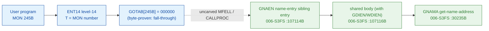

# MON 245B (octal) - GetNameEntry (GNAEN)

Gets information about a device (disk, floppy, streamer, and so on). The call returns
the device's **name entry** - a 28-byte record with the device name, storage capacity,
sector size, device-type flags, transfer-routine address and semaphore LDN. The caller
selects the device by its **name index** (from `GetDirNameIndex`, MON 243B).

**Status:** GOTAB dispatch head byte-proven as **fall-through** (`GOTAB[245B] =
000000`, no per-call stub); `GNAEN` is a flag-setting entry that joins a body shared
with the sibling calls `GDIEN` (MON 244B GetDirEntry) and `WDIEN` (MON 311B
WriteDirEntry); with the name-flag set it takes the `GNAMA` (Get NAme Address) path;
the exact `MON 245 -> worker` link crosses an uncarved kernel bridge (see
[Honest caveats](#honest-caveats)). All addresses/values are **octal**.

- **Full disassembly:** [`245B-GetNameEntry.ASM`](245B-GetNameEntry.ASM) - the GNAEN entry plus the shared body (the identical bytes also appear in [MON 244B](../244B-GetDirEntry/244B-GetDirEntry.ASM)).
- **Bytes live once in** the canonical segment layer: [`../../segments-ref/`](../../segments-ref/).

---

## Dispatch path

The GOTAB slot is zero, so there is **no per-call entry stub**. The dashed hop
(`C -> E`) is the resident `MFELL`/`CALLPROC` fall-through second-level dispatch - it
is **not present in any carved segment**, so it is the one link that cannot be followed
statically.

---

## Code location (dispatch path)

Every row is a real region you can open. Byte offset = `(addr - loadbase)` in octal words x 2.

| Role | Segment (full disasm) | Addr range (octal) | Byte offset | Symbol | Verdict |
|------|------------------------|--------------------|-------------|--------|---------|
| GOTAB[245] dispatch word | [commoncode.asm](../../segments-ref/SINTRAN-DATA_commoncode/SINTRAN-DATA_commoncode.asm) - [.hex](../../segments-ref/SINTRAN-DATA_commoncode/SINTRAN-DATA_commoncode.hex) | `071500B` (1 word) | 59008 | `GOTAB+245` = `000000` | **VERIFIED** (fall-through) |
| resident MFELL/CALLPROC bridge | - (uncarved) | - | - | `CALLPROC` | **UNVERIFIED** |
| GNAEN name-entry sibling entry | [006-S3FS.asm](../../segments-ref/006-S3FS/006-S3FS.asm) - [.hex](../../segments-ref/006-S3FS/006-S3FS.hex) | `107114B-107115B` (2w entry) | 50328 | `GNAEN` | real bytes; link **MISATTRIBUTED** |
| shared body (GDIEN/WDIEN/GNAEN) | [006-S3FS.asm](../../segments-ref/006-S3FS/006-S3FS.asm) - [.hex](../../segments-ref/006-S3FS/006-S3FS.hex) | `107116B-107400B` (to `RESDI`) | 50332 | body of `GDIEN` | real bytes |
| GNAMA get-name-address | [006-S3FS.asm](../../segments-ref/006-S3FS/006-S3FS.asm) - [.hex](../../segments-ref/006-S3FS/006-S3FS.hex) | `30235B` (call target) | - | `GNAMA` | called on the name path (link cell `107246`) - **VERIFIED** |

**Verify by hand:** `grep '^107114 ' ../../segments-ref/006-S3FS/006-S3FS.hex` -> byte offset `50328`;
then `dd if=../../../segments/006-S3FS.bin bs=1 skip=50328 count=8 | od -An -tx1` -> `f8 90 f8 38 22 4a cc 65`
(= octal `174220 174070 021112 146145` = `BSET ONE SSK` / `BSET ZRO SSM` / `STD I 112` / `RADD CLD SL DA`,
the GNAEN entry and the joined shared body head at `107116`).

The GOTAB slot itself:
`dd if=../../../resident/SINTRAN-DATA_commoncode.bin bs=1 skip=59008 count=2 | od -An -tx1` -> `00 00` (= `000000`, fall-through).

The GNAMA link cell: `dd if=../../../segments/006-S3FS.bin bs=1 skip=50508 count=2 | od -An -tx1` -> `30 9d` (= octal `030235`, the word at `107246B` = the resolved `GNAMA` worker address).

---

## Instruction walkthrough

Full listing: [`245B-GetNameEntry.ASM`](245B-GetNameEntry.ASM). `GNAEN` is a 2-word
flag-setting entry into a body shared with two siblings; the shared body is the same
bytes documented for [MON 244B GetDirEntry](../244B-GetDirEntry/README.md).

- **GNAEN entry / flag set (`107114-107115`)** - `107114 BSET ONE SSK` sets the name
  flag (SSK=1, name entry rather than directory entry) and `107115 BSET ZRO SSM` clears
  the write flag (SSM=0, get rather than write), then control falls into the shared body
  at `107116`. The sibling entries are `GDIEN` (`107111`, SSK=0/SSM=0, MON 244B) and
  `WDIEN` (`107106`, SSM=1, MON 311B).
- **Entry prologue (`107116-107122`)** - `107116 STD I 112` stashes the caller's
  double-word parameter; `107121 SAB 106` builds the 106-word local frame `B`;
  `107122 JPL I 107` -> `003752` is the shared resident prologue worker.
- **Flag latch + name path (`107123-107221`)** - the flags are latched into `B+104`
  (write) and `B+105` (name); with the name flag set the body takes
  `107217 JPL I 27` -> `030235` (**GNAMA**, Get NAme Address) rather than the directory
  path `107213 JPL I 31` -> `030225` (**GDIRA**). A range/validity failure loads error
  `174` (`107226 SAA 174`) and exits.
- **Format + finish (`107250-107365`)** - the name entry is formatted into the caller's
  buffer via the resident / `SUCPB` / `GNFLA` workers; `107364 STA ,B 2` writes the
  result word into the caller's status slot `B+2`; every path funnels into the resident
  return `107362 JMP I 16` -> `003776`.

The `JPL I 27` call to **GNAMA** (link cell `107246 = 030235`) on the name path is the
byte-level proof that `GNAEN` is the GetNameEntry worker: SSK=1 selects the
get-name-address primitive that yields the device name entry. `GNAEN` is also the `245B`
short name in the manual.

---

## Parameter / register contract

Manual-side names/types are from [`245B_GetNameEntry.yaml`](../../../../../../../Developer/MON/calls/245B_GetNameEntry.yaml).

| Reg / field | Dir | Meaning | Verdict |
|-------------|-----|---------|---------|
| entry point (sibling) | in | `107114B` = GNAEN (SSK=1/SSM=0), joins shared body at `107116B` | VERIFIED (bytes) |
| `SSK` (skip flag) | internal | `1` at GNAEN entry = name entry (not directory); latched to `B+105` | VERIFIED (bytes) |
| `SSM` (skip flag) | internal | `0` at GNAEN entry = get (not write); latched to `B+104` | VERIFIED (bytes) |
| `D` (double) | in | caller parameter block, saved first (`STD I 112`) | VERIFIED (copy); layout inferred |
| local frame `B` | internal | `SAB 106` = 106B-word working frame | VERIFIED (bytes) |
| `T` (manual) | in | name index of the device (`LDT NAMIX`) | inferred (manual MAC example) |
| `X` (manual) | in | address of the 14-word (28-byte) buffer receiving the name entry | inferred (manual) |
| `A` (manual) | out | error number on the error return | inferred (manual) |
| error `174` | out | address/validity error literal (`SAA 174` at `107226`) | VERIFIED (bytes); mapping inferred |
| `B+2` | out | returned status word (`STA ,B 2` at `107364`) | VERIFIED (bytes) |

The user-visible `T`/`X` register convention lives in the caller-side `MON 245` wrapper
and the uncarved `MFELL`/`CALLPROC` frame, so the precise user-register-to-field
assignment is **inferred** from the manual, not byte-proven here.

---

## Pseudo-code (for an emulator)

See **[`245B-GetNameEntry.pseudo.c`](245B-GetNameEntry.pseudo.c)** - a pseudo-C model of
the handler for emulator authors. The `SSK`/`SSM` flag set and the name-path call to
`GNAMA` are byte-verified; the parameter-field semantics and error-number meanings are
inferred from the call structure and the manual. Every instruction is translated per the
canonical
[`ND100-INSTRUCTION-SEMANTICS.md`](../../instruction-semantics/ND100-INSTRUCTION-SEMANTICS.md)
(`BSET ONE/ZRO SSx` sets/clears the skip flag; `BSKP ONE SSx` tests it; `MIN ,B 4`
success bump).

---

## Honest caveats

**What is byte-proven:** `GOTAB[245B] = 000000` (level-14 fall-through, no per-call
vector); the `GNAEN` entry at `107114B` in `006-S3FS` is real code (entry bytes
`174220 174070 021112 146145` match the disassembly); it sets SSK=1/SSM=0 and joins a
body shared with `GDIEN` (MON 244B) and `WDIEN` (MON 311B) at `107116B`, bounded by the
next FILSYS symbol `RESDI = 107401B`; and on the name path it calls `GNAMA` (`030235B`,
link cell `107246`).

**What is NOT proven:** the link from the zero GOTAB slot to the `GNAEN` entry. Because
the vector is zero there is no stub to disassemble and no pointer to dereference;
dispatch drops into the resident `MFELL`/`CALLPROC` second-level path, which lives in an
**uncarved overlay**. So the `MON 245 -> GNAEN` attribution rests on the `GNAEN` symbol
name (the `245B` short name) + its `GNAMA` name-path call + the matching name-entry
behaviour, not a followed pointer - hence **MISATTRIBUTED** in the strict sense.
Confirming the link needs a live trace: issue a real `MON 245`, single-step the level-14
fall-through into the resident `CALLPROC` dispatch, and confirm P lands on `GNAEN =
107114`.

**Shared body:** `GNAEN`, `GDIEN` (`107111B`, MON 244B) and `WDIEN` (`107106B`, MON
311B) are three entries into one body that forks on the `SSK`/`SSM` flags. The body is
shown here for context; the GetNameEntry-specific behaviour is the name path selected by
SSK=1. Several link-cell targets (`003752`, `020274`, `001224`, `010500`, `010506`,
`003776`) sit below the `26000B` segment load base; they are resident-monitor /
save-restore routines outside the file-system segment and are not resolved here.

Method: [../../../../../EXTRACTING-RESIDENT-CODE.md](../../../../../EXTRACTING-RESIDENT-CODE.md) - dispatch reality:
[../../TASK-05-mismatches.md](../../TASK-05-mismatches.md) - master map: [../../MON-CALL-INDEX.md](../../MON-CALL-INDEX.md).
