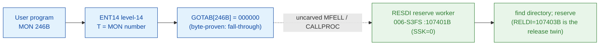

# MON 246B (octal) - ReserveDir (RESDI)

Reserves a directory for special use; other users cannot open files on it. The
directory must be entered and all its files must be closed. Release it with
ReleaseDir (MON 247B). User RT and user SYSTEM.

**Status:** GOTAB dispatch head byte-proven as **fall-through** (`GOTAB[246B] =
000000`, no per-call stub); the `RESDI` worker body is real SINTRAN L bytes in the
file-system segment `006-S3FS` (a `FILSYS-SYMBOLS` symbol). It is a **shared
reserve/release body**: the `SSK` skip flag selects reserve (`RESDI`, SSK=0, this
call) vs release (`RELDI`, SSK=1, MON 247B). It closes at `107426B`, bounded by the
next symbol `500RD=107434B`. The exact `MON 246 -> worker` link crosses an uncarved
kernel bridge (see [Honest caveats](#honest-caveats)). All addresses/values are
**octal**.

- **Full disassembly:** [`246B-ReserveDir.ASM`](246B-ReserveDir.ASM) - the actual code (the shared RESDI/RELDI worker; there is no entry stub because the GOTAB slot is zero).
- **Bytes live once in** the canonical segment layer: [`../../segments-ref/`](../../segments-ref/).

---

## Dispatch path

The GOTAB slot is zero, so there is **no per-call entry stub**. The dashed hop
(`C -> E`) is the resident `MFELL`/`CALLPROC` fall-through second-level dispatch -
it is **not present in any carved segment**, so it is the one link that cannot be
followed statically.

---

## Code location (dispatch path)

Every row is a real region you can open. Byte offset = `(addr - loadbase)` in octal
words x 2; for `006-S3FS` (load base `26000B`) it is `(addr - 26000B) x 2`.

| Role | Segment (full disasm) | Addr range (octal) | Byte offset | Symbol | Verdict |
|------|------------------------|--------------------|-------------|--------|---------|
| GOTAB[246] dispatch word | [commoncode.asm](../../segments-ref/SINTRAN-DATA_commoncode/SINTRAN-DATA_commoncode.asm) - [.hex](../../segments-ref/SINTRAN-DATA_commoncode/SINTRAN-DATA_commoncode.hex) | `071501B` (1 word) | 59010 | `GOTAB+246` = `000000` | **VERIFIED** (fall-through) |
| resident MFELL/CALLPROC bridge | - (uncarved) | - | - | `MFELL`/`CALLPROC` | **UNVERIFIED** |
| RESDI/RELDI shared worker body | [006-S3FS.asm](../../segments-ref/006-S3FS/006-S3FS.asm) - [.hex](../../segments-ref/006-S3FS/006-S3FS.hex) | `107401B-107426B` (code) + `107427B` (pad) + `107430B-107433B` (link cells) | 50690 | `RESDI` (SSK=0) / `RELDI`=107403B (SSK=1) | real bytes = **CODE**; body link **MISATTRIBUTED** |

The window is bounded strictly by the next symbol `500RD=107434B` (27 words). Words
`107401B-107426B` are code, `107427B` is a `ROP NOOP` pad, and `107430B-107433B` are
the `JPL I`/`JMP I` link-cell table (**data**).

**Verify by hand:** `grep '^107401 ' ../../segments-ref/006-S3FS/006-S3FS.hex`
-> byte offset `50690`; then
`dd if=../../../segments/006-S3FS.bin bs=1 skip=50690 count=2 2>/dev/null | od -An -tx1`
-> `f8 10` (the stored word = octal `174020`, `BSET ZRO SSK`, the RESDI
reserve entry). The GOTAB slot itself:
`grep '^71501 ' ../../segments-ref/SINTRAN-DATA_commoncode/SINTRAN-DATA_commoncode.hex`
-> `71501  000000  000 000  59010`; then
`dd if=../../../resident/SINTRAN-DATA_commoncode.bin bs=1 skip=59010 count=2 2>/dev/null | od -An -tx1`
-> `00 00` (= `000000`, fall-through). `prove-mon.py 246` reads the same GOTAB zero.

---

## Instruction walkthrough

Full listing: [`246B-ReserveDir.ASM`](246B-ReserveDir.ASM). The body is the shared
`RESDI`/`RELDI` worker (there is no F16xx stub because `GOTAB[246] = 0`).

**Two-entry prologue (107401-107410)** - `107401 BSET ZRO SSK` clears the skip flag
(RESDI reserve entry, this call); the sibling `107403 BSET ONE SSK` sets it (RELDI
release entry, MON 247B). Both join at `107404 STD I 23` (save the pair);
`107405-107406` copy link/frame; `107407 SAB 6`; `107410 JPL I 20 -> [107430]` calls
the resident prologue worker (find directory).

**Reserve/release branch (107411-107421)** - `107411 LDX ,B 5` / `107412 LDX ,X 31`
walk into the directory datafield; `107413 BSKP ONE SSK` selects the release resident
worker (`107415 JPL I 14 -> [107431]`) or the reserve resident worker (`107420 JPL I
12 -> [107432]`).

**Return (107422-107426)** - `107422 MIN ,B 4` advances the return; `107423 SAA -6`
loads a standard error code; `107424 JMP I 7 -> [107433]` returns indirectly; the
error tail `107425-107426` stores the error code first.

---

## Parameter / register contract

Manual-side names/types are from [`246B_ReserveDir.yaml`](../../../../../../../Developer/MON/calls/246B_ReserveDir.yaml).

| Reg / field | Dir | Meaning | Verdict |
|-------------|-----|---------|---------|
| `T` (DirectoryIndex) | in | directory index, from `@LIST-DIRECTORIES` (`MAC` `LDT DIRIX`) | inferred (manual) |
| `SSK` flag | internal | reserve (SSK=0, RESDI) vs release (SSK=1, RELDI) selector (`BSET ZRO/ONE SSK`, `BSKP ONE SSK`) | VERIFIED (bytes) |
| `B+5` / `X+31` | internal | directory datafield + reservation-word offset (`LDX ,B 5` / `LDX ,X 31`) | VERIFIED (bytes); meaning inferred |
| error return | out | standard error code in `A` (`107423 SAA -6`) | VERIFIED (bytes); code value inferred |

---

## Pseudo-code (for an emulator)

See **[`246B-ReserveDir.pseudo.c`](246B-ReserveDir.pseudo.c)** - a pseudo-C model for
emulator authors. The control flow (the SSK reserve/release discriminator, the
find-directory prologue, the datafield walk and the branch) is byte-verified; the
directory-index register meaning is inferred from the manual.

Every instruction in the pseudo-code is translated against the canonical
[ND-100 instruction semantics reference](../../instruction-semantics/ND100-INSTRUCTION-SEMANTICS.md)
(`BSET ZRO/ONE SSK` skip-flag set/clear, `RADD CLD` copy idiom, `BSKP ONE SSK` skip,
`LDX ,B`/`LDX ,X` indexed loads, `MIN ,B` increment and skip, `JPL I`/`JMP I`
indirect call/return).

---

## Honest caveats

**What is byte-proven:** `GOTAB[246B] = 000000` (level-14 fall-through;
`prove-mon.py 246` reads commoncode file byte `0xe682 = 00 00`); the `RESDI` worker
body at `107401B` in `006-S3FS` is real code (first word `174020B = BSET ZRO SSK`)
and it is a shared reserve/release directory routine (find-directory prologue,
`SSK`-selected reserve vs release resident call), consistent with ReserveDir.

**Which segment and why:** `RESDI=107401B` is a `FILSYS-SYMBOLS` symbol in the
file-system segment `006-S3FS`; its release twin `RELDI=107403B` shares the same
body two words later. The window `107401B-107433B` is bounded strictly by
`500RD=107434B` (27 words): `107401-107426` are code, `107427` is a `ROP NOOP` pad,
`107430-107433` are the link-cell table.

**What is NOT proven:** the link from the zero GOTAB slot to the `RESDI` worker.
Because the vector is zero there is no stub to disassemble; dispatch drops into the
resident `MFELL`/`CALLPROC` second-level path, which lives in an **uncarved
overlay** - hence **MISATTRIBUTED** in the strict sense: the attribution rests on the
`RESDI` symbol name (REServe DIrectory) + the matching behaviour + the `RELDI` twin,
not a followed pointer. The `JPL I`/`JMP I` link cells (`107430..107433`) are a
pointer table whose runtime targets are not resolved here. Confirming the dispatch
link needs a live trace of a real `MON 246`.

Method: [../../../../../EXTRACTING-RESIDENT-CODE.md](../../../../../EXTRACTING-RESIDENT-CODE.md) - dispatch reality:
[../../TASK-05-mismatches.md](../../TASK-05-mismatches.md) - master map: [../../MON-CALL-INDEX.md](../../MON-CALL-INDEX.md).
