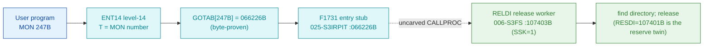

# MON 247B (octal) - ReleaseDir (RELDI)

Releases a directory that was reserved with ReserveDir (MON 246B).

**Status:** GOTAB dispatch head byte-proven (`GOTAB[247B] = 066226B`), pointing at
the 4-word entry stub `F1731` in `025-S3IRPIT`; the `RELDI` worker body is real
SINTRAN L bytes in the file-system segment `006-S3FS` (a `FILSYS-SYMBOLS` symbol).
`RELDI=107403B` is the release entry of a **shared reserve/release body** whose
reserve entry is `RESDI=107401B` (MON 246B); the `SSK` skip flag selects which. The
stub sits inside a shared stub block and does not itself reach `RELDI`; the exact
`MON 247 -> worker` link crosses an uncarved kernel bridge (see
[Honest caveats](#honest-caveats)). All addresses/values are **octal**.

- **Full disassembly:** [`247B-ReleaseDir.ASM`](247B-ReleaseDir.ASM) - the actual code, both regions (F1731 entry stub + the shared RESDI/RELDI worker).
- **Bytes live once in** the canonical segment layer: [`../../segments-ref/`](../../segments-ref/).

---

## Dispatch path

The dashed hop (`D -> E`) is the resident `CALLPROC`/segment-switch - it is **not
present in any carved segment**, so it is the one link that cannot be followed
statically. The stub `F1731` is a tiny 4-word compiler entry inside a shared stub
block (neighbours `MTOUS`/`F2166`); it is not a self-contained named handler and the
worker address `107403` does not occur anywhere inside `025-S3IRPIT`.

---

## Code location (dispatch path)

Every row is a real region you can open. Byte offset = `(addr - loadbase)` in octal
words x 2; for `025-S3IRPIT` (load base `32000B`) it is `(addr - 32000B) x 2`, for
`006-S3FS` (load base `26000B`) it is `(addr - 26000B) x 2`.

| Role | Segment (full disasm) | Addr range (octal) | Byte offset | Symbol | Verdict |
|------|------------------------|--------------------|-------------|--------|---------|
| GOTAB[247] dispatch word | [commoncode.asm](../../segments-ref/SINTRAN-DATA_commoncode/SINTRAN-DATA_commoncode.asm) - [.hex](../../segments-ref/SINTRAN-DATA_commoncode/SINTRAN-DATA_commoncode.hex) | `071502B` (1 word) | 59012 | `GOTAB+247` = `066226B` | **VERIFIED** |
| F1731 entry stub | [025-S3IRPIT.asm](../../segments-ref/025-S3IRPIT/025-S3IRPIT.asm) - [.hex](../../segments-ref/025-S3IRPIT/025-S3IRPIT.hex) | `066226B-066231B` (4 words) | 28972 | `F1731` | **VERIFIED** (GOTAB target); shared stub block |
| resident CALLPROC bridge | - (uncarved) | - | - | `CALLPROC` | **UNVERIFIED** |
| RESDI/RELDI shared worker body | [006-S3FS.asm](../../segments-ref/006-S3FS/006-S3FS.asm) - [.hex](../../segments-ref/006-S3FS/006-S3FS.hex) | `107401B-107426B` (code) + `107427B` (pad) + `107430B-107433B` (link cells) | 50694 | `RELDI`=107403B (SSK=1) / `RESDI`=107401B (SSK=0) | real bytes = **CODE**; body link **MISATTRIBUTED** |

The worker window is bounded strictly by the next symbol `500RD=107434B` (27 words).
Words `107401B-107426B` are code, `107427B` is a `ROP NOOP` pad, and
`107430B-107433B` are the `JPL I`/`JMP I` link-cell table (**data**).

**Verify by hand:** the GOTAB word:
`grep '^71502 ' ../../segments-ref/SINTRAN-DATA_commoncode/SINTRAN-DATA_commoncode.hex`
-> `71502  066226  154 226  59012`; then
`dd if=../../../resident/SINTRAN-DATA_commoncode.bin bs=1 skip=59012 count=2 2>/dev/null | od -An -tx1`
-> `6c 96` (word = `066226B`). The stub head:
`dd if=../../../segments/025-S3IRPIT.bin bs=1 skip=28972 count=2 2>/dev/null | od -An -tx1`
-> `c6 35` (= octal `143065`, `SKP IF DA LST ST`, matching the disassembly). The
RELDI worker entry: `grep '^107403 ' ../../segments-ref/006-S3FS/006-S3FS.hex` ->
byte offset `50694`; then
`dd if=../../../segments/006-S3FS.bin bs=1 skip=50694 count=2 2>/dev/null | od -An -tx1`
-> `f8 90` (= octal `174220`, `BSET ONE SSK`, the RELDI release entry).
`prove-mon.py 247` reads the same GOTAB value.

---

## Instruction walkthrough

Full listing: [`247B-ReleaseDir.ASM`](247B-ReleaseDir.ASM). Two regions.

**Region A - F1731 stub (`066226-066231`)** is the 4-word GOTAB target in
`025-S3IRPIT`. It sits inside a shared stub block and its head (`SKP IF DA LST ST` /
`JMP 2` / `STA ,B 21` / `LDT ,B 22`) is not a self-contained per-call handler; the
real transfer to the worker is the resident `CALLPROC`, which a static decode cannot
follow.

**Region B - RESDI/RELDI worker (`107401-107433`)** is the shared body.
`107401 BSET ZRO SSK` is the reserve entry (RESDI, MON 246B); `107403 BSET ONE SSK`
is the release entry (RELDI, this call). Both join at `107404 STD I 23`;
`107410 JPL I 20 -> [107430]` finds the directory; `107411-107412` walk into the
directory datafield; `107413 BSKP ONE SSK` selects the release resident worker
(`107415 JPL I 14 -> [107431]`, taken for this call). The tail
`107422 MIN ,B 4` / `107423 SAA -6` / `107424 JMP I 7 -> [107433]` returns.

---

## Parameter / register contract

Manual-side names/types are from [`247B_ReleaseDir.yaml`](../../../../../../../Developer/MON/calls/247B_ReleaseDir.yaml).

| Reg / field | Dir | Meaning | Verdict |
|-------------|-----|---------|---------|
| `T` (DirectoryIndex) | in | directory index, from `@LIST-DIRECTORIES` (`MAC` `LDT DIRIX`) | inferred (manual) |
| `SSK` flag | internal | release (SSK=1, RELDI, this call) vs reserve (SSK=0, RESDI) selector (`BSET ONE SSK`, `BSKP ONE SSK`) | VERIFIED (bytes) |
| `B+5` / `X+31` | internal | directory datafield + reservation-word offset (`LDX ,B 5` / `LDX ,X 31`) | VERIFIED (bytes); meaning inferred |
| error return | out | standard error code in `A` (`107423 SAA -6`) | VERIFIED (bytes); code value inferred |

---

## Pseudo-code (for an emulator)

See **[`247B-ReleaseDir.pseudo.c`](247B-ReleaseDir.pseudo.c)** - a pseudo-C model for
emulator authors. The control flow (the SSK reserve/release discriminator taking the
release branch, the find-directory prologue and the datafield walk) is byte-verified;
the directory-index register meaning is inferred from the manual.

Every instruction in the pseudo-code is translated against the canonical
[ND-100 instruction semantics reference](../../instruction-semantics/ND100-INSTRUCTION-SEMANTICS.md)
(`BSET ZRO/ONE SSK` skip-flag set/clear, `RADD CLD` copy idiom, `BSKP ONE SSK` skip,
`LDX ,B`/`LDX ,X` indexed loads, `MIN ,B` increment and skip, `JPL I`/`JMP I`
indirect call/return).

---

## Honest caveats

**What is byte-proven:** `GOTAB[247B] = 066226B` (`prove-mon.py 247` reads commoncode
file byte `0xe684 = 6c 96`); that value read as a `025-S3IRPIT` address is the
`F1731` stub, whose bytes decode cleanly (`143065B = SKP IF DA LST ST`). The
`RELDI`/`RESDI` shared worker at `107401B` in `006-S3FS` is real code (first word
`174020B = BSET ZRO SSK`) and it is a reserve/release directory routine consistent
with ReleaseDir.

**What is NOT proven:** the `F1731` stub is only 4 words and lands inside a shared
stub block, not a dedicated per-call handler; it branches within its own head and the
actual transfer to `RELDI` is the resident `CALLPROC` in an **uncarved overlay**. So
the `MON 247 -> RELDI` attribution rests on the `RELDI` symbol name (RELease
DIrectory) + the matching behaviour + the `RESDI` reserve twin, not a followed
pointer - hence **MISATTRIBUTED** in the strict sense. The worker's `JPL I`/`JMP I`
link cells (`107430..107433`) are a pointer table whose runtime targets are not
resolved here. Confirming the dispatch link needs a live trace: issue a real
`MON 247`, single-step through the stub and the resident `CALLPROC`, and confirm P
lands on `RELDI = 107403` with `SSK = 1`.

Method: [../../../../../EXTRACTING-RESIDENT-CODE.md](../../../../../EXTRACTING-RESIDENT-CODE.md) - dispatch reality:
[../../TASK-05-mismatches.md](../../TASK-05-mismatches.md) - master map: [../../MON-CALL-INDEX.md](../../MON-CALL-INDEX.md).
