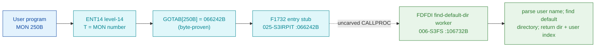

# MON 250B (octal) - GetDefaultDir (FDFDI)

Gets the user's default directory: the directory index and the user index are
returned for the named user (the name may identify a remote user). All users, all
programs, ND-100 and ND-500.

**Status:** GOTAB dispatch head byte-proven (`GOTAB[250B] = 066242B`), pointing at
the 4-word entry stub `F1732` in `025-S3IRPIT`; the `FDFDI` worker body is real
SINTRAN L bytes in the file-system segment `006-S3FS` (a `FILSYS-SYMBOLS` symbol).
The worker is real executable code with a two-entry SSK idiom (`FDFDI`/`FDINA`), a
name-parse, a named-vs-current-user branch and the return of the directory/user
indexes (it closes at `107057B`, bounded by the next symbol `WDIEN=107106B`). The
stub sits inside a shared stub block and does not itself reach `FDFDI`; the exact
`MON 250 -> worker` link crosses an uncarved kernel bridge (see
[Honest caveats](#honest-caveats)). All addresses/values are **octal**.

- **Full disassembly:** [`250B-GetDefaultDir.ASM`](250B-GetDefaultDir.ASM) - the actual code, both regions (F1732 entry stub + FDFDI worker with its link cells).
- **Bytes live once in** the canonical segment layer: [`../../segments-ref/`](../../segments-ref/).

---

## Dispatch path

The dashed hop (`D -> E`) is the resident `CALLPROC`/segment-switch - it is **not
present in any carved segment**, so it is the one link that cannot be followed
statically. The stub `F1732` is a tiny 4-word compiler entry inside a shared stub
block (the following `F1734=066246B` is the MON 254B GetErrorDevice stub); it is not
a self-contained named handler and the worker address `106732` does not occur
anywhere inside `025-S3IRPIT`.

---

## Code location (dispatch path)

Every row is a real region you can open. Byte offset = `(addr - loadbase)` in octal
words x 2; for `025-S3IRPIT` (load base `32000B`) it is `(addr - 32000B) x 2`, for
`006-S3FS` (load base `26000B`) it is `(addr - 26000B) x 2`.

| Role | Segment (full disasm) | Addr range (octal) | Byte offset | Symbol | Verdict |
|------|------------------------|--------------------|-------------|--------|---------|
| GOTAB[250] dispatch word | [commoncode.asm](../../segments-ref/SINTRAN-DATA_commoncode/SINTRAN-DATA_commoncode.asm) - [.hex](../../segments-ref/SINTRAN-DATA_commoncode/SINTRAN-DATA_commoncode.hex) | `071503B` (1 word) | 59014 | `GOTAB+250` = `066242B` | **VERIFIED** |
| F1732 entry stub | [025-S3IRPIT.asm](../../segments-ref/025-S3IRPIT/025-S3IRPIT.asm) - [.hex](../../segments-ref/025-S3IRPIT/025-S3IRPIT.hex) | `066242B-066245B` (4 words) | 28996 | `F1732` | **VERIFIED** (GOTAB target); shared stub block |
| resident CALLPROC bridge | - (uncarved) | - | - | `CALLPROC` | **UNVERIFIED** |
| FDFDI worker body | [006-S3FS.asm](../../segments-ref/006-S3FS/006-S3FS.asm) - [.hex](../../segments-ref/006-S3FS/006-S3FS.hex) | `106732B-107057B` (code) + `107060B` (pad) + `107061B-107105B` (link cells) | 50100 | `FDFDI` (SSK=1) / `FDINA`=106734B (SSK=0) | real bytes = **CODE**; body link **MISATTRIBUTED** |

The worker window is bounded strictly by the next symbol `WDIEN=107106B` (108 words).
Words `106732B-107057B` are code, `107060B` is a `ROP NOOP` pad, and
`107061B-107105B` are the `JPL I`/`JMP I` link-cell table (**data**).

**Verify by hand:** the GOTAB word:
`grep '^71503 ' ../../segments-ref/SINTRAN-DATA_commoncode/SINTRAN-DATA_commoncode.hex`
-> `71503  066242  154 242  59014`; then
`dd if=../../../resident/SINTRAN-DATA_commoncode.bin bs=1 skip=59014 count=2 2>/dev/null | od -An -tx1`
-> `6c a2` (word = `066242B`). The stub head:
`dd if=../../../segments/025-S3IRPIT.bin bs=1 skip=28996 count=2 2>/dev/null | od -An -tx1`
-> `54 fe` (= octal `052376`, `LDT ,X -2`, matching the disassembly). The FDFDI
worker entry: `grep '^106732 ' ../../segments-ref/006-S3FS/006-S3FS.hex` -> byte
offset `50100`; then
`dd if=../../../segments/006-S3FS.bin bs=1 skip=50100 count=2 2>/dev/null | od -An -tx1`
-> `f8 90` (= octal `174220`, `BSET ONE SSK`, the FDFDI entry). `prove-mon.py 250`
reads the same GOTAB value.

---

## Instruction walkthrough

Full listing: [`250B-GetDefaultDir.ASM`](250B-GetDefaultDir.ASM). Two regions.

**Region A - F1732 stub (`066242-066245`)** is the 4-word GOTAB target in
`025-S3IRPIT`. It sits inside a shared stub block (the following `F1734` is the
MON 254B stub) and its head (`LDT ,X -2` / `SKP IF DA GRE ST` / `JMP 5` / `LDA ,B 22`)
is not a self-contained per-call handler; the real transfer to the worker is the
resident `CALLPROC`, which a static decode cannot follow.

**Region B - FDFDI worker (`106732-107105`)** is the functional body.
`106732 BSET ONE SSK` is the FDFDI entry; the sibling `106734 BSET ZRO SSK` is FDINA;
both join at `106735 STD I 123`. `106741 JPL I 120 -> [107061]` is the prologue.
`106742-106747` set a decode-name flag from `SSK`; `106755 JPL I 106 -> [107063]`
parses the user name. `106764-106765 JAF` branches to the named-user path
(`106766-107005`) or the current-user path (`107006-107025`). The directory index
and user index are stored with `STT ,B 1` / `STA ,B 2` (107034-107035); the tails
converge on `107037 SAA -75` / `107040 JMP I 44 -> [107104]`.

---

## Parameter / register contract

Manual-side names/types are from [`250B_GetDefaultDir.yaml`](../../../../../../../Developer/MON/calls/250B_GetDefaultDir.yaml).

| Reg / field | Dir | Meaning | Verdict |
|-------------|-----|---------|---------|
| `X` (UserName) | in | address of a string holding the user name (16 chars; may identify a remote user) (`MAC` `LDX (USER`) | inferred (manual) |
| `T` (DirectoryIndex) | out | directory index (`MAC` `STT DIRIX`) | inferred (manual) |
| `X` (UserIndex) | out | user index in the default directory (`MAC` `STX USRIX`) | inferred (manual) |
| `B+74` | internal | decode-name flag set from the SSK entry (`STA ,B 74` / `STZ ,B 74`, `LDA ,B 74` / `JAF`) | VERIFIED (bytes); meaning inferred |
| error return | out | standard error code in `A` (`107037 SAA -75`) | VERIFIED (bytes); code value inferred |

---

## Pseudo-code (for an emulator)

See **[`250B-GetDefaultDir.pseudo.c`](250B-GetDefaultDir.pseudo.c)** - a pseudo-C
model for emulator authors. The control flow (the SSK two-entry idiom, the
name-parse, the named-vs-current-user branch and the index returns) is byte-verified;
the register/field semantics are inferred from the manual and the code shape.

Every instruction in the pseudo-code is translated against the canonical
[ND-100 instruction semantics reference](../../instruction-semantics/ND100-INSTRUCTION-SEMANTICS.md)
(`BSET ZRO/ONE SSK` skip-flag set/clear, `RADD CLD` copy idiom, `RADD SB DA/DX`
register add, `JAF` flag branch, `SKP IF DA EQL SX` compare, `STT`/`STX ,B` frame
stores, `MIN ,B` increment and skip, `JPL I`/`JMP I` indirect call/return).

---

## Honest caveats

**What is byte-proven:** `GOTAB[250B] = 066242B` (`prove-mon.py 250` reads commoncode
file byte `0xe686 = 6c a2`); that value read as a `025-S3IRPIT` address is the
`F1732` stub, whose bytes decode cleanly (`052376B = LDT ,X -2`). The `FDFDI` worker
at `106732B` in `006-S3FS` is real code (first word `174220B = BSET ONE SSK`) and it
is a find-default-directory routine (name-parse, named-vs-current-user branch, dir +
user index return), consistent with GetDefaultDir.

**What is NOT proven:** the `F1732` stub is only 4 words and lands inside a shared
stub block, not a dedicated per-call handler; it branches within its own head and the
actual transfer to `FDFDI` is the resident `CALLPROC` in an **uncarved overlay**. So
the `MON 250 -> FDFDI` attribution rests on the `FDFDI` symbol name (Find DeFault
DIrectory) + the matching behaviour, not a followed pointer - hence **MISATTRIBUTED**
in the strict sense. The worker's `JPL I`/`JMP I` link cells (`107061..107105`) are a
pointer table whose runtime targets are not resolved here. Confirming the dispatch
link needs a live trace: issue a real `MON 250`, single-step through the stub and the
resident `CALLPROC`, and confirm P lands on `FDFDI = 106732`.

Method: [../../../../../EXTRACTING-RESIDENT-CODE.md](../../../../../EXTRACTING-RESIDENT-CODE.md) - dispatch reality:
[../../TASK-05-mismatches.md](../../TASK-05-mismatches.md) - master map: [../../MON-CALL-INDEX.md](../../MON-CALL-INDEX.md).
