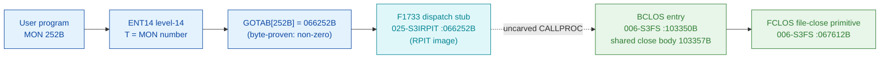

# MON 252B (octal) - BackupClose (BCLOS)

Closes a file, but - unlike ordinary [CloseFile (43B)](../43B-CloseFile/README.md) -
leaves the version number and the last-accessed date unchanged, and does not affect
the page count of temporary or spooling files. Mainly used by the BACKUP-SYSTEM.

**Status:** GOTAB dispatch head byte-proven **non-zero** (`GOTAB[252B] = 066252B`),
landing on the resident `F1733` dispatch-stub cluster in the `025-S3IRPIT` RPIT
image; the functional worker `BCLOS` (real SINTRAN L bytes in `006-S3FS`) is one
entry of a shared close dispatcher that calls the file-close primitive `FCLOS` -
the same primitive `CLOSF` (MON 43B) calls. The stub holds no static pointer to
`BCLOS`, so the stub -> worker hop crosses an uncarved kernel bridge - hence
**MISATTRIBUTED** (see [Honest caveats](#honest-caveats)). All addresses/values are **octal**.

- **Full disassembly:** [`252B-BackupClose.ASM`](252B-BackupClose.ASM) - the F1733 GOTAB stub fragment + the BCLOS shared-close worker body.
- **Bytes live once in** the canonical segment layer: [`../../segments-ref/`](../../segments-ref/).

---

## Dispatch path

`GOTAB[252B]` is **non-zero**: it points at symbol `F1733` in the resident RPIT
image `025-S3IRPIT`, part of the same `F17xx` GOTAB-stub cluster used by
[MON 236B](../236B-SetPermanentOpen/README.md) (`F1725`) and
[MON 254B](../254B-GetErrorDevice/README.md) (`F1734`). The stub is real resident
code but a fragment (it continues past the next symbol `F1735=066256B`); it does not
statically reference `BCLOS`, so the dashed `D -> E` hop is the uncarved resident
`CALLPROC` bridge.

---

## Code location (dispatch path)

Every row is a real region you can open. Byte offset is the segment `.hex` byte offset.

| Role | Segment (full disasm) | Addr range (octal) | Byte offset | Symbol | Verdict |
|------|------------------------|--------------------|-------------|--------|---------|
| GOTAB[252] dispatch word | [commoncode.asm](../../segments-ref/SINTRAN-DATA_commoncode/SINTRAN-DATA_commoncode.asm) - [.hex](../../segments-ref/SINTRAN-DATA_commoncode/SINTRAN-DATA_commoncode.hex) | `071505B` (1 word) | 59018 | `GOTAB+252` = `066252` | **VERIFIED** (non-zero) |
| F1733 dispatch stub (fragment) | [025-S3IRPIT.asm](../../segments-ref/025-S3IRPIT/025-S3IRPIT.asm) - [.hex](../../segments-ref/025-S3IRPIT/025-S3IRPIT.hex) | `066252B-066255B` (4w, to `F1735`) | 29012 | `F1733` | real bytes; link **UNVERIFIED** |
| resident CALLPROC bridge | - (uncarved) | - | - | `CALLPROC` | **UNVERIFIED** |
| BCLOS entry + shared close body | [006-S3FS.asm](../../segments-ref/006-S3FS/006-S3FS.asm) - [.hex](../../segments-ref/006-S3FS/006-S3FS.hex) | `103350B-103416B` (47w) | 46544 | `BCLOS` | real bytes; link **MISATTRIBUTED** |
| FCLOS file-close primitive | [006-S3FS.asm](../../segments-ref/006-S3FS/006-S3FS.asm) - [.hex](../../segments-ref/006-S3FS/006-S3FS.hex) | `067612B` (call target) | - | `FCLOS` | called by CLOFI arm (link cell `103415`) - **VERIFIED** |

**Verify by hand:** `grep '^103350 ' ../../segments-ref/006-S3FS/006-S3FS.hex` -> byte offset `46544`;
then `dd if=../../../segments/006-S3FS.bin bs=1 skip=46544 count=8 | od -An -tx1` -> `f8 38 f8 90 a8 05 f8 b8`
(= octal `174070 174220 124005 174270` = `BSET ZRO SSM` / `BSET ONE SSK` / `JMP 5` / `BSET ONE SSM` (SPERM), the BCLOS entry cluster).

The GOTAB slot itself:
`dd if=../../../resident/SINTRAN-DATA_commoncode.bin bs=1 skip=59018 count=2 | od -An -tx1` -> `6c aa` (= `066252`, the F1733 stub address).

The stub bytes:
`grep '^66252 ' ../../segments-ref/025-S3IRPIT/025-S3IRPIT.hex` -> byte offset `29012`;
then `dd if=../../../segments/025-S3IRPIT.bin bs=1 skip=29012 count=8 | od -An -tx1` -> `0c fe 49 12 0c ff 4c fc`.

---

## Instruction walkthrough

Full listing: [`252B-BackupClose.ASM`](252B-BackupClose.ASM).

**F1733 stub fragment (`066252-066255`)** - `STA ,X -2` / `LDA ,B 22` / `STA ,X -1`
/ `LDA ,X -4`, real bytes in the RPIT image; a fragment of resident dispatch code
that continues past the next symbol `F1735=066256B` (uncarved). It does not
statically reference `BCLOS`.

**Mode-select entry (`103350-103356`)** - `BCLOS` clears `SSM` (STS bit7 M) and sets
`SSK` (STS bit2 K), then `103352 JMP 5` merges into the shared close body at
`103357`. The cluster siblings are `SPERM` (`103353`, sets `SSM` - permanent-close
variant) and `CLOFI` (`103355`, clears both - plain close).

**Prologue (`103357-103364`)** - `103357 STD I 31` stashes the caller's double-word
(file number + modified flag); `103362 SAB 6` builds a small 6-word local frame;
`103363 JPL I 26` -> `003752` prologue; `103364 STT I 26` records the file number.

**Mode dispatch (`103365-103402`)** - `103365 BSKP ONE SSM` selects the permanent
path (`103370 JPL I 23` -> `072465 = SETPO`, the MON 236B worker); `103373 BSKP ONE
SSK` selects the BackupClose path (`103375 LDA ,B 2` reads the modified flag, then
`103376 JPL I 16` -> `067602` closes without touching the version/date); the
neither-flag CLOFI path calls the plain file-close primitive `103401 JPL I 14` ->
`067612 = FCLOS`. The call to `FCLOS` - the same primitive `CLOSF` (MON 43B) reaches
- is the byte-level proof that `BCLOS` is a close-family worker.

**Finish (`103403-103416`)** - `103403 MIN ,B 4` bumps the success flag;
`103405 JMP I 11` -> `103416 = 003776` is the resident return. The error path
`103406 STA ,B 2` stores the status word into caller slot `B+2` and falls to the
teardown without the bump. Words `103410-103416` are a pointer table (link cells:
`003752`, `072465`, `067602`, `067612`, `003776`).

---

## Parameter / register contract

| Reg / field | Dir | Meaning | Verdict |
|-------------|-----|---------|---------|
| GOTAB[252] | in | `066252B` = F1733 dispatch stub (non-zero vector) | VERIFIED (bytes) |
| worker entry | in | `103350B` = BCLOS entry (clears `SSM`, sets `SSK`) | VERIFIED (bytes) |
| `T` (manual) | in | file number returned from an earlier open | inferred (manual MAC example) |
| `A` (manual) | in | modified flag (0 = not marked modified) | inferred (manual MAC example) |
| frame `B+2` | in | modified flag, loaded by `LDA ,B 2` at `103375` | VERIFIED (bytes); role inferred |
| local frame `B` | internal | `SAB 6` = 6-word working frame | VERIFIED (bytes) |
| FCLOS `067612` | out | file-close primitive (`JPL I 14` at `103401`) | VERIFIED (bytes) |
| `B+2` | out | returned status word (`STA ,B 2` at `103406`) | VERIFIED (bytes) |

The user-visible `T` = file-number, `A` = flag convention lives in the caller-side
`MON 252` wrapper; the manual shows `LDT FILNO` / `LDA FLAG` / `MON 252`, matching
the worker's `STT I 26` and `LDA ,B 2`. The two-parameter contract is from the
[`252B_BACKUPCLOSE.yaml`](../../../../../../../Developer/MON/calls/252B_BACKUPCLOSE.yaml) parameter contract.

---

## Pseudo-code (for an emulator)

See **[`252B-BackupClose.pseudo.c`](252B-BackupClose.pseudo.c)** - a pseudo-C model
of the handler for emulator authors. The mode-select entry, control flow, and the
three-way close dispatch (SETPO / backup-with-flag / FCLOS) are byte-verified; the
modified-flag role and the skip-return polarity are inferred.

Every instruction in the model is translated per the canonical
[`ND100-INSTRUCTION-SEMANTICS.md`](../../instruction-semantics/ND100-INSTRUCTION-SEMANTICS.md)
(`BSET/BSKP` on STS bits `M`/`K`; `STD I`/`STT I` indirect stores; `RADD CLD`
register copy; `MIN ,B 4` success bump).

---

## Honest caveats

**What is byte-proven:** `GOTAB[252B] = 066252B` (level-14 dispatch, a non-zero
vector into the `025-S3IRPIT` RPIT image - matching the `F17xx` stub cluster); the
`BCLOS` entry at `103350B` in `006-S3FS` is real code (entry cluster bytes
`174070 174220 124005 174270` match the disassembly); it joins the shared close body
at `103357B` which calls the file-close primitive `FCLOS` (`067612B`, link cell
`103415`) - the same primitive the ordinary CloseFile worker uses.

**What is NOT proven:** the `F1733` stub does not contain a static pointer to
`BCLOS`; the stub is a fragment of resident dispatch code in the relocated RPIT
image whose control flow continues past `F1735` into uncarved resident code. So the
`stub -> BCLOS` link goes through the resident `CALLPROC` bridge (uncarved) - the
`MON 252 -> BCLOS` attribution rests on the `BCLOS` symbol name, its `FCLOS` call,
and the matching file-number+flag contract, not a followed pointer - hence
**MISATTRIBUTED** in the strict sense. Confirming the link needs a live trace:
issue a real `MON 252` on an open file, single-step the level-14 dispatch through
`F1733` and the resident `CALLPROC`, and confirm P lands on `BCLOS = 103350`.

**Shared close body:** `BCLOS` (BackupClose), `SPERM` (permanent-close) and `CLOFI`
(plain close) all enter the same body at `103357B`, differing only in the two STS
flags; the flags steer the dispatch to `SETPO` (`072465`), the backup-with-flag
close (`067602`), or `FCLOS` (`067612`) respectively.

**Region bound:** the shared body is bounded to the next symbol `SETUP = 103417B`;
its control flow closes on the `003776` resident-return link cell at `103416`.

Method: [../../../../../EXTRACTING-RESIDENT-CODE.md](../../../../../EXTRACTING-RESIDENT-CODE.md) - dispatch reality:
[../../TASK-05-mismatches.md](../../TASK-05-mismatches.md) - master map: [../../MON-CALL-INDEX.md](../../MON-CALL-INDEX.md).
