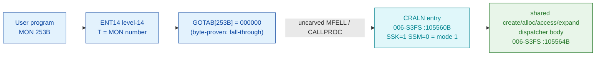

# MON 253B (octal) - NewFileVersion (CRALN)

Creates a new version of an existing file (indexed, contiguous, or allocated). You
must have directory access to the user area. The version number follows the
semicolon in the file name (e.g. `TEST:SYMB;4`). The file must already exist.

**Status:** GOTAB dispatch head byte-proven as **fall-through** (`GOTAB[253B] =
000000`, no per-call stub); the `CRALN` worker is real SINTRAN L bytes - the
**MODE-1 entry** of the same shared create/allocate/access/expand dispatcher used
by [SetFileAccess (237B)](../237B-SetFileAccess/README.md), whose body lives at
`105564B`. The exact `MON 253 -> worker` link crosses an uncarved kernel bridge
(see [Honest caveats](#honest-caveats)). All addresses/values are **octal**.

- **Full disassembly:** [`253B-NewFileVersion.ASM`](253B-NewFileVersion.ASM) - the CRALN mode-select entry + the shared dispatcher body.
- **Bytes live once in** the canonical segment layer: [`../../segments-ref/`](../../segments-ref/).

---

## Dispatch path

The GOTAB slot is zero, so there is **no per-call entry stub**. The dashed hop
(`C -> D`) is the resident `MFELL`/`CALLPROC` fall-through second-level dispatch -
not present in any carved segment. `CRALN` is the mode-1 arm of a shared body it
enters by setting the `SSK` STS flag (and clearing `SSM`).

---

## Code location (dispatch path)

Every row is a real region you can open. Byte offset is the `006-S3FS.hex` byte offset.

| Role | Segment (full disasm) | Addr range (octal) | Byte offset | Symbol | Verdict |
|------|------------------------|--------------------|-------------|--------|---------|
| GOTAB[253] dispatch word | [commoncode.asm](../../segments-ref/SINTRAN-DATA_commoncode/SINTRAN-DATA_commoncode.asm) - [.hex](../../segments-ref/SINTRAN-DATA_commoncode/SINTRAN-DATA_commoncode.hex) | `071506B` (1 word) | 59020 | `GOTAB+253` = `000000` | **VERIFIED** (fall-through) |
| resident MFELL/CALLPROC bridge | - (uncarved) | - | - | `CALLPROC` | **UNVERIFIED** |
| CRALN mode-1 entry | [006-S3FS.asm](../../segments-ref/006-S3FS/006-S3FS.asm) - [.hex](../../segments-ref/006-S3FS/006-S3FS.hex) | `105560B-105563B` (merge) | 48864 | `CRALN` | real bytes; link **MISATTRIBUTED** |
| shared dispatcher body | [006-S3FS.asm](../../segments-ref/006-S3FS/006-S3FS.asm) - [.hex](../../segments-ref/006-S3FS/006-S3FS.hex) | `105564B-106042B` (175w) | 48872 | (shared) | real bytes - **VERIFIED** |

**Verify by hand:** `grep '^105560 ' ../../segments-ref/006-S3FS/006-S3FS.hex` -> byte offset `48864`;
then `dd if=../../../segments/006-S3FS.bin bs=1 skip=48864 count=4 | od -An -tx1` -> `f8 90 a8 02`
(= octal `174220 124002` = `BSET ONE SSK` / `JMP 2`, the CRALN mode-1 entry; the `JMP 2`
lands on `105563 BSET ZRO SSM` which completes mode 1 before the shared body).

The GOTAB slot itself:
`dd if=../../../resident/SINTRAN-DATA_commoncode.bin bs=1 skip=59020 count=2 | od -An -tx1` -> `00 00` (= `000000`, fall-through).

---

## Instruction walkthrough

Full listing: [`253B-NewFileVersion.ASM`](253B-NewFileVersion.ASM). There is no
F16xx/F17xx stub because `GOTAB[253] = 0`.

**Mode-select entry (`105560-105563`)** - `CRALN` sets `SSK` (STS bit2 K) to 1,
then `105561 JMP 2` -> `105563 BSET ZRO SSM` clears `SSM` (STS bit7 M), giving
`MODE = (M<<1)|K = 1`, before falling into the shared body at `105564`. Its cluster
siblings are `SFACC` (mode 3, SetFileAccess/237B), `EXPFI` (mode 2, ExpandFile/231B)
and `CRALF` (mode 0).

**Prologue + mode rebuild (`105564-105574`)** - `105564 STD I 77` stashes the
caller's parameter double-word; `105567 SAB 145` builds the 145-word frame;
`105570 JPL I 74` -> `003752` prologue. `105571-105574` rebuild the two STS flags
into the 2-bit mode word `(M<<1)|K` and store it at `B+123` (mode 1 for CRALN).

**Parameter marshalling (`105575-105621`)** - the caller's file-name pointer and
the `FirstPage` / `NoOfPages` double-words are copied / address-adjusted into the
local frame; `105625 JPL I 51` -> `031075` parses the file name (including the
`;version` suffix).

**Mode dispatch (`105627-105657`)** - `105627 LDA ,B 123` / `105630 SAT 3` /
`105631 SKP IF DA LST ST`: because CRALN's mode is 1 (`< 3`), control takes the
create / allocate arm at `105641+`, which walks the file-name / page arguments
through a series of `JPL I` primitive calls to allocate and register the new
version.

**Finish (`105777-106042`)** - `105777 MIN ,B 4` bumps the success flag; the
epilogue restores caller words and returns through `106007 JMP I 33` ->
`106042 = 003776`. Error paths funnel through `106010 STA ,B 2` (status -> caller
`B+2`) into the same teardown without the bump.

---

## Parameter / register contract

| Reg / field | Dir | Meaning | Verdict |
|-------------|-----|---------|---------|
| entry point | in | `105560B` = CRALN mode-1 entry (fall-through, no stub) | VERIFIED (bytes) |
| STS `K` (`SSK`) | internal | set by CRALN to select mode 1 (`BSET ONE SSK`) | VERIFIED (bytes) |
| `X` (manual) | in | address of the file-name string (with `;version`) | inferred (manual MAC example) |
| `D` (manual) | in | `FirstPage` (start address of first new version; 0 for indexed/contiguous) | inferred (manual MAC example) |
| `T` (manual) | in | address of `NoOfPages` (file size in pages; 0 for indexed) | inferred (manual MAC example) |
| local frame `B` | internal | `SAB 145` = 145-word working frame | VERIFIED (bytes) |
| `B+123` | internal | 2-bit MODE word `(M<<1)|K = 1` (`STA ,B 123` at `105574`) | VERIFIED (bytes) |
| `B+2`/`B+3` | internal | FirstPage / NoOfPages working slots | VERIFIED (bytes); role inferred |
| `B+2` | out | returned status word (`STA ,B 2` at `106010`) | VERIFIED (bytes) |

The user-visible `X`/`D`/`T` convention lives in the caller-side `MON 253` wrapper
and the uncarved `MFELL`/`CALLPROC` frame, so the precise register-to-argument
assignment is **inferred** from the manual
([`253B_NewFileVersion.yaml`](../../../../../../../Developer/MON/calls/253B_NewFileVersion.yaml)),
not byte-proven here.

---

## Pseudo-code (for an emulator)

See **[`253B-NewFileVersion.pseudo.c`](253B-NewFileVersion.pseudo.c)** - a pseudo-C
model of the handler for emulator authors. The mode-select entry, the STS-flag mode
rebuild, control flow, and the mode-`<3` dispatch are byte-verified; the
FirstPage/NoOfPages roles and the identity of the per-mode primitives are inferred.

Every instruction in the model is translated per the canonical
[`ND100-INSTRUCTION-SEMANTICS.md`](../../instruction-semantics/ND100-INSTRUCTION-SEMANTICS.md)
(`BSET/BSKP` on STS bits `M`/`K`; `SHA LIN` M-bit fill (emulator-authoritative);
`BSET BAC 0 DA` = bit0 from `K` (emulator-authoritative); `SKP IF DA LST ST` signed
less-than; `MIN ,B 4` success bump).

---

## Honest caveats

**What is byte-proven:** `GOTAB[253B] = 000000` (level-14 dispatch, a fall-through
with no per-call vector); the `CRALN` entry at `105560B` in `006-S3FS` is real code
(entry bytes `174220 124002` match the disassembly); it sets `K`=1 / `M`=0 and joins
the shared body at `105564B`, which rebuilds those flags into the 2-bit mode word
`(M<<1)|K = 1` and dispatches into the create/allocate arm.

**What is NOT proven:** the link from the zero GOTAB slot to the `CRALN` entry.
Because the vector is zero there is no stub to disassemble and no pointer to
dereference; dispatch drops into the resident `MFELL`/`CALLPROC` path in an
**uncarved overlay**. So the `MON 253 -> CRALN` attribution rests on the `CRALN`
symbol name (Create-ALlocate-New), the mode-1 flag pattern, and the matching
name+FirstPage+NoOfPages contract, not a followed pointer - hence **MISATTRIBUTED**
in the strict sense.

**Shared body:** `CRALN` (253B), `SFACC` (237B), `EXPFI` (231B) and `CRALF` all
enter the **same** dispatcher at `105564B`; the ASM and pseudo-C for 237B and 253B
therefore share the body and differ only in the entry / selected mode. The
create/allocate sub-blocks (`105700-105776`) are modelled only at the spine.

**Region bound:** the shared body is bounded to the next symbol `SETTF = 106043B`;
its control flow closes on the `003776` resident-return link cell at `106042`.
Several link-cell contents (`031067`, `031075`) match no `FILSYS-SYMBOLS` entry.

Method: [../../../../../EXTRACTING-RESIDENT-CODE.md](../../../../../EXTRACTING-RESIDENT-CODE.md) - dispatch reality:
[../../TASK-05-mismatches.md](../../TASK-05-mismatches.md) - master map: [../../MON-CALL-INDEX.md](../../MON-CALL-INDEX.md).
