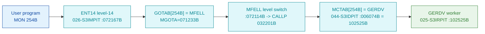

# MON 254B (octal) - GetErrorDevice (GERDV)

Gets the logical device number of the **error device** - the terminal that outputs system errors
and RT program messages (normally the console). If the error device is reserved by an RT program,
the call also returns the address of that program's RT description (0 = unreserved). Available on
the ND-100 and ND-500. The worker is **GERDV = 102525B** in segment `025-S3IRPIT`.

**Status:** **byte-verified** (dispatch + worker body). All addresses/values are **octal**.

> **CORRECTED 2026-07-13.** The previous version of this folder said the worker was
> `misattributed`: it read a "GOTAB" out of `SINTRAN-DATA_commoncode`, got `GOTAB[254B]=066246B`
> vectoring to an `F1734` entry stub, and could only attach `GERDV` by name across an "uncarved
> CALLPROC bridge". **That GOTAB-in-commoncode table is fiction** - its slot 0 is `000000`, not
> the real GOTAB slot-0 `MFELL=072114B`. MON calls dispatch through **`MCTAB @ 005620B`** (segment
> `044-S3IDPIT`), indexed directly by N. **`MCTAB[254B] = 102525B = GERDV`** - the SAME worker the
> old folder found by name, now proven directly from the table slot, no stub and no uncarved
> bridge. See [`../317B-ExecuteCommand/README.md`](../317B-ExecuteCommand/README.md) and
> `SINTRAN/CARVING-HANDOFF.md` section 3a.

- **Full disassembly:** [`254B-GetErrorDevice.ASM`](254B-GetErrorDevice.ASM).
- **Emulator model:** [`254B-GetErrorDevice.pseudo.c`](254B-GetErrorDevice.pseudo.c).
- **Bytes live once in** the canonical segment layer: [`../../segments-ref/`](../../segments-ref/).

---

## Dispatch path



There is **no dashed hop**. `GOTAB[254B]` is `MFELL` (as it is for 224 of the 256 calls); `MFELL`
switches program level (writes `CALLP=032201B` into the monitor level's `P`) and the monitor
level dispatches through `MCTAB`.

---

## Code location (dispatch path)

Byte offset = `(addr - loadbase)` in octal words x 2 (decimal). Offsets reproduced with `dd`.

| Role | Segment | Addr (octal) | Byte offset | Symbol | Verdict |
|------|---------|--------------|-------------|--------|---------|
| MCTAB[254B] slot | [044-S3IDPIT.asm](../../segments-ref/044-S3IDPIT/044-S3IDPIT.asm) - [.hex](../../segments-ref/044-S3IDPIT/044-S3IDPIT.hex) | `006074B` = `102525B` | 2168 | -> `GERDV` | **VERIFIED** |
| GERDV worker body | [025-S3IRPIT.asm](../../segments-ref/025-S3IRPIT/025-S3IRPIT.asm) - [.hex](../../segments-ref/025-S3IRPIT/025-S3IRPIT.hex) | `102525B-102554B` | 41642 | `GERDV` (SYMBOL-2-LIST) | **VERIFIED** |

**Verify by hand** (from `tools/sintran-segment-carver/versions/L-VSX-500/segments/`):
```
dd if=044-S3IDPIT.bin bs=1 skip=2168  count=2 | od -An -tx1   ->  85 55   (= 102525B = GERDV)
dd if=025-S3IRPIT.bin bs=1 skip=41642 count=2 | od -An -tx1   ->  ba 1a   (= 135032B, GERDV entry JPL I 32)
```
The worker block runs `102525B-102554B` (24 words), bounded by the next symbol `HIL14=102555B`.

---

## Instruction walkthrough

Full listing: [`254B-GetErrorDevice.ASM`](254B-GetErrorDevice.ASM).

**GERDV worker body (`102525B-102554B`).** It calls a resident prologue (`JPL I 32`), then enables
the interrupt-enable bits (`SAA 4` / `MST PIE`), fetches the error-device descriptor through an
indirect pointer (`LDX I 30`), stages fields (`LDA ,X 15/21`, a `RADD CLD` copy, a `SWAP SD DA`
full exchange, `STZ ,X` clears), calls shared resident workers (`JPL I 21`, `JPL I 15`,
`JPL I 13`), and stores the two outputs into the caller's `B`-frame: the logical device number
(`STA ,B 12`) and the RT description address (`STA ,B 13`). The `JPL I` link cells
(`102557/102561/102562`) lie past the carved window in the following `HIL14` region.

---

## Parameter / register contract

Manual-side names/types are from [`254B_GetErrorDevice.yaml`](../../../../../../../Developer/MON/calls/254B_GetErrorDevice.yaml).

| Reg / field | Dir | Meaning | Verdict |
|-------------|-----|---------|---------|
| `A` (ErrorDevice) | out | logical device number of the error device (`MAC` example `STA ERDEV`) | inferred (manual) |
| `D` (RTProgram) | out | RT description address of the reserving RT program; 0 = unreserved (`MAC` `COPY SD DA`) | inferred (manual) |
| `B+12` | internal/out | worker stores the device number here (`102546 STA ,B 12`) | VERIFIED (bytes); field meaning inferred |
| `B+13` | internal/out | worker stores the RT description address here (`102552 STA ,B 13`) | VERIFIED (bytes); field meaning inferred |
| error return | out | standard error code (appendix A) | inferred (manual) |

The descriptor read and the two `STA ,B` output stores are VERIFIED from bytes; the mapping onto
the user-visible `A`=ErrorDevice / `D`=RTProgram contract lives in the caller-side wrapper and is
**inferred** from the manual, not byte-proven here.

---

## Pseudo-code (for an emulator)

See **[`254B-GetErrorDevice.pseudo.c`](254B-GetErrorDevice.pseudo.c)** - the `GERDV` worker body
is byte-verified; the field semantics (which frame word is the device number vs the RT description
address) are inferred from the manual. Every instruction is translated per the canonical
[`ND100-INSTRUCTION-SEMANTICS.md`](../../instruction-semantics/ND100-INSTRUCTION-SEMANTICS.md)
(`RADD CLD` copy idiom, `MST PIE` masked-set, `SWAP SD DA` full exchange, indirect `LDX I`/`LDA I`
loads, `STZ ,X` clears, `JPL I` indirect call).

---

## Honest caveats

**What is byte-proven:** `MCTAB[254B] @006074B = 102525B = GERDV`; the `GERDV` entry bytes at
`102525B` in `025-S3IRPIT` (`135032B = JPL I 32`) match the disassembly; the 24-word block
(`102525B-102554B`, bounded by `HIL14=102555B`) has coherent descriptor staging, resident-worker
calls and two `STA ,B` output stores, exactly matching GetErrorDevice (a device number and an RT
description address).

**Which overlay and why:** `GERDV=102525B` is a `SYMBOL-2-LIST` symbol, and `025-S3IRPIT` is the
`SYMBOL-2-LIST` code overlay; it sits directly after `MSG=102453B` (the MON 32B worker) in the
same overlay. The parallel `026-S3IMPIT` overlay holds unrelated data at `102525B`.

**What is NOT proven:** the semantic label of each `B`-frame word (the ErrorDevice / RTProgram
assignment is inferred from the manual MAC example, not byte-isolated from this carve), and the
`JPL I` link cells (`102557/102561/102562`) which lie past the carved window in the following
`HIL14` region and are not resolved here.

**Correction to earlier work.** The old folder's `GOTAB[254B]=066246B -> F1734` chain was the
wrong-overlay artefact described above; `MCTAB[254B]` is the real link, byte-proven, so the
verdict is upgraded from `misattributed` to **VERIFIED**. The `F1734` bytes are real code but are
**not** on the MON 254B path.

Method: [../../../../../EXTRACTING-RESIDENT-CODE.md](../../../../../EXTRACTING-RESIDENT-CODE.md) -
master map: [../../MON-CALL-INDEX.md](../../MON-CALL-INDEX.md).
