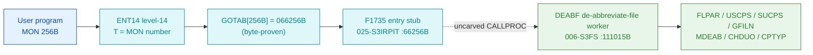

# MON 256B (octal) - FullFileName (DEABF)

Returns a complete file name from an abbreviated one - the directory, the user,
the file name, the file type, and the version are all returned. The caller passes
the abbreviated name, a receive buffer, and a default file type (ND-100 only).
The abbreviation must be unambiguous and the caller needs read access.

> The NC disassembler labels MON 256B "FNAME"; the authoritative name is
> **FullFileName**, worker mnemonic **DEABF** ("de-abbreviate file"), which
> matches the FILSYS worker symbol.

**Status:** GOTAB dispatch head byte-proven (`GOTAB[256B] = 066256B`, the `F1735`
level-14 stub in `025-S3IRPIT`); the `DEABF` worker body is real SINTRAN L bytes
and de-abbreviates the name via the file-system primitives (`FLPAR`, `USCPS`,
`SUCPS`, `GFILN`, `MDEAB`, `CHDUO`, `CPTYP`); the exact `MON 256 -> worker` link
crosses an uncarved kernel bridge (see [Honest caveats](#honest-caveats)). All
addresses/values are **octal**.

- **Full disassembly:** [`256B-FullFileName.ASM`](256B-FullFileName.ASM) - the actual code, both regions (F1735 entry stub + DEABF worker).
- **Bytes live once in** the canonical segment layer: [`../../segments-ref/`](../../segments-ref/).

---

## Dispatch path

The dashed hop (`D -> E`) is the resident `CALLPROC`/segment-switch - it is **not
present in any carved segment**, so it is the one link that cannot be followed
statically.

---

## Code location (dispatch path)

Every row is a real region you can open. The byte offset is the authoritative
decimal byte offset from the segment `.hex` (the `025-S3IRPIT` carve has an
unmapped hole before the stub, so its offset is not the plain
`(addr - loadbase) x 2`).

| Role | Segment (full disasm) | Addr range (octal) | Byte offset | Symbol | Verdict |
|------|------------------------|--------------------|-------------|--------|---------|
| GOTAB[256] dispatch word | [commoncode.asm](../../segments-ref/SINTRAN-DATA_commoncode/SINTRAN-DATA_commoncode.asm) - [.hex](../../segments-ref/SINTRAN-DATA_commoncode/SINTRAN-DATA_commoncode.hex) | `071511B` (1 word) | 59026 | `GOTAB+256` = `066256B` | **VERIFIED** |
| F1735 entry stub | [025-S3IRPIT.asm](../../segments-ref/025-S3IRPIT/025-S3IRPIT.asm) - [.hex](../../segments-ref/025-S3IRPIT/025-S3IRPIT.hex) | `66256B-66261B` (4w) | 29020 | `F1735` | **VERIFIED** |
| resident CALLPROC bridge | - (uncarved) | - | - | `CALLPROC` | **UNVERIFIED** |
| DEABF worker body | [006-S3FS.asm](../../segments-ref/006-S3FS/006-S3FS.asm) - [.hex](../../segments-ref/006-S3FS/006-S3FS.hex) | `111015B-111207B` (code to `111165B`) | 52250 | `DEABF` | real bytes; link **MISATTRIBUTED** |

**Verify by hand:** `grep '^111015 ' ../../segments-ref/006-S3FS/006-S3FS.hex` -> byte offset `52250`;
then `dd if=../../../segments/006-S3FS.bin bs=1 skip=52250 count=8 | od -An -tx1` -> `f8 10 22 68 cc 65 cc 59`
(= octal `174020 021150 146145 146131` = `BSET ZRO SSK` / `STD I 150` / `RADD CLD SL DA` / `RADD CLD SB DD`, the DEABF entry).

The GOTAB slot itself:
`dd if=../../../resident/SINTRAN-DATA_commoncode.bin bs=1 skip=59026 count=2 | od -An -tx1` -> `6c ae` (big-endian word = `066256B`).

The F1735 stub: `grep '^66256 ' ../../segments-ref/025-S3IRPIT/025-S3IRPIT.hex` -> byte offset `29020`;
then `dd if=../../../segments/025-S3IRPIT.bin bs=1 skip=29020 count=2 | od -An -tx1` -> `0c fb` (= `006373B`, the F1735 entry).

---

## Instruction walkthrough

Full listing: [`256B-FullFileName.ASM`](256B-FullFileName.ASM). Two regions:

**Region A - F1735 entry stub (`66256-66261`, `025-S3IRPIT`)** is the 4-word
level-14 entry vectored from `GOTAB[256]`, bounded strictly to the next symbol
`F1737 = 66262B`. It runs a short prologue (`66256 STA ,X -5`, `66257 ION`,
`66260 LDA ,B 20`) and ends in `66261 EXIT` (return); it does **not** itself
branch to the `DEABF` worker - that transfer is the uncarved resident `CALLPROC`
hop.

**Region B - DEABF worker (`111015-111165`, `006-S3FS`; link cells
`111166-111207`)** is the functional body. All calls to shared file-system
workers are **indirect** (`JPL I` / `JMP I`) through the pointer table at
`111166-111207`; those words are **data (link cells)**, not code, and their
resolved worker addresses are annotated in the `.ASM`.

- **Entry prologue (`111015-111022`)** - `111015 BSET ZRO SSK` clears the skip
  flag; `111016 STD I 150` stashes the caller's double-word; `111021 SAB 165`
  builds the large local frame `B`; `111022 JPL I 145` -> `003752` is the
  resident prologue worker.
- **Default-type branch (`111023-111051`)** - `111023 BSKP ONE SSK` selects
  whether a default file type was supplied. The no-default path sets the user
  context (`111034 JPL I 136` -> `USCPS`, `31075`), parses the abbreviated name
  (`111041 JPL I 133` -> `FLPAR`, `46231`), and copies the type
  (`111051 JPL I 125` -> `CPTYP`, `30205`).
- **Match / directory-user resolve (`111052-111145`)** - `111064 JPL I 114` ->
  `MDEAB` (`61044`, match-de-abbreviated); the alternate path re-parses via
  `USCPS`/`FLPAR`, then checks the directory-user with
  `111133 JPL I 51` -> `CHDUO` (`101303`) and fetches the resolved name with
  `111137 JPL I 46` -> `GFILN` (`60600`, get-file-name);
  `111145 JPL I 41` -> `SUCPS` (`31072`) restores the user context.
- **Exit (`111147-111165`)** - the normal path takes `111150 SAA -165` and
  returns through `111151 JMP I 36` -> `003776` (resident return). The ambiguity
  path (`111152-111163`) loads error number `113` (`SAA 113`). `111164 STA ,B 2`
  stores the status word into the caller's status slot `B+2`, and `111165` funnels
  into the resident return.

The calls to `FLPAR`, `USCPS`/`SUCPS`, `MDEAB`, `CHDUO`, `GFILN` and `CPTYP` are
the byte-level reason `DEABF` is the FullFileName worker - it de-abbreviates a
file name into directory / user / name / type / version exactly as the manual
describes.

---

## Parameter / register contract

| Reg / field | Dir | Meaning | Verdict |
|-------------|-----|---------|---------|
| entry point (stub) | in | `66256B` = `F1735`, the `GOTAB[256]` level-14 stub | VERIFIED (bytes) |
| entry point (worker) | in | `111015B` = DEABF worker entry | VERIFIED (bytes) |
| `SSK` | internal | default-type selector; cleared at entry `111015`, tested at `111023` | VERIFIED (bytes) |
| `D` (double) | in | caller parameter, saved first (`STD I 150`) | VERIFIED (copy); layout inferred |
| local frame `B` | internal | `SAB 165` = 165B-word working frame | VERIFIED (bytes) |
| `X` (manual) | in | address of the abbreviated file-name string (64 chars) | inferred (manual MAC example) |
| `A` (manual) | in/out | in: address of the receive buffer; out: error number | inferred (manual) |
| `T` (manual) | in | address of the default file type string (ND-100 only) | inferred (manual) |
| error `113` | out | ambiguity / not-found literal (`SAA 113` at `111163`) | VERIFIED (bytes); mapping inferred |
| `B+2` | out | returned status word (`STA ,B 2` at `111164`) | VERIFIED (bytes) |

The user-visible `X`/`A`/`T` register convention lives in the caller-side
`MON 256` wrapper and the uncarved `CALLPROC` frame, so the precise
user-register-to-field assignment is **inferred** from the manual, not
byte-proven here. The error literal `113` is VERIFIED in the code; its mapping to
the SINTRAN error-code table is **UNVERIFIED**.

---

## Pseudo-code (for an emulator)

See **[`256B-FullFileName.pseudo.c`](256B-FullFileName.pseudo.c)** - a pseudo-C
model of the handler for emulator authors. Control flow + the calls to the
file-system primitives are byte-verified; the parse/match semantics and error
meaning are inferred from the call structure and the manual. Every instruction is
translated per the canonical [`ND100-INSTRUCTION-SEMANTICS.md`](../../instruction-semantics/ND100-INSTRUCTION-SEMANTICS.md).

---

## Honest caveats

**What is byte-proven:** `GOTAB[256B] = 066256B` (level-14 dispatch); the `F1735`
stub at `66256B` in `025-S3IRPIT` is real code (4 words, ending in `EXIT`); the
`DEABF` worker body at `111015B` in `006-S3FS` is real code (entry bytes
`174020 021150 146145 146131` match the disassembly); and it belongs to the
file-name family - it calls `FLPAR`, `USCPS`/`SUCPS`, `MDEAB`, `CHDUO`, `GFILN`
and `CPTYP`.

**What is NOT proven:** the link from the `F1735` stub (in `025-S3IRPIT`) to the
`DEABF` worker (in `006-S3FS`). The value `111015` occurs nowhere the stub
dereferences; the stub returns via `EXIT`, and the stub->worker transfer is the
resident `CALLPROC`/segment switch in an **uncarved overlay**. So the
`MON 256 -> DEABF` attribution rests on the `DEABF` symbol name + its
de-abbreviation calls + the matching behaviour, not a followed pointer - hence
**MISATTRIBUTED** in the strict sense. Confirming it needs a live trace: break at
`66256B` on a real `MON 256`, single-step the segment switch, and confirm P lands
on `DEABF = 111015`.

**Region-B bound:** the `DEABF` worker is bounded strictly to the next FILSYS
symbol `FOBJN = 111210B`. Code runs `111015-111165`; `111166-111207` are the
pointer table (link cells). Every direct branch lands inside `111015-111165`.

The link-cell content `020274` and `003752` / `003776` match no `FILSYS-SYMBOLS`
entry; their low addresses suggest resident-monitor / save-restore routines
outside the file-system segment and are not resolved here.

Method: [../../../../../EXTRACTING-RESIDENT-CODE.md](../../../../../EXTRACTING-RESIDENT-CODE.md) - dispatch reality:
[../../TASK-05-mismatches.md](../../TASK-05-mismatches.md) - master map: [../../MON-CALL-INDEX.md](../../MON-CALL-INDEX.md).
