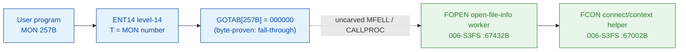

# MON 257B (octal) - OpenFileInfo (FOPEN)

> **CORRECTED 2026-07-15 (byte-verified).** The worker + dispatch described below are on the
> DEBUNKED model and are WRONG. Byte truth from the carved L07 image:
> `MCTAB[257B] = 006077B = FOPFN=111212B` in segment 006-S3FS, reached by the real dispatch
> `MON 257B -> ENT14(072167B) -> GOTAB[257B]=MFELL(072114B) -> CALLP(032201B) -> MCTAB[257B]=FOPFN`.
> Any "GOTAB from commoncode" / "uncarved CALLPROC bridge" / "F16xx stub" / old worker name below
> is an artefact of the wrong table. Verified: `dd if=044-S3IDPIT.bin bs=1 skip=2174 count=2`
> -> `92 8a`. Cross-ref ../317B-ExecuteCommand/README.md and SINTRAN/CARVING-HANDOFF.md sec 3a.

Gets information about an already-open file. The caller supplies a file name and
a default file type; on the normal return the call delivers the open file number
and the access type (and, for a peripheral file, the logical device number). The
file must already have been opened (e.g. with
[MON 50B OpenFile](../50B-OpenFile/README.md)).

**Status:** GOTAB dispatch head byte-proven as **fall-through** (`GOTAB[257B] = 000000`,
no per-call stub); the `FOPEN` worker body is real SINTRAN L bytes and calls the
`FCON` file-system connect/context helper; the exact `MON 257 -> worker` link
crosses an uncarved kernel bridge (see [Honest caveats](#honest-caveats)). All
addresses/values are **octal**.

- **Full disassembly:** [`257B-OpenFileInfo.ASM`](257B-OpenFileInfo.ASM) - the actual code (the FOPEN worker body; there is no entry stub because the GOTAB slot is zero).
- **Bytes live once in** the canonical segment layer: [`../../segments-ref/`](../../segments-ref/).

---

## Dispatch path

The GOTAB slot is zero, so there is **no per-call entry stub**. The dashed hop
(`C -> E`) is the resident `MFELL`/`CALLPROC` fall-through second-level dispatch -
it is **not present in any carved segment**, so it is the one link that cannot be
followed statically.

---

## Code location (dispatch path)

Every row is a real region you can open. Byte offset = `(addr - loadbase)` in octal words x 2.

| Role | Segment (full disasm) | Addr range (octal) | Byte offset | Symbol | Verdict |
|------|------------------------|--------------------|-------------|--------|---------|
| GOTAB[257] dispatch word | [commoncode.asm](../../segments-ref/SINTRAN-DATA_commoncode/SINTRAN-DATA_commoncode.asm) - [.hex](../../segments-ref/SINTRAN-DATA_commoncode/SINTRAN-DATA_commoncode.hex) | `071512B` (1 word) | 59028 | `GOTAB+257` = `000000` | **VERIFIED** (fall-through) |
| resident MFELL/CALLPROC bridge | - (uncarved) | - | - | `CALLPROC` | **UNVERIFIED** |
| FOPEN open-file-info worker body | [006-S3FS.asm](../../segments-ref/006-S3FS/006-S3FS.asm) - [.hex](../../segments-ref/006-S3FS/006-S3FS.hex) | `67432B-67571B` (96w) | 34356 | `FOPEN` | real bytes; link **MISATTRIBUTED** |
| FCON connect/context helper | [006-S3FS.asm](../../segments-ref/006-S3FS/006-S3FS.asm) - [.hex](../../segments-ref/006-S3FS/006-S3FS.hex) | `67002B` (call target) | 33796 | `FCON` | called by FOPEN (link cell `67565`) - **VERIFIED** |

**Verify by hand:** `grep '^67432 ' ../../segments-ref/006-S3FS/006-S3FS.hex` -> byte offset `34356`;
then `dd if=../../../segments/006-S3FS.bin bs=1 skip=34356 count=8 | od -An -tx1` -> `22 57 cc 65 cc 59 f0 06`
(= octal `021127 146145 146131 170006` = `STD I 127` / `RADD CLD SL DA` / `RADD CLD SB DD` / `SAB 6`, the FOPEN entry).

The GOTAB slot itself:
`dd if=../../../resident/SINTRAN-DATA_commoncode.bin bs=1 skip=59028 count=2 | od -An -tx1` -> `00 00` (= `000000`, fall-through).

---

## Instruction walkthrough

Full listing: [`257B-OpenFileInfo.ASM`](257B-OpenFileInfo.ASM). The functional body
is the FOPEN worker (region B); there is no F16xx stub because `GOTAB[257] = 0`.
All calls to shared workers are **indirect** (`JPL I` / `JMP I`) through a table
of pointer words at the tail of the window (`67561-67571`). nd100-dis renders
those pointer words as bogus instructions (`ROP NOOP`, `STZ I ...`, `SUB I ...`) -
they are **data (link cells)**, not code; their contents are the real worker
addresses (resolved below).

**Entry prologue (`67432-67436`)** - `67432 STD I 127` stashes the caller's
double-word parameter; `67435 SAB 6` builds a small local frame `B` (6 words);
`67436 JPL I 124` -> `003752` is the shared resident prologue worker (the same
prologue cell used by the file open / read / write bodies).

**Open-file-table scan (`67442-67456`)** - `67442 LDA ,X 0` reads the current
open-file-table entry; `67445 JAZ 12 -> 67457` breaks out on an empty/matching
slot; `67450 SKP IF DX EQL ST` / `67451 JMP 4` compares the entry; `67456 JMP -14
-> 67442` loops to the next entry (`67446 AAX 2`). On table exhaustion,
`67452 SAA 122` loads error `122` and exits via `67453 JMP 104 -> 67557`.

**Resolve + extract (`67457-67551`)** - `67457-67461` fetch the caller's
name/type arguments (`LDT ,B 1`, `LDA ,B 2`, `LDX ,B 0`); `67462 JPL I 103` ->
`067002` (**FCON**, the file-system connect/context helper) resolves the file
context. The two branches at `67504-67525` and `67526-67551` walk the file
descriptor and build the returned file-number / access-code / device-number
group, each writing the result code `SAA 120` and storing it with `STA ,B 2`.

**Exit (`67552-67560`)** - `67553`/`67557 STA ,B 2` write the result word into the
caller's status slot `B+2`; every path funnels into the resident return
`67555`/`67556 JMP I 13` -> `003776`.

The `JPL I 103` call to **FCON** (link cell `67565 = 067002`) is the byte-level
proof that FOPEN drives the file-system open-file lookup. `FOPEN = 67432B` was
selected because it is the FILSYS symbol the OpenFileInfo anchor points at, and it
carries the canonical file-worker prologue (`STD I` / `SAB` / `JPL I -> 003752`,
identical in shape to the OpenFile and read/write worker entries).

---

## Parameter / register contract

| Reg / field | Dir | Meaning | Verdict |
|-------------|-----|---------|---------|
| entry point | in | `67432B` = FOPEN worker entry (fall-through, no stub) | VERIFIED (bytes) |
| `D` (double) | in | caller parameter block, saved first (`STD I 127`) | VERIFIED (copy); layout inferred |
| local frame `B` | internal | `SAB 6` = 6-word working frame | VERIFIED (bytes) |
| `X` (manual) | in | address of file-name string | inferred (manual MAC example) |
| `A` (manual) | in | address of default file-type string | inferred (manual MAC example) |
| `T` (manual) | out | open file number | inferred (manual: `STT FILNO`) |
| `A` (manual) | out | access code (0 read, 1 write, 2 read+write) | inferred (manual: `STA ACODE`) |
| `D` (manual) | out | logical device number (peripheral files) | inferred (manual: `COPY SD DA`) |
| `B+2` | out | returned status word (`STA ,B 2` at `67523`/`67553`/`67557`) | VERIFIED (bytes) |
| error `122` | out | table-exhausted / not-found literal (`SAA 122` at `67452`) | VERIFIED (bytes); mapping inferred |
| result `120` | out | result/access literal (`SAA 120` at `67522`/`67545`) | VERIFIED (bytes); mapping inferred |

The user-visible `X`/`A`/`T`/`D` register convention lives in the caller-side
`MON 257` wrapper and the uncarved `MFELL`/`CALLPROC` frame, so the precise
user-register-to-field assignment is **inferred** from the manual, not
byte-proven here. The error/result literals `122`/`120` are VERIFIED in the code;
their mapping to the SINTRAN error/access tables is **UNVERIFIED**.

---

## Pseudo-code (for an emulator)

See **[`257B-OpenFileInfo.pseudo.c`](257B-OpenFileInfo.pseudo.c)** - a pseudo-C
model of the handler for emulator authors. Control flow + the open-file-table
scan + the call to the FCON helper are byte-verified; the parameter-field
semantics and error-number meanings are inferred from the call structure and the
manual.

Every instruction in the `.pseudo.c` is translated against the canonical
[`ND100-INSTRUCTION-SEMANTICS.md`](../../instruction-semantics/ND100-INSTRUCTION-SEMANTICS.md)
(bare `LDx`/`LDT`/`AND disp` = P-relative `mem[P+disp]`, not literals; `SKP`/`BSKP` skip
polarity; `RADD CLD SD DA` = `A = D`; T/X transfers = physical `EL`).

---

## Honest caveats

**What is byte-proven:** `GOTAB[257B] = 000000` (level-14 dispatch, a fall-through
with no per-call vector); the `FOPEN` worker body at `67432B` in `006-S3FS` is
real code (entry bytes `021127 146145 146131 170006` match the disassembly); and
it drives the open-file lookup - it calls `FCON` (`067002B`, link cell `67565`),
the file-system connect/context helper.

**What is NOT proven:** the link from the zero GOTAB slot to the `FOPEN` worker.
Because the vector is zero there is no stub to disassemble and no pointer to
dereference; dispatch drops into the resident `MFELL`/`CALLPROC` second-level
path, which lives in an **uncarved overlay**. So the `MON 257 -> FOPEN`
attribution rests on the `FOPEN` symbol name + its file-lookup behaviour, not a
followed pointer - hence **MISATTRIBUTED** in the strict sense. Confirming the
link needs a live trace: issue a real `MON 257`, single-step the level-14
fall-through into the resident `CALLPROC` dispatch, and confirm P lands on
`FOPEN = 67432`.

Several link-cell contents (`003752`, `003776`) match no `FILSYS-SYMBOLS` entry;
their low addresses (below the `26000B` segment load base) suggest resident-monitor
/ save-restore routines outside the file-system segment and are not resolved here.

Method: [../../../../../EXTRACTING-RESIDENT-CODE.md](../../../../../EXTRACTING-RESIDENT-CODE.md) - dispatch reality:
[../../TASK-05-mismatches.md](../../TASK-05-mismatches.md) - master map: [../../MON-CALL-INDEX.md](../../MON-CALL-INDEX.md).
