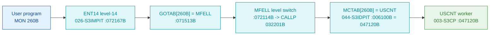

# MON 260B (octal) - USCNT (UserControl)

Set user control of a device (manual short name `USCNT`). The manual lists this call **name-only**, so
the full parameter/return contract is **inferred**; the carved worker itself is byte-verified.

**Status:** **byte-verified** (dispatch + worker body). The worker is real carved code in `003-S3CP`,
heading a user/system-accounting family `USCNT` / `SYCNT` / `NRETM` / `NCHBU`. All addresses/values
are **octal**.

> **CORRECTED 2026-07-13.** The previous version of this folder called this call `misattributed` with
> a `GOTAB` "fall-through" and no analysable body. **That was an artefact of the wrong dispatch
> model.** MON calls are not dispatched through the level-14 `GOTAB` (it is `MFELL` for 224 of 256
> calls); they go through **`MCTAB @ 005620B`** (segment `044-S3IDPIT`). `MCTAB[260B] = 047120B =
> USCNT`, and that worker IS carved - in `003-S3CP`. See
> [`../317B-ExecuteCommand/README.md`](../317B-ExecuteCommand/README.md) and
> `SINTRAN/CARVING-HANDOFF.md` section 3a.

- **Full disassembly:** [`260B-UserControl.ASM`](260B-UserControl.ASM).
- **Emulator model:** [`260B-UserControl.pseudo.c`](260B-UserControl.pseudo.c).

---

## Dispatch path



---

## Code location (dispatch path)

Byte offset = `(addr - loadbase)` in octal words x 2 (decimal). Offsets reproduced with `dd`.

| Role | Segment | Addr (octal) | Byte offset | Symbol | Verdict |
|------|---------|--------------|-------------|--------|---------|
| MCTAB[260B] slot | [044-S3IDPIT.asm](../../segments-ref/044-S3IDPIT/044-S3IDPIT.asm) | `006100B` = `047120B` | 2176 | -> `USCNT` | **VERIFIED** |
| USCNT worker body | [003-S3CP.asm](../../segments-ref/003-S3CP/003-S3CP.asm) | `047120B-047166B` | 15520 | `USCNT` | **VERIFIED** |

**Verify by hand** (from `tools/sintran-segment-carver/versions/L-VSX-500/segments/`):
```
dd if=044-S3IDPIT.bin bs=1 skip=2176  count=2 | od -An -tx1   ->  4e 50   (= 047120B = USCNT)
dd if=003-S3CP.bin    bs=1 skip=15520 count=2 | od -An -tx1   ->  45 4d   (= 042515B, USCNT entry)
```

---

## Instruction walkthrough

Full listing: [`260B-UserControl.ASM`](260B-UserControl.ASM).

`USCNT` opens by incrementing a per-user counter (`MIN ,X ,B 115`) and copying a paired accounting word.
The `SYCNT`/`NRETM` block (`047125B-047146B`) updates the matching system-side counters and re-stages
several accounting words; one branch reaches `MON 0` (ExitFromProgram) at `047147B`. The `NCHBU` tail
(`047156B-047166B`) updates the remaining counters and stores the results. The counter-update structure
and the `MON 0` branch are byte-proven; which counter corresponds to which resource is **inferred**.

---

## Parameter / register contract

| Reg / field | Dir | Meaning | Verdict |
|-------------|-----|---------|---------|
| `X` | in | base of the per-user accounting block being updated | VERIFIED (bytes: `MIN ,X ...`) |
| per-user counter `,X 115` etc. | in/out | incremented / reconciled accounting counters | VERIFIED (bytes); semantics inferred |
| `MON 0` branch | out | one path terminates the program (ExitFromProgram) | VERIFIED (bytes) |
| device / control parameters | in | manual "set user control of a device" | inferred (manual, name-only) |

---

## Pseudo-code (for an emulator)

See **[`260B-UserControl.pseudo.c`](260B-UserControl.pseudo.c)** - the counter-increment structure and
the `MON 0` branch are byte-verified; the resource/parameter meaning is inferred (the manual documents
this call name-only).

---

## Honest caveats

**What is byte-proven:** `MCTAB[260B] = 047120B = USCNT`; the `USCNT` entry bytes at `047120B` in
`003-S3CP` match the disassembly; the routine heads a coherent user/system-accounting family
(`USCNT`/`SYCNT`/`NRETM`/`NCHBU`) that updates per-user and per-system counters and can terminate the
program via `MON 0` on one branch.

**What is NOT proven:** the manual documents `UserControl` name-only, so the exact parameters and which
counter maps to which device/resource are inferred. The old `misattributed`/fall-through verdict was
the wrong dispatch model and is withdrawn.

Method: [../../../../../EXTRACTING-RESIDENT-CODE.md](../../../../../EXTRACTING-RESIDENT-CODE.md) ·
master map: [../../MON-CALL-INDEX.md](../../MON-CALL-INDEX.md).
