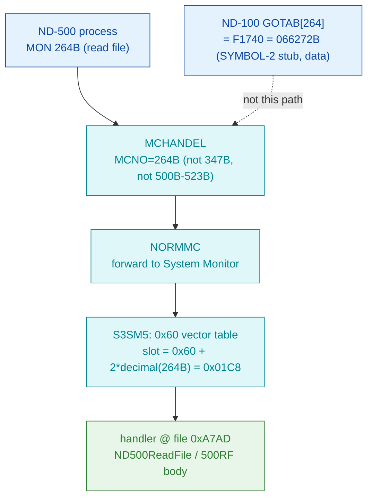

# MON 264B (octal) - ND500ReadFile (500RF)

Reads a file on behalf of an ND-500 program. It is dispatched through the ND-500
System Monitor's numeric MON vector table in `030-S3SM5`, in the same contiguous
block of real file-operation handlers as its siblings 265B (write) and 266B
(magtape).

**Status:** routing is **byte-proven** (ND-500 call via the S3SM5 `0x60` vector
table, slot `0x01C8` -> handler file offset `0xA7AD`, inside the contiguous
260B-277B block of real handlers - **not** the ND-100 GOTAB). The worker body is
real SINTRAN L bytes carved from `030-S3SM5.bin`, but the linear decode from the
raw vector offset is only **partly coherent**, so `0xA7AD` is not a proven
instruction boundary - see [Honest caveats](#honest-caveats). ND-100 addresses are
octal; ND-500 offsets are hex byte offsets.

- **Full disassembly:** [`264B-ND500ReadFile.ASM`](264B-ND500ReadFile.ASM) - the actual ND-500 handler body (single carved region).
- **Generated slice:** [`264B-ND500ReadFile.bin`](264B-ND500ReadFile.bin) - a single contiguous ND-500 region (`0xA7AD..0xA825`, 120 bytes) of the canonical segment.
- **Bytes live once in** the canonical segment layer: [`../../segments-ref/`](../../segments-ref/).

---

## Dispatch path



The `0x60` vector value `0xA7AD` is the handler file offset directly (no
correction needed, unlike 410B whose raw value fell inside a string). The
`X -> B` hop notes that the ND-100 GOTAB[264] slot holds a `F1740` descriptor stub
(first word `000000`, a data/descriptor cell), which is not this handler.

---

## Code location (dispatch path)

Rows are in execution order. ND-500 rows in `030-S3SM5` are **byte-addressed**
(byte offset is direct, no x2). The ND-100 GOTAB row byte offset = `(addr - GOTAB
base 071233B)` octal words x 2.

| Role | Segment (full disasm) | Addr / file offset | Byte offset (dec) | Symbol | Verdict |
|------|------------------------|--------------------|-------------------|--------|---------|
| GOTAB[264] read (does NOT apply) | [commoncode.asm](../../segments-ref/SINTRAN-DATA_commoncode/SINTRAN-DATA_commoncode.asm) · [.hex](../../segments-ref/SINTRAN-DATA_commoncode/SINTRAN-DATA_commoncode.hex) | `066272B` = `F1740` | 59038 | `F1740` (SYMBOL-2, descriptor stub; first word `000000`) | **inferred data** - ND-100 dispatch descriptor, not the handler |
| S3SM5 `0x60` vector slot 264B | [030-S3SM5.asm](../../segments-ref/030-S3SM5/030-S3SM5.asm) · [.hex](../../segments-ref/030-S3SM5/030-S3SM5.hex) | file off `0x01C8` | 456 | value `0xA7AD` (handler offset) | **VERIFIED** - non-zero handler word in the 260B-277B block |
| Handler body (ND500ReadFile / 500RF) | [030-S3SM5.asm](../../segments-ref/030-S3SM5/030-S3SM5.asm) · [.hex](../../segments-ref/030-S3SM5/030-S3SM5.hex) | file off `0xA7AD..0xA825` | 42925..43044 (120 bytes) | (no L07 symbol in the carved window) | real bytes; decode only partly coherent |

**Verify by hand:** `grep '^456 ' ../../segments-ref/030-S3SM5/030-S3SM5.hex` ->
`456  247` (octal `247` = `0xA7`); then the vector slot
`dd if=../../../segments/030-S3SM5.bin bs=1 skip=456 count=2 | od -An -tx1` ->
`a7 ad`. The handler:
`grep '^42925 ' ../../segments-ref/030-S3SM5/030-S3SM5.hex` -> `42925  142`
(octal `142` = `0x62`); then
`dd if=../../../segments/030-S3SM5.bin bs=1 skip=42925 count=8 | od -An -tx1` ->
`62 f2 30 c2 35 a8 05 f2` (matches the `.ASM` first words).

---

## Instruction walkthrough

Full listing: [`264B-ND500ReadFile.ASM`](264B-ND500ReadFile.ASM). Key points, by
file offset into `030-S3SM5.bin`:

```
0xA7AD  62 F2 30     w3 -  DESC(r3) $0x30   ; entry (UNVERIFIED boundary)
0xA7B0  C2 35 A8 ..  go    $0x35A805F2       ; out-of-range target -> misalignment signal
0xA7FC  BA 40 AA     entsn b.0x0,r.0xA8      ; frame prologue (mid-body)
0xA804  BA 3E AA     entsn $0x3E,r.0xA8      ; frame prologue (mid-body)
0xA7F9  81           retk                    ; a return opcode
0xA822  BA 31 A8     entsn $0x31,r.0xA0      ; runs up to the 265B entry (0xA825)
```

Readable structure: several `entsn` frame prologues and at least one return
opcode bracket a run of compare / subtract / conditional-go ops - the shape of a
short "validate arguments, call a shared file worker, return" routine, which is
*consistent* with ND500ReadFile behaviour. But the entry `0xA7AD` decodes with an
immediate out-of-range `go`, so the stream is at least partly **misaligned** past
the first few bytes (the `entsn` prologues sit mid-body, not at entry). This is
ND-500 code; the raw bytes are ground truth, the mnemonics are unreliable where
marked.

---

## Parameter / register contract

This is an ND-500 call; argument transport is the ND-500 MON message block, not
ND-100 A/X/T registers. The manual (ND-860228-2 EN, section 2.14) lists the call
name-only.

| Field | Dir | Meaning | Verdict |
|-------|-----|---------|---------|
| MON number | in | `264B` routes via MCHANDEL -> NORMMC -> S3SM5 `0x60` vector slot `0x01C8` | **VERIFIED** (bytes) |
| file number / byte count / buffer | in | expected read arguments; no frame slot attributed with confidence | UNVERIFIED |
| status / bytes read | out | a return opcode exists (`retk` at `0xA7F9`); no status field attributed | UNVERIFIED |

Full YAML contract: [`264B_ND500ReadFile.yaml`](../../../../../../../Developer/MON/calls/264B_ND500ReadFile.yaml)
(marked STUB - name/short only).

---

## Pseudo-code (for an emulator)

See **[`264B-ND500ReadFile.pseudo.c`](264B-ND500ReadFile.pseudo.c)** - a pseudo-C
model for emulator authors. Every modelled line gives the real ND-500 operation
from the instruction-semantics reference:
[`../../instruction-semantics/ND500-INSTRUCTION-SEMANTICS.md`](../../instruction-semantics/ND500-INSTRUCTION-SEMANTICS.md)
(register model, addressing modes, branch conditions; note `C=1` means
**no-borrow**, i.e. inverted). Only the **routing** and the presence of
`entsn`/return opcodes are relied upon; the argument block and status/error
contract are **UNVERIFIED** and are not modelled as behaviour.

---

## Honest caveats

**What is byte-proven:** MON 264B is an ND-500 call, forwarded to the ND-500
System Monitor. In `030-S3SM5` the `0x60` vector table is indexed by octal MON
number (`file_byte = 0x60 + 2*decimal(N)`), verified independently by the
routine map ([`../../030-S3SM5-routine-map.md`](../../030-S3SM5-routine-map.md)
section 2). Slot `0x01C8` (byte 456) reads `0xA7AD`, a non-zero handler offset in
the **contiguous 260B-277B block** of real file-operation handlers
(260=0xA75D 261=0xA773 262=0xA79F 264=0xA7AD 265=0xA825 266=0xA89D 270=0xA8AE).
That block, and the carved bytes at `0xA7AD`, are real bytes on disk.

**What is NOT proven:** the exact entry alignment and the body semantics. The
linear decode from `0xA7AD` begins with an out-of-range `go`, and unknown opcodes
appear before the first `entsn` - the same "vector points slightly off a clean
instruction boundary" symptom seen for 410B. So the disassembly is only partly
coherent; the RAW BYTES are ground truth but the decoded op sequence is not a
reliable control-flow guide. The argument block and error/skip contract are
entirely UNVERIFIED (the manual gives only the name `ND500ReadFile / 500RF`; the
call is absent from the available NPL source). Confirming the entry needs an S3SM5
symbol map or a live trace of an ND-500 read-file call; treat the *routing* as
reliable and the *exact entry/body* as provisional.

Method: [../../../../../EXTRACTING-RESIDENT-CODE.md](../../../../../EXTRACTING-RESIDENT-CODE.md) · dispatch reality:
[../../TASK-05-mismatches.md](../../TASK-05-mismatches.md) · master map: [../../MON-CALL-INDEX.md](../../MON-CALL-INDEX.md).
