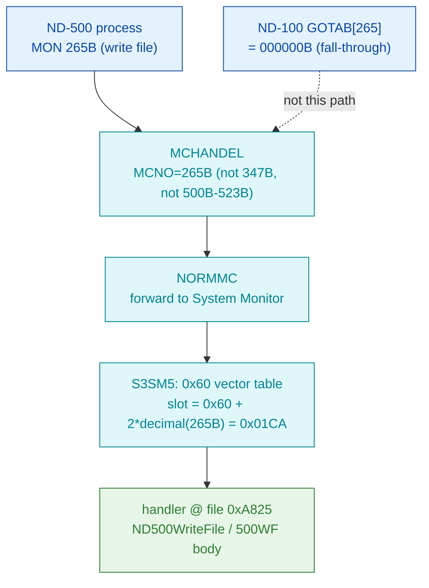

# MON 265B (octal) - ND500WriteFile (500WF)

Writes a file on behalf of an ND-500 program. It is dispatched through the ND-500
System Monitor's numeric MON vector table in `030-S3SM5`, in the same contiguous
block of real file-operation handlers as its siblings 264B (read) and 266B
(magtape).

**Status:** routing is **byte-proven** (ND-500 call via the S3SM5 `0x60` vector
table, slot `0x01CA` -> handler file offset `0xA825`, inside the contiguous
260B-277B block of real handlers - **not** the ND-100 GOTAB). The worker body is
real SINTRAN L bytes carved from `030-S3SM5.bin`, but the linear decode from the
raw vector offset is only **partly coherent**, so `0xA825` is not a proven
instruction boundary - see [Honest caveats](#honest-caveats). ND-100 addresses are
octal; ND-500 offsets are hex byte offsets.

- **Full disassembly:** [`265B-ND500WriteFile.ASM`](265B-ND500WriteFile.ASM) - the actual ND-500 handler body (single carved region).
- **Generated slice:** [`265B-ND500WriteFile.bin`](265B-ND500WriteFile.bin) - a single contiguous ND-500 region (`0xA825..0xA89D`, 120 bytes) of the canonical segment.
- **Bytes live once in** the canonical segment layer: [`../../segments-ref/`](../../segments-ref/).

---

## Dispatch path



The `0x60` vector value `0xA825` is the handler file offset directly. The
`X -> B` hop notes that the ND-100 GOTAB[265] slot is `000000` (a fall-through,
not a handler for this ND-500 call).

---

## Code location (dispatch path)

Rows are in execution order. ND-500 rows in `030-S3SM5` are **byte-addressed**
(byte offset is direct, no x2). The ND-100 GOTAB row byte offset = `(addr - GOTAB
base 071233B)` octal words x 2.

| Role | Segment (full disasm) | Addr / file offset | Byte offset (dec) | Symbol | Verdict |
|------|------------------------|--------------------|-------------------|--------|---------|
| GOTAB[265] read (does NOT apply) | [commoncode.asm](../../segments-ref/SINTRAN-DATA_commoncode/SINTRAN-DATA_commoncode.asm) · [.hex](../../segments-ref/SINTRAN-DATA_commoncode/SINTRAN-DATA_commoncode.hex) | `071740B` = `071233B+265B` | 59040 | `000000` (fall-through) | **inferred** - ND-100 fall-through, not the handler |
| S3SM5 `0x60` vector slot 265B | [030-S3SM5.asm](../../segments-ref/030-S3SM5/030-S3SM5.asm) · [.hex](../../segments-ref/030-S3SM5/030-S3SM5.hex) | file off `0x01CA` | 458 | value `0xA825` (handler offset) | **VERIFIED** - non-zero handler word in the 260B-277B block |
| Handler body (ND500WriteFile / 500WF) | [030-S3SM5.asm](../../segments-ref/030-S3SM5/030-S3SM5.asm) · [.hex](../../segments-ref/030-S3SM5/030-S3SM5.hex) | file off `0xA825..0xA89D` | 43045..43164 (120 bytes) | (no L07 symbol in the carved window) | real bytes; decode only partly coherent |

**Verify by hand:** `grep '^458 ' ../../segments-ref/030-S3SM5/030-S3SM5.hex` ->
`458  250` (octal `250` = `0xA8`); then the vector slot
`dd if=../../../segments/030-S3SM5.bin bs=1 skip=458 count=2 | od -An -tx1` ->
`a8 25`. The handler:
`grep '^43045 ' ../../segments-ref/030-S3SM5/030-S3SM5.hex` -> `43045  047`
(octal `047` = `0x27`); then
`dd if=../../../segments/030-S3SM5.bin bs=1 skip=43045 count=8 | od -An -tx1` ->
`27 01 86 01 85 f8 00 4c` (matches the `.ASM` first words).

---

## Instruction walkthrough

Full listing: [`265B-ND500WriteFile.ASM`](265B-ND500WriteFile.ASM). Key points, by
file offset into `030-S3SM5.bin`:

```
0xA825  27 01        f4 =: $0x1              ; entry (UNVERIFIED boundary)
0xA838  B8 8D        ents  r.0x34            ; enter-subroutine (frame)
0xA848  B8 A3        ents  r.0x8C            ; enter-subroutine (frame)
0xA864  BA 13 48     entsn $0x13,b.0x20      ; frame prologue (mid-body)
0xA82F  80           ret                     ; a return opcode
0xA847  83           rett                    ; a return opcode
```

Readable structure: two `ents` / one `entsn` frame prologues plus two return
opcodes bracket a run of load / multiply-add / conditional-go ops - the shape of a
short "validate arguments, call a shared file worker, return" routine, consistent
with ND500WriteFile behaviour and mirroring its 264B read sibling. The entry
`0xA825` is not a proven instruction boundary (unknown opcodes appear before the
first frame prologue), so the stream is partly **misaligned**; the raw bytes are
ground truth, the mnemonics are unreliable where marked.

---

## Parameter / register contract

This is an ND-500 call; argument transport is the ND-500 MON message block, not
ND-100 A/X/T registers. The manual (ND-860228-2 EN, section 2.14) lists the call
name-only.

| Field | Dir | Meaning | Verdict |
|-------|-----|---------|---------|
| MON number | in | `265B` routes via MCHANDEL -> NORMMC -> S3SM5 `0x60` vector slot `0x01CA` | **VERIFIED** (bytes) |
| file number / byte count / buffer | in | expected write arguments; no frame slot attributed with confidence | UNVERIFIED |
| status / bytes written | out | return opcodes exist (`ret` at `0xA82F`, `rett` at `0xA847`); no status field attributed | UNVERIFIED |

Full YAML contract: [`265B_ND500WriteFile.yaml`](../../../../../../../Developer/MON/calls/265B_ND500WriteFile.yaml)
(marked STUB - name/short only).

---

## Pseudo-code (for an emulator)

See **[`265B-ND500WriteFile.pseudo.c`](265B-ND500WriteFile.pseudo.c)** - a pseudo-C
model for emulator authors. Every modelled line gives the real ND-500 operation
from the instruction-semantics reference:
[`../../instruction-semantics/ND500-INSTRUCTION-SEMANTICS.md`](../../instruction-semantics/ND500-INSTRUCTION-SEMANTICS.md)
(register model, addressing modes, branch conditions; note `C=1` means
**no-borrow**, i.e. inverted). Only the **routing** and the presence of
`ents`/`entsn`/return opcodes are relied upon; the argument block and status/error
contract are **UNVERIFIED** and are not modelled as behaviour.

---

## Honest caveats

**What is byte-proven:** MON 265B is an ND-500 call, forwarded to the ND-500
System Monitor. In `030-S3SM5` the `0x60` vector table is indexed by octal MON
number (`file_byte = 0x60 + 2*decimal(N)`), verified independently by the
routine map ([`../../030-S3SM5-routine-map.md`](../../030-S3SM5-routine-map.md)
section 2). Slot `0x01CA` (byte 458) reads `0xA825`, a non-zero handler offset in
the **contiguous 260B-277B block** of real file-operation handlers. That block,
and the carved bytes at `0xA825`, are real bytes on disk.

**What is NOT proven:** the exact entry alignment and the body semantics. The
linear decode from `0xA825` shows unknown opcodes before the first frame prologue
- the same "vector points slightly off a clean instruction boundary" symptom seen
for 410B. So the disassembly is only partly coherent; the RAW BYTES are ground
truth but the decoded op sequence is not a reliable control-flow guide. The
argument block and error/skip contract are entirely UNVERIFIED (the manual gives
only the name `ND500WriteFile / 500WF`; the call is absent from the available NPL
source). Confirming the entry needs an S3SM5 symbol map or a live trace; treat the
*routing* as reliable and the *exact entry/body* as provisional.

Method: [../../../../../EXTRACTING-RESIDENT-CODE.md](../../../../../EXTRACTING-RESIDENT-CODE.md) · dispatch reality:
[../../TASK-05-mismatches.md](../../TASK-05-mismatches.md) · master map: [../../MON-CALL-INDEX.md](../../MON-CALL-INDEX.md).
