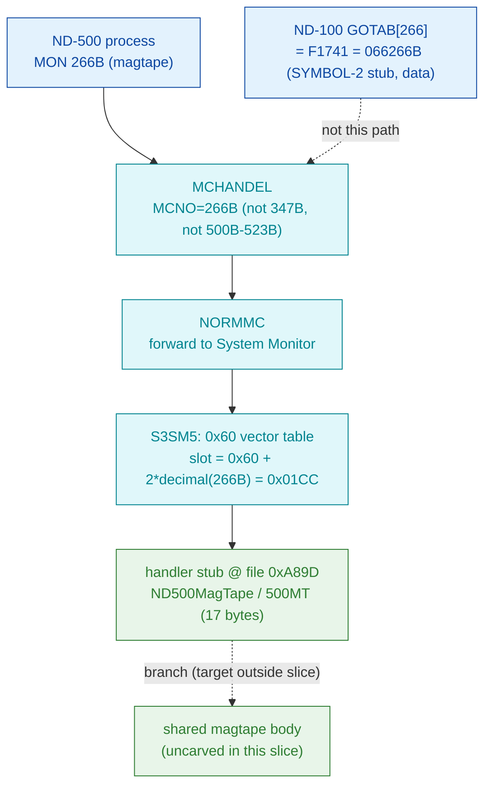

# MON 266B (octal) - ND500MagTape (500MT)

Magnetic-tape access on behalf of an ND-500 program. It is dispatched through the
ND-500 System Monitor's numeric MON vector table in `030-S3SM5`, in the same
contiguous block of real file/device-operation handlers as its siblings 264B
(read) and 265B (write).

**Status:** routing is **byte-proven** (ND-500 call via the S3SM5 `0x60` vector
table, slot `0x01CC` -> handler file offset `0xA89D`, inside the contiguous
260B-277B block of real handlers - **not** the ND-100 GOTAB). The worker region is
real SINTRAN L bytes carved from `030-S3SM5.bin`, but it is **short** (17 bytes to
the next handler) and the decode is only **partly coherent**, so `0xA89D` is not a
proven instruction boundary - see [Honest caveats](#honest-caveats). ND-100
addresses are octal; ND-500 offsets are hex byte offsets.

- **Full disassembly:** [`266B-ND500MagTape.ASM`](266B-ND500MagTape.ASM) - the actual ND-500 handler region (single carved region).
- **Generated slice:** [`266B-ND500MagTape.bin`](266B-ND500MagTape.bin) - a single contiguous ND-500 region (`0xA89D..0xA8AE`, 17 bytes) of the canonical segment.
- **Bytes live once in** the canonical segment layer: [`../../segments-ref/`](../../segments-ref/).

---

## Dispatch path



The `0x60` vector value `0xA89D` is the handler file offset directly. The short
region and its two branch opcodes give it the shape of a dispatch stub into a
shared magtape body (dashed `E -> F`, target outside the 17-byte slice). The
`X -> B` hop notes that the ND-100 GOTAB[266] slot holds a `F1741` descriptor stub
(first word `077777`, a data/descriptor cell), not this handler.

---

## Code location (dispatch path)

Rows are in execution order. ND-500 rows in `030-S3SM5` are **byte-addressed**
(byte offset is direct, no x2). The ND-100 GOTAB row byte offset = `(addr - GOTAB
base 071233B)` octal words x 2.

| Role | Segment (full disasm) | Addr / file offset | Byte offset (dec) | Symbol | Verdict |
|------|------------------------|--------------------|-------------------|--------|---------|
| GOTAB[266] read (does NOT apply) | [commoncode.asm](../../segments-ref/SINTRAN-DATA_commoncode/SINTRAN-DATA_commoncode.asm) · [.hex](../../segments-ref/SINTRAN-DATA_commoncode/SINTRAN-DATA_commoncode.hex) | `066266B` = `F1741` | 59042 | `F1741` (SYMBOL-2, descriptor stub; first word `077777`) | **inferred data** - ND-100 dispatch descriptor, not the handler |
| S3SM5 `0x60` vector slot 266B | [030-S3SM5.asm](../../segments-ref/030-S3SM5/030-S3SM5.asm) · [.hex](../../segments-ref/030-S3SM5/030-S3SM5.hex) | file off `0x01CC` | 460 | value `0xA89D` (handler offset) | **VERIFIED** - non-zero handler word in the 260B-277B block |
| Handler stub (ND500MagTape / 500MT) | [030-S3SM5.asm](../../segments-ref/030-S3SM5/030-S3SM5.asm) · [.hex](../../segments-ref/030-S3SM5/030-S3SM5.hex) | file off `0xA89D..0xA8AE` | 43165..43181 (17 bytes) | (no L07 symbol in the carved window) | real bytes; short; decode only partly coherent |

**Verify by hand:** `grep '^460 ' ../../segments-ref/030-S3SM5/030-S3SM5.hex` ->
`460  250` (octal `250` = `0xA8`); then the vector slot
`dd if=../../../segments/030-S3SM5.bin bs=1 skip=460 count=2 | od -An -tx1` ->
`a8 9d`. The handler:
`grep '^43165 ' ../../segments-ref/030-S3SM5/030-S3SM5.hex` -> `43165  071`
(octal `071` = `0x39`); then
`dd if=../../../segments/030-S3SM5.bin bs=1 skip=43165 count=8 | od -An -tx1` ->
`39 aa 03 6b f1 82 48 6a` (matches the `.ASM` first words).

---

## Instruction walkthrough

Full listing: [`266B-ND500MagTape.ASM`](266B-ND500MagTape.ASM). The whole region,
by file offset into `030-S3SM5.bin`:

```
0xA89D  39 AA        f2 comp r.0xA8          ; entry (UNVERIFIED boundary)
0xA89F  03           noop
0xA8A0  6B F1 82     d4 -   DESC(r2) r.0x8    ; subtract (selector check?)
0xA8A3  48 6A        by stz b.0xA8
0xA8A5  D9 2C 40     if << go $0x2C40         ; conditional branch (target outside slice)
0xA8A8  C0 05        go $0x5                  ; unconditional branch (target outside slice)
0xA8AA  AA 05 BA     w3 mulad $0x5,r.0xE8     ; last full op inside the 17-byte window
```

Readable structure: a compare and a subtract followed by a conditional and an
unconditional branch, both targeting past this short slice - the classic shape of
a dispatch stub that checks a small selector then jumps into a larger shared
magtape body. That is *consistent* with ND500MagTape behaviour, but the branch
targets are not resolvable inside the 17-byte window and `0xA89D` is not a proven
instruction boundary, so this is INFERRED, not proven. The raw bytes are ground
truth; the mnemonics are unreliable where marked.

---

## Parameter / register contract

This is an ND-500 call; argument transport is the ND-500 MON message block, not
ND-100 A/X/T registers. The manual (ND-860228-2 EN, section 2.14) lists the call
name-only.

| Field | Dir | Meaning | Verdict |
|-------|-----|---------|---------|
| MON number | in | `266B` routes via MCHANDEL -> NORMMC -> S3SM5 `0x60` vector slot `0x01CC` | **VERIFIED** (bytes) |
| tape function selector | in | a compare/subtract near entry looks like a selector check; value not attributed | UNVERIFIED |
| status | out | branch leaves this slice into an uncarved shared body; no status field attributed | UNVERIFIED |

Full YAML contract: [`266B_ND500MagTape.yaml`](../../../../../../../Developer/MON/calls/266B_ND500MagTape.yaml)
(marked STUB - name/short only).

---

## Pseudo-code (for an emulator)

See **[`266B-ND500MagTape.pseudo.c`](266B-ND500MagTape.pseudo.c)** - a pseudo-C
model for emulator authors. Every modelled line gives the real ND-500 operation
from the instruction-semantics reference:
[`../../instruction-semantics/ND500-INSTRUCTION-SEMANTICS.md`](../../instruction-semantics/ND500-INSTRUCTION-SEMANTICS.md)
(register model, addressing modes, branch conditions; note `C=1` means
**no-borrow**, i.e. inverted). Only the **routing** and the dispatch-stub shape
(two branch opcodes leaving the slice) are relied upon; the selector values,
argument block, and status/error contract are **UNVERIFIED** and are not modelled
as behaviour.

---

## Honest caveats

**What is byte-proven:** MON 266B is an ND-500 call, forwarded to the ND-500
System Monitor. In `030-S3SM5` the `0x60` vector table is indexed by octal MON
number (`file_byte = 0x60 + 2*decimal(N)`), verified independently by the
routine map ([`../../030-S3SM5-routine-map.md`](../../030-S3SM5-routine-map.md)
section 2). Slot `0x01CC` (byte 460) reads `0xA89D`, a non-zero handler offset in
the **contiguous 260B-277B block** of real file/device-operation handlers. That
block, and the carved bytes at `0xA89D`, are real bytes on disk.

**What is NOT proven:** the exact entry alignment, the branch targets, and the
body semantics. The region is only 17 bytes (to the next non-zero slot
270B=0xA8AE), the two branch opcodes point outside the slice, and `0xA89D` is not
a proven instruction boundary. So the disassembly is only partly coherent; the RAW
BYTES are ground truth but the decoded op sequence and the "dispatch stub" reading
are INFERRED. The selector values, argument block, and error/skip contract are
entirely UNVERIFIED (the manual gives only the name `ND500MagTape / 500MT`; the
call is absent from the available NPL source). Confirming the entry and the shared
body needs an S3SM5 symbol map or a live trace; treat the *routing* as reliable
and the *exact entry/body* as provisional.

Method: [../../../../../EXTRACTING-RESIDENT-CODE.md](../../../../../EXTRACTING-RESIDENT-CODE.md) · dispatch reality:
[../../TASK-05-mismatches.md](../../TASK-05-mismatches.md) · master map: [../../MON-CALL-INDEX.md](../../MON-CALL-INDEX.md).
