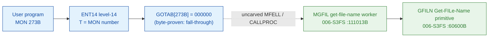

# MON 273B (octal) - GetFileName (MGFIL)

Gets the name of a file from its directory index, user index and object index;
the file name (and, per the manual, type/version) are returned in a caller
buffer. The file need not be open. It shares one code body with the sibling entry
`DEABF` (two words later); the two enter and the body forks on a read/write skip
flag (`SSK`).

**Status:** GOTAB dispatch head byte-proven as **fall-through** (`GOTAB[273B] = 000000`,
no per-call stub); the `MGFIL` worker body is real SINTRAN L bytes and calls the
`GFILN` Get-FILe-Name primitive; the exact `MON 273 -> worker` link crosses an
uncarved kernel bridge (see [Honest caveats](#honest-caveats)). All
addresses/values are **octal**.

- **Full disassembly:** [`273B-GetFileName.ASM`](273B-GetFileName.ASM) - the actual code (the MGFIL worker body; there is no entry stub because the GOTAB slot is zero).
- **Bytes live once in** the canonical segment layer: [`../../segments-ref/`](../../segments-ref/).

---

## Dispatch path

The GOTAB slot is zero, so there is **no per-call entry stub**. The dashed hop
(`C -> E`) is the resident `MFELL`/`CALLPROC` fall-through second-level dispatch -
it is **not present in any carved segment**, so it is the one link that cannot be
followed statically.

---

## Code location (dispatch path)

Every row is a real region you can open. Byte offset = `(addr - loadbase)` in octal words x 2.

| Role | Segment (full disasm) | Addr range (octal) | Byte offset | Symbol | Verdict |
|------|------------------------|--------------------|-------------|--------|---------|
| GOTAB[273] dispatch word | [commoncode.asm](../../segments-ref/SINTRAN-DATA_commoncode/SINTRAN-DATA_commoncode.asm) - [.hex](../../segments-ref/SINTRAN-DATA_commoncode/SINTRAN-DATA_commoncode.hex) | `071526B` (1 word) | 59052 | `GOTAB+273` = `000000` | **VERIFIED** (fall-through) |
| resident MFELL/CALLPROC bridge | - (uncarved) | - | - | `CALLPROC` | **UNVERIFIED** |
| MGFIL/DEABF get-file-name worker body | [006-S3FS.asm](../../segments-ref/006-S3FS/006-S3FS.asm) - [.hex](../../segments-ref/006-S3FS/006-S3FS.hex) | `111013B-111207B` (125w) | 52246 | `MGFIL` (`DEABF`=111015B sibling) | real bytes; link **MISATTRIBUTED** |
| GFILN Get-FILe-Name primitive | [006-S3FS.asm](../../segments-ref/006-S3FS/006-S3FS.asm) - [.hex](../../segments-ref/006-S3FS/006-S3FS.hex) | `60600B` (call target) | 27392 | `GFILN` | called by MGFIL (link cell `111205`) - **VERIFIED** |

**Verify by hand:** `grep '^111013 ' ../../segments-ref/006-S3FS/006-S3FS.hex` -> byte offset `52246`;
then `dd if=../../../segments/006-S3FS.bin bs=1 skip=52246 count=8 | od -An -tx1` -> `f8 90 a8 02 f8 10 22 68`
(= octal `174220 124002 174020 021150` = `BSET ONE SSK` / `JMP 2` / `BSET ZRO SSK` / `STD I 150`,
the MGFIL entry, sibling DEABF entry two words on, and the joined body head).

The GOTAB slot itself:
`dd if=../../../resident/SINTRAN-DATA_commoncode.bin bs=1 skip=59052 count=2 | od -An -tx1` -> `00 00` (= `000000`, fall-through).

---

## Instruction walkthrough

Full listing: [`273B-GetFileName.ASM`](273B-GetFileName.ASM). The functional body
is the MGFIL worker (region B); there is no F16xx stub because `GOTAB[273] = 0`.
All calls to shared file-system workers are **indirect** (`JPL I` / `JMP I`)
through a table of pointer words at the tail of the window (`111166-111207`).
nd100-dis renders those pointer words as bogus instructions (`STF I`, `FAD I`,
`ADD I`, `ROP NOOP`) - they are **data (link cells)**, not code; their contents
are the real worker addresses (resolved below).

**Two-entry / SSK fork (`111013-111016`)** - `111013 BSET ONE SSK` sets the
selector to 1; MGFIL enters here, then `111014 JMP 2 -> 111016` jumps over the
sibling entry `DEABF` (`111015 BSET ZRO SSK`, selector 0) into the joined body at
`111016`. Both entries share the body from `111016` on and later fork on the flag
(`111023 BSKP ONE SSK`). This two-entry, single-body shape mirrors the
`WFILE`/`RFILE` pattern in [MON 120B](../120B-WriteToFile/README.md).

**Entry prologue (`111016-111022`)** - `111016 STD I 150` stashes the caller's
double-word parameter; `111021 SAB 165` builds a large local frame `B` (165 words
- Get-FileName carries name/type/id string buffers); `111022 JPL I 145` ->
`003752` is the shared resident prologue worker.

**Index parse / validate (`111031-111105`)** - the body loads and validates the
directory/user/object indices: `111034`/`111047`/`111077 JPL I -> 031075`
(**USCPS**), `111041`/`111104 JPL I -> 046231` (**FLPAR**, parameter parse),
`111051 JPL I 125 -> 030205` (**CPTYP**, file-type helper). Each failure jumps to
the store-status exit at `111164`.

**Resolve + fetch name (`111106-111151`)** - `111064 JPL I 114 -> 061044`
(**MDEAB**, the sibling worker) handles the remote/de-abbreviate branch;
`111126 JPL I 55 -> 020274` is a resident helper; `111133 JPL I 51 -> 101303`
(**CHDUO**) resolves the directory/user/object; then `111137 JPL I 46 -> 060600`
(**GFILN**, the Get-FILe-Name primitive) fetches the file name into the caller
buffer, and `111145 JPL I 41 -> 031072` (**SUCPS**) restores context.

**Exit (`111152-111165`)** - error paths load a literal (`SAA 113` at `111163`)
and `111164 STA ,B 2` writes the result word into the caller's status slot `B+2`;
every path funnels into the resident return `111150`/`111151 JMP I 36` -> `003776`.

The `JPL I 46` call to **GFILN** (link cell `111205 = 060600`) is the byte-level
proof that MGFIL is the GetFileName worker: `GFILN` is the file system's
Get-FILe-Name primitive. (`MGFIL = 111013B` was selected because it is the FILSYS
symbol the GetFileName anchor points at; the very-close sibling `DEABF = 111015B`
is a *different* entry into the same body, distinguished by the `SSK` flag, not
the top-level `MON 273` body.)

---

## Parameter / register contract

| Reg / field | Dir | Meaning | Verdict |
|-------------|-----|---------|---------|
| entry point | in | `111013B` = MGFIL (SSK=1); `111015B` = DEABF sibling (SSK=0), shared body, `SSK` split | VERIFIED (bytes) |
| `SSK` | internal | MGFIL (1) / DEABF (0) selector; set at entry, tested at `111023` | VERIFIED (bytes) |
| `D` (double) | in | caller parameter block, saved first (`STD I 150`) | VERIFIED (copy); layout inferred |
| local frame `B` | internal | `SAB 165` = 165-word working frame | VERIFIED (bytes) |
| `B+6` | internal | SSK-derived mode flag (`STA ,B 6`/`STZ ,B 6` at `111025`/`111030`) | VERIFIED (bytes) |
| `T` (manual) | in | INDEX: left byte = directory index, right byte = user index | inferred (manual MAC example) |
| `A` (manual) | in | object index (bit 15 set = remote file) | inferred (manual) |
| `X` (manual) | in | address of buffer to receive the file name | inferred (manual) |
| `D` (manual) | in | remote-system id address (if remote bit set) | inferred (manual) |
| `B+2` | out | returned status word (`STA ,B 2` at `111164`) | VERIFIED (bytes) |
| error `113` | out | error literal (`SAA 113` at `111163`) | VERIFIED (bytes); mapping inferred |

The user-visible `T`/`A`/`X`/`D` register convention lives in the caller-side
`MON 273` wrapper and the uncarved `MFELL`/`CALLPROC` frame, so the precise
user-register-to-field assignment is **inferred** from the manual, not
byte-proven here. The error literal `113` is VERIFIED in the code; its mapping to
the SINTRAN error-code table is **UNVERIFIED**.

---

## Pseudo-code (for an emulator)

See **[`273B-GetFileName.pseudo.c`](273B-GetFileName.pseudo.c)** - a pseudo-C
model of the handler for emulator authors. Control flow + the `SSK` two-entry
fork + the call to the GFILN primitive are byte-verified; the parameter-field
semantics and error-number meanings are inferred from the call structure and the
manual. Every instruction is translated per the canonical
[`ND100-INSTRUCTION-SEMANTICS.md`](../../instruction-semantics/ND100-INSTRUCTION-SEMANTICS.md).

---

## Honest caveats

**What is byte-proven:** `GOTAB[273B] = 000000` (level-14 dispatch, a fall-through
with no per-call vector); the `MGFIL` worker body at `111013B` in `006-S3FS` is
real code (entry bytes `174220 124002 174020 021150` match the disassembly); it
enters two words before the sibling `DEABF` and both share one `SSK`-forked body;
and it drives the file-name lookup - it calls `GFILN` (`060600B`, link cell
`111205`), the file-system Get-FILe-Name primitive.

**What is NOT proven:** the link from the zero GOTAB slot to the `MGFIL` worker.
Because the vector is zero there is no stub to disassemble and no pointer to
dereference; dispatch drops into the resident `MFELL`/`CALLPROC` second-level
path, which lives in an **uncarved overlay**. So the `MON 273 -> MGFIL`
attribution rests on the `MGFIL` symbol name + its call to `GFILN` + the matching
get-name behaviour, not a followed pointer - hence **MISATTRIBUTED** in the strict
sense. Confirming the link needs a live trace: issue a real `MON 273`, single-step
the level-14 fall-through into the resident `CALLPROC` dispatch, and confirm P
lands on `MGFIL = 111013`.

The very-close sibling symbol `DEABF = 111015B` is only two words after `MGFIL`;
the worker window was bounded carefully so it starts at `MGFIL = 111013B` and runs
to the joined body's control-flow closure at `111207B` (up to but not including
`FOBJN = 111210B`), covering both entries and the shared code. One link-cell
target (`020274`) and the prologue/return cells (`003752`, `003776`) sit below the
`26000B` segment load base; they are resident-monitor / save-restore routines
outside the file-system segment and are not resolved here.

Method: [../../../../../EXTRACTING-RESIDENT-CODE.md](../../../../../EXTRACTING-RESIDENT-CODE.md) - dispatch reality:
[../../TASK-05-mismatches.md](../../TASK-05-mismatches.md) - master map: [../../MON-CALL-INDEX.md](../../MON-CALL-INDEX.md).
