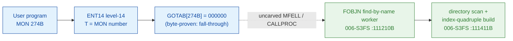

# MON 274B (octal) - GetFileIndexes (FOBJN)

Gets the directory index, the user index, the object index, and the next-version
object index of a file, identified by name. These are the indexes that address the
file inside the SINTRAN III File System. Unlike
[MON 217B GetAllFileIndexes](../217B-GetAllFileIndexes/README.md), the file **need
not be open** - the worker resolves the name against the directory itself.

**Status:** GOTAB dispatch head byte-proven as **fall-through** (`GOTAB[274B] =
000000`, no per-call stub); the `FOBJN` worker body is real SINTRAN L bytes and
builds the returned index quadruple with the **same** byte sequence used by the
`GUIOI` worker (MON 217B). The exact `MON 274 -> worker` link crosses an uncarved
kernel bridge (see [Honest caveats](#honest-caveats)). All addresses/values are **octal**.

- **Full disassembly:** [`274B-GetFileIndexes.ASM`](274B-GetFileIndexes.ASM) - the `FOBJN` worker body (there is no entry stub because the GOTAB slot is zero).
- **Bytes live once in** the canonical segment layer: [`../../segments-ref/`](../../segments-ref/).

---

## Dispatch path

The GOTAB slot is zero, so there is **no per-call entry stub**. The dashed hop
(`C -> E`) is the resident `MFELL`/`CALLPROC` fall-through second-level dispatch -
it is **not present in any carved segment**, so it is the one link that cannot be
followed statically.

---

## Code location (dispatch path)

Every row is a real region you can open. Byte offset is the `006-S3FS.hex` byte offset.

| Role | Segment (full disasm) | Addr range (octal) | Byte offset | Symbol | Verdict |
|------|------------------------|--------------------|-------------|--------|---------|
| GOTAB[274] dispatch word | [commoncode.asm](../../segments-ref/SINTRAN-DATA_commoncode/SINTRAN-DATA_commoncode.asm) - [.hex](../../segments-ref/SINTRAN-DATA_commoncode/SINTRAN-DATA_commoncode.hex) | `071527B` (1 word) | 59054 | `GOTAB+274` = `000000` | **VERIFIED** (fall-through) |
| resident MFELL/CALLPROC bridge | - (uncarved) | - | - | `CALLPROC` | **UNVERIFIED** |
| FOBJN find-by-name worker (+ FOPFN sibling entry) | [006-S3FS.asm](../../segments-ref/006-S3FS/006-S3FS.asm) - [.hex](../../segments-ref/006-S3FS/006-S3FS.hex) | `111210B-111500B` (185w) | 52496 | `FOBJN` | real bytes; link **MISATTRIBUTED** |
| index-quadruple build | [006-S3FS.asm](../../segments-ref/006-S3FS/006-S3FS.asm) - [.hex](../../segments-ref/006-S3FS/006-S3FS.hex) | `111411B-111431B` | 52754 | (inside `FOBJN`) | real bytes - **VERIFIED** |

**Verify by hand:** `grep '^111210 ' ../../segments-ref/006-S3FS/006-S3FS.hex` -> byte offset `52496`;
then `dd if=../../../segments/006-S3FS.bin bs=1 skip=52496 count=8 | od -An -tx1` -> `f8 90 a8 02 f8 10 22 36`
(= octal `174220 124002 174020 021066` = `BSET ONE SSK` / `JMP 2` / `BSET ZRO SSK` (FOPFN) / `STD I 66`, the FOBJN entry).

The GOTAB slot itself:
`dd if=../../../resident/SINTRAN-DATA_commoncode.bin bs=1 skip=59054 count=2 | od -An -tx1` -> `00 00` (= `000000`, fall-through).

---

## Instruction walkthrough

Full listing: [`274B-GetFileIndexes.ASM`](274B-GetFileIndexes.ASM). There is no
F16xx/F17xx stub because `GOTAB[274] = 0`.

**Mode-select entry (`111210-111213`)** - `FOBJN` (`111210 BSET ONE SSK`) and its
sibling `FOPFN` (`111212 BSET ZRO SSK`) set/clear the STS `K` flag, then both merge
at `111213 STD I 66` which stashes the caller's parameter double-word and
`111216 SAB 122` builds a 122-word local frame. The `K` flag is turned into an
open-flag word at `111220-111225` (`BSKP ONE SSK` -> `STA ,B 121`).

**Name parse + directory resolve (`111226-111254`)** - `111230 STA ,B 113` records
the file-name buffer pointer; `111232 JPL I 53` parses the name; the following
calls resolve the default directory / user for the parsed name.

**Directory walk (`111350-111401`)** - the loop reads directory entries, compares
the entry's dir index (`111362 LDA ,X 15`) and user index (`111366 LDA ,X 16`)
against the parsed target, advances by `111400 AAX 2`, and ends when the table
pointer wraps (`111352 SKP IF DX UEQ ST`).

**Index-quadruple build (`111411-111431`)** - the returned words are packed with
the **same** shape as `GUIOI` (MON 217B): the dir index is shifted into the left
byte and the user index into the right byte of the `INDEX` word
(`111415-111423 SHA ZIN 10` / `SHA ZIN SHR 10` / `RADD ST DA` / `STA ,B 1`); the
object index goes to `B+3` (`111414`) and the next-version object index to `B+2`
(`111424-111430`). `111431 MIN ,B 4` bumps the success flag. This identical packing
sequence is the byte-level proof that `FOBJN` is the GetFileIndexes worker.

**Finish (`111432-111500`)** - the epilogue restores state and every path funnels
into the resident return `111440 JMP I 40` -> `111500 = 003776`.

---

## Parameter / register contract

| Reg / field | Dir | Meaning | Verdict |
|-------------|-----|---------|---------|
| entry point | in | `111210B` = FOBJN worker entry (fall-through, no stub) | VERIFIED (bytes) |
| STS `K` flag | in | mode select: FOBJN sets it, FOPFN clears it (`BSET ONE/ZRO SSK`) | VERIFIED (bytes) |
| `X` (manual) | in | address of the file-name string | inferred (manual MAC example) |
| local frame `B` | internal | `SAB 122` = 122-word working frame | VERIFIED (bytes) |
| `B+121` | internal | open-flag derived from `K` (`BSKP ONE SSK`) | VERIFIED (bytes) |
| `T` (manual) | out | `INDEX`: directory index (left byte) + user index (right byte) | inferred (manual MAC example) |
| `A` (manual) | out | object index (`OBJIX`) | inferred (manual MAC example) |
| `D` (manual) | out | object index of the next file version (`NEXTO`) | inferred (manual MAC example) |
| `B+1` | out | INDEX word (dir/user), built at `111423` | VERIFIED (bytes) |
| `B+2` | out | next-object index, built at `111430` | VERIFIED (bytes); role inferred |
| `B+3` | out | object index, stored at `111414` | VERIFIED (bytes); role inferred |
| error at `111402` | out | not-found error number (`LDA 71`) | VERIFIED (bytes); mapping inferred |

The user-visible `X`-in / `T`/`A`/`D`-out convention lives in the caller-side
`MON 274` wrapper and the uncarved `MFELL`/`CALLPROC` frame, so the precise
user-register-to-field assignment is **inferred** from the manual
([`274B_GetFileIndexes.yaml`](../../../../../../../Developer/MON/calls/274B_GetFileIndexes.yaml)),
not byte-proven here.

---

## Pseudo-code (for an emulator)

See **[`274B-GetFileIndexes.pseudo.c`](274B-GetFileIndexes.pseudo.c)** - a pseudo-C
model of the handler for emulator authors. Control flow and the index-quadruple
build are byte-verified; the index-field roles and error-number meanings are
inferred from the call structure, the manual, and the identical `GUIOI` packing.

Every instruction in the model is translated per the canonical
[`ND100-INSTRUCTION-SEMANTICS.md`](../../instruction-semantics/ND100-INSTRUCTION-SEMANTICS.md)
(bare `LDA disp` = `mem[P+disp]`; `RADD CLD Sx Dy` = `Dy = Sx`; `BSET/BSKP` on STS
bit `K` = STS bit2; `SHA ZIN`/`SHA ZIN SHR` logical shifts; `MIN ,B 4` success bump).

---

## Honest caveats

**What is byte-proven:** `GOTAB[274B] = 000000` (level-14 dispatch, a fall-through
with no per-call vector); the `FOBJN` worker body at `111210B` in `006-S3FS` is real
code (entry bytes `174220 124002 174020 021066` match the disassembly); and it
belongs to the file-index family - it packs a directory/user/object/next-object
index quadruple into the caller frame using the **identical** `SHA ZIN` byte-pack
sequence as `GUIOI` (`111411-111431`).

**What is NOT proven:** the link from the zero GOTAB slot to the `FOBJN` worker.
Because the vector is zero there is no stub to disassemble and no pointer to
dereference; dispatch drops into the resident `MFELL`/`CALLPROC` second-level path,
which lives in an **uncarved overlay**. So the `MON 274 -> FOBJN` attribution rests
on the `FOBJN` symbol name + its index-quadruple behaviour + the matching
by-name (file-need-not-be-open) contract, not a followed pointer - hence
**MISATTRIBUTED** in the strict sense. Confirming the link needs a live trace:
issue a real `MON 274`, single-step the level-14 fall-through into the resident
`CALLPROC` dispatch, and confirm P lands on `FOBJN = 111210`.

**Region bound:** the `FOBJN` body is bounded strictly to the next symbol
`SDRUS = 111501B` (185 words); its shared body closes on the `003776` resident-return
link cell at `111500`.

Several link-cell contents (`031075`, `031310`, `031312`, `031313`, `031316`,
`031470`, `031474`, `031476`, `031477`) match no `FILSYS-SYMBOLS` entry; their low
addresses suggest resident-monitor / directory-primitive routines outside the
file-system segment and are not resolved here.

Method: [../../../../../EXTRACTING-RESIDENT-CODE.md](../../../../../EXTRACTING-RESIDENT-CODE.md) - dispatch reality:
[../../TASK-05-mismatches.md](../../TASK-05-mismatches.md) - master map: [../../MON-CALL-INDEX.md](../../MON-CALL-INDEX.md).
