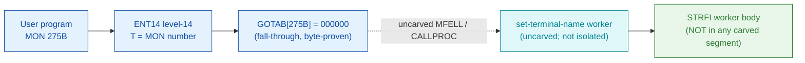

# MON 275B (octal) - SetTerminalName (STRFI)

> **CORRECTED 2026-07-15 (byte-verified).** The worker + dispatch described below are on the
> DEBUNKED model and are WRONG. Byte truth from the carved L07 image:
> `MCTAB[275B] = 006115B = SETTF=106043B` in segment 006-S3FS, reached by the real dispatch
> `MON 275B -> ENT14(072167B) -> GOTAB[275B]=MFELL(072114B) -> CALLP(032201B) -> MCTAB[275B]=SETTF`.
> Any "GOTAB from commoncode" / "uncarved CALLPROC bridge" / "F16xx stub" / old worker name below
> is an artefact of the wrong table. Verified: `dd if=044-S3IDPIT.bin bs=1 skip=2202 count=2`
> -> `8c 23`. Cross-ref ../317B-ExecuteCommand/README.md and SINTRAN/CARVING-HANDOFF.md sec 3a.

Defines the file name used for terminals (normally `TERMINAL:`). Background users
identify their own terminal with this file name; the call may be issued repeatedly.

**Status:** `documented`. `GOTAB[275B] = 000000` (byte-proven) - a **fall-through**:
there is no direct GOTAB handler word, so the level-14 handler is reached through the
resident MFELL/CALLPROC path (uncarved). **No worker region is isolated** for this call:
the manual short name `STRFI` has **no matching symbol** in any carved segment, and the
nearest name `STERM=041333B` is a **data variable** (words `000000`/`000035`, not code).
So the set-terminal-name worker body cannot be read from these carved bytes; the
attribution rests on the manual name only (see [Honest caveats](#honest-caveats)). All
addresses/values are **octal**.

- **Full disassembly:** [`275B-SetTerminalName.ASM`](275B-SetTerminalName.ASM) - documents the absence of a carved worker (and the `STERM` data cell).
- **Bytes live once in** the canonical segment layer: [`../../segments-ref/`](../../segments-ref/).

---

## Dispatch path

The dashed hop (`C -> D`) is the resident `MFELL`/`CALLPROC` fall-through - it is **not
present in any carved segment**. `GOTAB[275B]` is literally `000000`, so there is no
entry stub to disassemble; dispatch enters the resident handler, whose body (short name
`STRFI`) is **not present** in the carved bytes.

---

## Code location (dispatch path)

Every row is a real region you can open. Byte offset = `(addr - loadbase)` in octal
words x 2; the commoncode load base is `0`, so the byte offset is simply `octal-addr x 2`
(decimal).

| Role | Segment (full disasm) | Addr range (octal) | Byte offset | Symbol | Verdict |
|------|------------------------|--------------------|-------------|--------|---------|
| GOTAB[275] dispatch word | [commoncode.asm](../../segments-ref/SINTRAN-DATA_commoncode/SINTRAN-DATA_commoncode.asm) - [.hex](../../segments-ref/SINTRAN-DATA_commoncode/SINTRAN-DATA_commoncode.hex) | `071530B` (1 word) | 59056 | `GOTAB+275` = `000000` | **VERIFIED** (fall-through) |
| resident MFELL/CALLPROC bridge | - (uncarved) | - | - | `MFELL`/`CALLPROC` | **UNVERIFIED** |
| STRFI worker body | - (not in any carved segment) | - | - | `STRFI` | **NOT LOCATED**; body link **MISATTRIBUTED** |
| STERM data variable | [commoncode.asm](../../segments-ref/SINTRAN-DATA_commoncode/SINTRAN-DATA_commoncode.asm) - [.hex](../../segments-ref/SINTRAN-DATA_commoncode/SINTRAN-DATA_commoncode.hex) | `041333B-041334B` (2 words) | 34230 | `STERM` | **DATA** (not the worker) |

There is no entry-stub row: `GOTAB[275]` is `000000`, a resident fall-through, not a
`025-S3IRPIT` stub.

**Verify by hand:** the GOTAB word is a zero (fall-through):
`grep '^71530 ' ../../segments-ref/SINTRAN-DATA_commoncode/SINTRAN-DATA_commoncode.hex`
-> `71530  000000  000 000  59056`; then
`dd if=../../../resident/SINTRAN-DATA_commoncode.bin bs=1 skip=59056 count=2 2>/dev/null | od -An -tx1`
-> `00 00` (= `000000`, fall-through). The `STERM` data cell:
`grep '^41333 ' ../../segments-ref/SINTRAN-DATA_commoncode/SINTRAN-DATA_commoncode.hex`
-> `41333  000000  000 000  34230`; then
`dd if=../../../resident/SINTRAN-DATA_commoncode.bin bs=1 skip=34230 count=2 2>/dev/null | od -An -tx1`
-> `00 00` (the stored word = `000000` - a data variable, not code). `prove-mon.py 275`
reads the same GOTAB zero.

---

## Instruction walkthrough

Full listing: [`275B-SetTerminalName.ASM`](275B-SetTerminalName.ASM). There is no entry
stub (fall-through dispatch) and no carved worker body, so there is no executable
walkthrough. The nearest matching symbol `STERM=041333B` is a **data variable** (words
`000000`/`000035`), not the worker.

---

## Parameter / register contract

Manual-side names/types are from [`275B_SetTerminalName.yaml`](../../../../../../../Developer/MON/calls/275B_SetTerminalName.yaml).

| Reg / field | Dir | Meaning | Verdict |
|-------------|-----|---------|---------|
| `TerminalName` | in | file-name string for terminals (64 chars), normally `TERMINAL` | inferred (manual) |
| error return | out | standard error code in `A` | inferred (manual) |

No worker is carved for this call, so **nothing** in this contract is byte-proven; every
row is **inferred** from the manual and the caller-side `MON 275` wrapper.

---

## Pseudo-code (for an emulator)

See **[`275B-SetTerminalName.pseudo.c`](275B-SetTerminalName.pseudo.c)** - a pseudo-C
model for emulator authors. Because no worker is carved for this call (the `STRFI`
symbol is absent and `STERM` is data), the model is of the **documented** behaviour
only, NOT carved code. The fall-through `MON 275 -> worker` bridge is modelled but not
proven.

Instruction semantics (where any real code is referenced) follow the canonical
reference:
[`../../instruction-semantics/ND100-INSTRUCTION-SEMANTICS.md`](../../instruction-semantics/ND100-INSTRUCTION-SEMANTICS.md).

---

## Honest caveats

**What is byte-proven:** `GOTAB[275B] = 000000` (level-14 fall-through; `prove-mon.py
275` reads commoncode file byte `0xe6b0 = 00 00`). That is the only fact these carved
bytes establish for this call.

**What is NOT proven:** anything about the worker body. The manual short name `STRFI` has
**no matching symbol** in any carved segment (commoncode, `006-S3FS`, `025-S3IRPIT`), and
the nearest name `STERM=041333B` is a **data variable** (`000000`/`000035`), not code - so
the set-terminal-name worker is simply **absent** from this carve. And because
`GOTAB[275]` is `000000`, there is no stub to follow; dispatch enters the resident
`MFELL`/`CALLPROC` handler in an **uncarved overlay**. SetTerminalName is a sibling of
SetPeripheralName (MON 234B, worker `SPEFI` in `006-S3FS`), so a shared or adjacent
peripheral/terminal-file body is plausible, but that is **inferred**, not byte-proven -
hence **MISATTRIBUTED**. Confirming the actual worker needs a live trace of a real
`MON 275`.

Method: [../../../../../EXTRACTING-RESIDENT-CODE.md](../../../../../EXTRACTING-RESIDENT-CODE.md) - dispatch reality:
[../../TASK-05-mismatches.md](../../TASK-05-mismatches.md) - master map: [../../MON-CALL-INDEX.md](../../MON-CALL-INDEX.md).
