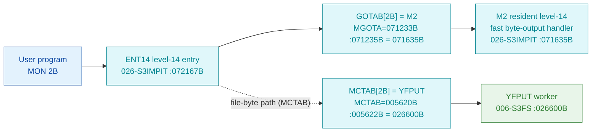

# MON 2B (octal) - OutByte (OUTBT)

Writes **one byte** to a character device (a terminal, an opened file, or a word-oriented device
where one word is written). The program waits if the device output buffer is full (unless a
no-wait flag is set); for a mass-storage file the next-byte pointer is incremented. This is an
ND-100 monitor call.

**Status:** **byte-verified** (both dispatch paths + worker body). All addresses/values are
**octal**.

> **CORRECTED 2026-07-13.** The previous version of this folder said the call was
> `misattributed`, claiming `GOTAB[2B] = 000000` (a "fall-through") and naming the worker
> `OUTBT = 032355B` in resident commoncode. **Both were artefacts of the wrong dispatch model.**
> The `000000` was read out of `SINTRAN-DATA_commoncode`'s fake "GOTAB" (its slot 0 is zero) -
> not the real table. Byte-proven: `GOTAB[2B] = 071635B = M2`, a **resident level-14 fast
> handler** (one of the 32 GOTAB slots that are NOT `MFELL`), and `MCTAB[2B] = 026600B = YFPUT`,
> the filesystem byte-output worker, carved in `006-S3FS`. See
> [`../317B-ExecuteCommand/README.md`](../317B-ExecuteCommand/README.md) and
> `SINTRAN/CARVING-HANDOFF.md` section 3a.

- **Full disassembly:** [`2B-OutByte.ASM`](2B-OutByte.ASM).
- **Emulator model:** [`2B-OutByte.pseudo.c`](2B-OutByte.pseudo.c).
- **Bytes live once in** the canonical segment layer: [`../../segments-ref/`](../../segments-ref/).

---

## Dispatch path

MON 2B is a **fast-path** call: its `GOTAB` slot is a resident level-14 handler (`M2`), not
`MFELL`. The filesystem byte-output worker `YFPUT` is named by `MCTAB[2B]`.



Unlike the 224 `MFELL` calls, `GOTAB[2B]` jumps straight to the resident level-14 handler `M2`
(byte-proven: slot value `071635B`, exactly the `M2` symbol the skill cites as GOTAB slot 2).
`MCTAB[2B] = YFPUT` is the filesystem byte-output worker. The **exact runtime hand-off** between
the `M2` fast path and the `YFPUT` file-byte worker is **INFERRED** (dashed hop) - not
byte-proven here.

---

## Code location (dispatch path)

Byte offset = `(addr - loadbase)` in octal words x 2 (decimal). Offsets reproduced with `dd`.

| Role | Segment | Addr (octal) | Byte offset | Symbol | Verdict |
|------|---------|--------------|-------------|--------|---------|
| GOTAB[2B] slot | [026-S3IMPIT.asm](../../segments-ref/026-S3IMPIT/026-S3IMPIT.asm) | `071235B` = `071635B` | 32058 | -> `M2` (fast handler) | **VERIFIED** |
| MCTAB[2B] slot | [044-S3IDPIT.asm](../../segments-ref/044-S3IDPIT/044-S3IDPIT.asm) | `005622B` = `026600B` | 1828 | -> `YFPUT` | **VERIFIED** |
| YFPUT worker body | [006-S3FS.asm](../../segments-ref/006-S3FS/006-S3FS.asm) | `026600B-026640B` | 768 | `YFPUT` | **VERIFIED** |

**Verify by hand** (from `tools/sintran-segment-carver/versions/L-VSX-500/segments/`):
```
dd if=026-S3IMPIT.bin bs=1 skip=32058 count=2 | od -An -tx1   ->  73 9d   (= 071635B = M2, NOT MFELL)
dd if=044-S3IDPIT.bin bs=1 skip=1828  count=2 | od -An -tx1   ->  2d 80   (= 026600B = YFPUT)
dd if=006-S3FS.bin    bs=1 skip=768   count=2 | od -An -tx1   ->  50 25   (= 050045B, YFPUT entry: LDT 45)
```

---

## Instruction walkthrough

Full listing: [`2B-OutByte.ASM`](2B-OutByte.ASM).

**Two entries, one body.** `YFPUT` (`026600B`, MON 2B output) and `YFGET` (`026576B`, MON 1B
input) are a paired put/get primitive that share a single body from `026601B`:
- `YFPUT`: `LDT 45` and falls through to `026601B` - loads a put selector into `T`.
- `YFGET`: `LDT 46` then `JMP 2` (`-> 026601B`) - loads a get selector into `T`.

**Shared body (`026601B` onward).** `STT ,X 30` stores the put/get selector into the open-file
control block at `,X 30`, then `JPL I 44` (`-> 026646B`) calls the byte-transfer helper. The
code sets a status flag (`SAA 1` / `STA ,B 21`), clears a byte counter (`STZ ,B 27`), reloads a
control-block pointer (`LDT I 40`) and tests it, forking between an in-buffer fast return and a
flush/error path (error codes `132B`/`133B` via `SAA 132`/`SAA 133`, branching back to the
shared tail at `026555B`).

The two-entry structure, the selector store and the transfer-helper call are byte-proven; the
detailed buffer-flush logic in the helper is **inferred** from the get/put pairing. (For output,
the shared helper flushes the buffer when full; the byte-proven bytes are identical to the get
side - only the `T` selector differs.)

---

## Parameter / register contract

| Reg / field | Dir | Meaning | Verdict |
|-------------|-----|---------|---------|
| device / file number | in | selects the output destination (terminal, opened file, device) | inferred (manual) |
| byte value | in | the byte to write (consumed by the transfer helper) | VERIFIED (structure); register inferred |
| `T` selector | internal | `45B` for put (`YFPUT`); stored into control block `,X 30` | VERIFIED (bytes) |
| `,B 21` | frame | status flag set to 1 | VERIFIED (bytes) |
| `,B 27` | frame | byte counter cleared | VERIFIED (bytes) |
| wait behaviour | in/out | waits if output buffer full unless no-wait flag set | inferred (manual) |

---

## Pseudo-code (for an emulator)

See **[`2B-OutByte.pseudo.c`](2B-OutByte.pseudo.c)** - the two-entry get/put selector, the
control-block store and the transfer-helper call are byte-verified; the buffer-flush logic and
the `M2` fast-path hand-off are inferred.

---

## Honest caveats

**What is byte-proven:** `GOTAB[2B] = 071635B = M2` (a resident level-14 fast handler, NOT
`MFELL`); `MCTAB[2B] = 026600B = YFPUT`; the `YFPUT` entry bytes at `026600B` in `006-S3FS` match
the disassembly (`050045B = LDT 45`); `YFPUT`/`YFGET` are a shared-body put/get pair
distinguished only by the `T` selector (`45B`/`46B`).

**What is NOT proven:** the exact runtime relationship between the `M2` level-14 fast path and
the `YFPUT` file-byte worker (whether `M2` tail-calls `YFPUT` for the opened-file case, or the
monitor level reaches `YFPUT` via `MCTAB` independently) - this is the dashed hop and is
**INFERRED**. The buffer-flush logic in the `026646B`/`026652B` helpers is not carved here, and
the wait/no-wait behaviour comes from the manual.

**Correction to earlier work.** The old folder read `GOTAB` out of `SINTRAN-DATA_commoncode`
(the fake table) and reported `GOTAB[2B] = 000000` (fall-through) with the worker
`OUTBT = 032355B`. The real `GOTAB[2B] = M2 = 071635B` and the real worker is
`MCTAB[2B] = YFPUT = 026600B`. The `000000`/`OUTBT` reading was the wrong-overlay error.

Method: [../../../../../EXTRACTING-RESIDENT-CODE.md](../../../../../EXTRACTING-RESIDENT-CODE.md) -
master map: [../../MON-CALL-INDEX.md](../../MON-CALL-INDEX.md).
