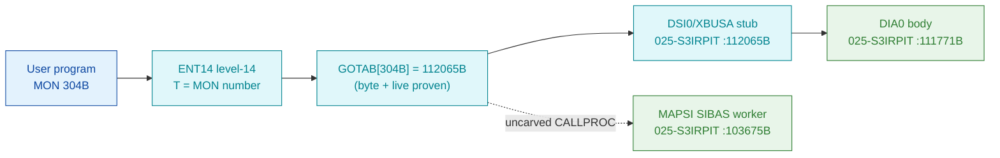

# MON 304B (octal) — SendSIBASMessage (MAPSI)

Sends a request message to a SIBAS database server (ND-100 RT-common or the ND-500) and
receives its answer, blocking the caller until SIBAS replies. NOTE: this is MON 304B — the
manual's "Performance 304B" is an OCR error (Performance is 344B).

**Status:** the GOTAB dispatch word is byte-proven, but it does **not** point at the SIBAS
handler. `GOTAB[304] = 112065B` (live + byte proven) lands on `DSI0/XBUSA` in the DSI/DIA block;
the semantic `MAPSI` SIBAS worker is real SINTRAN L bytes but is **unreachable** from `GOTAB[304]`
and from every GOTAB slot 0..377 — it is reached only across the uncarved resident `CALLPROC`
bridge (see [Honest caveats](#honest-caveats)). All addresses/values are **octal**.

- **Full disassembly:** [`304B-SendSIBASMessage.ASM`](304B-SendSIBASMessage.ASM) — both regions
  (the `DSI0`/`DIA0` dispatch target and the `MAPSI`/`MSIBB`/`TISIB` SIBAS worker).
- **Bytes live once in** the canonical segment layer: [`../../segments-ref/`](../../segments-ref/).

---

## Dispatch path



The solid edge (`C → D → E`) is byte-proven: `GOTAB[304]` = `112065B` = `DSI0`, a 2-word stub
(`ION` / `JMP -75`) that jumps into the `DIA0` body at `111771B`. The dashed hop (`C ⇢ F`) is the
resident `CALLPROC`/second-level dispatch to the semantic `MAPSI` SIBAS handler — it is **not
present in any carved segment**, so it is the one link that cannot be followed statically.

---

## Code location (dispatch path)

Ground truth: `python3 scripts/prove-mon.py 304` → `GOTAB[304] = 112065B` (big-endian `94 35`).
Byte offset of octal address `A` in a segment with load base `L`: `word = (A − L)` in octal,
`byte = word × 2` (decimal). Rows are in execution order; `DISPATCH.md`'s byte-verdict wins.

| Role | Segment (full disasm) | Addr range (octal) | Byte offset | Symbol | Verdict |
|------|------------------------|--------------------|-------------|--------|---------|
| GOTAB[304] dispatch word | [commoncode.asm](../../segments-ref/SINTRAN-DATA_commoncode/SINTRAN-DATA_commoncode.asm) · [.hex](../../segments-ref/SINTRAN-DATA_commoncode/SINTRAN-DATA_commoncode.hex) | `071537B` (1 word) | 59070 | `GOTAB+304` = `112065B` | **VERIFIED** (raw word `94 35`) |
| DSI0/XBUSA entry stub | [025-S3IRPIT.asm](../../segments-ref/025-S3IRPIT/025-S3IRPIT.asm) · [.hex](../../segments-ref/025-S3IRPIT/025-S3IRPIT.hex) | `112065B–112066B` | 49258 | `DSI0`/`XBUSA` | **VERIFIED** (`150402` ION; `124303` JMP -75 → `111771B`) |
| DIA0 body (entered at 111771B) | [025-S3IRPIT.asm](../../segments-ref/025-S3IRPIT/025-S3IRPIT.asm) · [.hex](../../segments-ref/025-S3IRPIT/025-S3IRPIT.hex) | `111752B–112113B` | 49108 | `DIA0` | bytes **VERIFIED**; semantics **UNVERIFIED** (issues MON 131/64/116/134 — RT-level, not clean L14) |
| resident CALLPROC bridge | — (uncarved) | — | — | `CALLPROC` | **UNVERIFIED** |
| MAPSI SIBAS worker body | [025-S3IRPIT.asm](../../segments-ref/025-S3IRPIT/025-S3IRPIT.asm) · [.hex](../../segments-ref/025-S3IRPIT/025-S3IRPIT.hex) | `103675B–104351B` | 42874 | `MAPSI`/`MSIBB`/`TISIB` | real bytes; link **MISATTRIBUTED** (unreachable from GOTAB[304] and every slot 0..377) |

**Verify by hand:** `grep '^71537 ' ../../segments-ref/SINTRAN-DATA_commoncode/SINTRAN-DATA_commoncode.hex`
→ `71537  112065  224 065  59070` (word `112065B`, byte offset 59070); then
`dd if=../../../resident/SINTRAN-DATA_commoncode.bin bs=1 skip=59070 count=2 | od -An -tx1` → `94 35`.
For the DSI0 target: `dd if=../../../segments/025-S3IRPIT.bin bs=1 skip=49258 count=2 | od -An -tx1`
→ `d1 02` (= octal `150402`, `ION`, the DSI0 stub head).

---

## Instruction walkthrough

Full listing: [`304B-SendSIBASMessage.ASM`](304B-SendSIBASMessage.ASM). Two regions.

**Region A — the byte-proven GOTAB target (`DSI0` → `DIA0` body).**
`GOTAB[304] = 112065B` = `DSI0`/`XBUSA`, a 2-word stub:
```
112065  150402  ION
112066  124303  JMP -75        ; -> 111771B, into the DIA0 body
```
The `DIA0` body (`111752B–112113B`) reads a status/flags word (`111771 LDT ,B 33`), branches on its
bits, and on the main path does a block transfer: `112016 ION` / `112021 MON 131` (ABSTR /
DataTransfer) / `112023 IOF`. Its error path (`112077–112112`) issues `MON 64` (ERMSG),
`MON 116` (UNFIX) and `MON 134` (RTEXT); the tail (`112055–112064`) uses `IRW 20 DP` / `MST PID`
(RT scheduling). **ANOMALY:** issuing `MON` and using `IRW/MST PID` is resident RT-program/driver
behaviour, not clean level-14 handler code — hence the DIA0 semantics are **UNVERIFIED** pending a
live trace (the stub→body edges are byte-solid).

**Region B — the semantic SIBAS handler (`MAPSI`).**
`MAPSI` at `103675B` decodes as a clean level-14 SIBAS handler and issues **no** MON instructions:
```
103675  146173  RADD CLD SX DB   ; X=:B
103676  170404  SAA 4            ; MLEV
103677  150207  MCL PIE          ; *MCL PIE
103706  044411  LDA ,B 11        ; fetch ZTREG (SIBAS device number)
103707  051150  LDT I 150        ; MXSIB
103710  141456  SKP IF DT MGRE SA ; IF ZTREG > MXSIB -> error exit
```
It then locates the SIBAS device block, copies the request into RT-common (`104051 MOVEW`,
*MOVAP-style), reactivates the SIBAS server, blocks for the reply, copies the answer back
(`104170 MOVEW`, *MOVPA-style), and stages the result (`174` bad size, `-1/-2/-3` errors, `0` OK)
into `,B 12` before returning (`104216 STA ,B 12` / `104220 JMP I`). `MSIBB=104221B` and
`TISIB=104315B` are sibling entries in the same body. This matches the NPL
`SUBR MAPSIB,MSIBB,TISIBB` structure — but it is **not** what `GOTAB[304]` reaches.

---

## Parameter / register contract

| Reg / field | Dir | Meaning | Verdict |
|-------------|-----|---------|---------|
| `ZTREG` (`,B 11`) | in | SIBAS device number (`≤ MXSIB`, checked at `103710`) | VERIFIED bounds check; slot mapping inferred |
| `ZXREG` | in | address of message (length in word S1, max `177×4`) | inferred (NPL contract) |
| `ZAREG` (`,B 12`) | out | `0` OK; `-1/-2/-3` errors; `174` bad size (staged `104207–104216`) | VERIFIED result-code stores; meaning inferred |
| entry point | in | `MAPSI=103675B` (message xfer); `MSIBB=104221B`, `TISIB=104315B` siblings | VERIFIED (bytes) |
| GOTAB target | dispatch | `GOTAB[304]=112065B` → `DSI0`, **not** `MAPSI` | VERIFIED (byte + live) |

The user-visible register convention lives in the caller-side `MON 304` wrapper and the uncarved
`CALLPROC` frame, so the precise `A/X/T` assignment for `MAPSI` is **inferred**, not byte-proven.

---

## Pseudo-code (for an emulator)

See **[`304B-SendSIBASMessage.pseudo.c`](304B-SendSIBASMessage.pseudo.c)** — a pseudo-C model with
BOTH paths: `dispatch_DSI0()` (the byte-proven GOTAB target, RT-level semantics UNVERIFIED) and
`mon_send_sibas_message()` (the semantic `MAPSI` SIBAS handler). Control flow and the SIBAS
bounds-check/`MOVEW` copies are byte-verified; the register/parameter labels are inferred from the
NPL structure.

Every instruction in the `.pseudo.c` is translated against the canonical
[`ND100-INSTRUCTION-SEMANTICS.md`](../../instruction-semantics/ND100-INSTRUCTION-SEMANTICS.md)
(`SKP IF DT MGRE SA` = skip if `T >= A` UNSIGNED - the `MXSIB`/`dev` bounds test; `LDT I 150` is
an indirect fetch, 150 is the displacement not the value; `RADD CLD SA Dx` = `x = A`).

---

## Honest caveats

**What is byte-proven:** `GOTAB[304] = 112065B` (matches a live read of the running system);
`112065B` is `DSI0`/`XBUSA`, a 2-word stub (`ION` / `JMP -75`) that jumps into the `DIA0` body at
`111771B`; those stub→body edges resolve in-segment. The `MAPSI` worker entry bytes at `103675B`
are real SINTRAN L bytes and decode as a clean SIBAS handler.

**What is NOT proven — one story reconciling ANALYSIS vs DISPATCH:** the original folder attributed
MON 304B to `MAPSI=103675B` (the SIBAS handler). Byte-truth says otherwise. `GOTAB[304]` points to
`DSI0`, and three independent byte checks show `MAPSI` is unreachable from it:
1. `DSI0` (`112065`) → `MAPSI` (`103675`) is ~6000B words apart — far outside any ND-100 relative
   `JMP/JPL` displacement, so no direct edge is possible.
2. A full word-scan of `025-S3IRPIT.bin` for any word equal to `103675`/`104221`/`104315` (an
   absolute `JMP I`/`JPL I` pointer to `MAPSI`/`MSIBB`/`TISIB`) returns **zero** matches.
3. A full `GOTAB[0..377]` scan for any value inside the `MAPSI` window returns **none** — no MON
   call 0..377 dispatches to the carved worker.

So `MAPSI` is real code reached only through the resident `CALLPROC` second-level dispatch, which
lives in an **uncarved overlay** — hence **MISATTRIBUTED** in the strict byte sense. A secondary
caveat: even the `DSI0` target decodes as RT-level code (`MON 131/64/116/134`, `IRW/MST PID`),
inconsistent with pure level-14 handler semantics for a MON# this high, so the `DSI0` attribution is
itself **UNVERIFIED** pending a live trace. Confirming either needs a live level-14 trace: break on
a real `MON 304B`, capture the first PC after the trap, and see whether it lands on `112065B`
(`DSI0`), `103675B` (`MAPSI`), or enters `CALLPROC` then a second-level table — and whether the
resident GOTAB indexed at `071233B` truly covers a MON# this high or a separate RT/start table backs
these indices.

> Address note: the NPL source is a different revision (NPL `MAPSIB=103476B` vs L07 `MAPSI=103675B`).
> Match behaviour/structure, not raw bytes.

Method: [../../../../../EXTRACTING-RESIDENT-CODE.md](../../../../../EXTRACTING-RESIDENT-CODE.md) · dispatch reality:
[../../TASK-05-mismatches.md](../../TASK-05-mismatches.md) · master map: [../../MON-CALL-INDEX.md](../../MON-CALL-INDEX.md).
