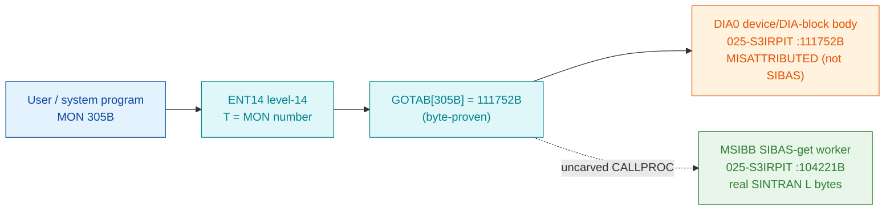

# MON 305B (octal) — GetSIBASMessage (MSIBB)

Retrieves a message from the SIBAS database system — the server-side of the SIBAS
inter-process communication over RT-common. It is the receive/get counterpart of
[MON 304B SendSIBASMessage](../304B-SendSIBASMessage/README.md); the two share one
SIBAS handler body (`MAPSI` = send, `MSIBB` = get, `TISIB` = timer). Internal-use
call (manual ND-860228.2 EN, section 2.14, name-only).

**Status:** the GOTAB dispatch word is byte-proven, but it does **not** point at the
SIBAS handler. `GOTAB[305] = 111752B` (byte-proven) lands on `DIA0`, the head of the
DIA device/DIA-block body — the same body the MON 304B `DSI0` stub jumps into. The
semantic `MSIBB` SIBAS worker is real SINTRAN L bytes but is **unreachable** from
`GOTAB[305]` and from every GOTAB slot 0..377 — it is reached only across the
uncarved resident `CALLPROC` bridge (see [Honest caveats](#honest-caveats)). All
addresses/values are **octal**.

- **Full disassembly:** [`305B-GetSIBASMessage.ASM`](305B-GetSIBASMessage.ASM) — both regions
  (the `DIA0` GOTAB target body and the `MSIBB`/SIBAS-get worker).
- **Bytes live once in** the canonical segment layer: [`../../segments-ref/`](../../segments-ref/).

---

## Dispatch path

The solid edge (`C → D`) is byte-proven: `GOTAB[305]` = `111752B` = `DIA0`. The dashed
hop (`C ⇢ E`) is the resident `CALLPROC`/second-level dispatch to the semantic `MSIBB`
SIBAS handler — it is **not present in any carved segment**, so it is the one link that
cannot be followed statically. This mirrors MON 304B exactly: 304B's `GOTAB` points at
`DSI0` (which jumps into `DIA0`), 305B's `GOTAB` points at `DIA0` directly.

---

## Code location (dispatch path)

Ground truth: `python3 scripts/prove-mon.py 305` → `GOTAB[305] = 111752B` (the stored word
`93 ea`). Byte offset of octal address `A` in a segment with load base `L`:
`word = (A − L)` in octal, `byte = word × 2` (decimal).

| Role | Segment (full disasm) | Addr range (octal) | Byte offset | Symbol | Verdict |
|------|------------------------|--------------------|-------------|--------|---------|
| GOTAB[305] dispatch word | [commoncode.asm](../../segments-ref/SINTRAN-DATA_commoncode/SINTRAN-DATA_commoncode.asm) · [.hex](../../segments-ref/SINTRAN-DATA_commoncode/SINTRAN-DATA_commoncode.hex) | `071540B` (1 word) | 59072 | `GOTAB+305` = `111752B` | **VERIFIED** (raw word `93 ea`) |
| DIA0 device/DIA-block body | [025-S3IRPIT.asm](../../segments-ref/025-S3IRPIT/025-S3IRPIT.asm) · [.hex](../../segments-ref/025-S3IRPIT/025-S3IRPIT.hex) | `111752B–112113B` | 49108 | `DIA0` | bytes **VERIFIED**; **MISATTRIBUTED** (issues MON 131/64/116/134 — RT-level device code, not SIBAS) |
| resident CALLPROC bridge | — (uncarved) | — | — | `CALLPROC` | **UNVERIFIED** |
| MSIBB SIBAS-get worker body | [025-S3IRPIT.asm](../../segments-ref/025-S3IRPIT/025-S3IRPIT.asm) · [.hex](../../segments-ref/025-S3IRPIT/025-S3IRPIT.hex) | `104221B–104314B` | 43298 | `MSIBB` (sibling of `MAPSI`/`TISIB`) | real bytes; link **MISATTRIBUTED** (unreachable from GOTAB[305] and every slot 0..377) |

**Verify by hand:** `grep '^71540 ' ../../segments-ref/SINTRAN-DATA_commoncode/SINTRAN-DATA_commoncode.hex`
→ `71540  111752  223 352  59072` (word `111752B`, byte offset 59072); then
`dd if=../../../resident/SINTRAN-DATA_commoncode.bin bs=1 skip=59072 count=2 2>/dev/null | od -An -tx1`
→ `93 ea`. For the `MSIBB` worker head:
`dd if=../../../segments/025-S3IRPIT.bin bs=1 skip=43298 count=6 2>/dev/null | od -An -tx1`
→ `cc 7b f1 04 d0 87` (= octal `146173 170404 150207` = `RADD CLD SX DB` / `SAA 4` / `MCL PIE`,
the `MSIBB` entry). For the `DIA0` target head:
`dd if=../../../segments/025-S3IRPIT.bin bs=1 skip=49108 count=6 2>/dev/null | od -An -tx1`
→ `f5 31 09 2a 48 4b` (= octal `172461 004452 044113` = `AAA 61` / `STA ,B 52` / `LDA 113`).

---

## Instruction walkthrough

Full listing: [`305B-GetSIBASMessage.ASM`](305B-GetSIBASMessage.ASM). Two regions.

**Region A — the byte-proven GOTAB target (`DIA0` body).** `GOTAB[305] = 111752B` =
`DIA0`. This is the DIA device/DIA-block body (`111752B–112113B`): it reads a
status/flags word (`111771 LDT ,B 33`), branches on its bits, and on the main path
does a block transfer (`112016 ION` / `112021 MON 131` ABSTR/DataTransfer / `112023
IOF`). Its error path (`112077–112112`) issues `MON 64` (ERMSG), `MON 116` (UNFIX) and
`MON 134` (RTEXT); the tail (`112055–112064`) uses `IRW 20 DP` / `MST PID` (RT
scheduling). **ANOMALY:** issuing `MON` and using `IRW/MST PID` is resident
RT-program/driver behaviour, not clean level-14 handler code — hence the `DIA0`
semantics are **UNVERIFIED** and the SIBAS-get attribution is **MISATTRIBUTED**.

**Region B — the semantic SIBAS-get handler (`MSIBB`).** `MSIBB` at `104221B` decodes
as a clean level-14 SIBAS handler and issues **no** MON instructions. It copies the
index register into `B` (`104221 RADD CLD SX DB` = `B = X`), sets `MLEV`
(`104222 SAA 4` / `104223 MCL PIE`), masks and tests the SIBAS device word
(`104224 LDA ,B 11`, `104225 SHA ZIN SHR 6`, `104231 SKP IF DA UEQ ST`), locates the
message-buffer head (`104250 LDX I ,X 41`), walks the buffer chain
(`104254 LDX ,X 1` … `104257 BSKP ONE 170 DA`), stages a reply record and status word,
and returns via an indirect link cell (`104303 JMP I 10 → 104313`). The words
`104304B–104314B` are the routine's local pointer/constant block (data —
`nd100-dis` renders them as instructions). `MAPSI=103675B` (send) and `TISIB=104315B`
(timer) are sibling entries in the same body. This matches the NPL
`SUBR MAPSIB,MSIBB,TISIBB` structure — but it is **not** what `GOTAB[305]` reaches.

---

## Parameter / register contract

| Reg / field | Dir | Meaning | Verdict |
|-------------|-----|---------|---------|
| entry point (worker) | in | `MSIBB=104221B` (SIBAS-get); siblings `MAPSI=103675B`, `TISIB=104315B` | VERIFIED (bytes) |
| device word (`,B 11`) | in | SIBAS device selector (masked/shifted `104225/104235/104246`) | VERIFIED masking; slot meaning inferred |
| `HOINT` (`,B -1`) | in/out | device interrupt word (`104233 STA ,B -1`) | VERIFIED store; meaning inferred |
| buffer head (`X`) | internal | message-buffer chain head (`104250 LDX I ,X 41`), walked via `LDX ,X 1` | VERIFIED (bytes) |
| status/result (`,B 12`) | out | caller status word branched on at `104263`, staged into the reply | VERIFIED store; meaning inferred |
| GOTAB target | dispatch | `GOTAB[305]=111752B` → `DIA0`, **not** `MSIBB` | VERIFIED (byte-proven) |

The user-visible register convention lives in the caller-side `MON 305` wrapper and the
uncarved `CALLPROC` frame, so the precise `A/X/T` assignment for `MSIBB` is **inferred**,
not byte-proven. Full YAML contract:
[`Developer/MON/calls/305B_GetSIBASMessage.yaml`](../../../../../../../Developer/MON/calls/305B_GetSIBASMessage.yaml)
(names `MSIBB` as the handler).

---

## Pseudo-code (for an emulator)

See **[`305B-GetSIBASMessage.pseudo.c`](305B-GetSIBASMessage.pseudo.c)** — a pseudo-C model
with BOTH paths: `dispatch_DIA0()` (the byte-proven GOTAB target, RT-level semantics
UNVERIFIED) and `mon_get_sibas_message()` (the semantic `MSIBB` SIBAS-get handler).
Control flow and the buffer-chain walk are byte-verified; the register/parameter labels
are inferred from the NPL structure.

Every instruction in the `.pseudo.c` is translated against the canonical
[`ND100-INSTRUCTION-SEMANTICS.md`](../../instruction-semantics/ND100-INSTRUCTION-SEMANTICS.md)
(`RADD CLD SX DB` = `B = X` — the COPY idiom, dest cleared then source added;
`SHA ZIN SHR 6` = logical right shift A by 6 with zero fill; `SKP IF DA UEQ ST` = skip if
`A != T` unsigned; `LDX ,X 1` = `X = mem[X + 1]` chain follow; `BSKP ONE 170 DA` tests
bit 15 of A, the printed bit number being `bn<<3`).

---

## Honest caveats

**What is byte-proven:** `GOTAB[305] = 111752B` (matches a live read of the running
system via `prove-mon.py`); `111752B` is `DIA0`, the head of the DIA device/DIA-block
body (the same body MON 304B's `DSI0` stub jumps into); and the `MSIBB` worker entry
bytes at `104221B` are real SINTRAN L bytes that decode as a clean SIBAS-get handler.

**What is NOT proven — one story:** `GOTAB[305]` points at `DIA0`, RT-level device code
(`MON 131/64/116/134`, `IRW/MST PID`), not at the SIBAS handler. Three independent byte
checks show `MSIBB` is unreachable from it:
1. `DIA0` (`111752`) → `MSIBB` (`104221`) is ~5500B words apart — far outside any ND-100
   relative `JMP/JPL` displacement, so no direct edge is possible.
2. A full word-scan of `025-S3IRPIT.bin` for any word equal to `104221`/`103675`/`104315`
   (an absolute `JMP I`/`JPL I` pointer to `MSIBB`/`MAPSI`/`TISIB`) returns **zero** matches.
3. A full `GOTAB[0..377]` scan for any value inside the `MSIBB` window returns **none** —
   no MON call 0..377 dispatches to the carved worker.

So `MSIBB` is real code reached only through the resident `CALLPROC` second-level
dispatch, which lives in an **uncarved overlay** — hence **MISATTRIBUTED** in the strict
byte sense. Confirming it needs a live level-14 trace: break on a real `MON 305B`, capture
the first PC after the trap, and see whether it lands on `111752B` (`DIA0`), `104221B`
(`MSIBB`), or enters `CALLPROC` then a second-level table.

> Address note: the NPL source is a different revision. Match behaviour/structure, not raw
> bytes. The L07 `SYMBOL-2-LIST` places `MSIBB=104221B`, `MAPSI=103675B`, `TISIB=104315B`
> as three sibling entries of one SIBAS body, exactly the NPL `SUBR MAPSIB,MSIBB,TISIBB`.

Method: [../../../../../EXTRACTING-RESIDENT-CODE.md](../../../../../EXTRACTING-RESIDENT-CODE.md) · dispatch reality:
[../../TASK-05-mismatches.md](../../TASK-05-mismatches.md) · master map: [../../MON-CALL-INDEX.md](../../MON-CALL-INDEX.md).
