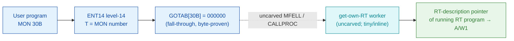

# MON 30B (octal) — GetOwnRTAddress (GETRT)

> **CORRECTED 2026-07-15 (byte-verified).** The worker + dispatch described below are on the
> DEBUNKED model and are WRONG. Byte truth from the carved L07 image:
> `MCTAB[30B] = 005650B = GTRT=072036B` in segment 025-S3IRPIT, reached by the real dispatch
> `MON 30B -> ENT14(072167B) -> GOTAB[30B]=MFELL(072114B) -> CALLP(032201B) -> MCTAB[30B]=GTRT`.
> Any "GOTAB from commoncode" / "uncarved CALLPROC bridge" / old worker name below is an artefact
> of the wrong table. Verified: `dd if=044-S3IDPIT.bin bs=1 skip=1872 count=2` -> `74 1e`.
> Cross-ref ../317B-ExecuteCommand/README.md and SINTRAN/CARVING-HANDOFF.md sec 3a.

Returns the address of the **calling program's RT description**. Background programs get the
RT-description address of the RT program that controls the terminal. The result is returned in
`W1` (the `A` register on the ND-100; MAC example: `MON 30 / STA RTPRO`). This is an ND-100
monitor call.

**Status:** `GOTAB[30B] = 000000` (byte-proven) — a **fall-through**: there is no direct GOTAB
handler word, so the level-14 handler is reached through the resident MFELL/CALLPROC path
(uncarved). There is **no ND-100 code worker and no ND-100 named region** for this call in the
carved segments: the manual short name `GETRT` resolves only in L07 `N500-SYMBOLS`
(`GETRT=106704B`, the **ND-500 companion**). The real worker is tiny — it reads the current
RT-description pointer and returns it in `A` — but that read lives past the uncarved bridge (see
[Honest caveats](#honest-caveats)). All addresses/values are **octal**.

- **Full disassembly:** [`30B-GetOwnRTAddress.ASM`](30B-GetOwnRTAddress.ASM) — documents the fall-through (no entry stub, no ND-100 named region).
- **Bytes live once in** the canonical segment layer: [`../../segments-ref/`](../../segments-ref/).

---

## Dispatch path

The dashed hop (`C ⇢ D`) is the resident `MFELL`/`CALLPROC` fall-through — it is **not present in
any carved segment**, so it is the one link that cannot be followed statically. `GOTAB[30B]` is
literally `000000`, so there is no entry stub to disassemble; dispatch enters the resident
handler, which reads the running RT program's descriptor and returns its address in `A`/`W1`.

---

## Code location (dispatch path)

Byte offset = `(addr − loadbase)` in octal words × 2 (decimal).

| Role | Segment (full disasm) | Addr range (octal) | Byte offset | Symbol | Verdict |
|------|------------------------|--------------------|-------------|--------|---------|
| GOTAB[30] dispatch word | [commoncode.asm](../../segments-ref/SINTRAN-DATA_commoncode/SINTRAN-DATA_commoncode.asm) · [.hex](../../segments-ref/SINTRAN-DATA_commoncode/SINTRAN-DATA_commoncode.hex) | `071263B` (1 word) | 58726 | `GOTAB+30` = `000000` | **VERIFIED** (fall-through) |
| resident MFELL/CALLPROC bridge | — (uncarved) | — | — | `MFELL`/`CALLPROC` | **UNVERIFIED** |
| GETRT (ND-500 companion) | [026-S3IMPIT.asm](../../segments-ref/026-S3IMPIT/026-S3IMPIT.asm) · [.hex](../../segments-ref/026-S3IMPIT/026-S3IMPIT.hex) | `106704B` | — | `GETRT` (N500-SYMBOLS) | **MISATTRIBUTED** (ND-500 side, not the ND-100 body) |

There is no entry-stub row and no ND-100 worker row: `GOTAB[30]` is `000000`, so the level-14
handler is a resident fall-through, and no ND-100 symbol names an RT-address worker body.

**Verify by hand:** the GOTAB word is a zero (fall-through) —
`grep '^71263 ' ../../segments-ref/SINTRAN-DATA_commoncode/SINTRAN-DATA_commoncode.hex`
→ `71263  000000  000 000  58726`; confirm from the canonical bin
`dd if=../../../resident/SINTRAN-DATA_commoncode.bin bs=1 skip=58726 count=2 2>/dev/null | od -An -tx1`
→ `00 00`. `prove-mon.py 30` reads the same GOTAB zero.

---

## Instruction walkthrough

Full listing: [`30B-GetOwnRTAddress.ASM`](30B-GetOwnRTAddress.ASM). There is no entry stub
(fall-through dispatch) and no ND-100 worker body or named region in the carved segments, so
there is no executable walkthrough. `GETRT=106704B` is the ND-500 companion in `026-S3IMPIT`,
not the ND-100 worker.

---

## Parameter / register contract

Manual-side names/types are from
[`30B_GetOwnRTAddress.yaml`](../../../../../../../Developer/MON/calls/30B_GetOwnRTAddress.yaml)
(MAC form: `MON 30 / STA RTPRO`).

| Reg / field | Dir | Meaning | Verdict |
|-------------|-----|---------|---------|
| `A` / `W1` | out | the RT-description address of the calling program | inferred (manual) |
| (background program) | — | returns the RT program controlling the terminal | inferred (manual) |

There is no entry stub and no carved worker, so **nothing** in this contract is byte-proven from
executable code; every row is **inferred** from the manual.

---

## Pseudo-code (for an emulator)

See **[`30B-GetOwnRTAddress.pseudo.c`](30B-GetOwnRTAddress.pseudo.c)** — a pseudo-C model.
Because the call is a fall-through and there is **no carved ND-100 worker** (`GETRT` is the
ND-500 companion), the model is of the **documented** behaviour only, NOT carved code. The
fall-through `MON 30 → worker` bridge is modelled but not proven.

Instruction semantics follow the canonical reference:
[`../../instruction-semantics/ND100-INSTRUCTION-SEMANTICS.md`](../../instruction-semantics/ND100-INSTRUCTION-SEMANTICS.md).

---

## Honest caveats

**What is byte-proven:** `GOTAB[30B] = 000000` (level-14 fall-through; `prove-mon.py 30` reads
commoncode file byte `0xe566 = 00 00`). That is the only fact these carved bytes establish for
this call.

**What is NOT proven:** anything about the RT-address worker. Because `GOTAB[30]` is `000000`,
there is no stub to follow; dispatch enters the resident `MFELL`/`CALLPROC` handler in an
**uncarved** overlay. The manual short name `GETRT` resolves only in `N500-SYMBOLS`
(`GETRT=106704B`) — the **ND-500-side** companion, not the ND-100 body — so it is
**MISATTRIBUTED** to the ND-100 call, and no ND-100 symbol names the worker.

This reconciles into one story: the dispatch head (`GOTAB[30]=0`, fall-through) is solid; the
ND-100 worker is a tiny resident routine (read the running RT program's descriptor, return its
address in `A`/`W1`) that lives past the uncarved bridge; and `GETRT=106704B` is the ND-500
companion. Confirming the actual worker needs a live trace (break on a real `MON 30`,
single-step the fall-through, and record where P lands).

---

Method: [../../../../../EXTRACTING-RESIDENT-CODE.md](../../../../../EXTRACTING-RESIDENT-CODE.md) §9 · dispatch reality:
[../../TASK-05-mismatches.md](../../TASK-05-mismatches.md) §G · master map: [../../MON-CALL-INDEX.md](../../MON-CALL-INDEX.md).
