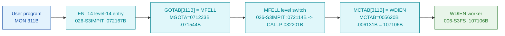

# MON 311B (octal) - WriteDirEntry (WDIEN)

Changes the information about a directory - the complete contents of a 48-byte directory entry
are written. The caller passes the **directory index** and the directory-entry buffer. The
directory must be entered and reserved, and only user SYSTEM may issue the call. ND-100 call.

**Status:** **byte-verified** (dispatch + worker body). The worker is real carved code in
`006-S3FS`. All addresses/values are **octal**.

> **CORRECTED 2026-07-13.** The previous version of this folder said the call was
> `misattributed (stub-routed)`, claiming `GOTAB[311B] = 112030B` routed to a `DIA2` level-14
> stub in `025-S3IRPIT`. **That was an artefact of the wrong dispatch model.** MON calls take
> their worker from **`MCTAB @ 005620B`** (segment `044-S3IDPIT`), not from that `GOTAB` (which
> is `MFELL` for 224 of 256 calls). `MCTAB[311B] = 107106B = WDIEN` (byte-proven), carved in
> `006-S3FS` - a mode-selecting entry (`SSM=1`) that joins a body shared with `GDIEN` and
> `GNAEN`. See [`../317B-ExecuteCommand/README.md`](../317B-ExecuteCommand/README.md) and
> `SINTRAN/CARVING-HANDOFF.md` section 3a.

- **Full disassembly:** [`311B-WriteDirEntry.ASM`](311B-WriteDirEntry.ASM).
- **Emulator model:** [`311B-WriteDirEntry.pseudo.c`](311B-WriteDirEntry.pseudo.c).
- **Bytes live once in** the canonical segment layer: [`../../segments-ref/`](../../segments-ref/).

---

## Dispatch path



There is **no dashed hop**. `GOTAB[311B] = MFELL` (byte-proven, `74 4c`); `MFELL` is a
program-**level** switch, not a subroutine call. The monitor level then indexes `MCTAB` and
reaches `WDIEN`.

---

## Code location (dispatch path)

Byte offset = `(addr - loadbase)` in octal words x 2 (decimal). Offsets reproduced with `dd`.

| Role | Segment | Addr (octal) | Byte offset | Symbol | Verdict |
|------|---------|--------------|-------------|--------|---------|
| GOTAB[311B] slot | [026-S3IMPIT.asm](../../segments-ref/026-S3IMPIT/026-S3IMPIT.asm) | `071544B` = `072114B` | 32456 | -> `MFELL` | **VERIFIED** |
| MCTAB[311B] slot | [044-S3IDPIT.asm](../../segments-ref/044-S3IDPIT/044-S3IDPIT.asm) | `006131B` = `107106B` | 2226 | -> `WDIEN` | **VERIFIED** |
| WDIEN worker body | [006-S3FS.asm](../../segments-ref/006-S3FS/006-S3FS.asm) | `107106B-107137B+` | 50316 | `WDIEN` | **VERIFIED** |

**Verify by hand** (from `tools/sintran-segment-carver/versions/L-VSX-500/segments/`):
```
dd if=026-S3IMPIT.bin bs=1 skip=32456 count=2 | od -An -tx1   ->  74 4c   (= 072114B = MFELL)
dd if=044-S3IDPIT.bin bs=1 skip=2226  count=2 | od -An -tx1   ->  8e 46   (= 107106B = WDIEN)
dd if=006-S3FS.bin    bs=1 skip=50316 count=2 | od -An -tx1   ->  f8 b8   (= 174270B, WDIEN entry: BSET ONE SSM)
```

---

## Instruction walkthrough

Full listing: [`311B-WriteDirEntry.ASM`](311B-WriteDirEntry.ASM).

**Mode-select entries (`107106B-107115B`).** Three sibling entries set a pair of mode bits then
merge at the shared body `107116B`:
- `WDIEN` (`107106B`, MON 311B write): `BSET ONE SSM` / `BSET ZRO SSK`  (SSM=1, SSK=0)
- `GDIEN` (`107111B`): `BSET ZRO SSK` / `BSET ZRO SSM`                  (both 0)
- `GNAEN` (`107114B`): `BSET ONE SSK` / `BSET ZRO SSM`                  (SSK=1, SSM=0)

The `SSM`/`SSK` status bits are latched here and later tested (`BSKP ONE SSM` at `107123B`,
`BSKP ONE SSK` at `107131B`) to fork read vs write and name-lookup vs index-lookup behaviour.

**Shared prologue (`107116B-107122B`).** `STD I 112` / `RADD CLD SL DA` / `RADD CLD SB DD` /
`SAB 106` save the caller's registers and build the frame; `JPL I 107` (`-> 107231B`) calls
the shared directory helper.

**Mode fork (`107123B-107137B`).** `BSKP ONE SSM` sets a write flag into `,B 104`
(`107126B STA ,B 104`, else `STZ ,B 104`); `BSKP ONE SSK` sets a name-lookup flag into `,B 105`.
Those two flags then steer the shared directory-entry body (which validates the SYSTEM-user and
reserved-directory preconditions and, on the write path, copies the 48-byte entry).

The mode-bit latch, the shared prologue and the two flag forks are byte-proven; the details of
the directory-entry copy in the shared body are **inferred** from the `WDIEN`/`GDIEN`/`GNAEN`
family and the manual.

---

## Parameter / register contract

| Reg / field | Dir | Meaning | Verdict |
|-------------|-----|---------|---------|
| directory index | in | selects the directory entry to write | VERIFIED (structure); byte layout inferred (manual) |
| entry buffer | in | 48-byte directory-entry contents to write | inferred (manual) |
| `SSM` bit | internal | set to 1 by `WDIEN` -> selects the write path | VERIFIED (bytes) |
| `SSK` bit | internal | 0 for `WDIEN` (index lookup, not name lookup) | VERIFIED (bytes) |
| `,B 104` | frame | write flag derived from `SSM` | VERIFIED (bytes) |
| `,B 105` | frame | name-lookup flag derived from `SSK` | VERIFIED (bytes) |
| caller class | in | only user SYSTEM; directory entered + reserved | inferred (manual) |

---

## Pseudo-code (for an emulator)

See **[`311B-WriteDirEntry.pseudo.c`](311B-WriteDirEntry.pseudo.c)** - the `SSM`/`SSK` mode
latch, the shared prologue and the two flag forks are byte-verified; the directory-entry copy
in the shared body is inferred.

---

## Honest caveats

**What is byte-proven:** `GOTAB[311B] = MFELL`; `MCTAB[311B] = 107106B = WDIEN`; the `WDIEN`
entry bytes at `107106B` in `006-S3FS` match the disassembly (`174270B = BSET ONE SSM`); `WDIEN`
/ `GDIEN` / `GNAEN` share one body distinguished by the `SSM`/`SSK` mode bits; `WDIEN` selects
the write path (`SSM=1`).

**What is NOT proven:** the exact layout of the 48-byte directory entry and the internals of the
shared directory body (reached by `JPL I 107` at `107122B`, not carved in this folder), and the
SYSTEM-user / reserved-directory precondition checks (from the manual).

**Correction to earlier work.** The old folder read the disproven `GOTAB` and reported
`GOTAB[311B] = 112030B -> DIA2` stub. The byte-proven worker is `MCTAB[311B] = WDIEN = 107106B`.
The `DIA2` reading was the wrong-overlay error.

Method: [../../../../../EXTRACTING-RESIDENT-CODE.md](../../../../../EXTRACTING-RESIDENT-CODE.md) -
master map: [../../MON-CALL-INDEX.md](../../MON-CALL-INDEX.md).
