# MON 312B (octal) - MOINF (CheckMonCall)

Checks whether a given **monitor call exists** in this particular SINTRAN III system. Optional monitor
calls are included or left out when SINTRAN is generated; MOINF lets a program probe for one. The caller
passes a **monitor-call number** in `A`; the **normal return** means "not implemented" (`A = 0`), and
the **skip return** delivers the call's **entry address** in `A`. ND-100 monitor call.

**Status:** **byte-verified** (dispatch + worker body), and the worker's core claim - that it reads
`MCTAB` and returns `MCTAB[N]` - is now **proven from bytes**, not merely inferred. All addresses/values
are **octal**.

> **CORRECTED 2026-07-13, and SPECIAL.** MON calls are dispatched through **`MCTAB @ 005620B`**
> (segment `044-S3IDPIT`), not the level-14 `GOTAB` (which is `MFELL` for 224 of 256 calls).
> `MCTAB[312B] = 032600B = MOINF`. Unlike the ordinary MON workers (which live in `003-S3CP`), **MOINF
> is part of the monitor-dispatch machinery** and lives with the dispatcher in `026-S3IMPIT` /
> `017-S3SMPIT` (load `32000B`, identical bytes), immediately after `CALLP=032201B`. In the `003-S3CP`
> overlay the same virtual address `032600B` decodes as an unrelated **data record table**
> (`X103T`..`X107E`), so MOINF must NOT be read there. See
> [`../317B-ExecuteCommand/README.md`](../317B-ExecuteCommand/README.md) and
> `SINTRAN/CARVING-HANDOFF.md` section 3a.

- **Full disassembly:** [`312B-CheckMonCall.ASM`](312B-CheckMonCall.ASM).
- **Emulator model:** [`312B-CheckMonCall.pseudo.c`](312B-CheckMonCall.pseudo.c).

---

## Dispatch path

```mermaid
flowchart LR
    A["User program<br/>MON 312B (A = MON#)"] --> B["ENT14 level-14<br/>026-S3IMPIT :072167B"]
    B --> C["GOTAB[312B] = MFELL<br/>:071545B"]
    C --> D["MFELL level switch<br/>:072114B -> CALLP 032201B"]
    D --> E["MCTAB[312B] = MOINF<br/>044-S3IDPIT :006132B = 032600B"]
    E --> F["MOINF worker<br/>026-S3IMPIT :032600B"]
    F --> G["reads MCTAB[MON#]<br/>044-S3IDPIT :005620B + MON#"]
    class A blue
    class B,C,D,E teal
    class F green
    class G teal
    classDef blue fill:#E3F2FD,stroke:#0D47A1,color:#0D47A1
    classDef teal fill:#E0F7FA,stroke:#00838F,color:#00838F
    classDef green fill:#E8F5E9,stroke:#2E7D32,color:#2E7D32
```



MOINF is both a normal MCTAB-dispatched worker AND itself an MCTAB reader: it returns `MCTAB[MON#]` for
the number the caller asks about.

---

## Code location (dispatch path)

Byte offset = `(addr - loadbase)` in octal words x 2 (decimal). Offsets reproduced with `dd`.

| Role | Segment | Addr (octal) | Byte offset | Symbol | Verdict |
|------|---------|--------------|-------------|--------|---------|
| MCTAB[312B] slot | [044-S3IDPIT.asm](../../segments-ref/044-S3IDPIT/044-S3IDPIT.asm) | `006132B` = `032600B` | 2228 | -> `MOINF` | **VERIFIED** |
| MOINF worker body | [026-S3IMPIT.asm](../../segments-ref/026-S3IMPIT/026-S3IMPIT.asm) | `032600B-032615B` | 768 | `MOINF` | **VERIFIED** |
| MOINF `MON_COUNT` const | [026-S3IMPIT.asm](../../segments-ref/026-S3IMPIT/026-S3IMPIT.asm) | `032636B` = `000400B` | 828 | (P+35 datum) | **VERIFIED** |
| MOINF `MCTAB` base const | [026-S3IMPIT.asm](../../segments-ref/026-S3IMPIT/026-S3IMPIT.asm) | `032637B` = `005620B` | 830 | (P+32 datum) | **VERIFIED** |

**Verify by hand** (from `tools/sintran-segment-carver/versions/L-VSX-500/segments/`):
```
dd if=044-S3IDPIT.bin bs=1 skip=2228 count=2 | od -An -tx1   ->  35 80   (= 032600B = MOINF)
dd if=026-S3IMPIT.bin bs=1 skip=768  count=2 | od -An -tx1   ->  d7 8d   (= 153615B, MOINF entry)
dd if=026-S3IMPIT.bin bs=1 skip=828  count=2 | od -An -tx1   ->  01 00   (= 000400B = 256, the bound)
dd if=026-S3IMPIT.bin bs=1 skip=830  count=2 | od -An -tx1   ->  0b 90   (= 005620B = MCTAB base)
```
(`017-S3SMPIT.bin` holds identical bytes at the same offsets.)

---

## Instruction walkthrough

Full listing: [`312B-CheckMonCall.ASM`](312B-CheckMonCall.ASM).

1. `032600B IRR 10 DA` - read the **caller's** `A` register (the MON# argument) across program levels.
2. `032601B LDT 35` - load the bound from the P-relative datum at `P+35` = `032636B` = **`000400B`
   (256)** = the number of MON-call slots.
3. `032602B-032603B SKP IF DA MLST ST` - continue (in range) only if `MON# < 256`; else go to the
   out-of-range path.
4. `032604B-032605B RADD CLD SA DX` / `LDA I ,X 32` - `X := MON#`, then load
   `A := mem[ mem[P+32] + X ]`. The pointer word at `P+32` = `032637B` = **`005620B` = MCTAB base**, so
   this is exactly **`A := MCTAB[MON#]`**.
5. `032607B RADD CLD 0 DA` - out-of-range path sets `A := 0` (not implemented).
6. `032610B IRW 10 DA` - write the result (`MCTAB[MON#]` or 0) back to the caller's `A`.
7. `032611B JAZ` - if the result is 0, take the **normal return** (not implemented).
8. `032612B-032614B IRR 10 DP / AAA 1 / IRW 10 DP` - otherwise bump the caller's `P` by 1: the ND-100
   **skip return** signalling "call implemented".
9. `032615B JMP I 6` - return.

Every one of these steps is byte-proven, including the two constants (`256` bound and `005620B` MCTAB
base) read from the routine's own P-relative data words.

---

## Parameter / register contract

| Reg / field | Dir | Meaning | Verdict |
|-------------|-----|---------|---------|
| `A` (caller) | in | monitor-call number to test | VERIFIED (bytes: `IRR 10 DA`) |
| `A` (caller) | out | `MCTAB[MON#]` = entry address, or `0` if not implemented | VERIFIED (bytes: `IRW 10 DA`) |
| skip return | out | taken iff entry != 0 (call implemented) | VERIFIED (bytes: `AAA 1` on caller `P`) |
| MCTAB base `005620B` | const | table base read via P-relative datum at `P+32` | VERIFIED (bytes) |
| bound `256` | const | range limit read via P-relative datum at `P+35` | VERIFIED (bytes) |

---

## Pseudo-code (for an emulator)

See **[`312B-CheckMonCall.pseudo.c`](312B-CheckMonCall.pseudo.c)** - the whole routine is byte-verified,
including the MCTAB index and the skip/normal return.

---

## Honest caveats

**What is byte-proven:** essentially the entire call. `MCTAB[312B] = 032600B = MOINF`; MOINF lives in
`026-S3IMPIT` (identical in `017-S3SMPIT`), reads the caller's MON# via `IRR`, range-checks it against a
`256` bound held at `032636B`, indexes `MCTAB` whose base `005620B` is held at `032637B`, and returns
`MCTAB[MON#]` (or 0) with the ND-100 skip/normal return convention. This upgrades the NC oracle's claim
(that MOINF returns `MCTAB[N]`) from **INFERRED to VERIFIED**.

**What is NOT proven / noteworthy:** nothing material is left unproven for the mechanism. The only
subtlety is the overlay trap: reading `032600B` in the wrong segment (`003-S3CP`) yields an unrelated
data table, which is what would mislead an analyst - hence the explicit segment note above.

Method: [../../../../../EXTRACTING-RESIDENT-CODE.md](../../../../../EXTRACTING-RESIDENT-CODE.md) ·
master map: [../../MON-CALL-INDEX.md](../../MON-CALL-INDEX.md) ·
NC oracle: `SINTRAN/ND500/mon-oracle-for-NC/312B-MOINF_317B-UECOM.md`.
