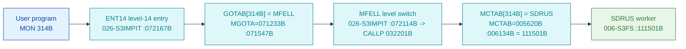

# MON 314B (octal) - DefaultRemoteSystem (SDRUS)

Sets the **default remote system** - the COSMOS network computer searched for a file that is not
found locally when remote file access is on (see
[MON 316B SetRemoteAccess](../316B-SetRemoteAccess/README.md)). Only available with COSMOS
installed. ND-100 call (manual ND-860228-2 EN, section 2.14).

**Status:** **byte-verified** (dispatch + worker body). The worker is real carved code in
`006-S3FS`. All addresses/values are **octal**.

> **CORRECTED 2026-07-13.** The previous version of this folder said the worker was
> `misattributed` / **"not recoverable from these carved bytes"**, claiming `GOTAB[314] = 112326B`
> resolved to a `DSI4` device/interrupt routine and that the only matching symbol was the ND-500
> `SRUSI = 125473B`. **All of that was an artefact of the wrong dispatch model.** MON calls take
> their worker from **`MCTAB @ 005620B`** (segment `044-S3IDPIT`), not from that `GOTAB` (which is
> `MFELL` for 224 of 256 calls). `MCTAB[314B] = 111501B = SDRUS` (byte-proven), and that worker IS
> carved in `006-S3FS`. The `DSI4` / "not recoverable" reading came from the disproven "uncarved
> CALLPROC bridge" story. See [`../317B-ExecuteCommand/README.md`](../317B-ExecuteCommand/README.md)
> and `SINTRAN/CARVING-HANDOFF.md` section 3a.

- **Full disassembly:** [`314B-DefaultRemoteSystem.ASM`](314B-DefaultRemoteSystem.ASM).
- **Emulator model:** [`314B-DefaultRemoteSystem.pseudo.c`](314B-DefaultRemoteSystem.pseudo.c).
- **Bytes live once in** the canonical segment layer: [`../../segments-ref/`](../../segments-ref/).

---

## Dispatch path



There is **no dashed hop**. `GOTAB[314B] = MFELL` (byte-proven, `74 4c`); `MFELL` is a
program-**level** switch, not a subroutine call. The monitor level then indexes `MCTAB` and
reaches `SDRUS`.

---

## Code location (dispatch path)

Byte offset = `(addr - loadbase)` in octal words x 2 (decimal). Offsets reproduced with `dd`.

| Role | Segment | Addr (octal) | Byte offset | Symbol | Verdict |
|------|---------|--------------|-------------|--------|---------|
| GOTAB[314B] slot | [026-S3IMPIT.asm](../../segments-ref/026-S3IMPIT/026-S3IMPIT.asm) | `071547B` = `072114B` | 32462 | -> `MFELL` | **VERIFIED** |
| MCTAB[314B] slot | [044-S3IDPIT.asm](../../segments-ref/044-S3IDPIT/044-S3IDPIT.asm) | `006134B` = `111501B` | 2232 | -> `SDRUS` | **VERIFIED** |
| SDRUS worker body | [006-S3FS.asm](../../segments-ref/006-S3FS/006-S3FS.asm) | `111501B-111546B+` | 52866 | `SDRUS` | **VERIFIED** |

**Verify by hand** (from `tools/sintran-segment-carver/versions/L-VSX-500/segments/`):
```
dd if=026-S3IMPIT.bin bs=1 skip=32462 count=2 | od -An -tx1   ->  74 4c   (= 072114B = MFELL)
dd if=044-S3IDPIT.bin bs=1 skip=2232  count=2 | od -An -tx1   ->  93 41   (= 111501B = SDRUS)
dd if=006-S3FS.bin    bs=1 skip=52866 count=2 | od -An -tx1   ->  22 29   (= 021051B, SDRUS entry: STD I 51)
```

---

## Instruction walkthrough

Full listing: [`314B-DefaultRemoteSystem.ASM`](314B-DefaultRemoteSystem.ASM).

**Prologue (`111501B-111505B`).** `STD I 51` / `RADD CLD SL DA` / `RADD CLD SB DD` / `SAB 47`
save the caller's registers and build the frame; `JPL I 46` (`-> 111553B`) calls the shared
FILSYS/COSMOS entry helper.

**Staged field stores (`111506B-111531B`).** A repeating four-instruction pattern -
`LDA <const>` / `RADD SB DA` (form a frame address) / `LDX ,B <n>` / `JPL I <helper>` -
runs for the caller's operands `,B 1`, `,B 2`, `,B 3`, storing each into the default-remote
record via the helper at `111555B`, with error branches to `111550B`.

**Record assembly (`111532B-111546B`).** Loads three resident constants (`LDX 22` / `LDT 22` /
`LDA 22`), combines them (`RADD SB DX/DT/DA`, `RADD CLD SA DD`) and calls `JPL I 16`
(`-> 111561B`) to commit the assembled default-remote-system record; an error path uses
`MIN ,B 4` / `SAA -47`.

The prologue, the staged stores and the commit call are byte-proven; the exact record layout
(system id vs user vs flags) is **inferred** from the manual and the COSMOS context.

---

## Parameter / register contract

| Reg / field | Dir | Meaning | Verdict |
|-------------|-----|---------|---------|
| `,B 1`,`,B 2`,`,B 3` | in | operands staged into the default-remote record | VERIFIED (bytes); field meaning inferred |
| default-remote record | out | assembled and committed via `JPL I 16` (`-> 111561B`) | VERIFIED (structure); layout inferred (manual) |
| `,B 4` | out | error counter (`MIN ,B 4`) on failure | VERIFIED (bytes) |
| return | out | via saved link; error path `111550B` | VERIFIED (bytes) |
| availability | in | COSMOS installed | inferred (manual) |

---

## Pseudo-code (for an emulator)

See **[`314B-DefaultRemoteSystem.pseudo.c`](314B-DefaultRemoteSystem.pseudo.c)** - the prologue,
the staged operand stores and the record-commit call are byte-verified; the record layout is
inferred.

---

## Honest caveats

**What is byte-proven:** `GOTAB[314B] = MFELL`; `MCTAB[314B] = 111501B = SDRUS`; the `SDRUS`
entry bytes at `111501B` in `006-S3FS` match the disassembly (`021051B = STD I 51`); the worker
stages three caller operands and commits an assembled record via a helper.

**What is NOT proven:** the exact layout of the default-remote-system record, the internals of
the helpers at `111553B`/`111555B`/`111561B` (reached by `JPL I`, not carved here), and the
COSMOS-installed availability precondition (from the manual).

**Correction to earlier work.** The old folder read the disproven `GOTAB`, reported
`GOTAB[314] = 112326B -> DSI4`, and concluded the worker was "not recoverable" (only the ND-500
`SRUSI = 125473B` matched). The byte-proven worker is `MCTAB[314B] = SDRUS = 111501B`, real
carved ND-100 code. The `DSI4` / "not recoverable" reading was the wrong-overlay error.

Method: [../../../../../EXTRACTING-RESIDENT-CODE.md](../../../../../EXTRACTING-RESIDENT-CODE.md) -
master map: [../../MON-CALL-INDEX.md](../../MON-CALL-INDEX.md).
