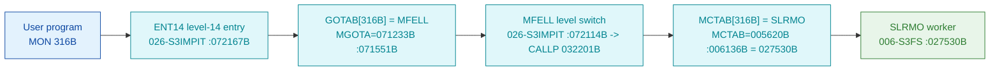

# MON 316B (octal) - SetRemoteAccess (SLRMO)

Switches COSMOS remote file access on and off. The COSMOS network lets a program open files on
remote computers directly; when remote access is on and a file does not exist locally, the
**default remote system** (set with
[MON 314B DefaultRemoteSystem](../314B-DefaultRemoteSystem/README.md)) is searched. A single
`INTEGER2 Mode` argument turns the feature off (`0`) or on (`1`). Only available with COSMOS
installed. ND-100 call.

**Status:** **byte-verified** (dispatch + worker body). The worker is real carved code in
`006-S3FS`. All addresses/values are **octal**.

> **CORRECTED 2026-07-13.** The previous version of this folder said the worker was
> `misattributed` / **"not recoverable from these carved bytes"**, claiming `GOTAB[316] = 112355B`
> resolved to a `DSI5` device/interrupt routine. **That was an artefact of the wrong dispatch
> model.** MON calls take their worker from **`MCTAB @ 005620B`** (segment `044-S3IDPIT`), not
> from that `GOTAB` (which is `MFELL` for 224 of 256 calls). `MCTAB[316B] = 027530B = SLRMO`
> (byte-proven), and that worker IS carved in `006-S3FS`. The `DSI5` / "not recoverable" reading
> came from the disproven "uncarved CALLPROC bridge" story. See
> [`../317B-ExecuteCommand/README.md`](../317B-ExecuteCommand/README.md) and
> `SINTRAN/CARVING-HANDOFF.md` section 3a.

- **Full disassembly:** [`316B-SetRemoteAccess.ASM`](316B-SetRemoteAccess.ASM).
- **Emulator model:** [`316B-SetRemoteAccess.pseudo.c`](316B-SetRemoteAccess.pseudo.c).
- **Bytes live once in** the canonical segment layer: [`../../segments-ref/`](../../segments-ref/).

---

## Dispatch path



There is **no dashed hop**. `GOTAB[316B] = MFELL` (byte-proven, `74 4c`); `MFELL` is a
program-**level** switch, not a subroutine call. The monitor level then indexes `MCTAB` and
reaches `SLRMO`.

---

## Code location (dispatch path)

Byte offset = `(addr - loadbase)` in octal words x 2 (decimal). Offsets reproduced with `dd`.

| Role | Segment | Addr (octal) | Byte offset | Symbol | Verdict |
|------|---------|--------------|-------------|--------|---------|
| GOTAB[316B] slot | [026-S3IMPIT.asm](../../segments-ref/026-S3IMPIT/026-S3IMPIT.asm) | `071551B` = `072114B` | 32466 | -> `MFELL` | **VERIFIED** |
| MCTAB[316B] slot | [044-S3IDPIT.asm](../../segments-ref/044-S3IDPIT/044-S3IDPIT.asm) | `006136B` = `027530B` | 2236 | -> `SLRMO` | **VERIFIED** |
| SLRMO worker body | [006-S3FS.asm](../../segments-ref/006-S3FS/006-S3FS.asm) | `027530B-027541B` | 1712 | `SLRMO` | **VERIFIED** |

**Verify by hand** (from `tools/sintran-segment-carver/versions/L-VSX-500/segments/`):
```
dd if=026-S3IMPIT.bin bs=1 skip=32466 count=2 | od -An -tx1   ->  74 4c   (= 072114B = MFELL)
dd if=044-S3IDPIT.bin bs=1 skip=2236  count=2 | od -An -tx1   ->  2f 58   (= 027530B = SLRMO)
dd if=006-S3FS.bin    bs=1 skip=1712  count=2 | od -An -tx1   ->  ba 06   (= 135006B, SLRMO entry: JPL I 6)
```

---

## Instruction walkthrough

Full listing: [`316B-SetRemoteAccess.ASM`](316B-SetRemoteAccess.ASM).

`SLRMO` is a short routine (`027530B-027541B`) that flows into `RSCAL` (`027542B`).

**Helper call + test (`027530B-027532B`).** `JPL I 6` (`-> 027536B`) calls a small helper that
zeroes two locations (`STZ -4` / `STZ 4`) and returns a state word; `LDA 6` reloads it and
`JAZ 3` (`-> 027535B`) skips the store when it is zero (COSMOS not present / precondition not met).

**Apply the Mode argument (`027533B-027535B`).** On the active path, `LDA ,B 12` loads the
caller's `Mode` argument and `STA I 4` writes it through the pointer at `4` into the resident
remote-access flag; `JMP I 4` (`-> 027541B`) returns. Setting `Mode` = 0 clears remote access,
`Mode` = 1 enables it.

The helper call, the zero-test fork and the store-through-pointer of the `Mode` argument are
byte-proven; the exact identity of the resident flag written is **inferred** from the call
semantics and the sibling `SDRUS`/`RSCAL` context.

---

## Parameter / register contract

| Reg / field | Dir | Meaning | Verdict |
|-------------|-----|---------|---------|
| `,B 12` (`Mode`) | in | 0 = remote access off, 1 = on; stored via `STA I 4` | VERIFIED (bytes); on/off meaning inferred (manual) |
| resident remote-access flag | out | target of `STA I 4` (pointer at `4`) | VERIFIED (bytes); identity inferred |
| state word | internal | from helper `027536B`; `JAZ` skips the store when zero | VERIFIED (bytes) |
| return | out | `JMP I 4` (`-> 027541B`) | VERIFIED (bytes) |
| availability | in | COSMOS installed | inferred (manual) |

---

## Pseudo-code (for an emulator)

See **[`316B-SetRemoteAccess.pseudo.c`](316B-SetRemoteAccess.pseudo.c)** - the helper call, the
zero-test fork and the store of the `Mode` argument are byte-verified; the identity of the
resident flag is inferred.

---

## Honest caveats

**What is byte-proven:** `GOTAB[316B] = MFELL`; `MCTAB[316B] = 027530B = SLRMO`; the `SLRMO`
entry bytes at `027530B` in `006-S3FS` match the disassembly (`135006B = JPL I 6`); the worker
calls a helper, forks on a zero test, and (on the active path) stores the caller's `Mode`
argument through a resident pointer.

**What is NOT proven:** the exact identity of the resident remote-access flag written by
`STA I 4`, the internals of the helper at `027536B`, and the COSMOS-installed availability
precondition (from the manual).

**Correction to earlier work.** The old folder read the disproven `GOTAB`, reported
`GOTAB[316] = 112355B -> DSI5`, and concluded the worker was "not recoverable". The byte-proven
worker is `MCTAB[316B] = SLRMO = 027530B`, real carved ND-100 code. The `DSI5` / "not
recoverable" reading was the wrong-overlay error.

Method: [../../../../../EXTRACTING-RESIDENT-CODE.md](../../../../../EXTRACTING-RESIDENT-CODE.md) -
master map: [../../MON-CALL-INDEX.md](../../MON-CALL-INDEX.md).
